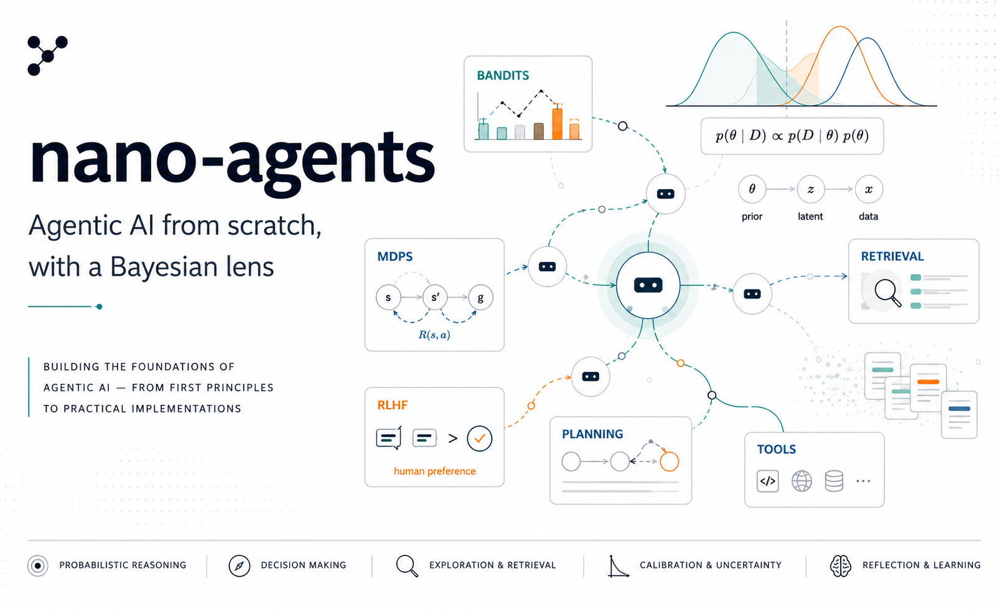

# nano-agents

<p align="center">
  
</p>

> Agentic AI from scratch, with a Bayesian lens. Every algorithm derived from first principles and implemented in <500 lines.

This is a personal learning series and reference codebase, written in my free time, building up the foundations of agentic AI — bandits, MDPs, RLHF, tool use, planning, retrieval, calibration — from the ground up. The unifying angle is **probabilistic**: I treat decision-making, exploration, retrieval, and reflection as approximate inference problems and look for the cleanest math underneath each one.

*Disclaimer: These are my personal study notes. All views, opinions, code, and errors are strictly my own*.

The companion blog is at **[tranbahien.github.io/nano-agents](https://tranbahien.github.io/nano-agents)**.

## Posts

### Topic 1 — Decision-making under uncertainty
- [1a — Multi-armed bandits](posts/01a-multi-armed-bandits.qmd) ✅
- [1b — Contextual bandits](posts/01b-contextual-bandits.qmd) ✅
- [1c — MDPs and Bellman equations](posts/01c-mdps-and-bellman.qmd) ✅
- [1d — POMDPs and Q-learning](posts/01d-pomdps-and-q-learning.qmd) ✅

### Topic 2 — Policy gradients
- [2a — REINFORCE and the policy gradient theorem](posts/02a-reinforce-and-policy-gradient.qmd) ✅
- [2b — Actor-critic and variance reduction](posts/02b-actor-critic.qmd) ✅
- [2c — TRPO and PPO (trust regions)](posts/02c-trpo-and-ppo.qmd) ✅
- [2d — RLHF, DPO, and GRPO](posts/02d-rlhf-dpo-grpo.qmd) ✅

### Topic 3 — Sampling, tool use, planning
- [3a — Decoding as approximate inference](posts/03a-decoding-as-inference.qmd) ✅
- [3b — Tool use as actions (ReAct)](posts/03b-tool-use.qmd) ✅
- [3c — Tree of Thoughts and MCTS for LLMs](posts/03c-tree-of-thoughts.qmd) ✅

### Topic 4 — Memory, reflection, calibration
- [4a — Retrieval as Bayesian conditioning](posts/04a-rag-as-bayesian-conditioning.qmd) ✅
- [4b — Self-reflection as Monte Carlo](posts/04b-self-reflection.qmd) ✅
- 4c — Calibration and uncertainty in LLMs

### Topic 5 — Putting it together
- 5a — Multi-agent systems
- 5b — nanoAgent: a clean reference implementation

## Quickstart

```bash
git clone https://github.com/tranbahien/nano-agents
cd nano-agents

# Install with uv (recommended)
uv pip install -e ".[dev]"

# Or with plain pip
pip install -e ".[dev]"

# Reproduce Figure 1 from Post 1a
python experiments/01a_regret_curves.py

# Regenerate all figures for Posts 1a and 1b
for f in experiments/01*.py; do python "$f"; done

# Run tests
pytest
```

## Repository structure

```
nano-agents/
├── posts/            # The blog content (Quarto markdown)
├── notebooks/        # One per post, for interactive exploration
├── src/nano_agents/  # Reusable, importable code
├── experiments/      # Standalone scripts, one per figure
├── tests/            # pytest
└── figures/          # Generated plots
```

The three audiences are separated by design: **posts** are for readers, **notebooks** are for learners who want to play, and **src/** is for users who want to import the code. Notebooks `import` from `src/`. Everything stays in one place.

## Who this is for

This series is written for people who already have machine learning fundamentals and want to understand agentic AI deeply rather than ship a framework integration. If you've trained a neural network and read a few RL or Bayesian inference papers, you're the target reader.

Each post derives the math, implements the algorithm from scratch, and points to experiments that build intuition. No frameworks, no LangChain — just NumPy, PyTorch, and a clear head.

## Citation

If you find this series useful for your work or teaching, please cite:

```bibtex
@misc{tran2026nanoagents,
  author       = {Tran, Ba-Hien},
  title        = {nano-agents: Agentic {AI} from scratch, with a {B}ayesian lens},
  year         = {2026},
  howpublished = {\url{https://tranbahien.github.io/nano-agents}},
  note         = {Blog series with companion code at
                  \url{https://github.com/tranbahien/nano-agents}}
}
```

To cite a specific post, use a sub-entry following the same pattern. For example, Post 2d:

```bibtex
@misc{tran2026nanoagents_2d,
  author       = {Tran, Ba-Hien},
  title        = {{RLHF, DPO, and GRPO}: From Classical {RL} to {LLM} Post-Training},
  year         = {2026},
  howpublished = {\url{https://tranbahien.github.io/nano-agents/posts/02d-rlhf-dpo-grpo.html}},
  note         = {nano-agents, Topic 2, Post 2d}
}
```

A [`CITATION.cff`](CITATION.cff) is included in the repo root, so GitHub will render a "Cite this repository" button automatically.

## License

MIT. See [LICENSE](LICENSE).

## About

Ba-Hien Tran. [Website](https://tranbahien.github.io) · [GitHub](https://github.com/tranbahien) · [Google Scholar](https://scholar.google.com/citations?user=tranbahien)
