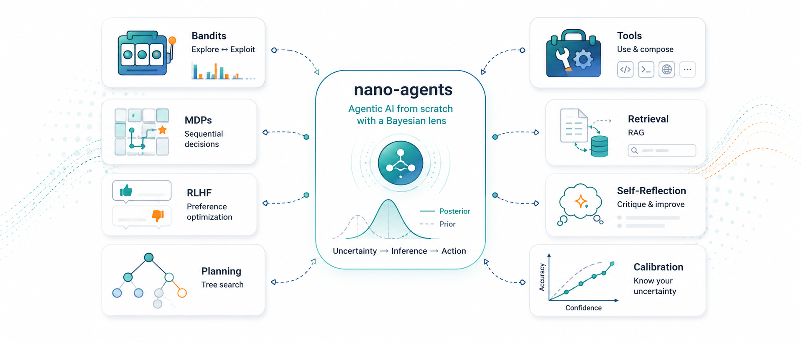

This is a personal learning series and reference codebase, written in my free time, building up the foundations of agentic AI — bandits, MDPs, RLHF, tool use, planning, retrieval, calibration — from the ground up. The unifying angle is **probabilistic**: I treat decision-making, exploration, retrieval, and reflection as approximate inference problems and look for the cleanest math underneath each one.

*Disclaimer: These are my personal study notes. All views, opinions, code, and errors are strictly my own.*

All materials — posts, notebooks, and experiments — are fully reproducible. Every figure in the series is generated by a standalone script in the companion repository.

[Code on GitHub →](https://github.com/tranbahien/nano-agents){.btn .btn-outline-secondary}

## Topics

### Topic 1 — Decision-making under uncertainty
- [1a — Multi-armed bandits](posts/01a-multi-armed-bandits.html)
- [1b — Contextual bandits](posts/01b-contextual-bandits.html)
- [1c — MDPs and Bellman equations](posts/01c-mdps-and-bellman.html)
- [1d — POMDPs and Q-learning](posts/01d-pomdps-and-q-learning.html)

### Topic 2 — Policy gradients
- [2a — REINFORCE and the policy gradient theorem](posts/02a-reinforce-and-policy-gradient.html)
- [2b — Actor-critic and variance reduction](posts/02b-actor-critic.html)
- [2c — TRPO and PPO (trust regions)](posts/02c-trpo-and-ppo.html)
- [2d — RLHF, DPO, and GRPO](posts/02d-rlhf-dpo-grpo.html)

### Topic 3 — Sampling, tool use, planning
- [3a — Decoding as approximate inference](posts/03a-decoding-as-inference.html)
- [3b — Tool use as actions (ReAct)](posts/03b-tool-use.html)
- [3c — Tree of Thoughts and MCTS for LLMs](posts/03c-tree-of-thoughts.html)

### Topic 4 — Memory, reflection, calibration
- [4a — Retrieval as Bayesian conditioning](posts/04a-rag-as-bayesian-conditioning.html)
- [4b — Self-reflection as Monte Carlo](posts/04b-self-reflection.html)
- [4c — Calibration and uncertainty](posts/04c-calibration.html)

### Topic 5 — Putting it together
- [5a — Multi-agent systems](posts/05a-multi-agent-systems.html)
- [5b — nanoAgent: a clean reference implementation](posts/05b-nanoagent.html)

## Who this is for

This series is written for people who already have machine learning fundamentals and want to understand agentic AI deeply rather than ship a framework integration. If you've trained a neural network and read a few RL or Bayesian inference papers, you're the target reader.

Each post derives the math, implements the algorithm from scratch, and points to experiments that build intuition. No frameworks, no LangChain — just NumPy, PyTorch, and a clear head.

## Posts

:::{#all-posts}
:::
