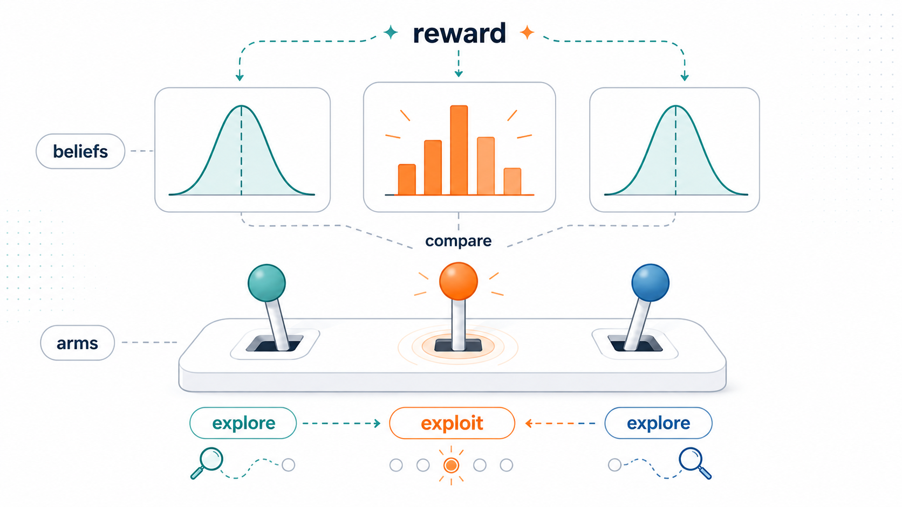
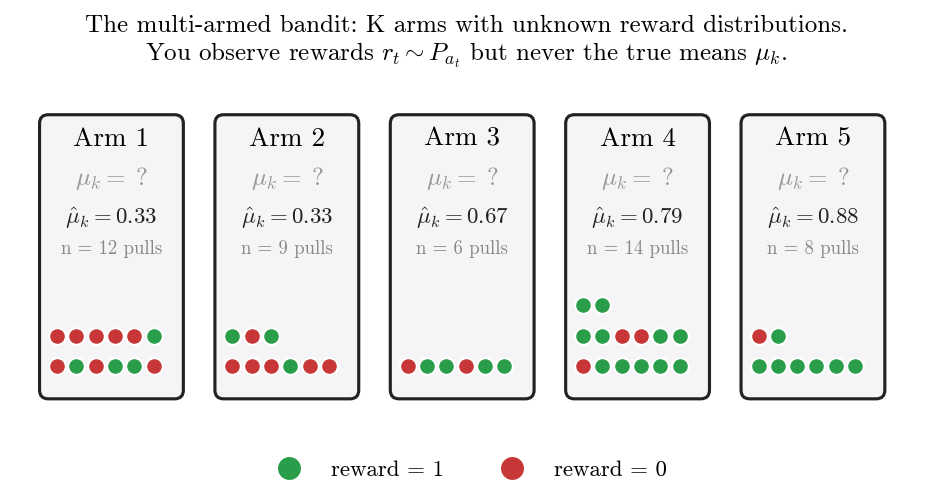
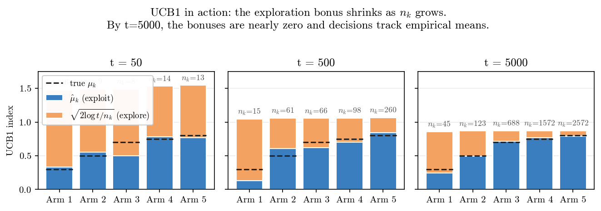
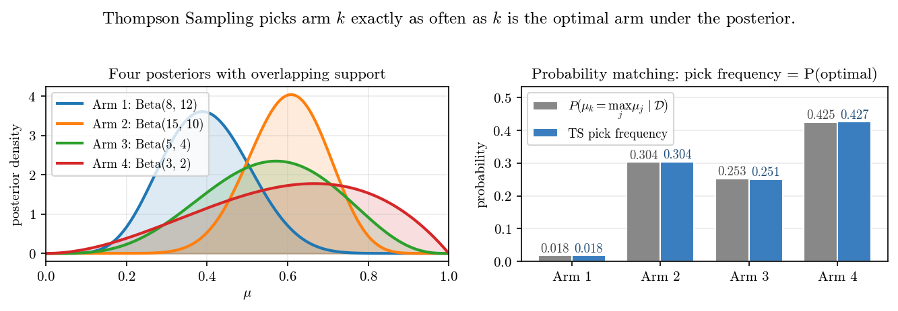
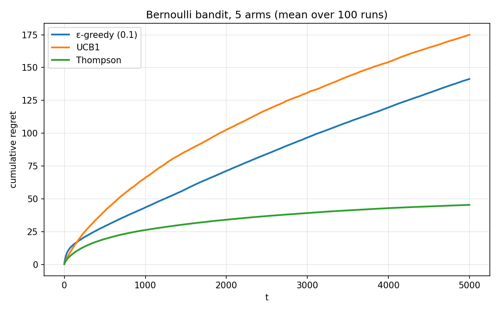
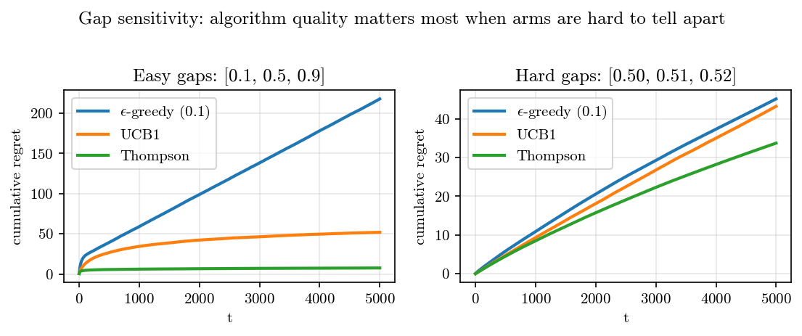
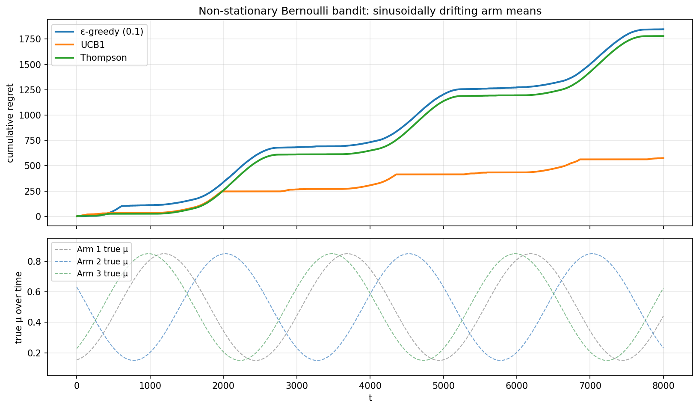
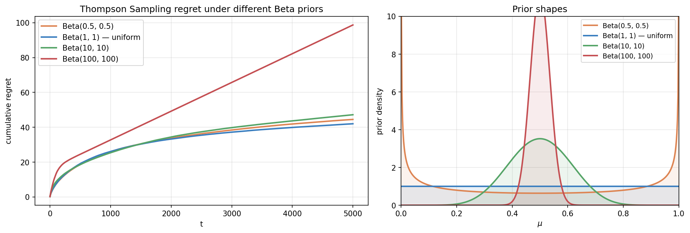

> *Decision-making under uncertainty, from scratch — 1 of 4.*

Before LLM agents, before MDPs, before policy gradients, there is the **bandit**. It is the smallest possible problem that contains the central tension of all sequential decision-making: **exploration vs. exploitation.** Every agentic AI algorithm I'll cover in this series — Q-learning, PPO, RLHF, tool use, planning over thoughts — is in some sense a bandit with more structure layered on top.

This post derives three classical algorithms — ε-greedy, UCB1, and Thompson Sampling — from first principles. By the end you'll have written all three in under 100 lines of NumPy and reproduced the figure above. More importantly, you'll have the *intuitions* that make the rest of the series make sense.

---

## 0. A casino vignette

You walk into a casino. There are five slot machines. Some pay better than others, but you don't know which. The machines look identical and the house won't tell you the odds. You have 5000 quarters and 5000 pulls. What's your strategy?

The naive options both fail.

**Pure exploration.** Pull each machine 1000 times to estimate its payout rate accurately, then play whichever turned out best. After all that careful estimation, you've already burned 4/5 of your budget on machines you knew, in retrospect, were losers.

**Pure exploitation.** Try each machine a few times. The one that hit a couple of jackpots early — that must be the best one. Play it the rest of the night. But what if you got lucky on a mediocre machine and never tried the genuine winner? You can be locked into a bad arm forever, with no mechanism to discover your mistake.

The bandit problem is the mathematical formalization of this dilemma, and it is one of those rare problems where the simplest version is rich enough to expose the central difficulty cleanly. There's no state, no transitions, no discounting — just K choices, repeated, with stochastic feedback. And yet to do well, you must learn while earning, and balance both.

---

## 1. Formal setup



We face $K$ arms (slot machines, ads, drug doses, recommendation candidates, treatment policies). Each arm $k$ has an unknown reward distribution $P_k$ with mean $\mu_k$. At each timestep $t = 1, 2, \dots, T$ we pick an action $a_t \in \{1, \dots, K\}$ and observe a reward $r_t \sim P_{a_t}$.

We want to maximize expected cumulative reward over the horizon $T$. Equivalently — and far more useful for analysis — we minimize **regret**:

$$
R(T) \;\equiv\; T \mu^\star - \mathbb{E}\!\left[\sum_{t=1}^{T} r_t\right] \;=\; \sum_{k=1}^{K} \Delta_k \, \mathbb{E}[n_k(T)],
$$

where:

- $\mu^\star \equiv \max_k \mu_k$ is the best arm's expected reward,
- $\Delta_k \equiv \mu^\star - \mu_k$ is the *suboptimality gap* of arm $k$ (zero for the best arm, positive for the rest),
- $n_k(T)$ is the number of times we've pulled arm $k$ up to time $T$.

The first form is intuitive: regret is the expected reward we missed by not always playing the best arm. The second form is profound: regret is the sum, over arms, of *how bad each arm is* times *how often we pulled it*. To minimize regret, we don't need to avoid bad arms entirely — we just need to avoid bad arms a lot. A small number of exploratory pulls on a known-loser is cheap.

This rephrasing turns the problem from "predict the best arm" into "allocate a budget of pulls intelligently." That shift is essentially the entire substance of the bandit literature.

**A name note.** The word "bandit" comes from "one-armed bandit," American slang for a slot machine. A "multi-armed bandit" is a fanciful gambler facing several at once. The metaphor stuck because the math is identical and slot machines are evocative.

---

## 2. Why this is hard: the exploration-exploitation tradeoff

We've already seen that pure exploration and pure exploitation both fail. Can we be more precise about why?

**Pure exploration (uniform random).** We pull each arm with probability $1/K$, regardless of past data. Then $\mathbb{E}[n_k(T)] = T/K$ for all $k$, so

$$
R(T) \;=\; \sum_{k=1}^{K} \Delta_k \cdot \frac{T}{K} \;=\; \frac{T}{K} \sum_k \Delta_k.
$$

This is **linear in $T$**. With $T = 10^6$ steps and average gap $\bar\Delta$, the expected regret is about $\bar\Delta \cdot 10^6$. Catastrophic.

**Pure exploitation (greedy on empirical mean).** After one pull of each arm, we play whichever has the highest empirical mean forever. By bad luck the best arm might return 0 on its single trial while a worse arm returns 1. Now we play the worse arm forever and incur $\Delta_{\text{bad}} \cdot (T - K)$ regret. Also linear, with positive probability.

Linear regret means we never learn — our performance per step doesn't improve. The bandit problem is interesting precisely because **sublinear regret is possible**: with the right algorithm, $R(T) / T \to 0$ as $T \to \infty$. We will get a per-step reward arbitrarily close to optimal in the limit.

### 2.1 How low can we go? The Lai–Robbins lower bound

How small can $R(T)$ be? Lai & Robbins (1985) proved the **fundamental lower bound** for the bandit problem: for any reasonable[^1] algorithm,

$$
\liminf_{T \to \infty} \frac{R(T)}{\log T} \;\geq\; \sum_{k: \Delta_k > 0} \frac{\Delta_k}{\mathrm{KL}(P_k \,\|\, P_{\star})}.
$$

[^1]: Specifically, *uniformly good* algorithms — those with regret $o(T^a)$ for every $a > 0$ on every instance. This excludes silly algorithms that work great on some bandits and terribly on others.

The right-hand side is a sum over suboptimal arms of "how much worse this arm is" divided by "how easily it can be distinguished from the optimum." Hard-to-distinguish arms (small KL) must be sampled more, contributing more regret.

The takeaway: **$R(T) = \Theta(\log T)$ is the best possible scaling.** The three algorithms we'll build all achieve $O(\log T)$, matching the lower bound up to constants. The difference between $\log T$ and $T$ is the entire engineering challenge. Over a million pulls, $\log T \approx 14$ — about five orders of magnitude smaller than linear regret.

---

## 3. ε-greedy: the strawman

The most intuitive idea: usually exploit, occasionally explore. With probability $1 - \varepsilon$, pull the arm with the highest empirical mean; with probability $\varepsilon$, pull a uniformly random arm.

$$
a_t = \begin{cases} \arg\max_k \hat{\mu}_k & \text{w.p. } 1-\varepsilon, \\ \text{Uniform}(\{1,\dots,K\}) & \text{w.p. } \varepsilon. \end{cases}
$$

### 3.1 Why it (mostly) fails

Run ε-greedy with a fixed $\varepsilon = 0.1$ for $T$ steps. The exploration phase pulls each arm $\varepsilon T / K$ times in expectation, and each suboptimal arm contributes $\Delta_k$ regret per exploration pull. So

$$
R(T) \;\geq\; \varepsilon \cdot \frac{T}{K} \sum_{k: \Delta_k>0} \Delta_k.
$$

**Linear in $T$, again.** With $\varepsilon = 0.1$ you forever burn 10% of your pulls on uniform exploration, whether or not you still need it. Worse: as $T$ grows, you've identified the best arm with overwhelming confidence, yet you keep paying the 10% exploration tax.

You can fix this by decaying $\varepsilon$ over time — e.g., $\varepsilon_t = c / t$. Auer et al. (2002) show that the schedule $\varepsilon_t = \min(1, cK / (d^2 t))$ achieves $O(\log T)$ regret, but this requires knowing $d = \min_k \Delta_k$ in advance, which is information about the unknown environment. In practice you don't have it.

### 3.2 Worked example

Two arms, $\varepsilon = 0.5$ (for visibility), $T = 6$. Let true means be $\mu_1 = 0.3$, $\mu_2 = 0.7$.

| $t$ | random? | $\hat\mu_1$ | $\hat\mu_2$ | action | reward |
| --- | ------- | ----------- | ----------- | ------ | ------ |
| 1   | yes     | 0           | 0           | 1      | 0      |
| 2   | yes     | 0           | 0           | 2      | 1      |
| 3   | no      | 0           | 1.0         | 2      | 1      |
| 4   | yes     | 0           | 1.0         | 1      | 1      |
| 5   | no      | 0.5         | 1.0         | 2      | 0      |
| 6   | no      | 0.5         | 0.5         | 1      | 0      |

Notice the failure mode in row 6: the algorithm has an exact tie and the argmax breaks it deterministically (here, by picking the lower index), even though arm 2 is genuinely better. Real implementations often randomize ties or pick the more-pulled arm — small details that matter at small $T$.

ε-greedy is the strawman we'll keep around for comparison. The next two algorithms beat it by being *adaptive*: their exploration shrinks naturally as confidence grows.

---

## 4. UCB1: Optimism in the face of uncertainty

The frequentist insight: instead of acting on the empirical mean $\hat\mu_k$, act on the *largest plausible value* that $\mu_k$ could take. If our estimate is tight, that's basically $\hat\mu_k$ — exploitation. If our estimate is loose, the plausible upper bound is much higher than $\hat\mu_k$ — exploration. **Optimism is automatic exploration.**

This is one of the most beautiful ideas in the field. We don't need a separate exploration schedule. We need a confidence interval, and the rest follows.

### 4.1 Deriving the bound from Hoeffding's inequality

We need an upper bound $U_k(t)$ such that $\mu_k \leq U_k(t)$ with high probability. **Hoeffding's inequality** is the right tool. For i.i.d. bounded random variables $X_1, \dots, X_n \in [0,1]$ with mean $\mu$,

$$
P\!\left(|\hat\mu_n - \mu| \geq \varepsilon\right) \;\leq\; 2 \exp(-2 n \varepsilon^2).
$$

In words: the empirical mean concentrates around the true mean exponentially fast in $n$. The probability we're off by more than $\varepsilon$ decays as $e^{-2n\varepsilon^2}$.

We want a one-sided bound that holds with probability at least $1 - \delta_t$:

$$
P\!\left(\mu_k > \hat\mu_k + \varepsilon\right) \;\leq\; \exp(-2 n_k \varepsilon^2) \;\leq\; \delta_t.
$$

Solve for $\varepsilon$:

$$
\varepsilon \;=\; \sqrt{\frac{\log(1/\delta_t)}{2 n_k}}.
$$

Now choose $\delta_t$. We want our failure probabilities to be summable over arms and time — otherwise some bad event eventually happens with probability 1. The standard choice is $\delta_t = t^{-4}$, which gives $\log(1/\delta_t) = 4 \log t$. Substituting:

$$
\boxed{\;a_t \;=\; \arg\max_k \left[\,\hat\mu_k \,+\, \sqrt{\frac{2 \log t}{n_k}}\,\right]\;}
$$

This is **UCB1**.[^2] The first term is exploitation (high if the arm looked good on average); the second is exploration (high if $n_k$ is small, low if we've pulled this arm many times; grows slowly with $t$ to keep us occasionally re-checking long-forgotten arms).

[^2]: Sutton & Barto write the bonus as $c \sqrt{\log t / n_k}$ with $c$ a tunable parameter. The factor of $\sqrt{2}$ here is the value Hoeffding gives you for $[0,1]$ rewards. In practice $c$ is sometimes tuned smaller.

### 4.2 Visualizing the mechanism



This figure shows what UCB1 is actually doing. At $t = 50$, every arm has a large bonus on top of its empirical mean — the algorithm is deeply uncertain and the index is dominated by exploration. The best arms ($n_k = 14, 13$) already have shorter orange bars: pulling them shrinks their bonus, making them look less attractive on the next round, so the algorithm rotates.

At $t = 500$, the bonuses on the well-pulled arms are small and their indices closely match the truth. The poorly-explored arm 1 still has a large bonus, but that's because UCB1 *can't* be sure it's bad without sampling it again occasionally.

At $t = 5000$, the bonuses are all small. The empirical means dominate, and the best arm wins decisively. UCB1 has converged.

### 4.3 Why $O(\log T)$ regret

The proof has a beautiful structure that's worth understanding even at a sketch level. Consider any suboptimal arm $k$. We pull it at time $t$ only if its UCB index is at least as high as the optimal arm's:

$$
\hat\mu_k + \sqrt{\frac{2 \log t}{n_k}} \;\geq\; \hat\mu_\star + \sqrt{\frac{2 \log t}{n_\star}}.
$$

By concentration, $\hat\mu_k \approx \mu_k$ and $\hat\mu_\star \approx \mu^\star$ once the corresponding $n$ are large. For the inequality above to hold, we'd need

$$
\sqrt{\frac{2 \log t}{n_k}} \;\geq\; \Delta_k \quad \Longrightarrow \quad n_k \;\leq\; \frac{8 \log t}{\Delta_k^2}.
$$

So a suboptimal arm is pulled at most $\sim 8 \log T / \Delta_k^2$ times over the horizon. Total regret is the sum over suboptimal arms:

$$
R(T) \;\leq\; \sum_{k: \Delta_k > 0} \frac{8 \log T}{\Delta_k} \;+\; O(1).
$$

This matches Lai–Robbins up to constants. UCB1 is **near-optimal**.

### 4.4 Worked example

Three arms. Let's compute the UCB1 indices step by step. We initialize by pulling each arm once (line 16 of the implementation):

| $t$ | $n_1, n_2, n_3$ | $\hat\mu_1, \hat\mu_2, \hat\mu_3$ | bonus $\sqrt{2\log t / n_k}$    | indices                  | action |
| --- | --------------- | --------------------------------- | ------------------------------- | ------------------------ | ------ |
| 1   | (0,0,0)         | (0,0,0)                           | (∞,∞,∞)                         | (∞,∞,∞)                  | 1      |
| 2   | (1,0,0)         | (0,0,0)                           | $(1.18, \infty, \infty)$        | $(1.18, \infty, \infty)$ | 2      |
| 3   | (1,1,0)         | (0,1,0)                           | $(1.48, 1.48, \infty)$          | $(1.48, 2.48, \infty)$   | 3      |
| 4   | (1,1,1)         | (0,1,1)                           | $(1.67, 1.67, 1.67)$            | $(1.67, 2.67, 2.67)$     | 2 or 3 |

After every arm has been pulled once, $\log t / n_k$ becomes finite for all arms, and the algorithm makes interesting choices. Notice the bonus $\sqrt{2 \log 4 / 1} \approx 1.67$ is *enormous* relative to the rewards (which are 0 or 1). Early UCB1 is dominated by exploration; only after each arm has been pulled tens of times do the empirical means start to matter.

This is why UCB1 can underperform ε-greedy at small $T$: its bonus is calibrated for asymptotic optimality, not finite-time efficiency. We'll see this clearly in the regret curves at the end.

---

## 5. Thompson Sampling: the Bayesian's algorithm

Now for a completely different paradigm. UCB1 is frequentist: it builds confidence intervals from concentration inequalities. Thompson Sampling is **Bayesian**: maintain a posterior over each arm's parameters, sample once from each, and play the arm with the highest sample.

That's it. Two lines.

It's stunning how well such a small idea works. It was proposed by William R. Thompson in 1933 — decades before UCB — then largely forgotten, then rediscovered in the 2010s when people noticed that it routinely outperformed everything else on real-world problems despite being mathematically harder to analyze.

### 5.1 Beta–Bernoulli refresher

For Bernoulli rewards $r_t \in \{0, 1\}$, the conjugate prior is the **Beta distribution**. If we put

$$
\mu_k \sim \mathrm{Beta}(\alpha, \beta) \quad\text{(prior)}, \qquad r_t \mid \mu_k \sim \mathrm{Bernoulli}(\mu_k) \quad\text{(likelihood)},
$$

then after observing $s_k$ successes (rewards of 1) and $f_k$ failures (rewards of 0) on arm $k$, the posterior is

$$
\mu_k \mid \mathcal{D}_t \;\sim\; \mathrm{Beta}(\alpha + s_k,\; \beta + f_k).
$$

**Conjugacy in one line.** $\alpha$ and $\beta$ act as *pseudocounts*: $\mathrm{Beta}(1, 1)$ is the uniform prior (one prior success, one prior failure — i.e., no information). $\mathrm{Beta}(10, 10)$ is a stronger prior that takes more data to update away from $\mu = 0.5$.

The Beta posterior has mean $\alpha / (\alpha + \beta)$ and variance $\alpha\beta / [(\alpha+\beta)^2(\alpha+\beta+1)]$. Variance shrinks like $1/n$ as data accumulates. This is exactly the kind of "uncertainty decreasing as we learn" that we want.

### 5.2 The algorithm in full

```python
class ThompsonSampling:
    def __init__(self, K):
        self.alpha = np.ones(K)  # prior: Beta(1, 1)
        self.beta  = np.ones(K)

    def select(self):
        samples = np.random.beta(self.alpha, self.beta)
        return int(np.argmax(samples))

    def update(self, k, r):
        self.alpha[k] += r
        self.beta[k]  += 1 - r
```

Eleven lines. No bonus terms, no schedules, no hyperparameters. Just sample and act.

### 5.3 Why this works — uncertainty as exploration


This figure is the heart of why Thompson Sampling works. Look at the posterior for Arm 1 (the worst, $\mu = 0.3$) on the right panel. After 5000 steps, it has only been pulled 9 times. **Its posterior is still wide.** The algorithm hasn't bothered tightening its estimate of arm 1's mean because it doesn't matter — arm 1 is clearly worse and we don't need precision about *how much* worse.

Compare to arm 3, which has been pulled 4583 times. Its posterior is razor-sharp, concentrated near 0.7.

Now think about what this means for selection. The probability that arm 1 wins the next round (i.e., its sample exceeds all others' samples) is tiny: even though its posterior is wide, the upper tail rarely reaches 0.7. Arm 1 gets *occasionally* sampled — just enough to make sure we don't lock it out forever. Meanwhile, arms 2 and 3 keep getting sampled because their posteriors are close enough to genuinely overlap.

**This is intelligent exploration, and it's emerging from the math, not from a hand-designed schedule.** No "decay your epsilon by 1/sqrt(t)" or "tune the UCB constant." Just maintain a posterior, sample, act.

### 5.4 Probability matching: the deepest property

The probability that Thompson Sampling picks arm $k$ at time $t$ is *exactly* the posterior probability that arm $k$ is optimal:

$$
P(a_t = k \mid \mathcal{D}_t) \;=\; P\!\left(\mu_k = \max_{j} \mu_j \;\Big|\; \mathcal{D}_t\right).
$$

This is called **probability matching** or **posterior sampling**. The proof is trivial: by definition, Thompson selects $k$ when $\tilde\mu_k > \tilde\mu_j$ for all $j \neq k$, where the $\tilde\mu_j$ are independent samples from each marginal posterior. The probability of that event is, by construction, the probability that $\mu_k$ is the largest under independent sampling — which is the posterior probability that $k$ is optimal.

Let's verify it empirically.



The left panel shows four posteriors with overlapping support: $\mathrm{Beta}(8, 12)$, $\mathrm{Beta}(15, 10)$, $\mathrm{Beta}(5, 4)$, $\mathrm{Beta}(3, 2)$. The right panel shows that the empirical pick frequencies from 100,000 Thompson trials match the analytical posterior optimality probabilities essentially exactly.

The interesting case is **arm 4**. It has the highest pick probability (42.5%) despite having a *lower posterior mean* than arm 2. Why? Because its posterior is wide. The probability of being optimal isn't determined by the mean alone — it's determined by the full distribution. Arms with high mean *and* high variance can be more likely to be optimal than arms with high mean and low variance, because their upside is bigger.

This is exactly why Thompson Sampling explores arms it's uncertain about. The exploration isn't a separate mechanism bolted on — it's a consequence of the geometry of the posterior.

### 5.5 Regret guarantees and why TS often beats UCB

Russo & Van Roy (2014) and Agrawal & Goyal (2012) prove that Thompson Sampling achieves the same $O(\log T)$ asymptotic regret bound as UCB1, with matching constants up to the Lai–Robbins lower bound. So theoretically they're equivalent.

In practice, Thompson typically wins. Two reasons:

1. **Data-adaptive exploration.** UCB's bonus is a deterministic function of $n_k$ alone — it doesn't know whether the data have produced a tight or loose posterior. TS uses the full posterior shape.
2. **No conservative constants.** UCB1's $\sqrt{2}$ factor is calibrated for the worst case where rewards are at the boundary of $[0,1]$. For nicer distributions the bound is loose. TS doesn't have a constant to be conservative about.

The flip side: UCB has stronger high-probability guarantees and is easier to analyze. If you need finite-sample guarantees with explicit confidence parameters, UCB is the right tool. If you want to do well on average, Thompson usually wins.

### 5.6 Worked example

Three arms, prior $\mathrm{Beta}(1,1)$ for all. Suppose after 9 pulls we have $\alpha = (3, 2, 5)$, $\beta = (4, 6, 1)$ — meaning arm 1 had 2 successes and 3 failures, arm 2 had 1 success and 5 failures, arm 3 had 4 successes and 0 failures. Posteriors: $\mathrm{Beta}(3,4)$, $\mathrm{Beta}(2,6)$, $\mathrm{Beta}(5,1)$.

To select the next action, sample once from each:

- $\tilde\mu_1 \sim \mathrm{Beta}(3,4)$ → say, 0.41
- $\tilde\mu_2 \sim \mathrm{Beta}(2,6)$ → say, 0.18
- $\tilde\mu_3 \sim \mathrm{Beta}(5,1)$ → say, 0.92

Pick arm 3 (largest sample). Observe reward, update $\alpha_3$ or $\beta_3$, repeat.

Note how arm 3's posterior is already very concentrated near 1 (one failure, four successes), so even a low draw is probably still high. Arm 1 has higher mean than arm 2, but both are unlikely to beat arm 3 on most draws. The algorithm has effectively decided.

---

## 6. The three side by side

We've now built all three algorithms. Time to compare them at the qualitative level.


This figure tells the qualitative truth that the regret curves obscure.

- **ε-greedy** allocates ~80% of pulls to the best arm and splits the remaining 20% across the other arms forever. That fixed 20% exploration tax is *exactly* what makes its regret linear.
- **UCB1** explores aggressively early (notice how diffuse the bands are for $t < 1000$) and then narrows. But even at $t = 5000$, it's still spending ~35% of pulls on suboptimal arms. The optimism is paying off slowly.
- **Thompson** concentrates fastest. By $t = 5000$, ~90% of pulls go to the best arm. Suboptimal arms are sampled only as much as the posterior uncertainty warrants.

And here's the regret figure again, in case you forgot what we were optimizing:



**A small puzzle.** UCB1 looks worse than ε-greedy here. But UCB1 has provably better asymptotic regret. What gives?

This is the classic **finite-time vs asymptotic** divergence. UCB1's exploration bonus is calibrated to guarantee log-T regret *in the long run*. With $T = 5000$ and small gaps between the top arms (0.7, 0.75, 0.8), the bonus is overzealous: it forces the algorithm to keep checking close-but-suboptimal arms long after a smarter algorithm would have given up. The theoretical guarantees kick in at much larger $T$ or with larger gaps.

ε-greedy, by contrast, has a *fixed* exploration cost — large but bounded. Over moderate horizons it can look better, but its regret grows linearly forever while UCB1's grows logarithmically. The asymptotics catch up.

Thompson Sampling avoids this trap entirely because its exploration is data-adaptive: when the posteriors for close arms tighten, the algorithm naturally stops sampling them.

This is the kind of nuance that *only* shows up when you actually run the experiments. The textbook story ("UCB1 has $O(\log T)$ regret") is asymptotic; the empirical truth is more interesting.

---

## 7. Why this matters for the rest of the series

Every algorithm in this curriculum is, in a precise sense, **a bandit with more structure**. Here's the mapping:

| Setting              | Generalizes bandit how?                       | Key new tool                   |
| -------------------- | --------------------------------------------- | ------------------------------ |
| Contextual bandits   | Reward depends on a feature vector $x_t$      | Linear/neural reward models    |
| MDPs                 | State evolves based on action                 | Bellman equations              |
| POMDPs               | State is hidden — agent maintains a belief    | Belief-state planning          |
| RL with function approx | State and action spaces are large/continuous | Policy and value networks      |
| RLHF                 | Reward is itself learned from preferences     | Bradley-Terry reward modeling  |
| LLM tool use         | Action = "call this tool with these args"     | Structured decoding            |
| Agentic AI           | All of the above at once                      | The whole stack                |

The fundamental ideas you've built here recur everywhere:

1. **Regret as the right objective.** Once you start thinking in terms of "what reward did I miss," you're set up for all of online learning.
2. **Optimism (UCB) and posterior sampling (TS) as the two great families.** Both ideas generalize. Bayesian RL is "Thompson at scale." UCB-style bonuses appear in pessimistic value iteration, R-MAX, RLHF reward modeling under uncertainty.
3. **Uncertainty as the source of exploration.** This is the deepest principle. In any setting where you act under uncertainty, *propagate your beliefs honestly and exploration emerges*. This is the through-line of the entire series.

In particular: **LLM agents using tools are POMDPs**, where the hidden state is "the actual state of the world" and the agent's belief is the conversation history plus tool outputs. The exact analogue of Thompson Sampling in that setting is sampling from your posterior over what the world is, then acting optimally given that sample. Most current LLM agents don't do this — they greedily pick actions from their highest-likelihood interpretation. That's the agent-AI version of being too greedy. There is plenty of research room here, and it's directly downstream of what you just learned.

---

## 8. Experiments to actually run

Reading is necessary but not sufficient. The intuitions that matter live in the experiments you run yourself. Here are four that build them.

### 8.1 Gap sensitivity

Run the algorithms on two contrasting bandits:

- **Large gaps:** `BernoulliBandit([0.1, 0.5, 0.9])` — arms are obviously different.
- **Small gaps:** `BernoulliBandit([0.50, 0.51, 0.52])` — nearly indistinguishable.

What you'll see: in the easy case, all three algorithms converge quickly and the differences are small. In the hard case, UCB1 thrashes (it can't tell which arm is best, so the bonus keeps it exploring), Thompson handles it gracefully, and ε-greedy quietly accumulates linear regret because most of its 10% exploration is going to nearly-equally-good arms anyway.

The point: **algorithm quality matters most when the problem is hard.** Hard = small gaps relative to the reward variance.

### 8.2 Non-stationary rewards

Make the arm means drift over time, e.g., `mu_k(t) = mu_k(0) + sin(t / 1000) * 0.2`. None of our three algorithms will adapt — they all assume stationary distributions. UCB1 will trust its old empirical means; Thompson's posterior will be slow to update; ε-greedy will eventually start looking better, because at least its exploration is permanent.

Real applications (recommender systems, ad auctions, drug dosing) are almost never stationary. This motivates discounted variants (give more weight to recent observations) and sliding-window variants (forget data older than $W$ steps). Both can be derived as proper Bayesian inference under a non-stationary model. We'll come back to this.

### 8.3 Gaussian rewards

Replace `BernoulliBandit` with `GaussianBandit` (already in the repo). For UCB1, the bound becomes $\sqrt{2 \sigma^2 \log t / n_k}$ — you need to know $\sigma$. For Thompson, the conjugate prior is Normal-Inverse-Gamma; the posterior over $\mu$ is Student-$t$. Derive this update yourself, then implement Gaussian Thompson Sampling. It's a one-page derivation that crystallizes a lot of inference intuition.

### 8.4 Prior sensitivity

Try Thompson Sampling with different priors: $\mathrm{Beta}(0.5, 0.5)$ (Jeffreys, encourages extreme initial guesses), $\mathrm{Beta}(1,1)$ (uniform), $\mathrm{Beta}(10, 10)$ (strong belief near 0.5). Which converges fastest? Which thrashes most early?

The lesson is general: **a stronger prior is more informative but harder to update away from.** If the prior is well-calibrated to your domain, strong helps. If it's wrong, strong hurts. This is the central tension of Bayesian modeling and it shows up vividly even in this tiny problem.

---

## 9. Solutions

Try the experiments yourself first — most of the value is in struggling through them. Once you've done that, here are reference solutions and discussions. Each is a runnable script in `experiments/`; the figures are reproducible by running it.

### 9.1 Gap sensitivity — `experiments/01a_sol1_gap_sensitivity.py`



**What you should see.** On the easy problem with arm probabilities $[0.1, 0.5, 0.9]$, the three algorithms separate cleanly: Thompson hugs $\sim 6$ at $T=5000$, UCB1 sits at $\sim 50$, and ε-greedy grows linearly to $\sim 210$. On the hard problem with $[0.50, 0.51, 0.52]$, all three are clustered near $30$–$45$, with Thompson narrowly winning.

**Why it happens.** Two simultaneous effects are working in opposite directions when gaps shrink:

1. **Per-step regret shrinks.** Each suboptimal pull only costs you the gap. With gaps of $0.01$ instead of $0.4$, a wrong pull is $40\times$ cheaper. So absolute regret is much smaller.
2. **Distinguishing arms gets harder.** The Lai–Robbins lower bound shows that the minimum pulls to confidently rank arms scales like $1/\Delta_k^2$. With $\Delta_k = 0.01$ versus $\Delta_k = 0.4$, you need $1600\times$ more samples per arm.

Net effect: the *relative* regret (regret / oracle reward) gets worse with small gaps, but the *absolute* regret can stay small because each mistake is tiny. ε-greedy looks deceptively close to UCB1 on the hard problem only because there isn't enough horizon to expose the linear-vs-logarithmic difference. At $T = 100{,}000$ that gap will be glaring.

**The deeper lesson.** When algorithm rankings flip between regimes, look at the *rate* of growth, not the absolute numbers. UCB1 is sublinear on both problems; ε-greedy is linear on both. The relative ordering at $T = 5000$ is a snapshot, not the story.

### 9.2 Non-stationary rewards — `experiments/01a_sol2_nonstationary.py`



**What you should see.** The setup is three arms with means oscillating between $\sim 0.15$ and $\sim 0.85$ on a period of $2500$ steps, phase-shifted so a different arm is best at different times. All three algorithms accumulate regret in step-like increments around every transition (visible as the upward jumps in the regret curve). But **UCB1 ends up at $\sim 570$ regret while ε-greedy and Thompson both reach $\sim 1800$** — roughly $3\times$ worse.

This is the opposite of what naive intuition says ("Thompson is always best"). It's worth understanding why.

**Why it happens.** The three algorithms differ in *what evidence persuades them to switch arms*.

- **Thompson Sampling** maintains a Beta posterior. After many pulls on what *was* the best arm, that posterior is razor-sharp at the old mean. When the true mean drifts away, it takes many contrary observations to widen the posterior — and TS rarely *gives* the algorithm those observations, because it concentrates pulls on the current "best." It's stuck in a confidence trap of its own making.

- **ε-greedy** explores uniformly at rate $\varepsilon = 0.1$, so each arm gets roughly $1/30$ of its pulls as exploration regardless of current beliefs. That's enough to *notice* drift but not to *react* — the empirical mean is a long-run average over the whole history, dominated by old data.

- **UCB1**'s bonus is $\sqrt{2 \log t / n_k}$. As $t$ grows, the bonus on rarely-pulled arms keeps inflating; once a "neglected" arm's bonus exceeds the leader's, UCB1 *has* to revisit it. This forced re-exploration is exactly what non-stationarity needs.

**The deeper lesson.** UCB1's "weakness" — that it keeps probing arms it should be confident about — turns into a virtue under non-stationarity. Algorithms have implicit assumptions about the world; when those assumptions break, the algorithm with the most robustly-pessimistic posture often wins. This is a general lesson worth carrying into RL and agent design: *be suspicious of your own confidence*.

**What you should build next.** The principled fix is to add discounting or a sliding window. *Discounted UCB1* uses an exponentially-weighted mean and bonus: replace $n_k$ with $\sum_t \gamma^{t-t'} \mathbf{1}[a_{t'} = k]$ for $\gamma \in (0, 1)$. *Sliding-window UCB1* only considers the last $W$ observations. Both have $\tilde O(\sqrt{T})$ regret against switching environments. Try implementing one and see whether it beats vanilla UCB1 on this problem.

### 9.3 Gaussian rewards — `experiments/01a_sol3_gaussian_rewards.py`

![Gaussian bandit with means [0.0, 0.5, 1.0, 1.2, 1.5] and σ=1.0. Gaussian UCB and NIG-Thompson both achieve sublinear regret; ε-greedy with the same configuration is markedly worse.](../figures/01a_sol3_gaussian_rewards.png)

**What you should see.** Gaussian UCB and the Normal-Inverse-Gamma Thompson Sampling reach $\sim 70$–$77$ cumulative regret at $T = 3000$; ε-greedy reaches $\sim 280$. NIG Thompson edges out Gaussian UCB by a small margin, mirroring the Bernoulli case.

**The derivation.** For Gaussian rewards $r_t \sim \mathcal{N}(\mu_k, \sigma^2)$ with conjugate Normal-Inverse-Gamma prior on $(\mu_k, \sigma_k^2)$, the posterior after $n$ observations with empirical mean $\bar{x}$ and SSE $\sum (x_i - \bar x)^2$ is

$$
\kappa_n = \kappa_0 + n, \qquad \mu_n = \frac{\kappa_0 \mu_0 + n \bar x}{\kappa_n},
$$
$$
\alpha_n = \alpha_0 + n/2, \qquad \beta_n = \beta_0 + \tfrac{1}{2} \mathrm{SSE} + \frac{\kappa_0 n (\bar x - \mu_0)^2}{2 \kappa_n}.
$$

The marginal posterior for $\mu$ is Student-$t_{2\alpha_n}(\mu_n, \beta_n / (\alpha_n \kappa_n))$. To sample, draw $\sigma^2 \sim \mathrm{InvGamma}(\alpha_n, \beta_n)$, then $\mu \sim \mathcal{N}(\mu_n, \sigma^2 / \kappa_n)$. Two lines, plus Welford updates for $\bar x$ and SSE.

**Why this is worth doing.** The Beta-Bernoulli case is uniquely elegant but also uniquely simple: each arm's parameter is scalar. The NIG-Gaussian case forces you to track *two* parameters per arm (mean and variance) and to sample from a hierarchical posterior. This is the natural transition to high-dimensional posteriors (next post: 2D, then $d$-dimensional), and the Welford trick is exactly what you'd use in production code for any streaming statistic.

If you're rusty on conjugate priors, this is the cleanest place to refresh. Bishop §3 or Murphy §3 cover it definitively.

### 9.4 Prior sensitivity for Thompson — `experiments/01a_sol4_prior_sensitivity.py`



**What you should see.** Beta(0.5, 0.5), Beta(1, 1), and Beta(10, 10) all reach $\sim 42$–$48$ cumulative regret — they're essentially equivalent at $T = 5000$. Beta(100, 100) is dramatically worse, reaching nearly $100$ and growing roughly linearly. The right panel shows why: Beta(100, 100) concentrates almost all its prior mass between 0.4 and 0.6, so updating to a true mean of $0.8$ requires fighting through a *lot* of pseudocounts.

**Why it happens.** The Beta posterior after $n$ pulls of an arm with $s$ successes is $\mathrm{Beta}(\alpha_0 + s, \beta_0 + n - s)$. The posterior mean is $(\alpha_0 + s) / (\alpha_0 + \beta_0 + n)$. With $\alpha_0 = \beta_0 = 100$, even after 200 pulls of an arm with 80% success rate (160 successes), the posterior mean is only $(100 + 160) / (100 + 100 + 200) = 0.65$ — still far from the truth. The prior has 200 "pseudo-observations" of a 50% rate, and it takes hundreds of real observations to overrule them.

**The deeper lesson.** **Priors are weights, not opinions.** A strong prior near 0.5 is mathematically equivalent to having seen many observations with that empirical mean. If your real observations contradict it, you have to outvote the pseudo-data — and that's expensive when the pseudo-data is plentiful.

The connection to modern AI is direct: pre-training is a (very strong) prior. Aligning a model away from pre-training behavior — via RLHF, instruction tuning, refusal training, or character setting — requires fighting through implicit pseudocounts proportional to the pre-training corpus size. This is why alignment is hard, why it takes a lot of human feedback to materially shift model behavior, and why "prompting" can be far more efficient than fine-tuning when the desired behavior is consistent with the prior. The mathematical structure that makes Beta(100, 100) hard to move is the same structure that makes large language models hard to redirect.

---

## 10. Further reading

- **Lattimore & Szepesvári, *Bandit Algorithms* (2020).** The modern reference. Chapters 1-10 cover everything here rigorously. [Free PDF](https://tor-lattimore.com/downloads/book/book.pdf).
- **Russo, Van Roy, Kazerouni, Osband & Wen, "A Tutorial on Thompson Sampling" (2018).** The clearest introduction to TS. Short and beautifully written.
- **Auer, Cesa-Bianchi & Fischer, "Finite-time Analysis of the Multiarmed Bandit Problem" (2002).** The original UCB1 paper. The proof structure I sketched in §4.3 is theirs.
- **Lai & Robbins, "Asymptotically Efficient Adaptive Allocation Rules" (1985).** The lower bound and the modern statistical framing of bandits start here.
- **Sutton & Barto, *Reinforcement Learning: An Introduction* (2018), Chapter 2.** A more elementary treatment with great intuition.

---

**Next up — Part 1b: Contextual bandits.** We add a feature vector $x_t$ at each step. Arm rewards become functions of context, $\mu_k(x_t)$. LinUCB and Linear Thompson Sampling generalize what we just did, and they're the formal foundation of recommender systems and the first piece of machinery you need to understand RLHF reward models.
