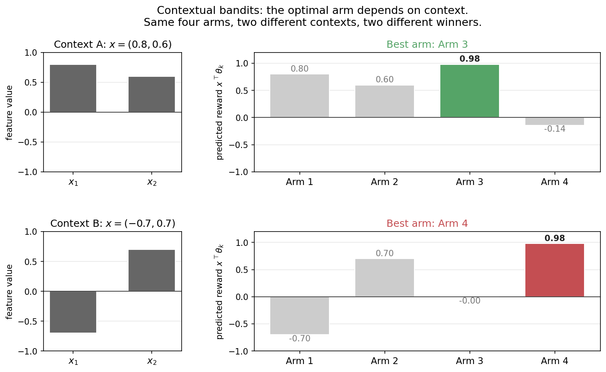
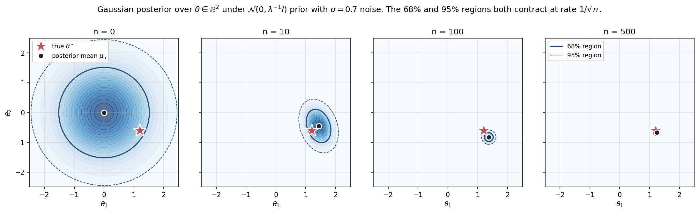
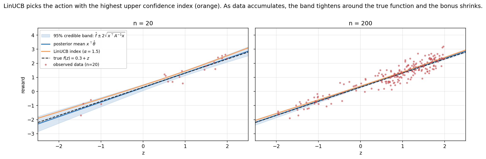
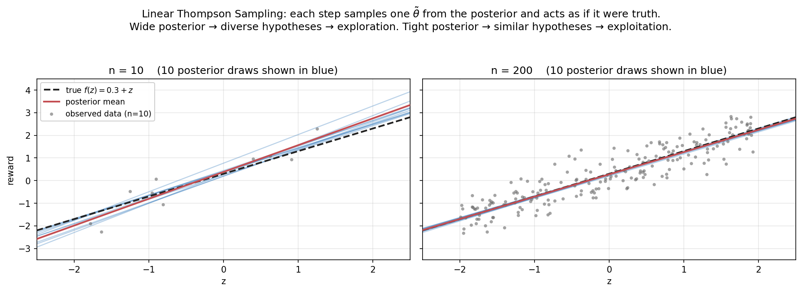
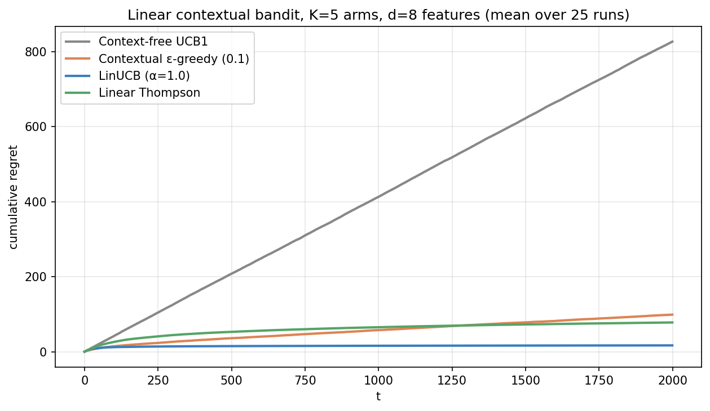
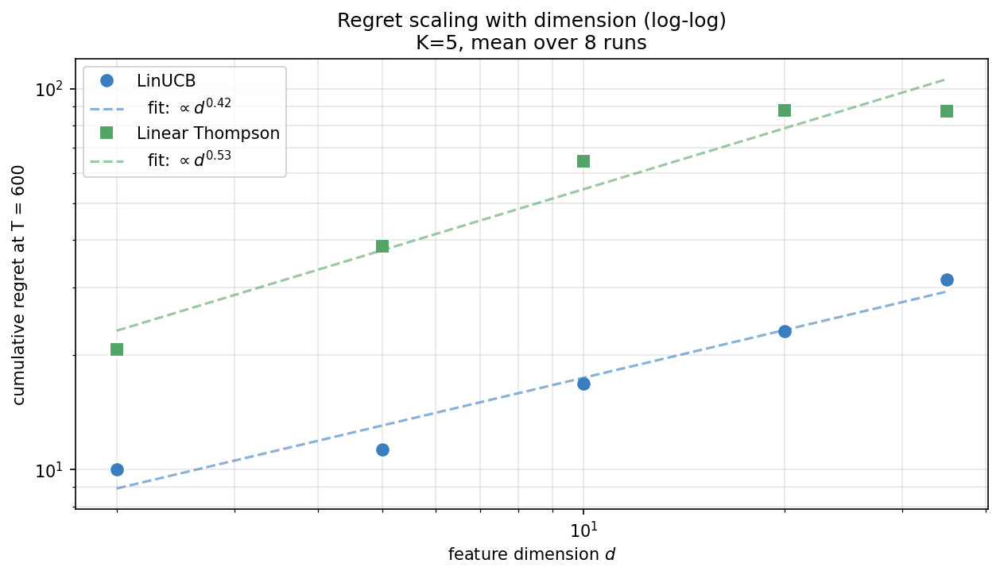
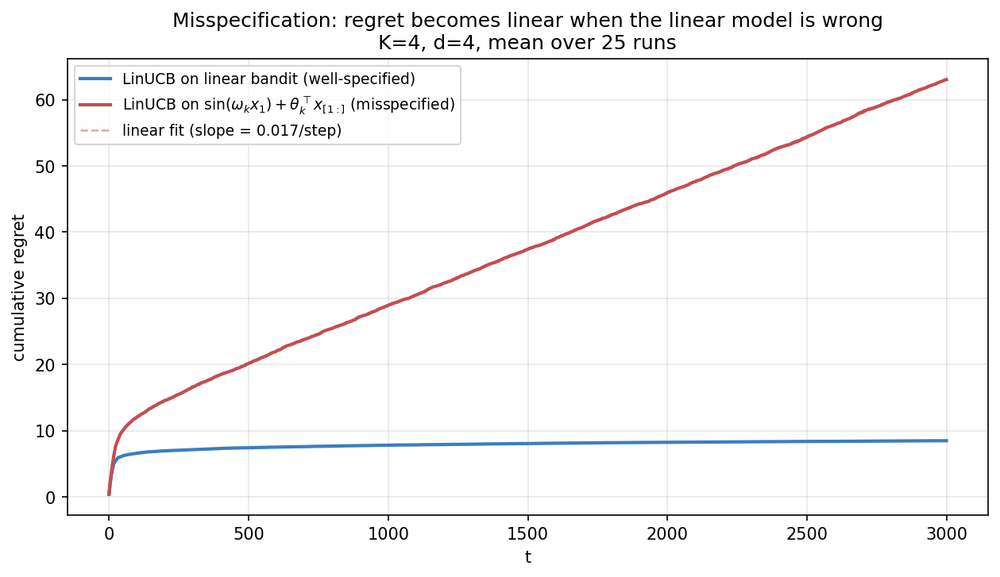
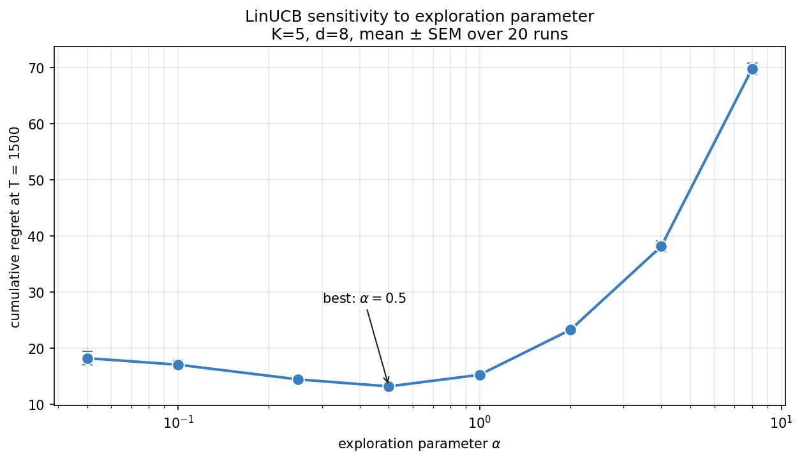

> *Decision-making under uncertainty, from scratch — 2 of 4.*

In [Part 1a](01a-multi-armed-bandits.qmd) we built three algorithms for a world where each arm has a single unknown expected reward. That's enough for some real problems (A/B testing two website designs), but it's far from enough for any modern application. Netflix doesn't recommend the same movie to everyone. A doctor doesn't prescribe the same dose to every patient. An RLHF reward model doesn't score every response the same.

The missing piece is **context** — features describing the situation we're in. The reward of pulling arm $k$ now depends on a context vector $x_t$, and the optimal arm changes with it. This post derives the linear contextual bandit from first principles, builds **LinUCB** and **Linear Thompson Sampling** on top, and lands at the place where reward models for RLHF actually live.

The mathematical engine for both algorithms is **Bayesian linear regression**. We'll spend serious time on it — not because the math is hard, but because many Bayesian deep learning methods, many uncertainty-aware LLM techniques, and many probabilistic agents come back to it. Treating BLR rigorously here pays off for the rest of the series.

**Roadmap for the core of this post.** The logic runs in three moves, and it's worth holding them in mind: (1) we *first derive Bayesian linear regression* (§2) — the posterior over the reward parameters given the data; (2) we then build **LinUCB** (§3), which turns the posterior's *uncertainty* into an optimism bonus and acts on the upper confidence bound; and (3) we build **Linear Thompson Sampling** (§4), which instead *samples* a parameter vector from the posterior and acts greedily under it. Same posterior, two different ways to let uncertainty drive exploration — optimism versus sampling. Everything else is detail around those three moves.

---

## 0. From "best arm" to "best arm for this context"

The figure above shows two contexts $x_A = (0.8, 0.6)$ and $x_B = (-0.7, 0.7)$, and the predicted reward $x^\top \theta_k$ each of four arms produces under each. Same arms, same parameters; different best arm. For $x_A$, arm 3 wins. For $x_B$, arm 4 wins.

If we ran the unstructured bandit algorithms from 1a on this data, they'd see a stream of rewards from each arm, average them out, and pick whichever arm had the highest *marginal* mean. They'd be solving the wrong problem. The marginal-best arm might lose to literally every other arm on every individual context, if the contexts arrive in the wrong proportions.

This is why context-free UCB1 has linear regret on this kind of problem — we'll see it explicitly in the regret figure at the end. The algorithm isn't doing anything wrong given its assumptions; the assumptions just don't match the world.

---

## 1. Formal setup

A **contextual bandit** is a tuple $(\mathcal{X}, \mathcal{A}, P_r)$ where:

- $\mathcal{X}$ is a context space (we'll take $\mathcal{X} = \mathbb{R}^d$),
- $\mathcal{A} = \{1, \dots, K\}$ is the action set, and
- $P_r(\cdot \mid x, a)$ is the conditional reward distribution given context and action.

At each timestep $t$:

1. The environment reveals context $x_t \in \mathcal{X}$.
2. The agent picks action $a_t \in \mathcal{A}$.
3. The environment returns reward $r_t \sim P_r(\cdot \mid x_t, a_t)$.

We want to minimize **regret** relative to the best contextual policy:

$$
R(T) \;\equiv\; \mathbb{E}\!\left[\sum_{t=1}^{T} \max_a \mathbb{E}[r_t \mid x_t, a] \;-\; r_t\right].
$$

This is the contextual analogue of the regret we defined for unstructured bandits. It compares the agent's reward to an oracle that knows the true reward function and picks optimally per-context.

### 1.1 Linearity assumption

To make progress we need structure. The simplest useful assumption is **linearity**: there exist unknown parameters $\theta_k \in \mathbb{R}^d$ such that

$$
\mathbb{E}[r_t \mid x_t, a_t = k] \;=\; x_t^\top \theta_k.
$$

Two common parameterizations:

- **Disjoint:** each arm has its own $\theta_k$. The K reward functions are independent. Used when arms are heterogeneous (e.g., news articles, where each has its own coefficients on user features).
- **Shared (hybrid):** there's a single $\theta$, but features depend on both context and arm: $\mathbb{E}[r \mid x, a] = \phi(x, a)^\top \theta$. Used when arms share structure (e.g., recommending the same set of items with item-specific features).

We'll focus on the disjoint case — it's conceptually cleaner and the math transfers to the shared case directly. In the implementation, both look identical: maintain the sufficient statistics of a Bayesian linear regression, predict and explore using them.

Note: realized rewards add noise, $r_t = x_t^\top \theta_k + \varepsilon_t$ with $\varepsilon_t \sim \mathcal{N}(0, \sigma^2)$. The Gaussian assumption is convenient (conjugate priors!) but not essential — most of what follows generalizes to sub-Gaussian noise.

---

## 2. The engine: Bayesian linear regression

Both LinUCB and Linear Thompson Sampling are wrappers around Bayesian linear regression. The algorithm essentially reduces to "fit a Bayesian linear regression to each arm, then do something thoughtful with the resulting posterior." So we need the posterior.

This section is the deepest math in the post. The payoff is that *many* later techniques in the curriculum — neural bandits, reward models in RLHF, Bayesian neural networks, calibration of LLMs — reduce in some part to this calculation. Internalize it once, reuse it often.

### 2.1 The model

We observe data $\mathcal{D} = \{(x_i, y_i)\}_{i=1}^n$ generated by

$$
y_i \;=\; x_i^\top \theta + \varepsilon_i, \qquad \varepsilon_i \sim \mathcal{N}(0, \sigma^2),
$$

with $\theta \in \mathbb{R}^d$ unknown. We place a Gaussian prior on $\theta$:

$$
\theta \sim \mathcal{N}(\mu_0, \Sigma_0).
$$

A standard choice is $\mu_0 = 0$, $\Sigma_0 = \lambda^{-1} I$ — a centered, isotropic prior with precision $\lambda$. Large $\lambda$ means a tight prior (strong belief that $\theta$ is near 0); small $\lambda$ means a vague prior.

### 2.2 Deriving the posterior

The posterior is also Gaussian — this is the magic of conjugacy. Let me derive it cleanly.

By Bayes' rule, $p(\theta \mid \mathcal{D}) \propto p(\mathcal{D} \mid \theta) \, p(\theta)$. Taking logs and dropping constants:

$$
\log p(\theta \mid \mathcal{D}) \;=\; -\frac{1}{2\sigma^2} \sum_{i=1}^{n} (y_i - x_i^\top \theta)^2 \;-\; \frac{1}{2} (\theta - \mu_0)^\top \Sigma_0^{-1} (\theta - \mu_0) \;+\; \text{const}.
$$

Both terms are quadratic in $\theta$. The posterior is therefore Gaussian. To find its mean and covariance, expand and collect terms in $\theta$:

$$
\log p(\theta \mid \mathcal{D}) \;=\; -\frac{1}{2} \theta^\top \underbrace{\left[\Sigma_0^{-1} + \sigma^{-2} X^\top X\right]}_{\Sigma_n^{-1}} \theta \;+\; \theta^\top \underbrace{\left[\Sigma_0^{-1} \mu_0 + \sigma^{-2} X^\top y\right]}_{\Sigma_n^{-1} \mu_n} + \text{const},
$$

where $X \in \mathbb{R}^{n \times d}$ is the design matrix with rows $x_i^\top$ and $y \in \mathbb{R}^n$ is the response vector. Reading off the coefficients of $\theta^\top (\cdot) \theta$ and $\theta^\top (\cdot)$ gives the **posterior**

$$
\boxed{\;\theta \mid \mathcal{D} \;\sim\; \mathcal{N}(\mu_n, \Sigma_n), \qquad \Sigma_n^{-1} = \Sigma_0^{-1} + \sigma^{-2} X^\top X, \qquad \mu_n = \Sigma_n \big[\Sigma_0^{-1} \mu_0 + \sigma^{-2} X^\top y\big].\;}
$$

With the standard isotropic prior $\mu_0 = 0$, $\Sigma_0 = \lambda^{-1} I$, this simplifies to

$$
\Sigma_n^{-1} \;=\; \lambda I + \sigma^{-2} X^\top X, \qquad \mu_n \;=\; \sigma^{-2} \Sigma_n X^\top y \;=\; \left(\lambda \sigma^2 I + X^\top X\right)^{-1} X^\top y.
$$

This is the **ridge regression** estimator with regularization $\lambda \sigma^2$. Bayesian linear regression with a zero-mean Gaussian prior *is* ridge regression — the posterior mean coincides with the MAP estimate, which coincides with the regularized least-squares solution. Three views, one object.

### 2.3 Visualizing the contraction

The figure shows the posterior at $n = 0, 10, 100, 500$ for a 2D problem with $\sigma = 0.7$ noise. Notice how:

- At $n = 0$, the posterior is the prior — wide and centered at zero, with the true parameter $\theta^\star = (1.2, -0.6)$ near the boundary.
- By $n = 10$, the posterior has clearly moved toward $\theta^\star$, though with significant uncertainty.
- At $n = 100$, the 95% region is tight and contains the truth.
- At $n = 500$, the posterior is essentially a delta at $\theta^\star$.

The rate of contraction is **$1/\sqrt{n}$ per dimension**. Specifically, the posterior covariance $\Sigma_n = (\lambda I + \sigma^{-2} X^\top X)^{-1}$. If $X^\top X$ grows like $n$ times the identity (true on average for isotropic contexts), then $\Sigma_n \approx \sigma^2 / n \cdot I$. The standard deviation in each direction is $\sigma / \sqrt{n}$. This is the same rate that frequentist concentration inequalities give you — Bayesian and frequentist agree on the *amount* of information in $n$ samples.

### 2.4 Online updates and Sherman-Morrison

Bandit algorithms need to update the posterior every step. Recomputing $\Sigma_n^{-1}$ from scratch and inverting it takes $O(n d^2 + d^3)$ — way too expensive online. We want **$O(d^2)$ per step**.

The Sherman-Morrison formula gives it to us. For an invertible matrix $A$ and vectors $u, v$ with $1 + v^\top A^{-1} u \neq 0$,

$$
(A + u v^\top)^{-1} \;=\; A^{-1} \;-\; \frac{A^{-1} u v^\top A^{-1}}{1 + v^\top A^{-1} u}.
$$

In our case, when a new data point $(x_{n+1}, y_{n+1})$ arrives, the precision matrix updates as

$$
A_{n+1} \;=\; A_n + \sigma^{-2} x_{n+1} x_{n+1}^\top, \quad \text{where } A_n \equiv \Sigma_n^{-1}.
$$

Applying Sherman-Morrison with $u = v = \sigma^{-1} x_{n+1}$:

$$
A_{n+1}^{-1} \;=\; A_n^{-1} \;-\; \frac{A_n^{-1} x_{n+1} x_{n+1}^\top A_n^{-1}}{\sigma^2 + x_{n+1}^\top A_n^{-1} x_{n+1}}.
$$

So we maintain $A_n^{-1}$ directly, update it in $O(d^2)$ per step (one matrix-vector product, one outer product), and never call `np.linalg.inv` again. The posterior mean $\mu_n = A_n^{-1} b_n$ where $b_n = \sigma^{-2} \sum_i y_i x_i$ also updates incrementally: $b_{n+1} = b_n + \sigma^{-2} y_{n+1} x_{n+1}$, with $\mu_{n+1} = A_{n+1}^{-1} b_{n+1}$.

In our reference implementation we use the simpler `np.linalg.solve(A, b)` because $d$ is small and clarity wins over micro-optimization. For production at large $d$, switch to Sherman-Morrison.

### 2.5 The variational / KL view

Here's a perspective that becomes essential later in the curriculum. The Bayesian posterior is the unique distribution $q^\star(\theta)$ that minimizes the **variational free energy**:

$$
q^\star \;=\; \arg\min_q \;\Big[\, \mathrm{KL}(q \,\|\, p_0) \;-\; \mathbb{E}_{q}[\log p(\mathcal{D} \mid \theta)] \,\Big],
$$

where the minimization is over all distributions $q$ on $\theta$. When $q$ is restricted to Gaussians and the model is conjugate, this optimization is exact: the optimal $q$ equals the true posterior $p(\theta \mid \mathcal{D})$. When $q$ is restricted to a more limited family (mean-field, low-rank Gaussians, etc.) you get **variational inference** — an approximate posterior that minimizes the same objective.

Two takeaways:

1. **The Bayesian update is an optimization.** Each step minimizes a tradeoff between (a) staying close to the prior (the KL term) and (b) fitting the data (the expected log-likelihood). Online, the previous posterior becomes the new prior, and each new data point pulls the distribution slightly toward better fit.

2. **This is the gateway to variational neural networks.** Replace $\theta$ with neural network weights, replace $p(y \mid x, \theta)$ with a deep model, restrict $q$ to a tractable family (e.g., factorized Gaussian over weights), and you get variational BNNs. The objective is identical. Bayesian linear regression is the simplest non-trivial instance of an idea that scales all the way up.

This isn't a digression — it's the through-line from contextual bandits to modern Bayesian deep learning. Every uncertainty-aware LLM technique in the literature is some descendant of the variational view applied here.

### 2.6 Predictive distribution

For a new context $x_*$, the predictive distribution of the reward is also Gaussian:

$$
r_* \mid x_*, \mathcal{D} \;\sim\; \mathcal{N}\!\left(\, x_*^\top \mu_n, \; \sigma^2 + x_*^\top \Sigma_n x_* \,\right).
$$

The variance has two parts:

- **$\sigma^2$ — irreducible noise.** Even if we knew $\theta$ exactly, we couldn't predict $r_*$ exactly because of the noise term $\varepsilon$. This is **aleatoric** uncertainty.
- **$x_*^\top \Sigma_n x_*$ — parameter uncertainty.** Our uncertainty about $\theta$ projected into the direction $x_*$. This is **epistemic** uncertainty — it shrinks to 0 as $n \to \infty$.

Both LinUCB and LinTS use the epistemic piece. UCB bonuses are scaled by $\sqrt{x_*^\top \Sigma_n x_*}$; TS samples from the parameter posterior. The aleatoric noise is fixed and irreducible — we can't explore it away.

This decomposition matters in agentic AI. When an LLM is uncertain, you want to know whether it's because the world is genuinely ambiguous (aleatoric — can't help by asking again) or because the model is undertrained (epistemic — more data would help). Same math, much bigger problem.

---

## 3. LinUCB

The LinUCB recipe: at each step $t$, for each arm $k$, compute the **upper confidence bound** on the expected reward $x_t^\top \theta_k$. Pick the arm with the highest UCB.

### 3.1 The algorithm

For each arm $k$, maintain the sufficient statistics for arm-$k$'s Bayesian linear regression:

$$
A_k \;\equiv\; \lambda I + \sum_{i:\, a_i = k} x_i x_i^\top, \qquad b_k \;\equiv\; \sum_{i:\, a_i = k} r_i \, x_i,
$$

where the sums are over timesteps when arm $k$ was pulled. We've set $\sigma = 1$ to keep notation light. Then the posterior mean and predictive variance are

$$
\hat\theta_k \;=\; A_k^{-1} b_k, \qquad \mathrm{Var}\!\left(x^\top \theta_k \mid \mathcal{D}\right) \;=\; x^\top A_k^{-1} x.
$$

LinUCB picks

$$
\boxed{\;a_t \;=\; \arg\max_k \; \left[\, x_t^\top \hat\theta_k \,+\, \alpha \sqrt{x_t^\top A_k^{-1} x_t} \,\right].\;}
$$

The first term is the predicted reward — pure exploitation. The second is $\alpha$ times the predictive standard deviation — exploration. Just like UCB1, but the bonus is now context-dependent. **Contexts in poorly-explored directions get higher bonuses; well-explored contexts get smaller bonuses.**

The hyperparameter $\alpha$ controls exploration aggressiveness. It plays the role of a confidence radius, and the theory does *not* reduce it to a clean $O(\sqrt{\log T})$: the honest confidence width from Abbasi-Yadkori et al. (2011) depends on the feature dimension $d$, the regularization $\lambda$, the noise scale $\sigma$, a bound on $\lVert\theta_k\rVert$, and the failure probability $\delta$ — it grows roughly like $\sigma\sqrt{d \log((1 + T/\lambda)/\delta)} + \sqrt{\lambda}\,\lVert\theta_k\rVert$. The $\sqrt{\log T}$ is just the leading time-dependence; the constants matter in practice. In implementations, $\alpha = 1$ is a strong, simple default.

### 3.2 What the algorithm looks like in practice

This figure uses a scalar feature $z$ with $d = 2$ (intercept plus $z$), so we can plot the predicted reward as a function of $z$. The shaded blue band is the 95% credible region for the reward; the orange line is the LinUCB upper-confidence index.

At $n = 20$, the band is visibly wide and the UCB sits noticeably above the posterior mean. The algorithm is uncertain and bonuses are large.

At $n = 200$, the band is tight, the UCB is barely above the mean, and both have essentially converged to the true function. Exploration has finished its job.

The bonus is largest in directions where $x^\top A_k^{-1} x$ is large — directions where the data didn't constrain $\theta_k$ much. If we'd pulled arm $k$ only on contexts living in a 2D subspace of $\mathbb{R}^d$, the predictive variance would be huge for any context outside that subspace, and LinUCB would aggressively pull that arm under such a context to find out. This is **exploration in the direction of information gain** — exactly the right behavior.

### 3.3 Regret bound

For LinUCB with appropriate $\alpha$, Abbasi-Yadkori, Pál & Szepesvári (2011) prove

$$
R(T) \;=\; \tilde O\!\left(d \sqrt{T}\right),
$$

where $\tilde O$ hides logarithmic factors. The matching lower bound for linear contextual bandits is $\Omega(d \sqrt{T})$, so LinUCB is near-optimal.

Note the $\sqrt{T}$ here. It is worth being careful about what it is being contrasted *with*, because finite-arm bandits actually have two regret regimes. The gap-dependent bound for $K$-armed stochastic bandits is logarithmic, $O(\log T)$, when there is a fixed positive gap between the best and second-best arm (this is the bound we cited in 1a). But the same finite-arm problem also has a *gap-free* (worst-case, minimax) bound of order $\sqrt{KT}$, achieved when gaps can be arbitrarily small. So the meaningful contrast is not "linear contextual is $\sqrt T$ while finite-arm is $\log T$" — it is between the *gap-dependent finite-arm* bound ($\log T$) and the *worst-case linear contextual* bound ($d\sqrt T$). Learning a $d$-dimensional reward function, rather than $K$ independent scalar means, puts us in the function-estimation regime, where the $\sqrt T$ minimax rate is fundamental and there is no gap-dependent escape to $\log T$ in general.

---

## 4. Linear Thompson Sampling

The Bayesian counterpart. Instead of optimistic point estimates, **sample** parameters from each arm's posterior and act greedily under the samples.

### 4.1 The algorithm

Maintain the same $A_k$, $b_k$ as LinUCB. At each step:

1. For each arm $k$, sample $\tilde\theta_k \sim \mathcal{N}\!\left(\hat\theta_k, \, v^2 A_k^{-1}\right)$.
2. Play $a_t = \arg\max_k x_t^\top \tilde\theta_k$.
3. Observe $r_t$ and update $A_{a_t}, b_{a_t}$.

The hyperparameter $v$ rescales the posterior variance. $v = 1$ corresponds to the exact Bayesian Thompson posterior under unit-variance noise. Agrawal & Goyal (2013) show that inflating $v$ beyond 1 yields the tightest regret bounds; in practice $v \in [0.25, 1]$ usually works well. Smaller $v$ → less exploration; larger → more.

### 4.2 The "each draw is a hypothesis" view

This figure shows ten posterior draws of the function $f(z) = \theta_0 + \theta_1 z$ at two timesteps. Each draw $\tilde\theta$ is a possible truth — one of the worlds consistent with the data. The agent picks one (randomly), commits to it for the round, and acts as if that world is real.

At $n = 10$, the ten hypotheses fan out: some slopes are higher, some lower, intercepts vary. Different hypotheses imply *different best arms* at a given context. This natural disagreement drives exploration — the agent will visit whichever arm looks best under the sample it drew, and that varies stochastically.

At $n = 200$, all ten draws cluster tightly around the true function. The agent acts almost as if it knew $\theta^\star$, because all plausible $\theta$'s now agree on what to do.

Compare to plain Thompson Sampling from 1a, where each "hypothesis" was a single number per arm (a Beta sample). The same idea, scaled to functions: sample the function, act under it.

### 4.3 Probability matching, generalized

In 1a we showed that Thompson Sampling picks arm $k$ with probability equal to the posterior probability that $k$ is optimal. The same property holds here — but *only when we sample from the true posterior*, i.e. at $v = 1$. With the contextual twist:

$$
P(a_t = k \mid x_t, \mathcal{D}_t) \;=\; P\!\left(\, k = \arg\max_{j} x_t^\top \theta_j \;\Big|\; x_t, \mathcal{D}_t \,\right).
$$

The probability that LinTS picks arm $k$ for context $x_t$ equals the posterior probability that $k$ is the optimal arm at $x_t$. This is a strictly more nuanced statement than the unstructured version: the same arm can have high optimality probability at one context and low at another, and LinTS will track that automatically.

### 4.4 Regret bound

Agrawal & Goyal (2013) prove $R(T) = \tilde O(d^{3/2} \sqrt{T})$ for Linear Thompson Sampling — a factor of $\sqrt{d}$ worse than LinUCB. In practice the bound is loose and LinTS is often empirically competitive with LinUCB. Which wins depends on the problem.

---

## 5. The showdown

Four algorithms on the same problem:

- **Context-free UCB1** ignores $x_t$ entirely, treating rewards from each arm as i.i.d. samples from some marginal distribution. Its regret grows linearly — about 4 per step on this problem — because there *is* no single best arm. The marginal "best" arm is bad on a substantial fraction of contexts.
- **Contextual ε-greedy** uses ridge regression to estimate $\hat\theta_k$ and acts greedily with probability $1 - \varepsilon$. A subtlety the curve hides: with a *fixed* $\varepsilon = 0.1$ it never stops taking random actions, so it pays a constant exploration tax every step and its *asymptotic* regret is actually linear — it only looks competitive over a finite horizon because the tax is small. To get genuinely sublinear regret you must *decay* $\varepsilon$ over time (under suitable conditions on the decay schedule). The fixed-$\varepsilon$ version here is the simple, practical default; it is not asymptotically optimal.
- **LinUCB** wins decisively here. Its principled exploration (Hoeffding-style bounds in feature space) is very efficient.
- **Linear Thompson Sampling** is also sublinear but slightly behind LinUCB on this particular instance. This is the opposite of what we saw in 1a, and it's instance-dependent — try different feature dimensions and noise levels and you'll see the ranking shift.

**The key message: using context buys you orders of magnitude.** At $T = 2000$, the context-free baseline has accumulated ~800 regret; the contextual algorithms have ~10–100. The gap widens with $T$ — context-free regret is linear, contextual is sublinear. Asymptotically, the ratio diverges.

This is the empirical case for why every modern personalization system, recommender, or LLM reward model is contextual.

---

## 6. Forward connections

We're now at a junction with two important downstream applications. Let me make both explicit because they're central to the rest of the agentic AI curriculum.

### 6.1 RLHF reward models and the contextual-bandit analogy

Reinforcement learning from human feedback trains a **reward model** $r_\phi(x, y)$ that scores how good a response $y$ is to a prompt $x$. At heart a reward model is a *contextual scoring function* trained from preference data — and that is exactly the object at the centre of this post, a function of a context (the prompt) and an action (the response). The bandit framing is an analogy rather than an identity: a reward model is fit offline from a fixed preference dataset, not by a bandit actively pulling arms. The analogy becomes *most* direct when you actively choose which prompts and responses to label next — at that point you really are running an exploration policy over a reward-model posterior. The reward model is fit from preference data: humans see pairs $(y_1, y_2)$ for the same prompt $x$ and pick which they prefer. The standard model is **Bradley-Terry**:

$$
P(y_1 \succ y_2 \mid x) \;=\; \frac{\exp r_\phi(x, y_1)}{\exp r_\phi(x, y_1) + \exp r_\phi(x, y_2)} \;=\; \sigma\!\big(r_\phi(x, y_1) - r_\phi(x, y_2)\big).
$$

Take logs: this is **logistic regression** on the difference of rewards. If $r_\phi$ is linear, $r_\phi(x, y) = \phi(x, y)^\top \theta$, you get linear logistic regression — a contextual bandit one-step removed. The features depend on prompt *and* response, fitting our "shared parameterization" case.

In practice $r_\phi$ is a neural network, so the linear model is too simple. But two ideas from this post transfer directly:

1. **Uncertainty in the reward model is the same problem we just solved.** Whether you use Bayesian last-layer ridge regression, deep ensembles, or variational neural networks — all of these are approximations to the posterior over $\theta$ we computed exactly here. The Bayesian view of RLHF asks: how do we maintain calibrated uncertainty about which response is preferred?
2. **Exploration in RLHF.** Active learning for reward models — picking which prompts to label next — is exactly an exploration problem over the reward-model posterior. Should you label a prompt where the current model is confident (low information gain) or one where it's uncertain (high gain)? This is the bandit problem at the data-collection level.

There's published work in this direction; there's also room for more. Calibrated, uncertainty-aware reward modeling is one of the active research areas in safe RL from preferences, and the foundations are exactly what we just built.

### 6.2 Neural bandits and deep uncertainty

What if the reward function isn't linear? Replace $x^\top \theta_k$ with a neural network $f_{\theta_k}(x)$. The problem becomes a **neural bandit**.

The difficulty: we no longer have closed-form posteriors. Several approaches:

- **Bootstrap and ensembles** (Osband et al., 2016). Train $M$ networks on bootstrapped samples of the data. Use the ensemble disagreement as a proxy for posterior variance. Pick actions by sampling one ensemble member (Bootstrapped Thompson) or by averaging means + ensemble-std bonus (ensemble UCB).
- **Bayesian neural networks** (Blundell et al., 2015 and successors). Place a prior on the weights, do variational inference. Same KL view as §2.5, but on a deep model. The variational families are restricted, so the approximation introduces error, but the formalism is identical.
- **Neural linear** (Riquelme et al., 2018). Use the neural net as a feature extractor and apply Bayesian linear regression on the last layer. The features are learned but the uncertainty is closed-form. Practical and surprisingly strong; the recommended starting point.
- **Laplace approximation** (Daxberger et al., 2021). Fit a deterministic neural net, then approximate the posterior as Gaussian centered at the MAP with covariance equal to the inverse Hessian. Plays nicely with pretrained models.

The unifying view: any neural bandit is *Bayesian linear regression in a richer feature space*. The math you built here is the limiting case where the features are fixed. Everything else is a way of learning the features adaptively while still maintaining usable uncertainty.

This is also the connection point to **calibrated LLMs**. Modern LLMs produce probabilities over tokens, but those probabilities are notoriously miscalibrated. The deepest framing is: the model has implicit uncertainty about its own predictions, and treating that uncertainty as Bayesian — with priors, posteriors, and information-theoretic exploration — turns out to be a productive research direction. Conformal prediction, semantic entropy, ensembles of LLMs: all are coarse approximations to the Bayesian story you've now seen exactly.

---

## 7. Experiments to actually run

### 7.1 How does regret scale with dimension?

Run LinUCB and LinTS at $d \in \{2, 5, 10, 25, 50\}$, holding everything else fixed. Plot the cumulative regret at $T = 2000$ as a function of $d$. You should see roughly linear growth in $d$ for LinUCB (consistent with the $\tilde O(d\sqrt{T})$ bound). Check whether LinTS follows the predicted $d^{3/2}$ scaling.

The point: dimension matters a lot. Practical applications with many features need either much more data or function-class structure (sparsity, low-rank, etc.).

### 7.2 Calibration of the posterior

In a held-out sense, are LinUCB's 95% credible intervals actually calibrated? At each step, predict the reward and check whether the realized reward falls within the predictive 95% band. Track the coverage rate. Under correct model specification it should converge to 95%; under misspecification it may be far off.

This is a microcosm of LLM calibration. Models often produce confident-sounding answers whose actual reliability doesn't match. Testing calibration is the first step toward fixing it.

### 7.3 Misspecified model

What if the true reward function is non-linear? Generate data with $r = \sin(x_1) + x_2 + \varepsilon$ and run LinUCB pretending the model is linear. The algorithm will fit the best linear approximation but its regret will not be $\tilde O(\sqrt{T})$ — it will eventually be linear (because no linear approximation gets you to the truth). Empirically observe this. Then think: how would you detect misspecification in real life?

### 7.4 Reproduce one figure from the LinUCB paper

Li et al. (2010) ran LinUCB on a Yahoo! news recommendation dataset. The figure showing cumulative clicks vs LinUCB exploration rate is a classic. Replicate it on synthetic data: vary $\alpha \in \{0.1, 0.5, 1.0, 2.0, 5.0\}$ and plot how regret depends on the exploration parameter. There's an optimal $\alpha$ — find it.

---

## 8. Solutions

As with the previous post, try first. Once you've struggled with each, here are the reference solutions and discussions.

### 8.1 Regret scaling with dimension — `experiments/01b_sol1_regret_vs_dim.py`

**What you should see.** Both algorithms' final regret grows with $d$. The fitted power-law exponents — LinUCB at $d^{0.42}$, LinTS at $d^{0.53}$ — are well below the theoretical bounds of $\tilde O(d)$ and $\tilde O(d^{3/2})$. The qualitative ordering (LinTS grows slightly faster than LinUCB) matches theory.

**Why the gap between theory and practice.** Several reasons:

1. **The bounds are worst-case upper bounds**, not exact rates. They hold over all problem instances; the *average* instance is much easier. Our random thetas are isotropic; the worst case has thetas adversarially aligned with the contexts.
2. **Finite-T effects.** The theoretical $\tilde O(d \sqrt T)$ has hidden constants and $\log T$ factors. At $T = 600$ we're in the regime where lower-order terms still matter.
3. **The constants depend on $\sigma$, $\lambda$, and the diameter of the parameter space.** Different choices give different constants in front of the same exponent.

**The deeper lesson.** In this synthetic setup, empirical scaling came out *better* than worst-case theory predicts — but the headline to take away is the **shape**, not the specific exponents, which are properties of this particular instance (isotropic Gaussian contexts, well-specified linear rewards, this noise level). What generalizes is that regret grows polynomially in $d$ rather than catastrophically: a 10× increase in feature dimension was, here, only a $10^{0.4}$–$10^{0.5} \approx 2.5$–$3\times$ increase in regret. Treat that as the right *intuition* for "how much harder does it get if I add features?" — not as a law to quote. On real problems the exponent depends on the geometry of your contexts and the degree of model misspecification.

For practical work: if your features explode in dimension (sparse one-hot encodings, embedding dimensions), this scaling is your friend. If you can keep the *effective* dimension low (sparsity, low-rank structure), you can do dramatically better than this. Both LinUCB and LinTS have variants that exploit sparsity (LASSO-based; see Bastani & Bayati 2020).

### 8.2 Calibration — `experiments/01b_sol2_calibration.py`

**What you should see.** Under matched noise — the bandit's $\sigma$ equals the algorithm's implicit assumption — coverage converges to 95.3%, essentially right on the nominal 95%. The brief over-shoot to ~98% early on is the prior dominating before enough data arrives. Under mismatched noise (algorithm thinks $\sigma = 1$, truth is $\sigma = 0.1$), coverage is *100% from the start*: every realized reward falls in the predicted interval. The intervals are about $10\times$ too wide.

**Why it happens.** LinUCB's predictive variance is $\sigma_{\text{alg}}^2 + x^\top A^{-1} x$, where the first term is the assumed aleatoric noise and the second is epistemic uncertainty about $\theta$. When $\sigma_{\text{alg}}^2 \gg \sigma_{\text{true}}^2$, you've inflated the noise term tenfold. The 95% interval is mostly capturing irreducible noise the algorithm *thinks* exists but doesn't. Realized rewards essentially always land inside.

**The deeper lesson — this is the canonical case of *calibration*.** Calibration asks: when you say "I'm 95% confident," does that statement bear out empirically? Three failure modes:

- **Over-coverage / under-confidence**: stated intervals are too wide. You're being lazy about your beliefs and missing decisions. *This is what we see in the mismatched case.*
- **Under-coverage / over-confidence**: stated intervals are too narrow. You're being reckless and will be wrong more often than you think.
- **Calibration drift**: coverage starts good but degrades as the problem changes (non-stationarity, distribution shift).

Modern LLMs have all three failure modes, depending on the question type. Calibrating LLM uncertainty — making "the model says 90%" match empirical 90% accuracy — is an active research area. The mathematical *pattern* is analogous to what we just did here: maintain a posterior, ask whether its stated confidence matches observed frequencies. **You have built, in this experiment, the simplest non-trivial calibration test that exists.** Every paper on LLM calibration is doing some version of this, with a more complex model class standing in for the linear one.

**What you should build next.** Conformal prediction is a technique that takes any predictive model — including a miscalibrated one — and produces intervals with finite-sample coverage guarantees. It's a beautifully simple idea worth your time. Once you've internalized this experiment, conformal prediction is a 30-minute read away.

### 8.3 Misspecification — `experiments/01b_sol3_misspecification.py`

**What you should see.** When the model is well-specified (true rewards are linear), LinUCB's regret plateaus around 9 by $T = 3000$ — sublinear and consistent with the $\tilde O(d \sqrt T)$ bound. When the model is misspecified (true rewards include $\sin(\omega_k x_1)$, which no linear function captures), regret grows linearly at $\sim 0.017$ per step from start to finish. After $T = 3000$, cumulative regret is $\sim 63$, with no sign of plateauing.

**Why it happens.** LinUCB fits the best *linear approximation* to the true function, since that's the only thing its model class allows. Call this best linear fit $\bar\theta_k$. The algorithm's regret with respect to the *best linear policy* would be sublinear. But the optimal *contextual* policy uses the true non-linear $r_k(x)$, not its linear approximation. The gap between "best linear policy" and "true optimal policy" is the **approximation error**, and it's constant per step. Cumulative approximation error grows linearly.

You can decompose total regret:
$$
R_{\text{total}}(T) \;=\; \underbrace{R_{\text{linear}}(T)}_{\tilde O(d\sqrt T) \text{ if linear is correct}} \;+\; \underbrace{R_{\text{approx}}(T)}_{\Omega(T) \text{ if misspecified}}.
$$

The second term dominates asymptotically. There's no algorithm in our linear class that can do better — we've hit the ceiling of what the model can express.

**The deeper lesson.** Model class matters more than algorithm. A wrong-class model with a clever algorithm is beaten by a right-class model with a dumb algorithm, eventually. This is why neural bandits and Bayesian deep learning exist: when the truth isn't linear, you need a richer model class even at the cost of harder inference.

**Misspecification detection.** Can you tell from the regret curve that you're misspecified, before you know the answer? Yes — look at the second derivative of cumulative regret. Well-specified algorithms should produce regret curves that *bend down* (sublinear); persistent linearity is a red flag. In practice, you'd also do residual analysis: if your model's residuals show structure (e.g., correlation with some feature), you're missing something.

**What you should build next.** Two natural extensions: (a) Replace LinUCB with a neural-linear UCB (last-layer Bayesian regression on a neural feature extractor) and see if regret returns to sublinear. (b) Implement *model-class testing*: fit several model classes (linear, polynomial degree 2, neural net) and use held-out predictive likelihood to pick. Misspecification stops being a silent killer when you actively look for it.

### 8.4 Alpha sweep — `experiments/01b_sol4_alpha_sweep.py`

**What you should see.** Final regret at $T = 1500$ has a clear minimum at $\alpha \approx 0.5$, where regret is $\sim 13$. Going to $\alpha = 0.05$ (almost no exploration) costs you $\sim 5$ extra regret. Going to $\alpha = 8$ (massive over-exploration) costs you $\sim 57$ extra regret — far worse. The curve is asymmetric: **over-exploration hurts more than under-exploration**, at least on this instance.

**Why the U-shape.** Two competing effects, each unbounded at one end:

- **$\alpha$ too small → exploitation trap.** Without enough bonus to overcome small noise advantages, the algorithm can settle on a suboptimal arm and keep pulling it. Regret is approximately *linear* until enough random noise eventually causes a switch.
- **$\alpha$ too large → wasted exploration.** Big bonuses mean even well-explored arms keep getting probed. The algorithm keeps trying arms it should already know are bad. Per-pull regret is high; cumulative regret grows fast.

The optimum is where these two costs balance.

**Why over-exploration is worse here.** At the high-$\alpha$ end, every step is genuinely costly — you're pulling clearly-suboptimal arms by direct choice. At the low-$\alpha$ end, you're *not* pulling clearly-suboptimal arms; you're failing to discover that one of your "good" arms is actually better. The first error is constant per step; the second is bounded by the gap between near-tied top arms, which can be small. Hence the asymmetry.

**The deeper lesson — agentic AI implication.** Every exploration mechanism has a tunable temperature: $\alpha$ in UCB-like methods, $v$ in Thompson, $\varepsilon$ in ε-greedy, the entropy bonus in policy gradients, the temperature parameter in LLM decoding. They all have this U-shape. The whole point of the principled methods (Thompson, Bayesian RL) is that **the optimal temperature is set automatically by the posterior** — you don't have to sweep. But every system still has *some* knob, and the U-shape governs it.

**Practical guidance.** For a new contextual bandit problem, sweep $\alpha$ logarithmically over $\{0.1, 0.3, 1, 3, 10\}$ before fixing it. The optimum often sits in $[0.5, 2.0]$; $\alpha = 1$ is a strong default if you have no budget for tuning. Thompson Sampling with $v = 1$ is even more strongly self-tuning and often a safer choice for production.

---

## 9. Further reading

- **Lattimore & Szepesvári, *Bandit Algorithms* (2020), Chapters 18–22.** The rigorous treatment of contextual bandits. Worth reading carefully if you want the tight regret proofs.
- **Li, Chu, Langford & Schapire, "A Contextual-Bandit Approach to Personalized News Article Recommendation" (WWW 2010).** The original LinUCB paper. Surprisingly readable and full of practical wisdom.
- **Abbasi-Yadkori, Pál & Szepesvári, "Improved Algorithms for Linear Stochastic Bandits" (NeurIPS 2011).** The cleanest analysis of LinUCB and the source of the $\tilde O(d\sqrt{T})$ bound.
- **Agrawal & Goyal, "Thompson Sampling for Contextual Bandits with Linear Payoffs" (ICML 2013).** The contextual TS paper. The variance inflation analysis is the technical crux.
- **Bishop, *Pattern Recognition and Machine Learning* (2006), Chapter 3.** The cleanest exposition of Bayesian linear regression I know of. Worth reading even if you've seen it before.
- **Riquelme, Tucker & Snoek, "Deep Bayesian Bandits Showdown" (ICLR 2018).** An empirical comparison of neural bandit methods. Neural-linear holds up surprisingly well — read for both the methods and the meta-lesson that simple methods often win.
- **Ouyang et al., "Training Language Models to Follow Instructions with Human Feedback" (NeurIPS 2022).** The InstructGPT paper. The reward modeling section is exactly the contextual bandit framing from §6.1.

---

**Next up — Part 1c: MDPs and the Bellman equations.** We add state transitions. Now the action you take changes the world, not just the reward you receive. Value functions, the Bellman optimality equation, value iteration. The bandit-to-MDP relationship is worth stating precisely: an *ordinary* (context-free) bandit is a one-state MDP; a *contextual* bandit is an MDP with an exogenous state — the context arrives from outside and your action does *not* influence the next context. What 1c adds is exactly that missing ingredient: action-dependent state transitions, where what you do now shapes the situations you face later.
