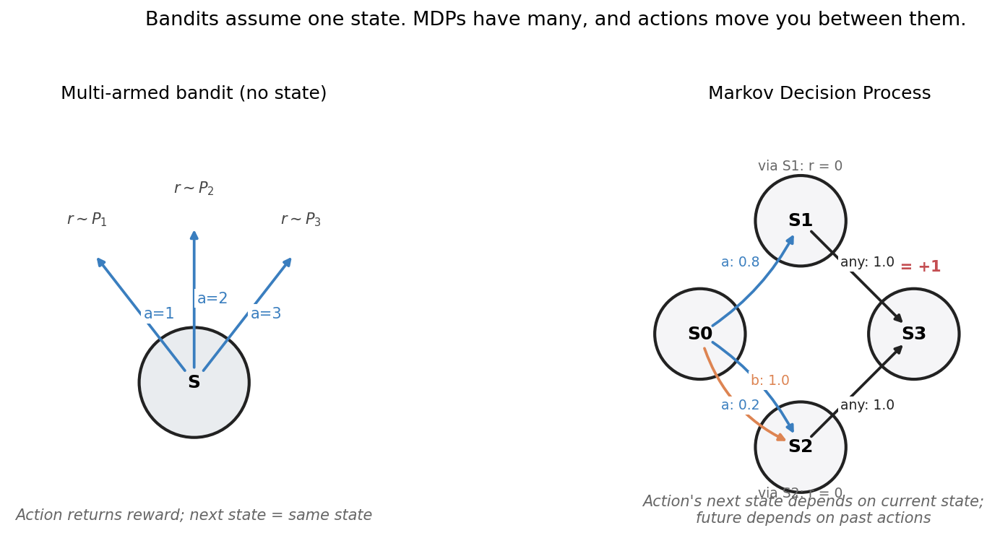
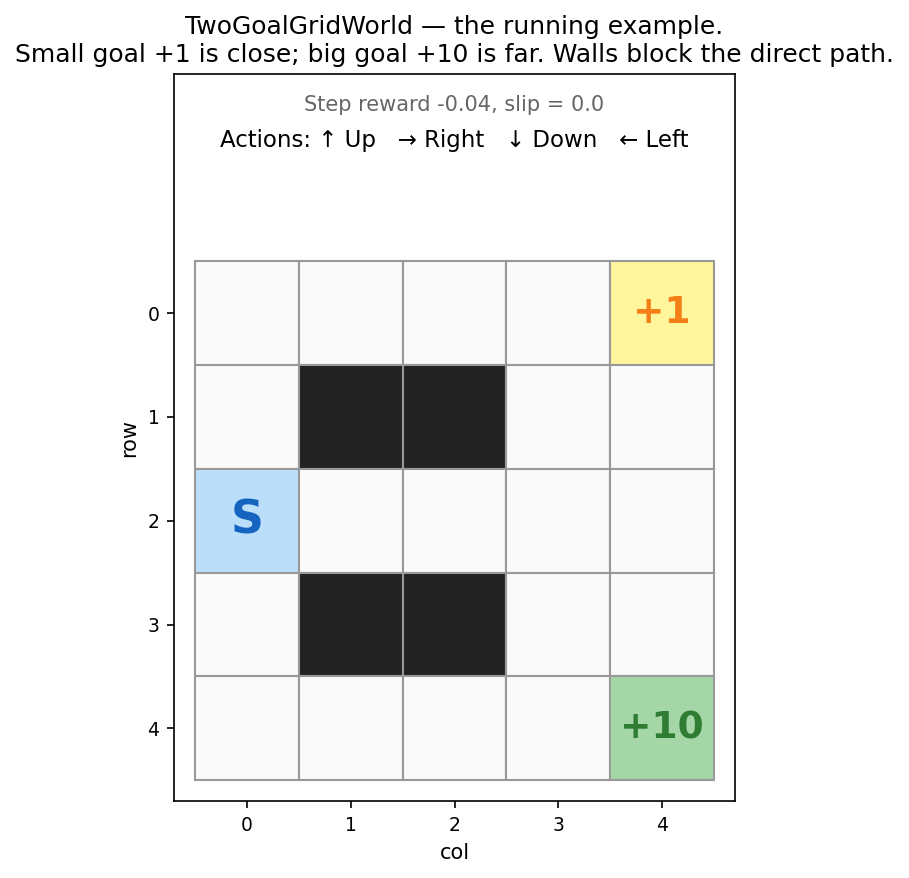
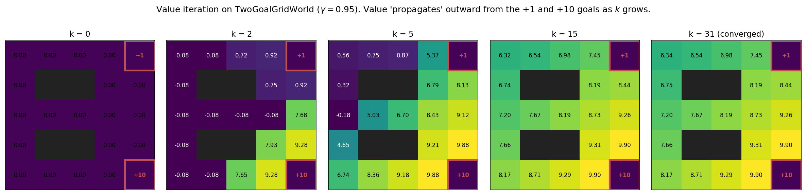
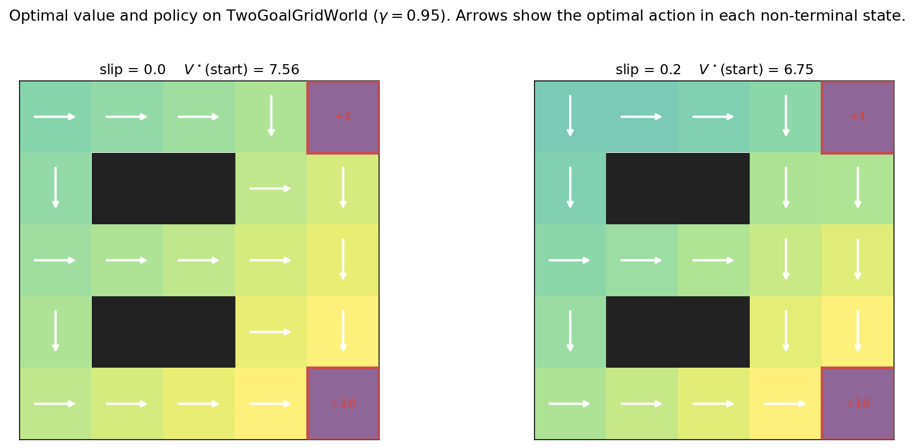
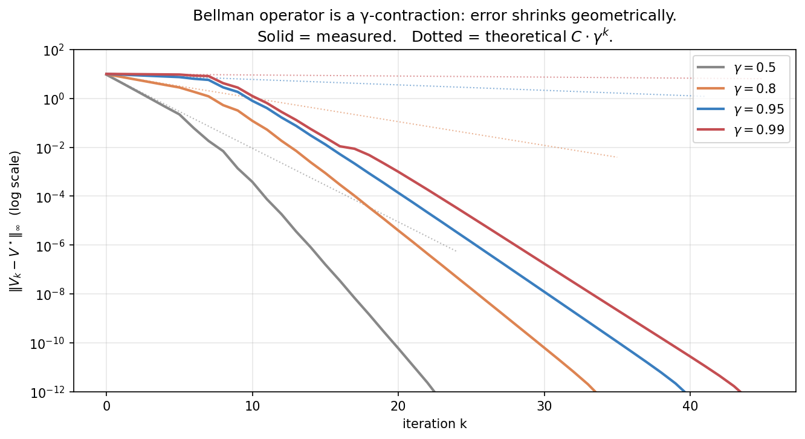
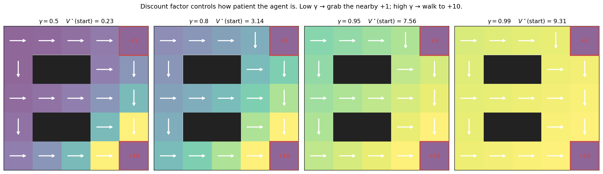
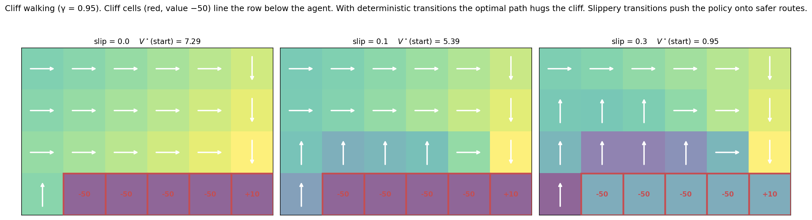
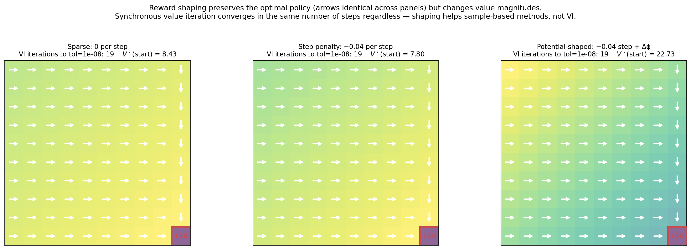
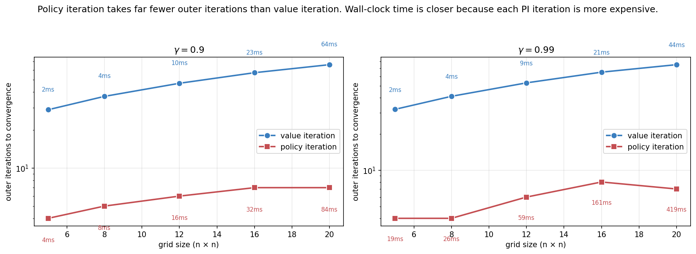

> *Decision-making under uncertainty, from scratch — 3 of 4.*

In [Part 1a](01a-multi-armed-bandits.qmd) and [Part 1b](01b-contextual-bandits.qmd), we built algorithms for problems where each action gives you a reward and *then nothing else matters*. The world doesn't change because of what you did. The next decision is just like this one.

Real decisions don't work like that. A chess move now changes which positions you can be in next. A tool call now shapes what the LLM agent can do in the following turn. A treatment decision now affects what symptoms you'll see in the next checkup. The simple act of *having state* — a world that evolves based on actions — is what turns a bandit into a **Markov Decision Process** (MDP), and it's the framework everything in RL builds on.

This post derives MDPs and the Bellman equations from first principles, proves convergence of value iteration via the contraction mapping theorem, implements value iteration and policy iteration in clean NumPy, and solves a gridworld with both. The math gets a little more interesting; the figures shift from regret curves to **value heatmaps and policy arrows**.

---

## 0. When state matters



The left panel shows a multi-armed bandit. There's one state $S$, and three actions each return a reward sampled from a fixed distribution. The right panel shows the simplest non-trivial MDP: four states, two actions in $S_0$ that produce *different* next-state distributions, and a reward associated with eventually reaching $S_3$.

The new question is: **how should I trade off immediate rewards against future opportunities?** Action $b$ from $S_0$ deterministically lands in $S_2$, which then deterministically reaches the reward $S_3$. Action $a$ is risky: it lands in $S_1$ (which also leads to $S_3$) with high probability, but slips to $S_2$ with low probability. Are these equivalent? Better, worse?

The answer requires summing rewards over all future steps, weighted by probability. That sum is the **return**, and learning to compute it for arbitrary policies is the central activity of dynamic programming. Once we can compute returns, we can pick the policy that maximizes them.

---

## 1. Formal setup

A **Markov Decision Process** is a tuple $(\mathcal{S}, \mathcal{A}, P, R, \gamma)$:

- $\mathcal{S}$ — set of states.
- $\mathcal{A}$ — set of actions (possibly state-dependent: $\mathcal{A}(s)$).
- $P(s' \mid s, a)$ — transition probabilities: probability of next state being $s'$ given current state $s$ and action $a$.
- $R(s, a, s')$ — reward function. We'll often use the simpler $R(s, a)$ when reward depends only on state and action.
- $\gamma \in [0, 1]$ — discount factor.

At each timestep $t = 0, 1, 2, \dots$ the agent:

1. Observes the current state $s_t$.
2. Picks an action $a_t$.
3. Receives reward $r_{t+1}$ and transitions to $s_{t+1} \sim P(\cdot \mid s_t, a_t)$.

### 1.1 The Markov property

The defining assumption is that the transition probabilities depend only on the current state and action — not on the history:

$$
P(s_{t+1} \mid s_t, a_t, s_{t-1}, a_{t-1}, \dots, s_0, a_0) \;=\; P(s_{t+1} \mid s_t, a_t).
$$

The "Markov" in "MDP" is this property. It says the current state is a **sufficient statistic** for the past — everything you need to know about how the world will evolve is captured in $s_t$.

This is a strong assumption, and almost no real-world problem satisfies it literally. A chess position is Markov (state is the board); a robotics task often isn't (you need velocity, not just position); an LLM conversation isn't (you need long-range context). The standard fix is to *redefine the state* to include enough history to make it Markov. The "state" you use is an engineering choice.

When the true state is partially observed — when what you see isn't sufficient to predict the future — you get a **POMDP**, which is the subject of [Part 1d](01d-pomdps-and-q-learning.qmd). For now, assume Markov.

### 1.2 The running example: TwoGoalGridWorld



The states are cells. Actions are {Up, Right, Down, Left}. By default transitions are deterministic — the action you choose is the action you take. With slip probability $p$, the action goes uniformly at random to one of the three non-intended directions with probability $p$; otherwise as intended. Walls are non-states: an action into a wall keeps you in place. Terminals are absorbing: once you reach them, no more transitions and no more rewards.

The point of this layout: there are two terminals worth +1 and +10, and they're at roughly equal distances from start. The discount factor $\gamma$ controls whether the +10 is worth waiting for. We'll see this concretely in §9.

---

## 2. Policies, returns, and value functions

### 2.1 Policies

A **policy** is a rule for choosing actions. Two flavors:

- **Deterministic**: $\pi : \mathcal{S} \to \mathcal{A}$, mapping states to actions.
- **Stochastic**: $\pi(a \mid s)$, a probability distribution over actions given state.

For the rest of this post we'll mostly work with deterministic policies — they're sufficient for MDPs (there's always a deterministic optimal policy, a fact we'll see in §4).

### 2.2 Returns

The **return** from time $t$ is the discounted sum of future rewards:

$$
G_t \;=\; r_{t+1} + \gamma r_{t+2} + \gamma^2 r_{t+3} + \cdots \;=\; \sum_{k=0}^{\infty} \gamma^k r_{t+k+1}.
$$

The discount factor $\gamma \in [0, 1)$ does two things:

1. **Makes the infinite sum finite.** With bounded rewards $|r| \leq R_{\max}$, $|G_t| \leq R_{\max} / (1 - \gamma)$. Without discounting (or a finite horizon), the sum can diverge.
2. **Encodes patience.** Low $\gamma$ values immediate rewards heavily over future ones; high $\gamma$ treats them as comparable. We'll see this control "myopia vs patience" empirically in §9.

When the MDP has terminal states (like our gridworld), the sum effectively truncates at the first terminal. Mathematically, you can treat a terminal state as one that loops back to itself with zero reward forever — same answer.

### 2.3 Value functions

Two functions encode "how good is this state/action under policy $\pi$":

- **State-value function**: $V^\pi(s) \;=\; \mathbb{E}_\pi[G_t \mid s_t = s]$. Expected return when starting in state $s$ and following $\pi$ thereafter.
- **Action-value function**: $Q^\pi(s, a) \;=\; \mathbb{E}_\pi[G_t \mid s_t = s, a_t = a]$. Expected return when starting in $s$, taking action $a$, then following $\pi$.

These are related by $V^\pi(s) = \sum_a \pi(a \mid s) Q^\pi(s, a)$, and conversely $Q^\pi(s, a) = \sum_{s'} P(s' \mid s, a) [R(s, a, s') + \gamma V^\pi(s')]$.

We're after the **optimal** value functions:

$$
V^\star(s) \;=\; \max_\pi V^\pi(s), \qquad Q^\star(s, a) \;=\; \max_\pi Q^\pi(s, a).
$$

An **optimal policy** $\pi^\star$ is any policy whose value function is $V^\star$. Note: there can be multiple optimal policies (multiple actions might be tied for best in a given state), but they all achieve the same value.

---

## 3. The Bellman equations

This is the heart of the post. The Bellman equations are *self-referential* relationships that the value functions must satisfy. They are the foundation of every value-based RL algorithm.

### 3.1 The expectation equation: one-step decomposition

For any policy $\pi$, the value function satisfies

$$
\boxed{\; V^\pi(s) \;=\; \sum_a \pi(a \mid s) \sum_{s'} P(s' \mid s, a) \big[R(s, a, s') + \gamma V^\pi(s')\big]. \;}
$$

This is the **Bellman expectation equation**. The derivation is one line:

$$
\begin{aligned}
V^\pi(s) &= \mathbb{E}_\pi[r_{t+1} + \gamma r_{t+2} + \gamma^2 r_{t+3} + \cdots \mid s_t = s] \\
&= \mathbb{E}_\pi[r_{t+1} + \gamma G_{t+1} \mid s_t = s] \\
&= \sum_a \pi(a \mid s) \sum_{s'} P(s' \mid s, a) \big[R(s, a, s') + \gamma V^\pi(s')\big].
\end{aligned}
$$

In words: the value of a state equals the expected immediate reward, plus $\gamma$ times the expected value of the next state. The value at $s$ is *defined in terms of* the value at $s'$.

### 3.2 The optimality equation

For the optimal value function, replace the sum-over-policy with a max:

$$
\boxed{\; V^\star(s) \;=\; \max_a \sum_{s'} P(s' \mid s, a) \big[R(s, a, s') + \gamma V^\star(s')\big]. \;}
$$

This is the **Bellman optimality equation**. It says the optimal value of $s$ equals the best expected one-step result, computed under the optimal value of the next state.

The optimal policy reads off directly:

$$
\pi^\star(s) \;=\; \arg\max_a \sum_{s'} P(s' \mid s, a) \big[R(s, a, s') + \gamma V^\star(s')\big].
$$

Once you know $V^\star$, the optimal action in every state is a one-step lookup. The hard part is *finding* $V^\star$.

### 3.3 The Bellman operators

Write the Bellman expectation equation as $V^\pi = T^\pi V^\pi$ where the operator $T^\pi$ acts on value functions: $(T^\pi V)(s) = \sum_a \pi(a \mid s) \sum_{s'} P(s'|s,a)[R(s,a,s') + \gamma V(s')]$. This $T^\pi$ is **linear** in $V$.

Write the optimality equation as $V^\star = T^\star V^\star$ where $(T^\star V)(s) = \max_a \sum_{s'} P(s'|s,a)[R(s,a,s') + \gamma V(s')]$. This $T^\star$ is **non-linear** — the max makes it so.

Both operators are **$\gamma$-contractions** in the max-norm: for any two value functions $V$ and $V'$,

$$
\|T V - T V'\|_\infty \;\leq\; \gamma \|V - V'\|_\infty.
$$

**Proof sketch (for $T^\star$).** For each state $s$:
$$
|(T^\star V)(s) - (T^\star V')(s)| = \big| \max_a [\ldots V \ldots] - \max_a [\ldots V' \ldots] \big| \leq \max_a \big| [\ldots V \ldots] - [\ldots V' \ldots] \big|
$$
$$
= \max_a \gamma \big| \mathbb{E}_{s'}[V(s') - V'(s')] \big| \leq \gamma \|V - V'\|_\infty.
$$

The inequality $|\max f - \max g| \leq \max |f - g|$ is the only delicate step.

### 3.4 Why contraction matters: Banach's fixed-point theorem

The **contraction mapping theorem** (Banach, 1922) says: a $\gamma$-contraction on a complete metric space (with $\gamma < 1$) has a unique fixed point, and iterating the operator from *any* starting point converges to it at rate $\gamma$.

Apply this to $T^\star$. The space of bounded value functions $V : \mathcal{S} \to \mathbb{R}$ under the max-norm is complete. $T^\star$ is a $\gamma$-contraction. Therefore:

1. **$V^\star$ exists and is unique.** The Bellman optimality equation has exactly one solution.
2. **Iterating $T^\star$ from any $V_0$ converges to $V^\star$.** And the error shrinks geometrically: $\|V_k - V^\star\|_\infty \leq \gamma^k \|V_0 - V^\star\|_\infty$.

These two facts are the foundation of every value-based RL algorithm. The next two sections describe two ways to use them.

---

## 4. Value iteration

The most direct algorithm: just iterate the Bellman optimality operator until convergence.

```python
V = np.zeros(nS)
for k in range(max_iters):
    Q = R + gamma * (P @ V)        # Q[s, a] = expected one-step + gamma * V(s')
    V_new = Q.max(axis=1)          # take the max over actions
    if np.max(np.abs(V_new - V)) < tol:
        break
    V = V_new
pi = Q.argmax(axis=1)              # read off the optimal policy
```

That's the whole algorithm. Two lines of math per iteration. The full clean version is in `src/nano_agents/mdp/solvers.py`.

### 4.1 Watching it work



This is what the operator is doing. At $k = 0$ all values are zero. After one Bellman backup ($k = 1$, not shown), states adjacent to terminals get their first non-zero values — they "see" the reward one step away, discounted by $\gamma$. By $k = 2$, two-step states get values via the $k = 1$ values of their neighbors. And so on.

The intuition is *value propagating outward from terminals at one cell per iteration*. After $k$ iterations, you've correctly accounted for the first $k$ steps of every trajectory. After many more iterations, the contraction has made even the higher-order terms shrink below tolerance.

### 4.2 The optimal value and policy



Two takeaways from these final panels:

1. **The arrows align with the value gradient.** Going to a higher-value neighbor is the optimal action. This is consistent with the Bellman equation: the optimal policy is the one-step greedy choice with respect to $V^\star$.

2. **Stochasticity is expensive.** The same problem with 20% slip has $V^\star(\text{start})$ drop from 7.56 to 6.75 — about 10% — because the agent now has to hedge against unintended transitions. Some arrows shift toward more conservative paths.

### 4.3 The geometry of convergence



This figure verifies the contraction property empirically. With $\gamma = 0.5$, each iteration cuts the error roughly in half. With $\gamma = 0.99$, each iteration only shaves about 1% off, and you need ~40 iterations to reach machine precision.

The practical implication: **high-$\gamma$ problems take more iterations to solve.** The "effective horizon" $1/(1-\gamma)$ measures how many future steps you need to account for. With $\gamma = 0.99$, the effective horizon is 100. The algorithm has to propagate value information that far, and each iteration propagates it by approximately one step.

This is exactly why long-horizon RL is hard. The deeper a problem's effective horizon, the slower planning converges.

---

## 5. Policy iteration

A different algorithm with a different rhythm. Instead of iterating one value function until convergence, **policy iteration** alternates two steps:

1. **Policy evaluation**: solve $V^\pi$ for the current policy $\pi$ (typically by iterating $T^\pi$ to convergence — itself a contraction).
2. **Policy improvement**: compute $\pi'(s) = \arg\max_a Q^\pi(s, a)$ using $V^\pi$.

Repeat until $\pi' = \pi$. The full algorithm in pseudocode:

```python
pi = np.zeros(nS, dtype=int)
while True:
    V = policy_evaluation(pi, P, R, gamma)        # exact solve for V^pi
    Q = R + gamma * (P @ V)
    pi_new = Q.argmax(axis=1)
    if np.array_equal(pi_new, pi):                # tie-break carefully (see code)
        break
    pi = pi_new
```

**Why it terminates.** The *policy improvement theorem* says that if $\pi'$ is greedy with respect to $V^\pi$, then $V^{\pi'} \geq V^\pi$ pointwise — and strictly greater unless $\pi'$ is already optimal. So each PI iteration strictly improves the policy until it can't anymore. Since there are only finitely many deterministic policies in a finite MDP ($|\mathcal{A}|^{|\mathcal{S}|}$ of them), PI must terminate in finitely many iterations.

**Why it usually terminates fast.** Each PI iteration is essentially Newton's method on the Bellman optimality equation. The convergence is *quadratic* near the optimum, not just linear like VI. In practice, PI usually terminates in 5–10 outer iterations on small MDPs, regardless of $\gamma$.

The catch: each PI iteration is expensive. Policy evaluation requires either solving a linear system ($|\mathcal{S}|^3$ in the worst case) or iterating $T^\pi$ to convergence (cheaper in practice). VI's iterations are individually cheap. We'll see the tradeoff empirically in §9.

**Practical tie-breaking.** A subtlety: if multiple actions tie for argmax in a state, naive PI can oscillate between equivalent policies forever. The fix is to only switch $\pi(s)$ if the new action's Q-value is *strictly* greater than the current one's. Our implementation does this.

---

## 6. Forward connections

### 6.1 Bandits and contextual bandits as MDPs with $|\mathcal{S}| = 1$

Bandits are MDPs with one state. The Bellman equation collapses: $V^\star = \max_a R(a) + \gamma V^\star$, giving $V^\star = \max_a R(a) / (1 - \gamma)$. The optimal policy is "always take the best arm" — exactly what we were trying to find in Part 1a.

Contextual bandits are MDPs with one *step* per episode: state transitions exist but the episode terminates after one action. Equivalently, $\gamma = 0$. The Bellman equation collapses to $V^\star(s) = \max_a R(s, a)$, recovering the contextual-bandit objective from Part 1b.

This is why bandits are the right starting point for RL: they are MDPs with the temporal structure stripped away. Adding it back is what we just did.

### 6.2 LLM agents are MDPs (with caveats)

An LLM agent using tools generates a sequence: at each step it observes the conversation history $s_t$, picks an action $a_t$ (a token, a tool call, a response), receives an "observation" (tool output) and an implicit reward (eventually, did the task succeed?). The conversation-so-far is the state.

This is an MDP if you treat the full conversation history as the state. It's a *huge* MDP — $|\mathcal{S}|$ is astronomical, growing with conversation length. Value iteration is unthinkable on this scale, and we need function approximation (neural networks) to represent $V$ and $Q$.

But the Bellman equation still holds. Modern RLHF, PPO for language models, and reasoning-RL methods like GRPO are all approximate value-based or policy-gradient methods built on this foundation. **The Bellman equation is what justifies bootstrapping** — using your current estimate of $V$ to update itself, which is the only way to make sequential decisions tractable at scale.

The transition from this post to the next series of topics (policy gradients, RLHF) goes exactly through this point. Read the Bellman equation as a *target* for neural networks to regress against, and you're already past half the conceptual work.

### 6.3 Model-based planning and MCTS

Value iteration assumes you have $P$ and $R$ — the **model** of the world. When you do, planning is "just" dynamic programming.

AlphaGo and AlphaZero don't run value iteration on the full game tree (Go has $\sim 10^{170}$ board positions, never mind sequences). They run **Monte Carlo Tree Search**, which is a clever sample-based approximation to the Bellman backup. MCTS uses a neural network's value estimate as a heuristic and refines it by simulating rollouts.

The conceptual story: MCTS replaces "compute $\max_a \sum_{s'} P(s'|s,a)[R + \gamma V(s')]$ over all $a$ and $s'$" with "sample a few promising actions, follow each forward with a learned model, use a UCB-style bonus to balance exploration of the search tree." It is, in essence, applying the multi-armed bandit ideas from Part 1a to *nodes in the planning tree*. UCB1 plays a starring role in MCTS, which is why we built it in 1a.

We'll see MCTS for LLM reasoning in Part 3 of the curriculum (Tree of Thoughts, search-augmented LLMs). For now, just notice: every "structured planning" technique in modern AI is, when you squint, a Bellman backup with approximations.

---

## 7. Experiments to actually run

### 7.1 Discount factor sensitivity

Run VI on TwoGoalGridWorld at $\gamma \in \{0.5, 0.8, 0.95, 0.99\}$. How does the optimal policy change? Does the agent at the start always head to the +10 goal, or does there exist a $\gamma$ low enough that the +1 wins for some states?

The intuition you should build: $\gamma$ is the *patience parameter*. With $\gamma = 0$, the agent is purely myopic — it only cares about immediate reward. As $\gamma \to 1$, the agent treats all future rewards equally. The transition is smooth and the boundary where the policy switches is a specific function of the discount and the path lengths.

### 7.2 Stochastic transitions and risk

Modify the gridworld to have a "cliff" — a row of states with reward $-50$. The optimal deterministic path runs right next to the cliff. What happens to the policy when you add slip probability?

The expected lesson: under stochasticity, the agent prefers paths that are *robust to perturbations*, not paths that are *shortest in expectation*. This is the formal beginning of "risk-aware" planning, and it's central to safe RL.

### 7.3 Reward shaping

Try three reward designs for the same task:
- **Sparse**: reward only at the goal.
- **Step penalty**: reward at goal, plus a small negative reward per step.
- **Potential-based shaping**: step penalty plus a bonus equal to $\phi(s') - \gamma \phi(s)$ where $\phi(s) = -\mathrm{dist}(s, \text{goal})$.

Compare the three. Do the policies agree? Do the value functions? Do the number of VI iterations differ?

The Ng-Harada-Russell (1999) result you're rediscovering: **potential-based shaping preserves the optimal policy**. The value functions differ by a state-dependent constant, but the policy is identical. This is the only kind of reward shaping that's safe to apply without thinking — any other form changes what's optimal.

### 7.4 Policy iteration vs value iteration

Implement both, time them, count iterations. On problems with varying $\gamma$ and grid size, when does each win?

The classical wisdom: PI uses fewer outer iterations (sometimes far fewer) but each iteration is more expensive. VI's iterations are cheap. Wall-clock often favors VI on small problems, PI on larger ones — but the exact crossover depends on the inner-loop tolerance of policy evaluation.

---

## 8. Solutions

### 8.1 Discount factor sensitivity — `experiments/01c_sol1_discount_sensitivity.py`



**What you should see.** Most of the policy is identical across all four discount factors: head right, then down, toward the +10 goal at the bottom-right. The difference is concentrated in the *top-right corner* — states near the +1 goal. At low $\gamma$, those states peel off toward the +1; at high $\gamma$, they commit to the longer journey to +10.

The dramatic change is in $V^\star(\text{start})$: from 0.23 at $\gamma = 0.5$ to 9.31 at $\gamma = 0.99$. The optimal *policy* changes only at a few states; the optimal *value* changes by 40×. This is because value is the discounted sum, and the discount factor compresses the whole signal.

**Why local-only changes.** A state's optimal action depends on a comparison of one-step-look-aheads under $V^\star$. For states far from both terminals, the choice is dominated by "head toward the highest-value neighbor," which is roughly the same across $\gamma$ values because all $V^\star$ values are scaled the same way. The choice only changes when a state is close enough to a terminal that the difference between $\gamma^k \cdot 1$ and $\gamma^{k+\Delta} \cdot 10$ swings the comparison. That happens at the top-right corner — states a step or two from +1, several steps from +10.

**The deeper lesson — γ as a hyperparameter.** In RL practice, $\gamma$ is often chosen by convention ($0.99$ is common). But it's not innocuous: it implicitly defines what "long-term" means. Too low and you get short-sighted policies. Too high and credit assignment becomes hopeless because everything is comparable to everything else. For tasks with episode lengths of $\sim H$, a rule of thumb is $\gamma = 1 - 1/H$. For LLM agents reasoning over 10–20 steps, $\gamma \in [0.9, 0.95]$ is typical. For long-horizon tasks ($H = 1000+$), $\gamma = 0.999$ is necessary but makes value-based methods very slow to converge.

### 8.2 Stochastic transitions — `experiments/01c_sol2_stochastic.py`



**What you should see.** The agent starts at the left, the goal (+10) is at the bottom-right, and the row just below the agent's row is a line of cliff cells (terminal, reward $-50$). With deterministic transitions, the optimal path runs along the row directly above the cliff — closest to the goal, never slipping into the cliff. With slip $= 0.1$, the values on the cliff-adjacent row drop sharply (the expected reward of a single step into the cliff is $-5$ from a 10% chance of $-50$), and the policy starts hedging away. With slip $= 0.3$, most of the policy has retreated to the upper rows, and $V^\star(\text{start})$ has collapsed from 7.29 to 0.95 — the trip is barely worth taking.

**Why the policy retreats.** The Bellman equation directly accounts for transition probabilities. Under slip, a "Right" action from a cliff-adjacent state means: with probability $0.9$ you move right safely, with probability $0.1/3 \approx 0.033$ each you slip up, down, or left. The "down" slip drops you into a $-50$ cliff. Expected immediate reward becomes $0.9 \cdot (\text{step reward}) + 0.033 \cdot (-50) + \cdots$, dominated by the $-50$ term. The optimal policy *learns the risk* — not because of a separate risk module, but because the expected-value calculation in the Bellman equation already handles it correctly.

**The deeper lesson.** This is "risk awareness for free." Standard RL maximizes expected return; that's already enough to drive the policy off the cliff edge when transitions are uncertain. No special "risk-sensitive" objective needed. This is why deterministic gridworlds in textbooks look so easy and stochastic ones look so cautious — the math is the same, the world is just being honest about its noise.

In LLM agent terms: when actions have uncertain outcomes (a tool call might fail, a search might return garbage), value-based planning naturally prefers actions with predictable consequences. The agent learns to take "safe" actions even without an explicit safety objective. This is the same machinery that, scaled up, gives us conservative planning in safety-critical RL.

### 8.3 Reward shaping — `experiments/01c_sol3_reward_shaping.py`



**What you should see.** All three reward designs produce the *same* optimal policy — the arrows are identical. The value functions differ: sparse gives $V^\star(\text{start}) = 8.43$, step penalty gives 7.80, potential-shaped gives 22.73. And VI converges in exactly 19 iterations under all three.

The 19-iterations-each result is the surprising one. Reward shaping is usually pitched as a way to *speed up learning*, so why doesn't it help here?

**Why VI doesn't benefit from shaping (but Q-learning does).** Synchronous value iteration does a full Bellman backup at every state in every iteration. Information about the goal reward propagates outward at the rate of *one cell per iteration*, regardless of whether you have step penalties or potentials. The bottleneck is the topological structure of the MDP, not the reward signal density.

Sample-based methods (Q-learning, REINFORCE, PPO) are entirely different. They update from individual transitions: a Q-learning agent that only sees reward at the goal has to randomly stumble onto the goal *and then* the rare goal-reaching trajectory needs to propagate backward through the Bellman backup over many subsequent training steps. With shaped rewards, every transition carries informative gradient signal, and learning is dramatically faster.

This was the central insight of the Ng-Harada-Russell (1999) paper: potential-based shaping is the *only* form that's safe (doesn't change what's optimal) *and* useful (provides denser signal). Their proof is essentially: under potential-based shaping, the new $Q$-function differs from the old one by exactly $-\phi(s)$. Argmax over actions is unchanged. So the policy is unchanged.

**The deeper lesson — values are relative, policies are not.** In RL, only the *differences* between values matter for the policy. Adding any state-dependent constant $\phi(s)$ shifts the values but not the relative ordering. This means there's a lot of freedom in how you define rewards as long as you preserve the right relative orderings. This freedom is exploited heavily in modern RLHF: the reward model's *absolute* outputs don't matter — only their relative differences across pairs of responses. The Bradley-Terry preference model uses this freedom by construction.

### 8.4 Policy iteration vs value iteration — `experiments/01c_sol4_pi_vs_vi.py`



**What you should see.** PI uses far fewer outer iterations — between 4 and 9 across the entire range of grid sizes and discount factors. VI uses 25–80, growing with both size and $\gamma$. So PI wins on iteration count, by an order of magnitude.

But the wall-clock times tell the opposite story. At grid $20 \times 20$ with $\gamma = 0.99$, PI takes 419 ms while VI takes 44 ms — VI is **10× faster** despite needing 10× more iterations.

**Why the inversion.** Each PI iteration involves a full policy evaluation: solving $V^\pi$ for the current $\pi$. We do this by iterating $T^\pi$ to convergence, which itself is contraction with rate $\gamma$ — so policy evaluation at $\gamma = 0.99$ takes hundreds of inner iterations. Each PI outer iteration is therefore $\sim 100\times$ more expensive than a VI iteration.

Math: PI does $\sim 5 \times 400 = 2000$ "Bellman-equivalent" operations; VI does $\sim 80 \times 1 = 80$. VI wins by 25×, matching the empirical ratio.

**When PI is actually faster.** Three scenarios:

1. **Exact policy evaluation by linear solve.** Instead of iterating $T^\pi$, solve $(I - \gamma P^\pi) V = R^\pi$ directly with `np.linalg.solve`. Cost: $O(|\mathcal{S}|^3)$ once per PI iteration, vs $O(|\mathcal{S}|^2 / (1-\gamma) \cdot \text{tol})$ for iterative evaluation. For small state spaces and high $\gamma$, the direct solve wins.

2. **Modified policy iteration** (Puterman & Shin 1978): instead of fully converging policy evaluation, do just $k$ iterations of $T^\pi$ before improving the policy. With $k = 1$ you recover value iteration; with $k = \infty$ you recover pure PI. Intermediate $k$ values often beat both.

3. **Generalized policy iteration**, the framework behind actor-critic methods. The "evaluator" and the "improver" don't need to run to convergence — they can alternate at any rate. This unification is one of the most important conceptual insights of modern RL.

**The deeper lesson.** Iteration count isn't the right metric. Wall-clock cost = (iterations) × (cost per iteration), and PI loads its cost into the inner loop. For modern RL where you have neural networks doing the function approximation, the inner-vs-outer-loop tradeoff reappears in every algorithm. Actor-critic methods are essentially generalized PI; deep Q-learning is essentially VI with a neural network. The PI/VI distinction has scaled all the way up to ChatGPT.

---

## 9. Further reading

- **Sutton & Barto, *Reinforcement Learning: An Introduction* (2018), Chapters 3–4.** The canonical reference for MDPs and dynamic programming. Free online.
- **Puterman, *Markov Decision Processes* (1994).** The definitive mathematical treatment. Read this for proofs.
- **Bertsekas, *Dynamic Programming and Optimal Control* (1995–2017).** Two volumes covering finite MDPs, infinite-horizon problems, and approximate DP. Heavier on theory; great if you want depth.
- **Banach, "Sur les opérations dans les ensembles abstraits et leur application aux équations intégrales" (1922).** The original contraction mapping theorem.
- **Ng, Harada & Russell, "Policy invariance under reward transformations: Theory and application to reward shaping" (ICML 1999).** Three pages, hugely influential.
- **Bellman, *Dynamic Programming* (1957).** The book that named the field. Out of print but reissued; the original framing is still illuminating.

---

**Next up — Part 1d: POMDPs and Q-learning.** We add hidden state. The agent no longer sees $s_t$ directly — it sees observations $o_t$ that are noisy signals of the true state. The agent must maintain a **belief** over what the true state might be, and act on that belief. POMDPs are the formal framework for LLM agents using tools — the conversation history is the agent's belief over the true world state. We'll derive belief-state planning, then introduce **Q-learning** as the model-free alternative for when you don't have $P$ and $R$ at all.
