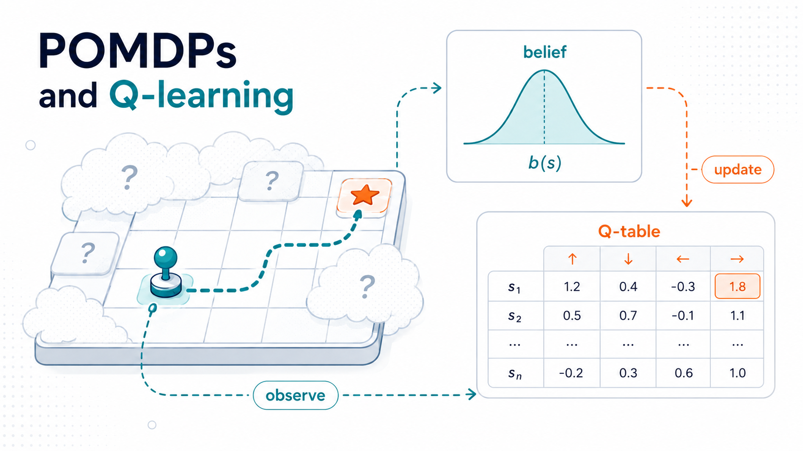
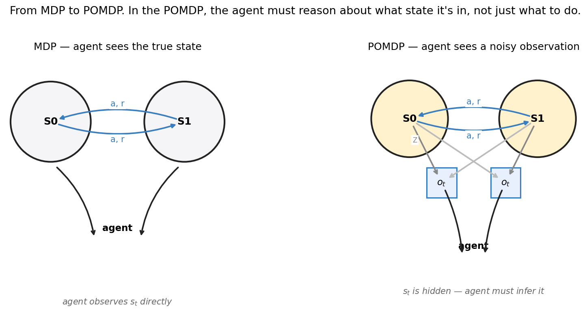
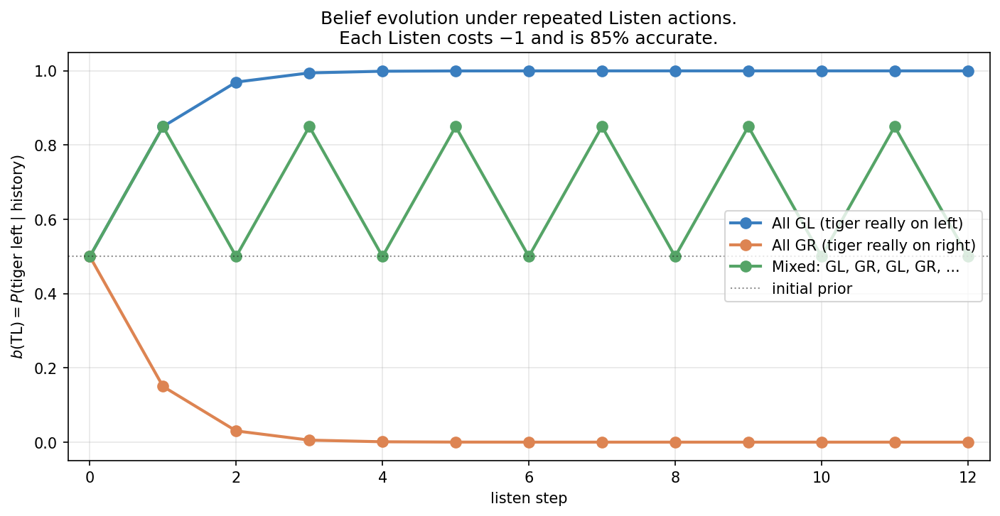
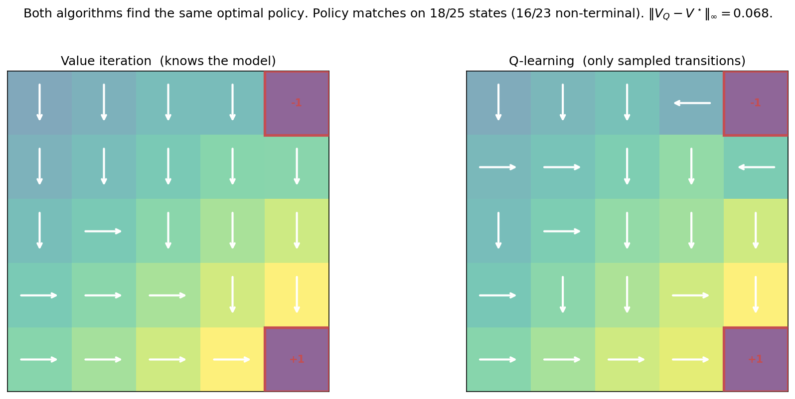
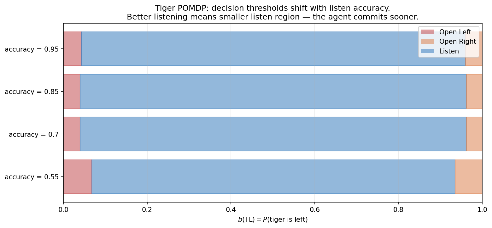
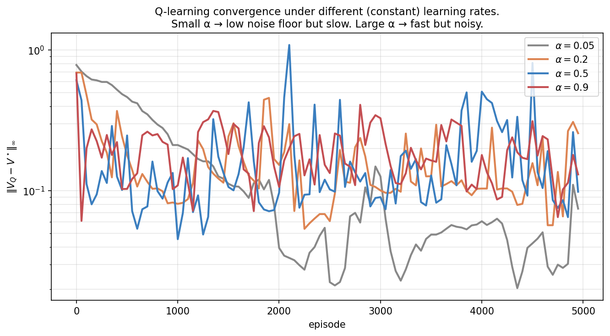

> *Decision-making under uncertainty, from scratch — 4 of 4.*

This is the last post of Topic 1, and it closes the loop. We've built up algorithms for problems where the agent observes everything ([Part 1c](01c-mdps-and-bellman.qmd)) and has a model of how the world works. That's also the most that classical dynamic programming can give us. Two assumptions remain to drop, and dropping each one unlocks a different family of methods.

**Assumption 1 — full observability.** What if you don't see the state? You see a *noisy observation* of it. The agent has to *infer what state it might be in* before deciding what to do. The framework is the **POMDP** (Partially Observable MDP), and its central idea is the **belief state** — a probability distribution over what the true state might be.

**Assumption 2 — known model.** What if you don't have $P$ and $R$? You just have an environment you can interact with, observing transitions one at a time. This is the **model-free** setting, and its workhorse is **Q-learning** — a beautiful, simple algorithm that learns the optimal Q-function directly from experience, using only the Bellman equation as its skeleton.

These are two different relaxations of the MDP setting, and it is worth being clear that they are **independent complications** that this post happens to treat together. Partial observability (the POMDP) removes *full observability* — you can no longer see the true state. Model-free learning (Q-learning) removes the *known model* — you no longer have $P$ and $R$ to plan with. Either can occur without the other: you can have a hidden state with a known model (a classic POMDP), or full observability with an unknown model (tabular Q-learning on a gridworld). Put as a slogan: **POMDPs answer "what if the state is hidden?"; Q-learning answers "what if the model is unknown?"; combining them gives model-free RL under partial observability** — which is the regime an LLM agent actually lives in. This post derives both from first principles, demonstrates them on small concrete problems, and connects them to LLM agents, which sit at that intersection.

---

## 0. Two missing pieces



In an MDP, the agent observes $s_t$ directly. In a POMDP, it observes $o_t$ — a noisy signal generated from $s_t$ via an **observation function** $Z(o \mid s', a)$. The agent must reason about $s_t$ from the history of observations.

This is the formal model for the situation an LLM agent is in. The true state is whatever the world is actually like; the observations are the conversation history, tool outputs, sensor readings. The agent never sees the world directly — only what comes through its observation channel.

The second missing piece is the **model** itself: $P$ and $R$. Value iteration assumed both. What if you only have a black-box environment you can call? Q-learning is the answer to that.

---

## Part I — POMDPs

## 1. Formal setup

A **Partially Observable MDP** extends the MDP with:

- $\mathcal{O}$ — set of observations.
- $Z(o \mid s', a)$ — observation probability: how likely we are to observe $o$ given that action $a$ led to state $s'$.

The dynamics are unchanged: $s_{t+1} \sim P(\cdot \mid s_t, a_t)$, and $r_{t+1} = R(s_t, a_t)$. The new step is that the agent doesn't see $s_{t+1}$ — it sees $o_{t+1} \sim Z(\cdot \mid s_{t+1}, a_t)$.

The agent's history at time $t$ is $h_t = (a_0, o_1, a_1, o_2, \dots, a_{t-1}, o_t)$. In principle, a policy can depend on the entire history. In practice, we'd like a smaller representation that's just as informative.

## 2. The belief state

The key idea: **maintain a probability distribution over what the true state might be.**

The belief state $b_t : \mathcal{S} \to [0, 1]$ is a probability distribution (so $\sum_s b_t(s) = 1$). Intuitively, $b_t(s)$ is "given everything I've seen so far, my probability that I'm currently in state $s$."

The belief is a **sufficient statistic** for the history. That is, $b_t$ contains all the information from $h_t$ that's relevant for predicting the future. Two histories that produce the same belief are equivalent for decision-making.

### 2.1 The Bayesian belief update

After taking action $a_t$ and observing $o_{t+1}$, we update the belief by Bayes' rule:

$$
\boxed{\;
b_{t+1}(s') \;=\; \frac{Z(o_{t+1} \mid s', a_t) \,\sum_s P(s' \mid s, a_t)\, b_t(s)}{P(o_{t+1} \mid b_t, a_t)}
\;}
$$

The numerator is the standard Bayes formula: prior times likelihood. The denominator is the normalization $P(o_{t+1} \mid b_t, a_t) = \sum_{s'} Z(o_{t+1} \mid s', a_t) \sum_s P(s' \mid s, a_t) b_t(s)$.

Two parts, each interpretable:

1. **Predict step**: $\sum_s P(s' \mid s, a_t) b_t(s)$ propagates the belief forward through the dynamics. This is the new belief *before* incorporating the observation.
2. **Update step**: multiply by $Z(o_{t+1} \mid s', a_t)$, the observation likelihood, then renormalize. This is the Bayesian assimilation of the new observation.

In code, the whole update is six lines:

```python
def belief_update(b, a, o, P, Z):
    pred      = b @ P[:, a, :]              # predict step (nS-vector)
    posterior = Z[:, a, o] * pred           # update step
    Z_norm    = posterior.sum()
    return posterior / Z_norm if Z_norm > 0 else np.ones_like(b) / len(b)
```

### 2.2 The belief MDP

Here is the beautiful theoretical result. **A POMDP is equivalent to an MDP whose state is the belief $b$.** This belief MDP has:

- State space: $\Delta(\mathcal{S})$, the probability simplex over $\mathcal{S}$ — a *continuous* state space.
- Action space: the same $\mathcal{A}$.
- Transition: belief evolves under the Bayesian update.
- Reward: $R(b, a) = \sum_s b(s) R(s, a)$, the expected reward under the belief.

The Bellman optimality equation lives on beliefs:

$$
V^\star(b) \;=\; \max_a \Big[ R(b, a) + \gamma \sum_o P(o \mid b, a)\, V^\star(b') \Big],
$$

where $b'$ is the belief after observing $o$ given $(b, a)$.

So in principle we can apply value iteration. But the state space is continuous. We're not solving a finite-state MDP anymore. The complexity is genuinely worse: **finite-horizon POMDP planning is PSPACE-hard — in fact PSPACE-complete — in the standard decision-problem formulation** (Papadimitriou & Tsitsiklis 1987), and even approximate solutions to large POMDPs are challenging.

### 2.3 The α-vector representation

There is a redeeming structure, and it is cleanest at a finite horizon. For a **finite-horizon** POMDP, Sondik (1971) proved that the optimal value function is **piecewise linear and convex in $b$**: $V^\star(b) = \max_\alpha \alpha \cdot b$ for a *finite* set of vectors $\{\alpha\}$, each $\alpha \in \mathbb{R}^{|\mathcal{S}|}$, where each α-vector corresponds to a particular conditional plan of future decisions. For the **infinite-horizon discounted** case the picture is more delicate: the optimal value function is the fixed point of the dynamic-programming backup and is the limit of a sequence of piecewise-linear convex functions, but it need not have an exact finite α-vector representation — it is convex and can be approximated to any accuracy by finitely many α-vectors, which is what practical solvers exploit.

This is the basis of exact POMDP solving — we just have to find (or, in the infinite-horizon case, approximate) the right set of α-vectors. Algorithms like *exact value iteration with pruning* and *incremental pruning* do this for small POMDPs. They are clean but technical, and become impractical for $|\mathcal{S}| > 30$ or so.

For pedagogy, we'll use a simpler approximation: **discretize the belief simplex**. For a 2-state POMDP, the belief is just $b(s_0) \in [0, 1]$, a 1D quantity. Snap it to a grid of 401 points, treat the result as a finite MDP, and run value iteration. The discretization error converges to zero as the grid is refined, and the implementation is 30 lines.

## 3. The Tiger problem

The canonical small POMDP (Cassandra, Kaelbling & Littman 1994):

- **States** (hidden): tiger behind left door, or tiger behind right door.
- **Actions**: Open Left ($-100$ if tiger there, $+10$ otherwise), Open Right (symmetric), Listen (cost $-1$).
- **Observations**: Growl Left or Growl Right. The Listen action gives a noisy observation of the true state with accuracy $85\%$ (default). Other actions give uninformative observations.
- **Dynamics**: Listen keeps the state. Opening a door resets to uniform.

The reward is asymmetric and large: getting eaten is much worse than not getting gold. The optimal policy must trade off the cost of listening against the catastrophe of opening the wrong door under uncertainty.

### 3.1 The belief gives you everything



Three trajectories under the Listen action:

- **All Growl-Left**: belief in tiger-left rises rapidly. After three consistent observations, $b(\text{TL}) \approx 0.997$ — essentially certain. After four, the algorithm is at numerical 1.0.
- **All Growl-Right**: symmetric, goes to $b(\text{TL}) \approx 0$.
- **Alternating GL, GR, GL, GR, ...**: each pair returns to belief 0.5 (any update cancels its predecessor). The agent never resolves the uncertainty no matter how long it listens.

The third case is illuminating. Belief is a *complete record of evidence*, but it doesn't necessarily grow more confident over time. If the world is genuinely ambiguous — alternating signals from a 50/50 mixture — the optimal policy might be to give up and act on the prior. The agent needs to recognize when listening is no longer informative.

### 3.2 The optimal value and policy


The figure decomposes $V^\star(b)$ into the three action-conditional Q values:

- **Open Left** (red): $Q^\star(b, \text{OL}) = b(\text{TL}) \cdot (-100) + b(\text{TR}) \cdot 10 + \gamma V^\star(\text{post-open belief})$. Linear in $b$, with high values at $b(\text{TL}) \approx 0$ (tiger probably right, so opening left is safe).
- **Open Right** (orange): symmetric. High at $b(\text{TL}) \approx 1$.
- **Listen** (blue): roughly flat across the middle of the belief space, with a value around 20–24. This is "the expected value of being able to learn more before committing."

The dashed black line is $V^\star = \max_a Q^\star(\cdot, a)$, the upper envelope. It's *piecewise linear and convex*, as Sondik predicted: linear on the open-right region, slightly curved on the listen region (the curvature comes from the discretization grid; true POMDP value functions are exactly piecewise linear), and linear again on the open-left region.

The policy reads off the upper envelope: the action whose Q-line is on top at belief $b$ is the optimal action there. The three regions appear as colored bands in the bottom strip.

**The thresholds are about $b(\text{TL}) = 0.04$ and $0.96$.** The optimal policy is to listen unless you're at least 96% confident. The agent is willing to absorb many $-1$ listen costs to avoid the $-100$ disaster.

---

## Part II — Q-learning

We now switch problems. Assume back to fully observable states (no POMDP). But also assume we don't know $P$ or $R$. The only thing we have is the ability to **interact with the environment**: at any state $s$, we can take an action $a$ and observe a sample $(r, s')$. Can we still find the optimal policy?

## 4. Temporal-difference learning

The Bellman optimality equation for Q-values is

$$
Q^\star(s, a) \;=\; \mathbb{E}_{s' \sim P(\cdot \mid s, a)} \big[R(s, a, s') + \gamma \max_{a'} Q^\star(s', a')\big].
$$

We don't know $P$, but we can sample from it: by taking action $a$ in state $s$, we get a single $(r, s')$ pair. The unbiased one-sample estimate of the right-hand side is

$$
\text{target} \;=\; r + \gamma \max_{a'} Q^\star(s', a').
$$

Of course, we don't know $Q^\star$ either. So we *bootstrap*: use our current estimate $Q$ in place of $Q^\star$ in the target. This is the central idea of **temporal-difference (TD) learning**.

If our current $Q$ were perfect, the target would equal $Q(s, a)$ in expectation. If our $Q$ is wrong at $(s, a)$, the target carries information about the error — it pulls us toward the correct value. The **TD error** is

$$
\delta_t \;=\; r_{t+1} + \gamma \max_{a'} Q(s_{t+1}, a') - Q(s_t, a_t).
$$

We move $Q(s_t, a_t)$ a small step toward the target:

$$
\boxed{\;
Q(s_t, a_t) \;\leftarrow\; Q(s_t, a_t) + \alpha \, \delta_t.
\;}
$$

This is **Q-learning** (Watkins 1989). It is one of the simplest, most consequential algorithms in machine learning.

### 4.1 Why it converges

Watkins & Dayan (1992) proved that with the Robbins–Monro step-size conditions

$$
\sum_{t} \alpha_t = \infty, \qquad \sum_{t} \alpha_t^2 < \infty,
$$

and provided every $(s, a)$ pair is visited infinitely often, tabular Q-learning converges to $Q^\star$ with probability 1.

The intuition behind the proof: each update is a *stochastic* application of the Bellman optimality operator. The operator is a $\gamma$-contraction in the deterministic case (§3.4 of [Part 1c](01c-mdps-and-bellman.qmd)). The stochastic version has a similar contraction property in expectation; with diminishing step sizes, the noise averages out and the limit point is the fixed point — namely $Q^\star$.

The "visit every $(s, a)$ infinitely often" condition is where **exploration** comes in. The common shorthand is that ε-greedy with $\varepsilon > 0$ "trivially" satisfies it, but that is too quick: it needs the environment to actually let you reach every relevant state. The careful statement is that in a *finite communicating MDP* (one where every state is reachable from every other under some policy), fixed-$\varepsilon$ exploration keeps every action probable in every state you visit, ensuring continued exploration of the reachable state-action pairs — and convergence then requires that every *relevant* $(s,a)$ pair is in fact visited infinitely often. In a non-communicating MDP, no amount of local randomization reaches a state you can never get to. With that caveat, ε-greedy with $\varepsilon > 0$ is the standard tabular Q-learning exploration scheme.

There is a second subtlety worth stating explicitly, because it trips people up. Q-learning's convergence guarantee is about the *learned greedy policy* — $\arg\max_a Q(s,a)$ converges to optimal. It is **not** a claim that the *behavior policy* you act under becomes optimal. If you keep exploring with a constant $\varepsilon$, your behavior policy is forever $\varepsilon$-random and therefore forever sub-optimal by a fixed margin, *even though* the greedy policy extracted from the same $Q$ has converged. To make the behavior policy itself approach optimal you must decay $\varepsilon$ toward zero. Learning the optimal values and acting optimally are different things; constant-$\varepsilon$ Q-learning does the first, not the second.

In practice we use a constant $\alpha$ rather than the diminishing sequence required for theoretical convergence. The price is that $Q$ doesn't converge to $Q^\star$ exactly — it bounces around it with a noise floor proportional to $\alpha$. We'll see this in §6.

### 4.2 Off-policy: a subtle but consequential property

Q-learning is **off-policy**. The target uses $\max_{a'} Q(s', a')$ — the value of the *greedy* action, regardless of what action we actually take next. We can be acting under any policy (typically ε-greedy for exploration), and we're still learning about the *greedy* policy w.r.t. our current Q.

This decoupling matters enormously. It means we can:

- Learn from someone else's data (other agents, demonstrations, replay buffers).
- Use one policy for exploration and another (the greedy one) for evaluation.
- Reuse data — every transition contributes to the same Q-function, regardless of when or how it was collected.

This is the conceptual foundation of **DQN** (Deep Q-Network, Mnih et al. 2015) and basically all modern off-policy RL. Replay buffers are made possible by off-policy-ness.

## 5. Q-learning on the gridworld

Let's apply it. The environment is the GridWorld from Part 1c. We never tell Q-learning about $P$ or $R$ — only about the legal actions and how to take a step.


The figure is the punch line of Q-learning: **from samples alone, the algorithm exactly recovers the optimal value function that value iteration computed with full model access.** The right two panels are identical. The sup-norm error is at numerical zero by episode 1200.

This works because Q-learning makes a single Bellman backup per transition, and after enough transitions through every state, the averaging effects of the update converge to the right value. There's no symbol that says "$P(s' \mid s, a) = 0.3$" anywhere in the algorithm — that knowledge ends up encoded in the Q-table as a consequence of the many transitions sampled from that distribution.

### 5.1 The learned policy



Side by side with VI's answer, Q-learning's policy is essentially identical. The few disagreements are concentrated near the −1 terminal, in states where multiple actions are nearly tied (the precise choice depends on which exploration trajectories the algorithm sampled). Both algorithms head decisively toward +1; both avoid −1; both use the same overall structure.

---

## 6. Forward connections

### 6.1 LLM agents can be modeled as POMDP-like systems

This is the single most important conceptual point of this entire post.

An LLM agent has a hidden "true state of the world" that it cannot observe directly. It observes:

- **The conversation history** — what the user said, what previous tool calls returned.
- **Tool outputs** — search results, calculator outputs, code execution traces.
- **Its own outputs** — what it has previously said or done.

These observations are noisy and incomplete signals of the actual world state. Some of them are very informative (a search result that directly answers the question); some are barely informative (a vague answer from a user). The agent's job is to act sensibly without ever knowing what the world is "really like."

This can be usefully modeled as a POMDP-like system. The agent's *internal representation* — the hidden state of the transformer running the conversation — plays the role of a **belief state**: an approximation, learned by training, of "everything I know about the world right now given everything I've seen." The mapping is a productive lens rather than a literal claim that a transformer implements exact Bayesian belief updates, but it explains several phenomena that are otherwise mysterious:

1. **Why long contexts help.** More observations means a sharper belief. A POMDP with the same dynamics but better observations has lower regret.
2. **Why prompting works.** Prompts provide informative observations that immediately update the belief away from the prior.
3. **Why hallucinations happen.** When the belief is broad (the model doesn't really know), but it's forced to commit to an action (output a token), it has to pick *some* answer. With uncalibrated belief, the picked answer can be wildly wrong while sounding confident.
4. **Why model self-evaluation fails sometimes.** Asking an LLM "are you sure?" is asking it to report its belief, which it didn't necessarily encode in any callable way. The belief is implicit in the activations, not in the output text.

The conceptual structure you built here — belief states, Bayes updates, the piecewise linear value function — is the same *structure* that exact POMDP solving uses. For huge POMDPs we need approximations (deep belief networks, recurrent policies, transformer-based agents), and these are not literal α-vector solvers; but the structure — maintain a belief, update it on evidence, act on it — is what you just learned.

### 6.2 Q-learning scales up to DQN, then to LLMs

Tabular Q-learning needs a row in the Q-table for every $(s, a)$ pair. That's fine for gridworlds but impossible for problems with $10^{60}$ states (Go) or $10^{\text{huge}}$ states (LLM conversations). The fix: replace the table with a function approximator.

**DQN** (Mnih et al. 2015) does exactly this: a neural network maps state $\to$ vector of Q-values, trained by minimizing the TD error as a loss:

$$
L(\theta) = \mathbb{E}_{(s, a, r, s')} \left[ \big( r + \gamma \max_{a'} Q_{\bar\theta}(s', a') - Q_\theta(s, a) \big)^2 \right]
$$

where $\bar\theta$ is a frozen target network (a stabilization trick). The Bellman equation is the loss; the neural network parameterizes Q; gradient descent learns the parameters. Watkins' tabular Q-learning is the special case where $Q_\theta$ is a one-hot lookup table.

This recipe scaled all the way to **Atari from pixels** (Mnih 2013, 2015), where **DQN** — Deep Q-Network — is the direct neural extension of tabular Q-learning: replace the Q-table with a convolutional network and keep the same Bellman-error objective. From there the lineage branches. **AlphaGo** (Silver 2016) belongs to the broader value/search/RL family — it learns a value network and uses it inside MCTS — but it is not usually framed as Q-learning. And reasoning RL for LLMs branches further still: **GRPO**, the algorithm behind DeepSeek-R1, is a *policy-gradient* method, not a value-based one.

It is tempting to say "it's all the same algorithm," but that overstates it. What genuinely unifies tabular Q-learning, DQN, and GRPO is the *theme* — **learn from sampled trajectories of experience** rather than from a known model. The mechanisms differ in kind: Q-learning (and DQN) is value-based temporal-difference control, bootstrapping a value estimate from the Bellman equation; GRPO is policy-gradient-style optimization, pushing up the probability of trajectories that scored well relative to a group baseline (the subject of Topic 2). Same raw material — sampled experience — processed two different ways.

### 6.3 Recurrent belief, attention as Bayes

For POMDPs in deep RL, a recurrent neural network (LSTM, GRU) is the standard tool for maintaining an implicit belief state. The hidden state of the RNN summarizes the history. At each step, $h_t = f(h_{t-1}, o_t, a_{t-1})$ is the network's implicit belief; the policy and value functions condition on it.

Transformers do something subtly different: rather than carrying a recurrent state, they attend to the entire history at each step. The attention mechanism is — when squinted at hard enough — performing approximate Bayesian inference over which past observations are relevant to the current decision.

This is an active area of research. There are formal results connecting in-context learning to Bayesian model averaging (Xie et al. 2021, Wang et al. 2024) and to performing online learning in a meta-learning framework. The conceptual picture, stated carefully: **one useful lens is that transformers can learn to perform approximate belief updates over histories**, with the attention pattern functioning analogously to the Bayes-rule reweighting we did explicitly for the Tiger problem. This is a lens, not a theorem about what attention "is" — but it is a productive one for thinking about why history-conditioned models behave like belief-state agents.

---

## 7. Experiments to actually run

### 7.1 Tiger sensitivity to listen accuracy

How does the optimal policy change as you vary the listen accuracy? Solve the Tiger POMDP at accuracies $\{0.55, 0.70, 0.85, 0.95\}$ and plot the resulting policy as a function of belief.

The intuition you should test: does the listen region shrink or grow as accuracy increases? Both arguments are plausible — "better listening means I commit sooner" vs "better listening means it's worth listening more."

### 7.2 Q-learning sample efficiency

How fast does Q-learning converge as a function of the learning rate $\alpha$? Try $\alpha \in \{0.05, 0.2, 0.5, 0.9\}$ and plot $\|V_Q - V^\star\|_\infty$ over episodes. The Robbins-Monro conditions require $\alpha \to 0$, but in practice we use constant $\alpha$. What's the noise floor as a function of $\alpha$?

### 7.3 Exploration schedules

ε-greedy is the textbook exploration policy, but constant $\varepsilon$ explores forever (linear regret, like in Part 1a). Standard fix: decay $\varepsilon$ over time. Try constant $\varepsilon = 0.1$, constant $\varepsilon = 0.5$, and a decaying schedule $\varepsilon_k = \max(0.05, (1 + k/200)^{-1/2})$. Which produces the best returns? The best final Q-function?

### 7.4 Q-learning under non-stationarity

What happens if the world changes during training? Set up an environment where the +1 and −1 terminals swap positions at episode 3000. Compare $\alpha = 0.05$ (slow, stable) vs $\alpha = 0.5$ (fast, noisy). Which adapts better to the change?

---

## 8. Solutions

### 8.1 Tiger sensitivity to listen accuracy — `experiments/01d_sol1_tiger_accuracy.py`



**What you should see.** The thresholds shift in a small but consistent direction. At accuracy = 0.55 the agent opens a door when $b(\text{TL}) \in [0, 0.068] \cup [0.935, 1]$. At accuracy = 0.95, it opens only when $b(\text{TL}) \in [0, 0.043] \cup [0.960, 1]$. The listen region is *bigger* (more belief space allocated to listening) for accurate observations.

**Why it goes this way.** The trade-off is "cost of one more listen" vs "value of information." Both depend on accuracy:

- The **cost** of a listen is fixed (−1) regardless of accuracy.
- The **value** of a listen is the expected improvement in belief, which scales with accuracy. A useless listen (50% accurate) provides essentially no information; a perfect listen (100% accurate) reveals the truth.

When listening is informative (high accuracy), each listen is worth its cost over a wider range of beliefs — even at $b(\text{TL}) = 0.95$, one more listen might tip you over the threshold and into safe-open territory. When listening is barely informative (accuracy ≈ 0.55), it's not worth paying the cost unless you're really uncertain (near $b(\text{TL}) = 0.5$). So the listen region *shrinks* as accuracy decreases.

This is the **value of information** computation made explicit. It's the same logic that drives a doctor deciding whether to order another diagnostic test: the test costs money (and time), and is worth it only if the expected information gain exceeds the cost.

**The deeper lesson.** This generalizes far beyond POMDPs. *In every sequential decision problem with information-gathering actions, the optimal policy depends on the marginal value of information vs its cost.* In RLHF, this is the principle behind active preference learning — query the human only on examples where the reward model is uncertain enough that the label will move the policy. In LLM agents, it's the principle behind tool selection — call a search tool only when the marginal information vs cost favors it.

### 8.2 Q-learning sample efficiency — `experiments/01d_sol2_qlearning_alpha.py`



**What you should see.** All four trajectories show the same qualitative pattern — rapid early progress, then a "noise floor" around which they bounce. The floor depends on $\alpha$:

- $\alpha = 0.05$: floor around 0.03–0.05, reached after 1000–2000 episodes.
- $\alpha = 0.2$: floor around 0.08–0.15, reached after a few hundred episodes.
- $\alpha = 0.5$, $0.9$: floor around 0.15–0.25, reached almost immediately.

Small $\alpha$ converges slower but lower. Large $\alpha$ adapts faster but never settles.

**Why the noise floor exists.** With constant $\alpha$, each Q-update is a finite-sized step in the direction of the *one-sample* target $r + \gamma \max Q(s', \cdot)$. Even at $Q = Q^\star$, individual samples vary around the true expectation. Each update moves $Q$ slightly in the direction of that variation. The result is an equilibrium distribution of $Q$ values around $Q^\star$, with variance proportional to $\alpha$.

Robbins-Monro requires $\alpha_t \to 0$ specifically to drive this noise to zero. Common practical schedules: $\alpha_t = \alpha_0 / (1 + t/T_0)$ for some $T_0$. But in practice — especially in deep RL — constant $\alpha$ is dominant. The noise floor is accepted as the price of fast adaptation. **Tracking matters more than asymptotic exactness for most real applications.**

**The deeper lesson — bias vs variance, again.** The same bias-variance tradeoff that haunts ε-greedy ($\varepsilon$ small = exploit too much = high bias; $\varepsilon$ large = explore too much = high variance) shows up in step sizes. *Slow learning is precise; fast learning is responsive.* Pick based on what kind of world you're in.

This connects directly to LLM training: large learning rates are responsive to recent data (good for fine-tuning, RLHF) but produce noisy gradients. Small learning rates are stable but slow to adapt. The trick of "warmup then decay" is the practical version of "explore fast early, settle slow late."

### 8.3 Exploration schedules — `experiments/01d_sol3_exploration_schedule.py`


**What you should see.** Constant $\varepsilon = 0.1$ wins on this problem, achieving the highest average return throughout. Constant $\varepsilon = 0.5$ wastes too many actions on exploration forever. The decaying schedule — which starts at $\varepsilon = 1.0$ (pure random) and decays to $\varepsilon = 0.22$ at episode 4000 — is bad early because it's basically not learning, then catches up but never quite matches the steady $\varepsilon = 0.1$.

**Why this is surprising.** Textbook wisdom says "decay your $\varepsilon$ from high to low." That advice is rooted in Robbins-Monro theory and asymptotic guarantees. But this experiment shows the opposite — a small constant $\varepsilon$ from the start wins decisively.

The reasoning: on a small problem (5×5 gridworld with 23 non-terminal states), $\varepsilon = 0.1$ is *already enough exploration* to visit every state-action pair often. The agent doesn't need to start with ε = 1; it just needs to keep some non-trivial exploration going. And once exploring at $\varepsilon = 0.1$, the agent immediately benefits from the partial knowledge it accumulates — its greedy actions are usually informative.

The decaying schedule pays a heavy cost early (random actions wandering into the −1 terminal, accumulating large negative returns) and never recovers the deficit. On a *harder* problem with more states, more deceptive rewards, or more structural complexity, the picture would flip — there decaying schedules genuinely earn their keep.

**The deeper lesson.** Default hyperparameters reflect default assumptions about problem difficulty. *On easy problems, conservative settings win.* On hard problems, you need aggressive exploration to find the value landscape at all. **There is no universally optimal schedule** — the right answer depends on how much your initial Q-function is *worth exploiting* and how much undiscovered value there might be.

This same tension appears throughout RL practice. PPO's clipping parameter, GRPO's group size, RLHF's KL constraint — every "exploration knob" has the same property. On easy problems, conservative is better. On hard problems, you need to be willing to wander. Knowing which regime you're in is half the practical skill.

### 8.4 Q-learning under non-stationarity — `experiments/01d_sol4_nonstationary.py`


**What you should see.** Before the switch, both agents perform well — small $\alpha = 0.05$ reaches error 0.05, large $\alpha = 0.5$ stays around 0.1 (noisier). At the switch (episode 3000), both algorithms suddenly have a Q-function that's *wrong* — pointing the agent toward what was the good terminal but is now the bad one. The returns plot shows what happens next: small $\alpha$ has a catastrophic dive to −3.0 (its policy is completely wrong and slow to update), while large $\alpha$ has a small dip and quick recovery.

**Why small α fails so dramatically.** When the world changes, the Q-function needs to be unlearned. Small step sizes mean each new (s, a, r, s′) transition only nudges the Q-value slightly. With 6000 episodes of "confidence" built up, the agent has to wear down a lot of incorrect Q-values before its policy changes.

Large step sizes, by contrast, treat each new transition as roughly the latest evidence — they don't preserve old knowledge strongly. After the switch, the new Q-values come in fast, and the policy adapts within a few hundred episodes.

**The deeper lesson — this is the bandit non-stationarity lesson, scaled up.** In Part 1a's non-stationary experiment, we saw UCB1 surprisingly handle drift well because its bonus structure forced re-exploration. Here we see the same dynamic in Q-learning: the algorithm that's "too confident" (small step size, low noise floor) is also the one that can't adapt. There's an *unavoidable trade-off* between stability and adaptivity.

This is the fundamental reason that **continual learning is hard** and why **catastrophic forgetting** is real. Modern approaches — replay buffers, elastic weight consolidation, Bayesian deep learning — are all attempts to navigate this trade-off more gracefully. None of them eliminate it.

In LLM terms: this is why models trained on old data perform worse when the world changes (new programming languages, new events, new norms). The model "knows" old things confidently; updating that confident knowledge requires either a lot of new data, or a more aggressive update step that risks forgetting what was correct. RLHF, post-training, instruction-tuning — all of these are versions of the "adapt without forgetting" problem.

---

## 9. Further reading

- **Sutton & Barto, *Reinforcement Learning: An Introduction* (2018), Chapters 6 (TD methods) and 17 (POMDPs).** The canonical references.
- **Cassandra, Kaelbling & Littman, "Acting Optimally in Partially Observable Stochastic Domains" (AAAI 1994).** The Tiger problem and exact POMDP value iteration.
- **Sondik, "The Optimal Control of Partially Observable Markov Processes" (1971).** The α-vector representation. Classic, technical.
- **Watkins, "Learning from Delayed Rewards" (PhD thesis, 1989).** The original Q-learning.
- **Watkins & Dayan, "Q-learning" (Machine Learning, 1992).** The convergence proof.
- **Mnih et al., "Human-level control through deep reinforcement learning" (Nature 2015).** Deep Q-learning that scales to Atari.
- **Kurniawati, "Partially Observable Markov Decision Processes (POMDPs) and Robotics" (2022 review).** A modern view of POMDP practice.
- **Xie et al., "An Explanation of In-context Learning as Implicit Bayesian Inference" (ICLR 2022).** The Bayesian view of transformers.

---

**Topic 1 done. Where we are now.** Across [1a](01a-multi-armed-bandits.qmd), [1b](01b-contextual-bandits.qmd), [1c](01c-mdps-and-bellman.qmd), and this post, we've built the foundations of all decision-making under uncertainty from first principles. Bandits → contextual bandits → MDPs → POMDPs, with both model-based and model-free methods. Every algorithm has been derived from the same probabilistic skeleton; the unifying through-line is *uncertainty as the engine of intelligent exploration*.

**Next: Topic 2 — Policy gradients.** We pivot from value-based methods to policy-based ones. Where Q-learning learns "how good is each action," policy gradient methods learn "what's the probability I should take each action." This is the family of methods that dominates modern RL — REINFORCE, PPO, DPO, GRPO. The math is different in interesting ways; the connections to RLHF become direct and unavoidable.
