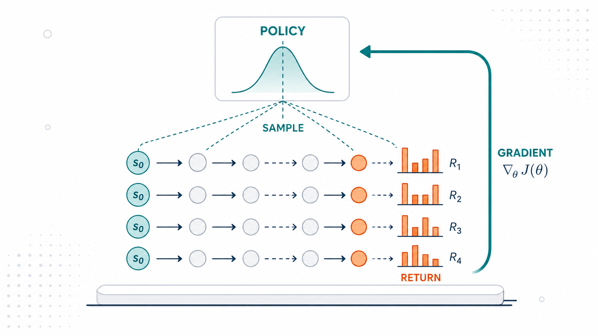
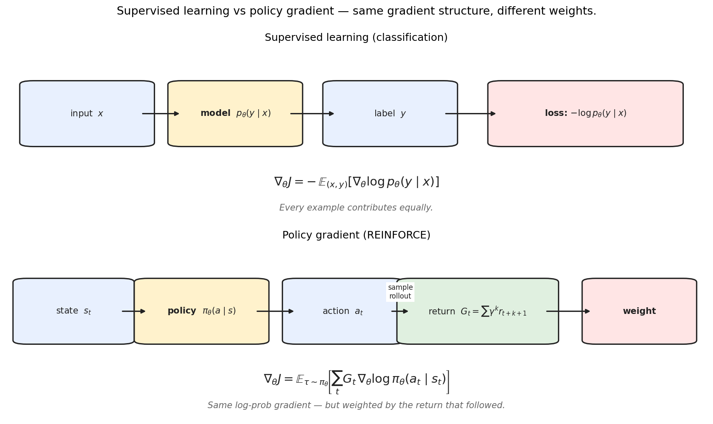
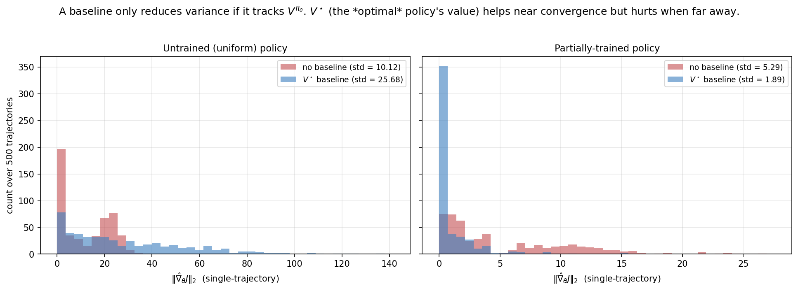
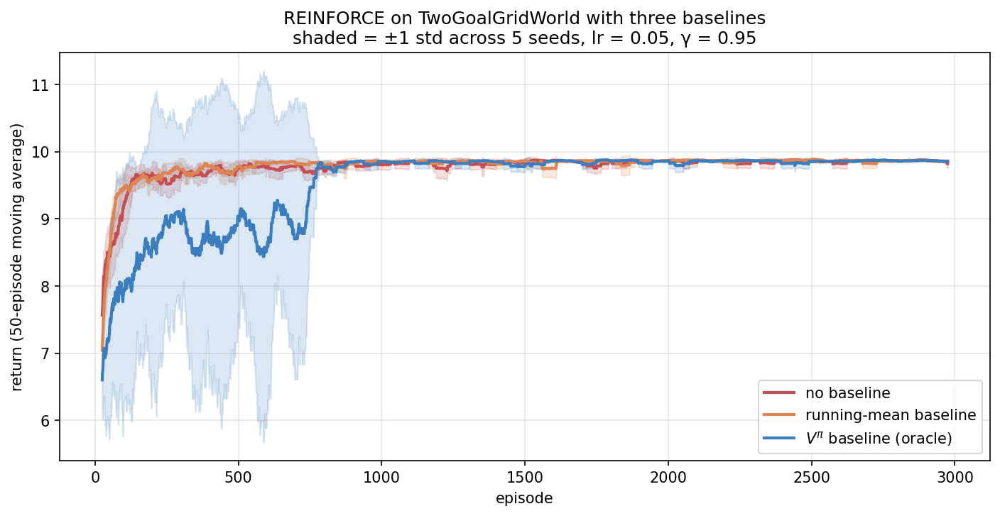
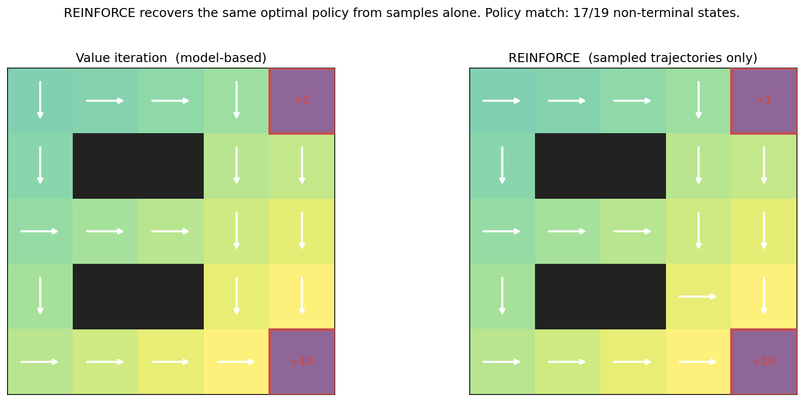
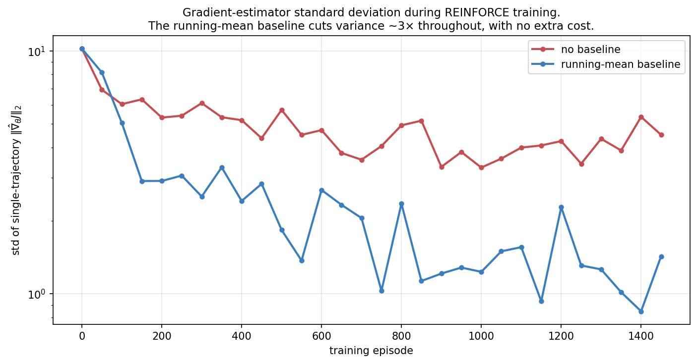
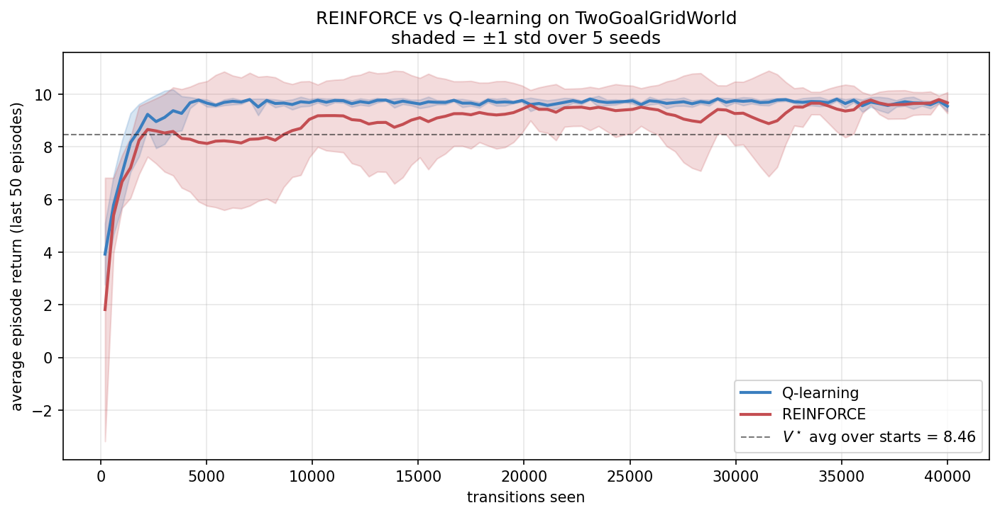
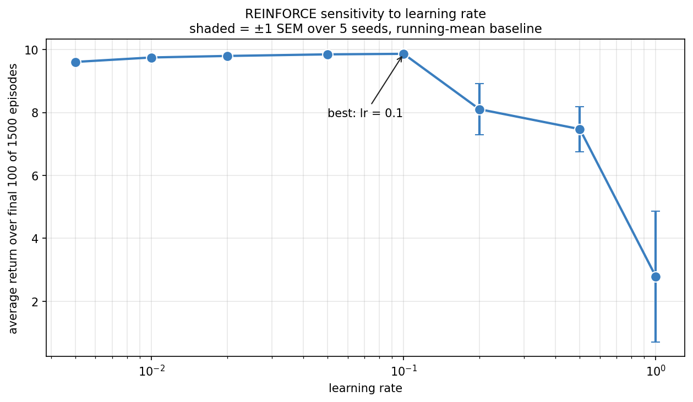

> *Policy gradient methods, from scratch — 1 of 4.*

Topic 1 built the value-based foundation: learn $Q^\star$, then act greedily. That worked beautifully on small finite MDPs. It runs into trouble, though, on the continuous, high-dimensional action spaces of everything modern: a *naive* tabular or argmax-over-$Q$ approach doesn't scale, because argmax over a continuous action space is hard, argmax over a neural network's output is intractable, and the policy is only *implicit* in $Q$ rather than directly expressed. (Value-based ideas *can* be adapted to continuous actions — deterministic policy gradients, SAC, and actor-critic methods all do exactly that — but they get there by borrowing the policy-parameterization trick we are about to introduce, not by brute-force argmax.)

Policy gradient methods take a different approach. **Parameterize the policy directly** — $\pi_\theta(a \mid s)$ — and optimize $\theta$ by gradient ascent on expected return. The result is an algorithm that scales to anything you can differentiate: neural nets, continuous actions, structured outputs, language models.

This is the foundation post for Topic 2. We derive the policy gradient theorem from first principles, implement REINFORCE in clean NumPy, study baselines and variance reduction, and apply it to a continuous-action problem where Q-learning has no good answer. The next three posts will build on this: actor-critic (learned baseline), trust-region methods (PPO), and RLHF/DPO/GRPO. All of them are variations on the same theme set here.

---

## 0. The structural bridge to supervised learning



The clearest way to enter policy gradient methods is by analogy.

In **supervised classification**, the model defines a distribution $p_\theta(y \mid x)$. The loss is $-\log p_\theta(y \mid x)$ for each training example. The gradient is $-\nabla_\theta \log p_\theta(y \mid x)$ averaged over the dataset.

In **policy gradient RL**, the policy defines a distribution $\pi_\theta(a \mid s)$. There is no "correct $a$" — we sample, observe return $G_t$, and the gradient is $-G_t \cdot \nabla_\theta \log \pi_\theta(a_t \mid s_t)$ averaged over trajectories.

Two differences:

1. **Sign**: supervised wants $\nabla J$ (minimize loss); RL wants $\nabla J$ (maximize return). Just a flip.
2. **Weight**: supervised treats every example equally ($w = 1$); RL weights each by the return $G_t$. Good trajectories get amplified; bad ones get attenuated.

That's the core of **likelihood-ratio policy gradients**, at the gradient level: **weighted maximum likelihood**, where the weights are whatever signal you can extract from interaction. (To be precise, this characterizes the policy-gradient *family* — REINFORCE, actor-critic, PPO, RLHF, DPO — not literally all of reinforcement learning; value-based methods like Q-learning from Topic 1 have a different gradient.) This framing makes RLHF (Reinforcement Learning from Human Feedback) immediate: replace $G_t$ with a learned reward model. It makes DPO (Direct Preference Optimization) feel like a natural reformulation: maximize the likelihood ratio of preferred over dispreferred responses. Once you see the gradient structure, the modern RL-for-LLMs literature becomes a sequence of careful weight designs.

---

## 1. Formal setup

We work in the discounted-return MDP setting from [Part 1c](01c-mdps-and-bellman.qmd). Let $\pi_\theta$ be a parameterized stochastic policy. A trajectory is

$$
\tau = (s_0, a_0, r_1, s_1, a_1, r_2, \dots, s_{T-1}, a_{T-1}, r_T, s_T)
$$

with $s_0 \sim p_0$, $a_t \sim \pi_\theta(\cdot \mid s_t)$, $s_{t+1} \sim P(\cdot \mid s_t, a_t)$, and $r_{t+1} = R(s_t, a_t, s_{t+1})$.

The trajectory distribution is

$$
P_\theta(\tau) \;=\; p_0(s_0) \prod_{t=0}^{T-1} \pi_\theta(a_t \mid s_t) \, P(s_{t+1} \mid s_t, a_t).
$$

The total discounted return is $R(\tau) = \sum_{t=0}^{T-1} \gamma^t r_{t+1}$.

The objective: maximize expected return

$$
J(\theta) \;=\; \mathbb{E}_{\tau \sim P_\theta}[R(\tau)].
$$

We want $\nabla_\theta J(\theta)$ so we can do gradient ascent.

---

## 2. The policy gradient theorem

The fundamental result. Here is the derivation in full.

### 2.1 The log-derivative trick

The starting point is the identity

$$
\nabla_\theta P_\theta(\tau) \;=\; P_\theta(\tau) \,\nabla_\theta \log P_\theta(\tau).
$$

This is just the chain rule: $\nabla \log P = (1/P) \nabla P$, so $\nabla P = P \nabla \log P$.

The trick is that **we can take expectations of $\nabla \log P$ in a way we can't of $\nabla P$ directly**. Specifically,

$$
\nabla_\theta J(\theta)
\;=\; \nabla_\theta \int P_\theta(\tau) R(\tau) \, d\tau
\;=\; \int (\nabla_\theta P_\theta(\tau)) R(\tau) \, d\tau
$$
$$
\;=\; \int P_\theta(\tau) (\nabla_\theta \log P_\theta(\tau)) R(\tau) \, d\tau
\;=\; \mathbb{E}_{\tau \sim P_\theta}[R(\tau) \,\nabla_\theta \log P_\theta(\tau)].
$$

This converts an intractable gradient (of an expectation over $\theta$-dependent distribution) into an expectation of a gradient (which can be estimated by sampling).

The single algebraic move that makes this work is the **log-derivative trick**, $\nabla_\theta P_\theta = P_\theta \nabla_\theta \log P_\theta$ (just the chain rule, since $\nabla \log P = \nabla P / P$). It is worth pausing on *why* it is the right move, because the same identity reappears in every method in Topic 2. The problem with $\nabla_\theta \int P_\theta(\tau) R(\tau)\,d\tau$ is that the thing we are differentiating is also the thing we sample from — the distribution itself depends on $\theta$, so we cannot just average a fixed function over fixed samples. The trick relocates the $\theta$-dependence: it turns "the gradient of a probability" into "a probability times the gradient of a log-probability," and the leading $P_\theta$ is exactly what lets us rewrite the integral as an expectation $\mathbb{E}_{\tau \sim P_\theta}[\cdot]$ that we estimate by rolling out the policy. Intuitively, $\nabla_\theta \log \pi_\theta(a \mid s)$ is the direction in parameter space that makes action $a$ *more likely* in state $s$; multiplying it by the return $R(\tau)$ says "move in the make-this-more-likely direction, scaled by how good the outcome was." Good trajectories pull the parameters toward repeating their actions; bad ones push away. The whole policy-gradient family is variations on weighting that one direction.

### 2.2 Simplifying $\nabla \log P_\theta(\tau)$

Take the log of $P_\theta(\tau)$:

$$
\log P_\theta(\tau) \;=\; \log p_0(s_0) + \sum_{t=0}^{T-1} \log P(s_{t+1} \mid s_t, a_t) + \sum_{t=0}^{T-1} \log \pi_\theta(a_t \mid s_t).
$$

Take the gradient w.r.t. $\theta$. The first two terms don't depend on $\theta$ — they're determined by the environment, not the policy. So

$$
\boxed{\;
\nabla_\theta \log P_\theta(\tau) \;=\; \sum_{t=0}^{T-1} \nabla_\theta \log \pi_\theta(a_t \mid s_t).
\;}
$$

This is the **policy gradient theorem** in its raw form. The environment dynamics $P$ have vanished — we don't need a model to compute the gradient. Substituting back:

$$
\nabla_\theta J(\theta) \;=\; \mathbb{E}_{\tau \sim P_\theta}\!\left[ R(\tau) \sum_{t=0}^{T-1} \nabla_\theta \log \pi_\theta(a_t \mid s_t) \right].
$$

### 2.3 Causality: only future rewards depend on $a_t$

There's a refinement. The action $a_t$ can only affect rewards $r_{t+1}, r_{t+2}, \dots$ — it has no effect on rewards in the past. So we can replace $R(\tau)$ in the formula by the **return-from-$t$**:

$$
G_t \;=\; \sum_{k=0}^{T-t-1} \gamma^k r_{t+k+1}.
$$

The resulting gradient is unbiased and has lower variance:

$$
\boxed{\;
\nabla_\theta J(\theta) \;=\; \mathbb{E}_{\tau \sim P_\theta}\!\left[ \sum_{t=0}^{T-1} G_t \, \nabla_\theta \log \pi_\theta(a_t \mid s_t) \right].
\;}
$$

This is the form usually called the "policy gradient theorem" (Sutton, McAllester, Singh & Mansour 2000). It's what REINFORCE implements.

**A note on the discounting convention.** With the discounted objective $R(\tau) = \sum_t \gamma^t r_{t+1}$, the strictly-correct causal estimator carries an outer $\gamma^t$ on each term:
$$
\nabla_\theta J(\theta) \;=\; \mathbb{E}\!\left[ \sum_{t=0}^{T-1} \gamma^t\, G_t \, \nabla_\theta \log \pi_\theta(a_t \mid s_t) \right],
$$
because a log-probability at time $t$ contributes to the objective only through the discounted rewards from $t$ onward. Many implementations (including the one here, and most practical codebases) **drop the outer $\gamma^t$**, which corresponds to optimizing the *undiscounted* sum of per-step objectives — a different but standard convention that tends to work better in practice because it doesn't down-weight late-trajectory updates. We use the dropped-$\gamma^t$ form throughout; just know the convention is a deliberate choice, not an oversight.

### 2.4 Visualizing the gradient in 1D


Concretely: take a 1D Gaussian policy $\pi(a; \mu) = \mathcal{N}(\mu, \sigma^2)$ and a reward $r(a)$. The policy gradient is

$$
\nabla_\mu J(\mu) \;=\; \mathbb{E}_{a \sim \pi}\!\left[ r(a) \cdot \frac{a - \mu}{\sigma^2} \right].
$$

The factor $(a - \mu)/\sigma^2$ is the **score function** — the gradient of the log-density w.r.t. $\mu$. It points in the direction "if you want to make this action more likely, increase $\mu$ in this direction." Sampled actions contribute to the gradient in proportion to $r(a)$ times the score: good actions far from $\mu$ pull the mean toward them; bad actions far from $\mu$ push it away.

The right panel shows REINFORCE in action: starting from $\mu = 0$, gradient ascent moves the policy mean toward the reward peak at $a = 2$ in ~30 steps.

---

## 3. The REINFORCE algorithm

Williams' (1992) Monte Carlo algorithm is just the policy gradient theorem applied with stochastic gradient ascent. Each iteration:

1. Sample one trajectory $\tau$ by rolling out under $\pi_\theta$.
2. Compute returns $G_t$ for each timestep.
3. Update $\theta \leftarrow \theta + \alpha \sum_t G_t \, \nabla_\theta \log \pi_\theta(a_t \mid s_t)$.

For a softmax policy $\pi_\theta(a \mid s) = \text{softmax}(\theta_{s, \cdot})_a$, the score has a closed form:

$$
\frac{\partial \log \pi(a \mid s)}{\partial \theta_{s', a'}} \;=\; \big(\mathbf{1}[a = a'] - \pi(a' \mid s)\big) \cdot \mathbf{1}[s = s'].
$$

The gradient is sparse: only the row of $\theta$ at the visited state has nonzero gradient. In code:

```python
def reinforce_step(policy, traj, returns, lr):
    for t, (s, a, _) in enumerate(traj):
        p = policy.probs(s)
        policy.theta[s] += lr * returns[t] * (-p)
        policy.theta[s, a] += lr * returns[t]
```

That's it. Six lines, including the closed-form softmax gradient. Compare to value iteration (a ~30-line algorithm with the contraction analysis) and Q-learning (~25 lines with the convergence theorem). Policy gradient is simpler than both — at the cost of higher variance.

---

## 4. Baselines and variance reduction

The big practical issue with REINFORCE: **the gradient estimator has high variance**. Different trajectories can yield wildly different returns; the gradient direction jitters from update to update; convergence is slow and unreliable.

It is worth collecting REINFORCE's limitations in one place, because the rest of Topic 2 is essentially a campaign against them:

- **High variance.** A single trajectory's return is a noisy estimate of the expected return; the gradient inherits that noise. (Baselines, §4, and learned critics, Post 2b, attack this.)
- **On-policy only.** The expectation is over trajectories from the *current* $\pi_\theta$, so every gradient step needs fresh samples from the latest policy — you cannot reuse old data. (Importance sampling and trust regions, Post 2c, relax this.)
- **Weak credit assignment.** The whole return-from-$t$ multiplies every action equally; REINFORCE has no fine-grained sense of *which* action in a long trajectory deserves the credit. (Advantage estimation and GAE, Post 2b, sharpen this.)
- **Unstable under large updates.** A big step can collapse the policy to something degenerate from which it never recovers, because the data distribution shifts with the policy. (Clipped surrogates in PPO, Post 2c, guard against this.)

Keep this list in mind; each later method in Topic 2 is best understood as fixing one or more of these four.

The key variance-reduction trick: **subtract a baseline** from the return.

### 4.1 The unbiased baseline trick

For any function $b(s)$ that depends only on the state (not the action),

$$
\mathbb{E}_{a \sim \pi(\cdot \mid s)}\!\big[b(s) \,\nabla_\theta \log \pi_\theta(a \mid s)\big] \;=\; b(s) \, \mathbb{E}_a\!\big[\nabla_\theta \log \pi(a \mid s)\big] \;=\; b(s) \cdot 0 \;=\; 0.
$$

The middle equality uses $\mathbb{E}_a[\nabla \log \pi(a \mid s)] = \nabla_\theta \mathbb{E}_a[1] = \nabla_\theta 1 = 0$. So we can subtract $b(s_t)$ from $G_t$ in the gradient without introducing bias:

$$
\boxed{\;
\nabla_\theta J(\theta) \;=\; \mathbb{E}\!\left[ \sum_t (G_t - b(s_t)) \, \nabla_\theta \log \pi_\theta(a_t \mid s_t) \right].
\;}
$$

The quantity $A_t \equiv G_t - b(s_t)$ is called the **advantage**.

Why does this reduce variance when the expectation is unchanged? A small worked case makes it vivid. Suppose in some state both available actions are good, returning $G = 100$ and $G = 102$. Without a baseline, every update pushes *up* on whichever action was sampled, with a huge weight (~100) — the gradient is dominated by the large common offset, and the tiny difference that actually distinguishes the actions (2 out of 102) is buried in noise. Subtract a baseline of $b = 101$ (roughly $V^\pi$), and the weights become $-1$ and $+1$: now the update *pushes down* on the slightly-worse action and *up* on the slightly-better one. Same expected gradient (the offset was constant and integrates to zero), but the variance is slashed because the weights are now centered near zero and reflect only the *relative* merit of each action. The baseline turns "everything was great, do more of all of it" into "this was better than average, do more of *this*" — which is both lower-variance and a sharper learning signal. That centering is the entire point, and it is why the best baseline is the expected return $V^\pi(s)$: it makes the advantage measure deviation from the state's own average.

### 4.2 The variance-minimizing baseline

What's the best $b(s)$? Here we should be careful, because there are two different "best" baselines and they are often conflated. The *exact* variance-minimizing scalar baseline for the gradient estimator is **score-norm weighted**:

$$
b^\star(s) \;=\; \frac{\mathbb{E}_{\pi_\theta}\!\big[\,G_t\,\lVert\nabla_\theta \log \pi_\theta(a_t\mid s_t)\rVert^2 \mid s_t = s\,\big]}{\mathbb{E}_{\pi_\theta}\!\big[\,\lVert\nabla_\theta \log \pi_\theta(a_t\mid s_t)\rVert^2 \mid s_t = s\,\big]},
$$

a ratio that weights returns by the squared norm of the score function. Under the simplifying assumption that the score norm is uncorrelated with the return (or constant across actions), this collapses to the much more familiar

$$
b^\star(s) \;\approx\; \mathbb{E}_{\pi_\theta}[G_t \mid s_t = s] \;=\; V^{\pi_\theta}(s).
$$

So the **current policy's value function** $V^{\pi_\theta}$ is the *practical* optimal baseline — it is what actor-critic methods learn and target, and it is correct under the simplifying assumption — but the truly variance-minimizing choice is the score-norm-weighted ratio above. We use $V^{\pi_\theta}$ throughout because it is the right engineering target; just know it is an approximation to the exact optimum. Intuitively, $A_t = G_t - V^{\pi_\theta}(s_t)$ measures how much *better* the actual return was than what the agent expects on average from state $s_t$, centering the advantage around zero.

In practice we don't know $V^{\pi_\theta}$ either; it's the same chicken-and-egg as $Q^\star$. There are several practical approximations:

- **Running mean of returns**: a single constant, updated online. Crude but free.
- **Learned baseline**: train a neural network $V_\phi(s)$ alongside the policy. This is the actor-critic family, the topic of Post 2b.
- **Empirical batch average**: in batched updates, subtract the mean return within the batch. Used in some implementations of PPO and GRPO.

### 4.3 Variance reduction in practice



Two important wrinkles surface in practice.

**First**, the optimal baseline is $V^{\pi_\theta}$ — for the *current* policy. Using $V^{\pi^\star}$ as a baseline (which I called "oracle" in the figure) is **wrong** when your policy is far from optimal. The histogram on the left shows the surprising result: at uniform initialization, the $V^\star$ "oracle" baseline actually *increases* the gradient variance. Why? Because the agent's actual returns are far below $V^\star$ (it's playing randomly), so $A_t = G_t - V^\star$ is mostly very negative. Big negative advantages → big-magnitude gradients → high variance.

The right histogram shows the textbook story: once the policy is partially trained, $V^\star$ becomes a good approximation of $V^{\pi_\theta}$, and the variance drops 3×.

**Second**, the running-mean baseline is shockingly effective despite its simplicity — it captures most of the benefit at zero engineering cost. See §8.1 below for the empirical breakdown over training.

---

## 5. REINFORCE on a gridworld

Let's apply it. We use the TwoGoalGridWorld from [Part 1c](01c-mdps-and-bellman.qmd) and three baselines:



The result is honest about a subtle point. The $V^{\pi^\star}$ "oracle" baseline isn't always better than no baseline — it depends critically on the current policy. The running-mean baseline (which dynamically tracks $V^{\pi_\theta}$ approximately) does better than both.

### 5.1 The learned policy



Like Q-learning in [Part 1d](01d-pomdps-and-q-learning.qmd), REINFORCE recovers essentially the optimal policy from samples alone. It never knew $P$ or $R$. The few disagreements occur at near-tied states.

The conceptual jump from Q-learning to REINFORCE is small in algorithm but large in implication. Q-learning updates one Q-value per transition; REINFORCE updates the full $\theta$ for every trajectory. Q-learning's argmax breaks under continuous actions; REINFORCE doesn't care.

---

## 6. Forward connections

### 6.1 REINFORCE is the gradient of RLHF

In modern RLHF, the policy is an LLM, and the "reward" comes from a learned reward model trained on human preferences. The *simplest* policy-gradient form of the objective is

$$
\nabla_\theta J(\theta) \;=\; \mathbb{E}_{x \sim \mathcal{D}, \, y \sim \pi_\theta(\cdot \mid x)}\!\left[ r_\phi(x, y) \, \nabla_\theta \log \pi_\theta(y \mid x) \right]
$$

— exactly the REINFORCE estimator, with prompts $x$ as states and responses $y$ as actions. Production RLHF is more than this bare estimator: it adds a KL penalty against a reference policy to prevent collapse to degenerate distributions, and it almost always uses a PPO-style clipped update (Post 2c) rather than vanilla REINFORCE for stability. The point here is just that the *core* gradient signal — reward times score function — is the one we derived.

If you understand the REINFORCE gradient, you understand the gradient of RLHF. Everything else is engineering: PPO clips the update size, GRPO uses group-relative advantages, RLOO uses leave-one-out, but the underlying gradient structure is what we just derived.

### 6.2 The variance reduction is the actor-critic family

The natural extension of "use a baseline" is "learn the baseline." Actor-critic methods do exactly this: maintain two networks, $\pi_\theta$ (the actor) and $V_\phi$ (the critic). The actor is updated by policy gradient with the critic's $V_\phi$ as baseline; the critic is updated by TD learning (Part 1d) toward its own bootstrap target.

A2C, A3C, PPO, SAC — all are actor-critic variants. They're the workhorse of modern policy gradient practice. Post 2b builds them.

### 6.3 The constraint reduction is the trust-region family

The other massive issue with REINFORCE: **the gradient update can be too large**, knocking the policy into bad regions. We saw this in §8.4 below: large learning rates cause catastrophic collapse.

The fix is to constrain how much the policy can change per update. **TRPO** (Schulman et al. 2015) uses a KL-divergence trust region; **PPO** (Schulman et al. 2017) uses a clipped ratio surrogate. Both restrict $\pi_{\text{new}}$ to stay close to $\pi_{\text{old}}$.

This is what makes modern RL training stable enough to work on LLMs. Post 2c covers it.

### 6.4 DPO and the bypass

The most surprising recent development: **you can sometimes skip the policy gradient entirely.** Direct Preference Optimization (Rafailov et al. 2023) uses an algebraic identity to convert RLHF's policy-gradient objective into a closed-form supervised loss. The data is pairs $(y^+, y^-)$ of preferred and dispreferred responses; the loss is

$$
\mathcal{L}_{\text{DPO}} \;=\; -\log \sigma\!\left[ \beta \log \frac{\pi_\theta(y^+ \mid x)}{\pi_{\text{ref}}(y^+ \mid x)} - \beta \log \frac{\pi_\theta(y^- \mid x)}{\pi_{\text{ref}}(y^- \mid x)} \right].
$$

No sampling, no reward model, no policy gradient. It's the same problem, reframed as binary classification. DPO works because the optimal policy under the RLHF objective has a closed-form solution in terms of the reward, and you can solve for the policy directly given preference pairs.

This is one of the cleanest examples of "rederiving an algorithm from the gradient structure" — a topic for Post 2d.

---

## 7. Experiments to actually run

### 7.1 Gradient variance throughout training

Track the empirical gradient variance over training episodes for vanilla REINFORCE and REINFORCE with a running-mean baseline. The claim "baselines reduce variance" is theoretical — does it show up in practice over the whole training trajectory, or only late?

### 7.2 REINFORCE vs Q-learning sample efficiency

Both are model-free. On the same gridworld and the same number of transitions, which converges faster? Why?

### 7.3 Continuous action space

Implement REINFORCE for a 1D Gaussian policy on a continuous bandit. Learn both the mean *and* the standard deviation. Show that the policy "tightens" around the optimum as it discovers it.

### 7.4 Learning rate sensitivity

Sweep the learning rate over two orders of magnitude. Plot final return vs lr. What does the curve look like? (Hint: it's not symmetric.)

---

## 8. Solutions

### 8.1 Gradient variance throughout training — `experiments/02a_sol1_gradient_variance_over_training.py`



**What you should see.** Both curves start at $\sim 10$ (the variance of the gradient at uniform initialization). Without a baseline, variance drops to ~3-5 over training but never reaches lower than ~3. With a running-mean baseline, variance drops to 1-2 by episode ~500 — about a 3× improvement.

**Why this happens.** The running mean rapidly converges to approximately $V^{\pi_\theta}(\text{average over starts})$, which is a good *constant* approximation to the policy's value function. Subtracting it from each $G_t$ gives advantages centered around zero, which is exactly what makes the gradient estimator low-variance.

The early variance is the same because the running mean hasn't converged yet — at episode 0 the baseline is 0, so we're back to vanilla REINFORCE.

**The deeper lesson.** Adding a baseline is the cheapest, easiest improvement to REINFORCE. It costs nothing — one scalar to maintain — and consistently cuts variance several-fold. It is also unbiased: the expected gradient is unchanged. There is no downside.

This is the case for *every* variance-reduction trick in RL: control variates, advantages, normalized advantages, GAE (generalized advantage estimation). They're all "unbiased noise reduction." If you can identify a state-dependent quantity that correlates with the return, subtract it. It's free signal.

### 8.2 REINFORCE vs Q-learning — `experiments/02a_sol2_reinforce_vs_qlearning.py`



**What you should see.** Q-learning converges in 3-4× fewer transitions and with much smaller variance across seeds. REINFORCE catches up eventually but is noticeably slower throughout.

**Why Q-learning wins on small finite MDPs.** Q-learning extracts more information from each transition. After observing $(s, a, r, s')$, Q-learning does a one-step Bellman backup on that specific $(s, a)$ pair: "the value of doing $a$ from $s$ should be approximately $r + \gamma \max Q(s', \cdot)$." Every transition produces an update.

REINFORCE waits for full trajectory completion before updating. The credit assignment is "the entire return after $s_t$ is good/bad" — there's no per-step Bellman backup. The signal is weaker per transition.

Quantitatively: on this gridworld with 23 non-terminal states and 4 actions, Q-learning has 92 Q-values to learn, each one updated about $N / 92$ times after $N$ transitions. REINFORCE has 92 logits but updates them based on full-trajectory returns, which is noisier.

**The deeper lesson — but the trade-off flips at scale.** On small finite MDPs, Q-learning is more sample-efficient. On large or continuous problems, REINFORCE and its descendants dominate because:

1. **Continuous actions**: REINFORCE handles them directly via Gaussian policies (next experiment); Q-learning needs discretization or fancy tricks (DDPG, SAC).
2. **Neural network policies**: REINFORCE's gradient is well-defined regardless of network architecture; Q-learning's argmax is sensitive to the function class.
3. **Structured outputs (tokens, plans, programs)**: only policy gradient methods naturally handle these.

The bandits→MDPs→deep RL→LLM-RL pipeline lives mostly on the policy gradient side from the moment the action space stops being "small finite set."

### 8.3 Continuous action space — `experiments/02a_sol3_continuous_action.py`


**What you should see.** The 1D Gaussian policy with both $\mu$ and $\log \sigma$ as learnable parameters discovers the optimum and tightens around it. Final policy is $\mathcal{N}(1.96, 0.21^2)$ — essentially at the true optimum $a^\star = 2$.

**Why σ contracts naturally.** The score for $\log \sigma$ is

$$
\frac{\partial \log \pi(a \mid \mu, \sigma)}{\partial \log \sigma} \;=\; \frac{(a - \mu)^2}{\sigma^2} - 1.
$$

When advantages are positive on average for actions near $\mu$ (the policy has found a peak), the expected gradient on $\log \sigma$ becomes *negative* — actions far from $\mu$ contribute large $(a - \mu)^2 / \sigma^2 - 1$ but get negative advantages there, pulling $\log \sigma$ down. The policy concentrates.

The opposite happens when the policy is still searching: high $\sigma$ is good for exploration, and the gradient naturally keeps it large. Only once you've found a reliable reward peak does the variance shrink.

**The deeper lesson — exploration and exploitation are encoded in the policy itself.** In Q-learning, exploration is a separate mechanism (ε-greedy). In Gaussian policy gradient, exploration is *built into the policy* as its variance, and the variance is itself a learnable parameter. The algorithm naturally explores broadly early, then narrows in.

This is the conceptual basis for SAC (Soft Actor-Critic), where the policy explicitly trades off reward and entropy via a temperature parameter. It's also why language models can be sampled at different temperatures — the policy itself controls the exploration-exploitation balance.

### 8.4 Learning rate sensitivity — `experiments/02a_sol4_lr_sensitivity.py`



**What you should see.** Returns are nearly constant across the low-lr range (0.005 to 0.1) — small lr is just slower, not worse for the final policy. At lr = 0.2, returns drop to ~8.1. At lr = 0.5, ~7.5. At lr = 1.0, the policy collapses to ~2.8.

The curve is **asymmetric**: low lr is suboptimal but stable; high lr is catastrophic. Error bars also explode at high lr — across seeds, you get very different outcomes (some succeed, others collapse).

**Why high lr destroys REINFORCE.** Each REINFORCE update is $\theta \leftarrow \theta + \alpha A_t \nabla \log \pi(a_t \mid s_t)$. The advantage $A_t$ can be large (on the order of total return), and the score gradient can be large too. The combined update size $\alpha A_t \|\nabla \log \pi\|$ can move $\theta$ by a lot.

When $\theta$ changes a lot, the policy changes a lot. The policy is now *different from the policy that generated the data we just used to update it*. The gradient was an unbiased estimate of $\nabla J(\pi_\text{old})$, not $\nabla J(\pi_\text{new})$. With a moderate change, this approximation is fine. With a huge change, the next batch of samples may come from a very different distribution, and the next gradient estimate can push $\theta$ in a wild direction. The process is unstable.

This is the **off-policy distribution shift** problem: REINFORCE is on-policy, meaning each update must be small enough that the next batch of trajectories is "similar enough" to the previous one. With a large lr, the on-policy assumption breaks within a single update.

**The deeper lesson — this is exactly what trust-region methods solve.** TRPO and PPO directly constrain the policy update size:

- **TRPO**: solve $\max_\theta J(\theta)$ subject to $D_{\mathrm{KL}}(\pi_{\text{new}} \| \pi_{\text{old}}) \leq \delta$.
- **PPO**: clip the policy ratio $\pi_{\text{new}}/\pi_{\text{old}}$ to be in $[1 - \epsilon, 1 + \epsilon]$, which approximates the KL constraint cheaply.

Both work by ensuring the gradient update doesn't move the policy too far from the policy that generated the data. The U-shape you see in this experiment goes away with PPO — you can use a much larger effective learning rate without collapse, because the clipping prevents the worst updates.

**This is the central practical reason PPO dominates plain REINFORCE in modern RL training.** Not because the gradient is better; it's the same gradient. Because the constraint makes the update stable. The next post (Part 2c) builds PPO from this insight.

---

## 9. Further reading

- **Sutton & Barto, *Reinforcement Learning: An Introduction* (2018), Chapter 13.** The canonical treatment of policy gradient methods, including the policy gradient theorem.
- **Williams, "Simple statistical gradient-following algorithms for connectionist reinforcement learning" (1992).** The original REINFORCE paper.
- **Sutton, McAllester, Singh & Mansour, "Policy Gradient Methods for Reinforcement Learning with Function Approximation" (NeurIPS 1999).** The modern version of the policy gradient theorem.
- **Schulman, Levine, Abbeel, Jordan & Moritz, "Trust Region Policy Optimization" (ICML 2015).** TRPO.
- **Schulman, Wolski, Dhariwal, Radford & Klimov, "Proximal Policy Optimization Algorithms" (2017).** PPO.
- **Rafailov, Sharma, Mitchell, Manning, Ermon & Finn, "Direct Preference Optimization: Your Language Model is Secretly a Reward Model" (NeurIPS 2023).** DPO.
- **OpenAI Spinning Up — Policy Gradient.** A clear modern engineering treatment.

---

**Next up — Part 2b: Actor-Critic and Variance Reduction.** We make the baseline learnable. The actor is a policy network updated by policy gradient; the critic is a value network updated by TD learning. The result is the algorithmic chassis for A2C, A3C, PPO, SAC, and almost every modern policy gradient method. The trick is the same as REINFORCE plus a baseline; the engineering is in making the baseline accurate enough to actually help.
