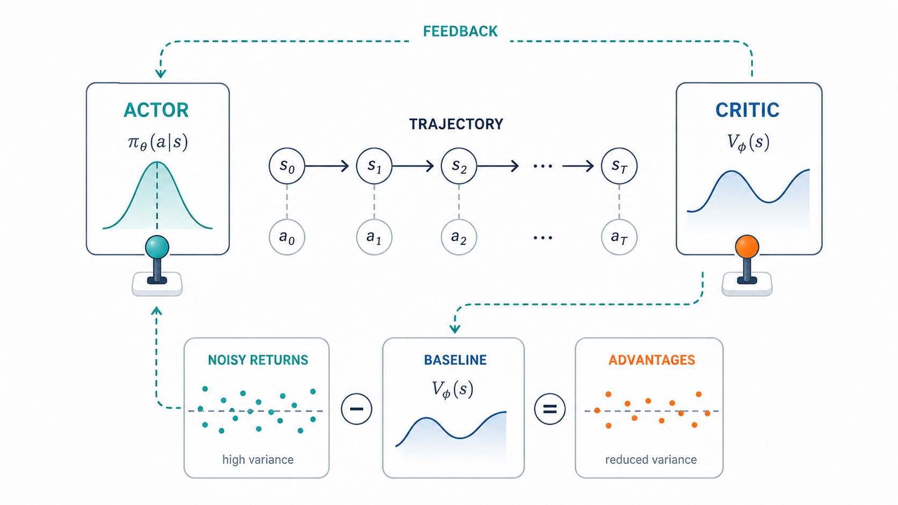
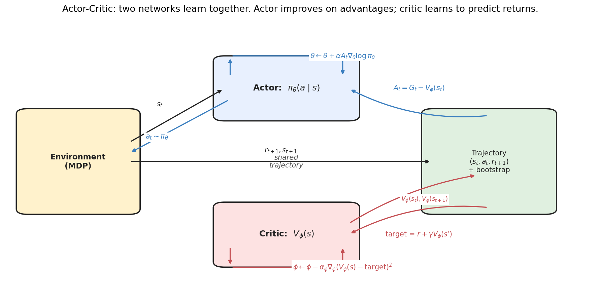
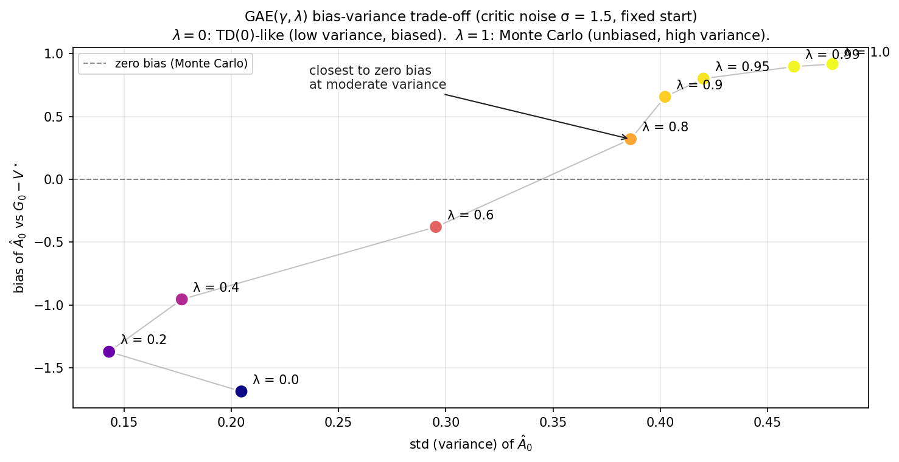
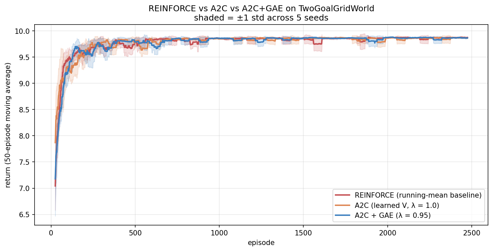
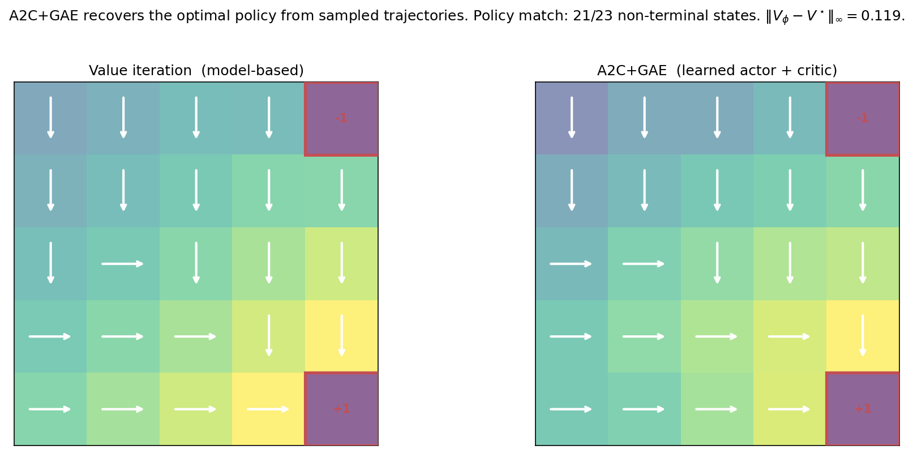
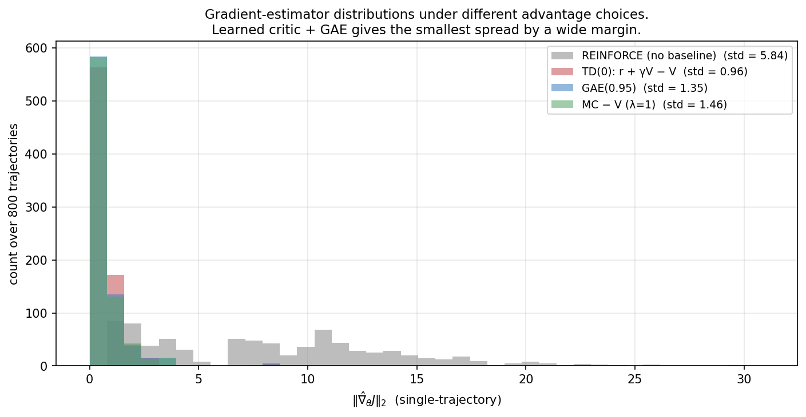
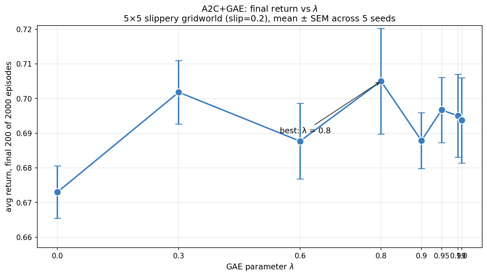
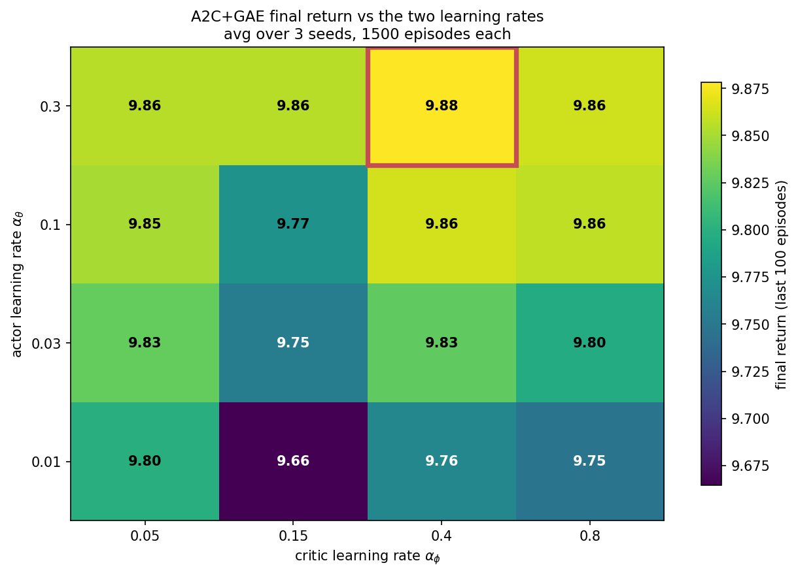

> *Policy gradient methods, from scratch — 2 of 4.*

[Part 2a](02a-reinforce-and-policy-gradient.qmd) ended with a question that this post answers. We saw that REINFORCE's gradient has high variance, and that subtracting a baseline reduces it. The best *practical* state-dependent baseline is $V^{\pi_\theta}$ — the *current* policy's value function (recall from 2a §4.2 that the exact variance-minimizing baseline is score-norm weighted; $V^{\pi_\theta}$ is the correct target under the usual simplifying assumption, and the one everyone actually uses). But we don't have it. The running-mean baseline was a crude substitute that helped a lot but not enough.

The natural next step is to **learn the baseline**. That's the actor-critic architecture: maintain a value network $V_\phi$ alongside the policy network $\pi_\theta$, and update both. The actor gets a high-quality, state-conditional baseline; the critic gets training data from the actor's interaction with the environment. Two networks learn together.

This is the second post of Topic 2 and the algorithmic chassis under PPO, SAC, A3C, and many modern policy-gradient methods. The math is what we derived in Post 2a plus one new trick — **GAE**, which smoothly interpolates between Monte Carlo and TD advantages and is the standard choice in modern implementations.

---

## 0. The architecture



Each episode, the actor (policy $\pi_\theta$) interacts with the environment and produces a trajectory. The critic ($V_\phi$) evaluates each state along the trajectory and provides a value estimate $V_\phi(s_t)$. The actor uses these values to compute **advantages** $A_t \approx G_t - V_\phi(s_t)$, which are then used as gradient weights. The critic uses the same trajectory to update toward bootstrapped value targets via TD regression.

The two updates happen on the same data and feed each other. The actor's policy determines which states the critic sees; the critic's accuracy determines how informative the actor's advantages are. This is a classic **mutual learning** dynamic.

---

## 1. Setup

The actor is the policy from Post 2a — a softmax over actions, parameterized by $\theta$:

$$
\pi_\theta(a \mid s) \;=\; \text{softmax}(\theta_{s, \cdot})_a.
$$

The critic is a value function $V_\phi$. For tabular state spaces, $V_\phi$ is just a vector indexed by state — one parameter per state. For neural-network policies, both $\pi_\theta$ and $V_\phi$ would be networks; the algorithm is identical.

We need three pieces of math to make this work:

1. **The actor update**: policy gradient with the critic's value as baseline.
2. **The critic update**: regression toward a TD target.
3. **The advantage estimator**: how to combine sampled returns with $V_\phi$.

The first two are standard (policy gradient + TD learning, both from previous posts). The third is where the new ideas live.

---

## 2. Advantage estimation

The advantage at time $t$ is

$$
A^\pi(s_t, a_t) \;=\; Q^\pi(s_t, a_t) - V^\pi(s_t).
$$

It measures how much better action $a_t$ was than what the policy would do on average. We never compute this exactly — we estimate it from data. There are many estimators, each with different bias and variance properties.

### 2.1 The spectrum: Monte Carlo to TD(0)

The simplest two estimators bracket the spectrum.

**Monte Carlo**:
$$
\hat A_t^{\text{MC}} \;=\; G_t - V_\phi(s_t).
$$

This is what we used in Post 2a (just with $V_\phi$ replacing the running mean). It's *unbiased* (if $V_\phi$ is also a state-dependent function, the gradient bias is zero by the standard argument). But it has high variance: $G_t$ involves all the noise from the entire trajectory.

**TD(0)**:
$$
\hat A_t^{\text{TD}} \;=\; r_{t+1} + \gamma V_\phi(s_{t+1}) - V_\phi(s_t).
$$

This uses only one step of actual reward, plus the critic's value estimate to bootstrap the rest. It's *biased* if $V_\phi$ is wrong — and $V_\phi$ is always somewhat wrong during training. But it has very low variance: only one step of randomness enters.

### 2.2 n-step returns: tuning the trade-off

A natural family is the **n-step** estimator:

$$
\hat A_t^{(n)} \;=\; \left[\sum_{k=0}^{n-1} \gamma^k r_{t+k+1}\right] + \gamma^n V_\phi(s_{t+n}) - V_\phi(s_t).
$$

It uses $n$ actual rewards, then bootstraps. $n = 1$ recovers TD(0); $n \to \infty$ recovers Monte Carlo. Intermediate $n$ trade off bias (decreasing in $n$) against variance (increasing in $n$).

### 2.3 GAE: an exponentially weighted combination

The downside of picking a single $n$ is that it's an all-or-nothing choice. **Generalized Advantage Estimation** (Schulman et al. 2015) takes an exponentially weighted average over all $n$-step estimators:

$$
\hat A_t^{\text{GAE}(\gamma, \lambda)} \;=\; \sum_{k=0}^{\infty} (\gamma \lambda)^k \delta_{t+k},
\qquad
\text{where} \quad \delta_t \;=\; r_{t+1} + \gamma V_\phi(s_{t+1}) - V_\phi(s_t).
$$

The $\delta_t$ here is the **one-step TD error** — the surprise at step $t$, the gap between the bootstrapped estimate $r_{t+1} + \gamma V_\phi(s_{t+1})$ and the prior estimate $V_\phi(s_t)$. GAE is, beautifully, just an exponentially-discounted sum of future surprises: how much better things turned out than expected, with later surprises down-weighted by $(\gamma\lambda)^k$. Why exponential weighting rather than picking one horizon $n$? Because the right horizon is uncertain — near-term TD errors are low-variance but lean on a possibly-wrong critic, far-term ones are accurate but noisy — and an exponential average is the natural way to hedge across all of them with a single parameter. It is the exact analogue of the eligibility traces of TD($\lambda$): $\lambda$ controls how much credit flows back from future surprises to the current action. The two limits drop straight out of the formula: at $\lambda=0$ only $\delta_t$ survives (pure one-step bootstrap), and at $\lambda=1$ the bootstrap terms telescope — each $-V_\phi(s_{t+k})$ cancels the $+\gamma V_\phi(s_{t+k})$ from the previous term — leaving $G_t - V_\phi(s_t)$, the Monte Carlo advantage. One formula, the whole spectrum.

The parameter $\lambda \in [0, 1]$ smoothly controls the trade-off:

- $\lambda = 0$: $\hat A_t = \delta_t$, the TD(0) estimator — low variance, but biased whenever the critic $V_\phi$ is imperfect (it leans entirely on a single bootstrap from a wrong value).
- $\lambda = 1$: $\hat A_t = \sum_k \gamma^k \delta_{t+k}$, which by telescoping equals $G_t - V_\phi(s_t)$ — Monte Carlo. With a state-dependent baseline this is an *unbiased* advantage estimate; its problem is high variance, not bias.
- Intermediate $\lambda$: a smooth blend, trading a little bootstrap bias for a large reduction in variance.

So the tradeoff, stated cleanly: **$\lambda = 0$ has low variance and the most critic/bootstrap bias; $\lambda = 1$ has the least bias and the most sampling variance; intermediate $\lambda$ is the bias–variance compromise.**

Implementation is one backward pass through the trajectory:

```python
def gae(rewards, values, next_value, gamma, lam):
    T = len(rewards)
    advantages = np.zeros(T)
    last_adv = 0.0
    for t in reversed(range(T)):
        v_next = next_value if t == T - 1 else values[t + 1]
        delta = rewards[t] + gamma * v_next - values[t]
        advantages[t] = delta + gamma * lam * last_adv
        last_adv = advantages[t]
    return advantages
```

Six lines, $O(T)$ runtime. In modern RL implementations this is what computes the advantages every iteration.

### 2.4 Bias vs variance in practice



The figure illustrates this with a partially-trained policy and a noisy critic ($\sigma_{\text{noise}} = 1.5$ added to $V^\star$):

- At $\lambda = 0$, variance is small but bias is large and negative — this is genuine bootstrap bias from the inaccurate critic.
- At $\lambda = 1$ the estimator is Monte Carlo, which is *unbiased*. Any nonzero bias you see in the plot at $\lambda = 1$ is not bias introduced by Monte Carlo itself — it is finite-sample error, error in the $V^\star$ reference used to measure "bias," or measurement artifact from the limited number of trajectories. The honest reading of the right end of the curve is "high variance, bias consistent with zero up to sampling noise."
- The measured curve crosses near zero bias around $\lambda \in [0.6, 0.8]$, where the small residual bootstrap bias and the finite-sample noise roughly cancel for this particular setup.

This is the typical pattern. In practice, $\lambda \in [0.9, 0.97]$ is the standard choice — high enough that the bias from the critic is small, low enough to keep variance manageable. PPO defaults to $\lambda = 0.95$.

---

## 3. The A2C algorithm

Now we tie it together. **Advantage Actor-Critic** (A2C) is the clean, synchronous actor-critic template — the simplest version that has every essential piece in place (it is not the only historically important actor-critic, but it is the clearest one to learn from). Each episode:

1. Collect a trajectory $(s_0, a_0, r_1, s_1, \ldots, s_T)$ under $\pi_\theta$.
2. Compute critic values $V_\phi(s_t)$ along the trajectory.
3. Compute advantages $\hat A_t$ via GAE.
4. **Actor update**: $\theta \leftarrow \theta + \alpha_\theta \sum_t \hat A_t \, \nabla_\theta \log \pi_\theta(a_t \mid s_t)$.
5. **Critic update**: form the **detached return target** $\hat R_t = \hat A_t + V_\phi(s_t)$ — the bootstrapped return the advantage implies, treated as a constant — and regress the critic toward it:
$$
V_\phi(s_t) \;\leftarrow\; V_\phi(s_t) + \alpha_\phi\big(\hat R_t - V_\phi(s_t)\big).
$$

In our tabular NumPy version, both updates are explicit gradient steps. For neural-network policies, both would use autodiff on appropriate loss functions, with the same detached target $\hat R_t = \hat A_t + V_\phi(s_t)$:

$$
\mathcal{L}_{\text{actor}} = -\sum_t \hat A_t \log \pi_\theta(a_t \mid s_t),
\qquad
\mathcal{L}_{\text{critic}} = \sum_t \tfrac{1}{2}\big(\hat R_t - V_\phi(s_t)\big)^2,
\qquad \hat R_t = \big(\hat A_t + V_\phi(s_t)\big)^{\text{detached}}.
$$

The `detached` (stop-gradient) on $\hat R_t$ is essential: the target is held fixed so the critic loss doesn't backprop through the advantage computation, which would couple the gradient of $V_\phi$ to itself inappropriately. The critic simply does ordinary regression toward a fixed return estimate.

### 3.1 Optional: entropy bonus

In practice, vanilla A2C tends to collapse the policy too quickly — the policy commits to a "good enough" action distribution before exploring sufficiently. A standard fix is to add an **entropy bonus** to the objective:

$$
\mathcal{L}_{\text{actor}} = -\sum_t \hat A_t \log \pi_\theta(a_t \mid s_t) \;-\; \beta \sum_t H[\pi_\theta(\cdot \mid s_t)].
$$

The entropy $H = -\sum_a \pi(a) \log \pi(a)$ is maximized by the uniform distribution. Subtracting $\beta H$ from the loss (or adding $\beta \nabla H$ to the gradient) pushes the policy toward higher entropy. With small $\beta$ this regularizes exploration without preventing eventual convergence.

This is the same idea as the temperature in Soft Actor-Critic (SAC); SAC just makes $\beta$ a learnable parameter that automatically adjusts to match a target entropy level.

### 3.2 Two practical details that matter more than they look

Two implementation choices separate a textbook A2C from one that trains reliably, and both follow directly from the bias–variance story.

**Advantage normalization.** The raw advantages $\hat A_t$ can have any scale — it drifts as the critic learns and as rewards vary across tasks — and that scale directly sets the effective learning rate of the actor (the gradient is $\hat A_t \nabla \log \pi$). The standard fix is to normalize advantages within each batch to zero mean and unit variance before the actor update. This decouples the *direction* of each update (which actions to favor) from its *magnitude* (how big a step), making a single learning rate work across very different reward scales. It is nearly universal in practice and is one reason PPO (next post) is robust. Note it does not change the *expected* gradient direction much — subtracting the batch mean is just another baseline — but it tames the variance of the step size.

**The deadly triad.** Actor-critic combines three ingredients: bootstrapping (the critic's TD target uses its own estimate), function approximation (the critic is a parametric model, not a table), and — in off-policy variants — learning about one policy from another's data. Sutton & Barto call the simultaneous presence of all three the **deadly triad**, because together they can cause the value estimates to *diverge* rather than converge, even though any two of the three are safe. A2C as we built it is on-policy, so it sidesteps the third leg and is stable; but the moment you reuse data (PPO's multiple epochs) or go off-policy (SAC, DQN), you are walking near the triad, and the stabilizers — target networks, trust regions, conservative step sizes — exist precisely to keep you on the safe side of it. Knowing the triad tells you *why* those tricks are there rather than treating them as folklore.

---

## 4. A2C on the gridworld


The critic learns to approximate $V^\star$ to within ~1.0 max-norm error on most states. The biggest errors are at cells near the small +1 goal — the policy quickly commits to going right toward +10, so those states are visited rarely, and the critic doesn't accumulate enough data there.

This is a critical observation: **the critic learns $V^{\pi_\theta}$, not $V^\star$**. They're equal at the optimal policy, but during training the critic only sees states the current policy visits. If the policy never visits a state, the critic doesn't learn its value. *This is the "exploration-exploitation tradeoff" of the critic itself.*

### 4.1 Comparison to vanilla REINFORCE



On the TwoGoalGridWorld, all three methods converge to essentially the same performance. This is an honest finding worth noting: **on small finite MDPs, the value-of-baseline-quality is modest**. The variance reduction from a learned baseline is real but not dramatic when the problem is small enough that the running mean is already a reasonable approximation.

The advantages of A2C+GAE show up dramatically on (a) larger problems with more diverse states, (b) stochastic transitions where bootstrap is more informative, and (c) longer episodes where MC variance becomes prohibitive. We'll see hints of these effects in §8.

### 4.2 Final policy



Final A2C agrees with VI on 21/23 non-terminal states — slightly better than REINFORCE's 17/19 in Post 2a, with a much more accurate value function ($\|V_\phi - V^\star\|_\infty = 0.12$). The two states that disagree are at near-tied positions where multiple actions are similarly good.

---

## 5. Why A2C is the chassis under modern RL

The actor-critic pattern is more pervasive than its name suggests. Almost every modern policy-gradient method is a variation:

- **A3C** (Mnih et al. 2016): A2C with multiple parallel workers, each updating shared parameters asynchronously. Solved a lot of stability issues that arose from on-policy data being too correlated.
- **PPO** (Schulman et al. 2017): actor-critic-style training with GAE, plus a **clipped policy-ratio surrogate** that limits how far the policy can move in a single update and thereby enables many epochs of minibatch optimization on the same batch of data. It is not merely "A2C with more updates" — the clipping is what makes those extra updates safe. The next post (2c) builds it.
- **SAC** (Haarnoja et al. 2018): A2C with a learned entropy temperature, off-policy data, and a Q-function critic instead of V. Common for continuous control.
- **TRPO** (Schulman et al. 2015): A2C+GAE plus an explicit KL trust region constraint.
- **GRPO** (Shao et al. 2024): actor-critic-style training with a group-relative baseline that bypasses the value critic entirely; it later became central to DeepSeek-style reasoning training.

In all of them, the GAE machinery from §2.3 is the standard way to compute advantages. The "actor + critic + advantages" template is what makes RL tractable at scale.

There's also a deep conceptual connection: **A2C is the natural deep-RL extension of policy iteration from Part 1c**. Recall PI alternates *evaluation* (compute $V^\pi$) and *improvement* (compute greedy $\pi$ from $V^\pi$). Actor-critic does the same thing in soft form: the critic does (partial) evaluation; the actor does (partial) improvement; both update continuously. **Generalized policy iteration**, the term Sutton & Barto give this pattern, is exactly what's happening here.

---

## 6. Forward connections

### 6.1 PPO needs all of this

When we build PPO in Post 2c, the inner machinery is exactly A2C+GAE. The only addition is a **clipped surrogate objective** that prevents the actor from changing too much per update. The clip is essentially a fix to the learning-rate-sensitivity problem we saw in Post 2a §8.4 — large lr collapses REINFORCE. PPO instead lets you take many gradient steps per batch of data while keeping the policy close to the data-generating policy.

So PPO = (A2C+GAE) + (a way to take more updates per batch). That's it.

### 6.2 RLHF uses A2C+GAE+PPO

When you train a language model with RLHF, the standard recipe (used by OpenAI, Anthropic, and others) is:

1. Sample completions from the policy (the LLM).
2. Score them with a learned reward model.
3. Compute advantages via GAE (with $\gamma$ usually 1 since LLM "episodes" are token sequences).
4. Update the policy via PPO with the reward as the "return."
5. The critic is a separate value head, also a transformer.

Every conceptual piece you just built is in there. The function approximators are big and the engineering is complex, but the algorithmic skeleton is what's on this page.

### 6.3 GRPO bypasses the critic

In late 2023 / early 2024, DeepSeek published **Group Relative Policy Optimization** for training reasoning models. Their key observation: training a separate value critic adds engineering complexity and can be unstable. What if you replaced the critic with a *group-relative* baseline?

For each prompt, sample $G$ completions. Use the *group mean* of their rewards as the baseline. The advantage of completion $i$ is $A_i = r_i - \frac{1}{G}\sum_j r_j$.

This is essentially "no learned critic, but an empirical batch baseline." On the surface it sounds like a step backward — we worked hard to learn a state-dependent baseline. But for LLM training:

- The state space is too high-dimensional for tabular methods anyway.
- A learned critic in LLM space is expensive (another transformer-sized network).
- The within-prompt variance reduction from a group baseline is enormous (much more than across-prompt variance).

GRPO is what DeepSeek-R1 used. We'll cover it in detail in Post 2d, along with DPO. The conceptual point: **the variance reduction machinery we built is a toolbox**, not a fixed recipe. Different problem structures call for different baseline choices. The first-principles understanding is what lets you make those choices intelligently.

---

## 7. Experiments to actually run

### 7.1 Gradient variance under different advantage estimators

We compared variance with and without a baseline in Post 2a. Now compare four estimators: REINFORCE (no baseline), TD(0) advantages, GAE($\lambda = 0.95$), and Monte Carlo with learned baseline. Which has the lowest empirical variance?

### 7.2 GAE λ sweep on a hard problem

On the TwoGoalGridWorld, A2C+GAE shows little λ sensitivity. Move to a *slippery* gridworld (slip = 0.2) and sweep λ from 0 to 1. Where's the sweet spot?

### 7.3 Joint sensitivity to actor and critic learning rates

A2C has two learning rates. Conventional wisdom says the critic should be faster than the actor. Test it: sweep both and visualize the 2D heatmap of final returns.

### 7.4 Entropy regularization

Add an entropy bonus $\beta H[\pi(\cdot \mid s)]$ to the actor objective. Sweep $\beta$ from 0 to 1. Plot both the return and the average policy entropy over training. What does $\beta$ buy you?

---

## 8. Solutions

### 8.1 Variance of advantage estimators — `experiments/02b_sol1_advantage_variance.py`



**What you should see.** REINFORCE (no baseline) has gradient norms scattered up to ~30, with std 5.84. All three learned-baseline estimators are tightly clustered below 5 with std around 1. **TD(0) has the lowest variance (std 0.96)** — but at the cost of bias from the imperfect critic.

**Why it happens.** The "no baseline" case has gradients proportional to the *full* return $G_t$, which on this problem is roughly $10$ for successful trajectories and much lower for failing ones. So gradient norms are large and highly variable.

The learned-baseline cases subtract $V_\phi(s_t)$ from $G_t$ (or use bootstrapping). After training, $V_\phi$ is approximately $E[G_t \mid s_t]$, so $G_t - V_\phi(s_t)$ is approximately zero-mean noise. The variance reduction is the central reason A2C is more stable than REINFORCE.

**The deeper lesson — TD has lowest variance, MC has lowest bias.** This is the well-known trade-off. In modern practice, GAE($\lambda \approx 0.95$) hits a sweet spot: most of the variance reduction of TD with little of the bias. The choice of $\lambda$ encodes a belief about how much to trust the critic vs the actual sampled returns.

For LLM training, where critics are expensive and noisy, lower $\lambda$ values (or no critic at all, à la GRPO) are common. For continuous control with a small reliable critic (SAC, PPO on MuJoCo), higher $\lambda$ tends to work better.

### 8.2 GAE λ sweep — `experiments/02b_sol2_gae_lambda_sweep.py`



**What you should see.** $\lambda = 0$ (pure TD) is the worst by a notable margin (return 0.673). All other λ values cluster between 0.687 and 0.705. The empirical best is $\lambda = 0.8$ at 0.705. $\lambda = 1$ (Monte Carlo) sits at 0.694, slightly below the peak.

The differences are smaller than you might expect from theory. Several reasons:

- The slippery gridworld is small (25 states); the critic is easy to learn.
- The horizon is short, so MC's variance doesn't blow up.
- The reward structure is simple, so credit assignment is easy.

On harder problems (longer horizons, sparser rewards, larger state spaces), the gap between $\lambda \approx 0.95$ and the extremes is much larger. This is why $\lambda \approx 0.95$ is the universal default in PPO implementations.

**Why TD ($\lambda = 0$) is so much worse.** The TD estimator $\delta_t = r_{t+1} + \gamma V_\phi(s_{t+1}) - V_\phi(s_t)$ depends entirely on the critic for credit assignment beyond one step. If the critic has any error, the policy gets a biased gradient. With $\lambda > 0$, some actual reward information from later steps is included, anchoring the estimate against critic errors.

**The deeper lesson.** $\lambda$ encodes your prior about critic accuracy. **High $\lambda$** says "trust the empirical samples more than the critic"; **low $\lambda$** says "trust the critic more." In early training, the critic is bad, so high $\lambda$ helps. Late in training, the critic is accurate, so low $\lambda$ would be fine. Some practitioners actually anneal $\lambda$ down over training; this is rare but principled.

### 8.3 Actor vs critic learning rates — `experiments/02b_sol3_actor_critic_lr.py`



**What you should see.** The heatmap shows final returns from 9.66 to 9.88 across the 4×4 grid. Three observations:

1. **The actor learning rate dominates the picture.** Top row (lr_actor = 0.3) all green/yellow; bottom row (lr_actor = 0.01) all darker. Bigger actor lr → faster convergence on this small problem.

2. **The critic learning rate matters less.** Across each row, the difference between lr_critic = 0.05 and lr_critic = 0.8 is at most 0.1, often less.

3. **The conventional wisdom "critic faster than actor" is more subtle.** The diagonal (similar lrs) is fine; the very-asymmetric cells (large actor, small critic) are also fine. What hurts is *both* being too small (slow critic + slow actor → slow training).

**Why the conventional wisdom is conditional.** "Critic faster than actor" makes most sense in two scenarios:

- **High-dimensional state spaces.** When the critic has lots of parameters to learn, it needs more updates per actor step to be useful.
- **Off-policy training.** When the critic is being trained from a replay buffer (DQN-style), it can use much more data per actor step.

Our tabular gridworld is neither — the critic has only 25 parameters and is updated from the same on-policy data the actor uses. So a moderate critic lr is sufficient, and the actor's lr is the bottleneck.

**The deeper lesson.** Hyperparameter advice in RL is highly problem-dependent. The "default" lr_actor = lr_critic ratio in PPO implementations is often 1:1 or 1:3, but for SAC it can be 1:1 or even reversed (actor much faster than the Q-network in some cases). When in doubt, sweep — the cost is small and the gains can be large.

There is a structural reason this ratio matters at all, beyond mere tuning: actor and critic are **coupled in a moving-target loop**. The actor's gradient depends on the critic's advantage estimates; the critic's regression target depends on the actor's current policy (it learns $V^{\pi_\theta}$, and $\pi_\theta$ is moving). If the actor learns *faster* than the critic can track it, the critic is perpetually evaluating a stale policy, and the advantages the actor trains on are wrong — a recipe for instability. If the critic learns much faster than the actor, you waste compute perfecting the value of a policy you're about to change. The healthy regime is "critic keeps pace with, or slightly ahead of, the actor," which is why a critic learning rate equal to or a few times the actor's is a common default. This coupling is also why the more aggressive stabilizers of the next post — trust regions, clipping — pay off: they bound how fast the actor can move, which keeps the critic's target from sliding out from under it.

### 8.4 Entropy regularization — `experiments/02b_sol4_entropy_regularization.py`


**What you should see.** Two clear stories:

- **Returns**: $\beta \in \{0, 0.01, 0.05, 0.1, 0.3\}$ are all indistinguishable around return 9.85 — essentially optimal. $\beta = 1.0$ pays a noticeable cost, settling at 9.6.
- **Entropy**: A monotonic ordering. $\beta = 0$ collapses to entropy 0.2 (the policy almost deterministic). $\beta = 0.3$ stays at 0.65 (some genuine stochasticity preserved). $\beta = 1.0$ stays near 1.1 (close to the uniform-policy entropy of 1.39).

**Why small β is "free."** Adding $\beta H[\pi(\cdot \mid s)]$ to the objective biases the policy toward uniformity at every state. But the policy gradient term also pushes toward exploitation. With small $\beta$, the gradient term dominates whenever the advantage signal is informative, and the entropy term is a soft regularizer that mostly keeps the long tail of unlikely actions from going to literally zero probability.

When the policy converges to a good action, the entropy of $\pi(\cdot \mid s)$ doesn't have to be zero — there can be one main action plus a 1% chance of each alternative, with entropy maybe 0.1 or 0.2. That's enough exploration to keep the critic updated and to recover from environment changes, while still achieving near-greedy returns.

**Why large β hurts.** When $\beta$ is large, the entropy bonus actively prevents the policy from concentrating on the best action. At $\beta = 1.0$ on this 4-action gridworld, the policy stays close to $(0.4, 0.2, 0.2, 0.2)$ instead of $(0.97, 0.01, 0.01, 0.01)$. The expected return per episode drops slightly.

**The deeper lesson — exploration is free, but only in small doses.** This is a recurring theme. ε-greedy with $\varepsilon = 0.01$ is essentially free; with $\varepsilon = 0.3$ it's costly. UCB1's bonus is "free" exploration. Entropy regularization at small $\beta$ is "free" exploration. The general principle: **maintain enough stochasticity to keep the system responsive, but no more.**

For LLM training, this is the role of the KL penalty against a reference model. The KL constraint prevents the policy from drifting too far from the pre-trained distribution, which (a) preserves diversity, (b) prevents reward hacking, and (c) keeps generated text fluent. It's an entropy-like regularizer with a learned reference point.

---

## 9. Further reading

- **Sutton & Barto, *Reinforcement Learning: An Introduction* (2018), Chapter 13.** Coverage of actor-critic methods.
- **Mnih, Badia, Mirza, Graves, Lillicrap, Harley, Silver & Kavukcuoglu, "Asynchronous Methods for Deep Reinforcement Learning" (ICML 2016).** Introduced A3C.
- **Schulman, Moritz, Levine, Jordan & Abbeel, "High-Dimensional Continuous Control Using Generalized Advantage Estimation" (ICLR 2016).** The GAE paper.
- **Haarnoja, Zhou, Abbeel & Levine, "Soft Actor-Critic: Off-Policy Maximum Entropy Deep Reinforcement Learning with a Stochastic Actor" (ICML 2018).** SAC.
- **Mnih et al., "Playing Atari with Deep Reinforcement Learning" (NIPS Workshop 2013).** Origin of deep value-based RL; informs the actor-critic combination.
- **Ziegler et al., "Fine-Tuning Language Models from Human Preferences" (2019).** The first paper combining PPO and language models — the precursor of modern RLHF.

---

**Next up — Part 2c: TRPO and PPO.** We add the missing piece: a constraint on how much the policy can change per update. The result is PPO, the workhorse of modern policy-gradient methods. We'll derive the clipped surrogate objective, build it on top of the A2C+GAE machinery from this post, and demonstrate how it makes RL training stable enough to work on LLMs at scale.
