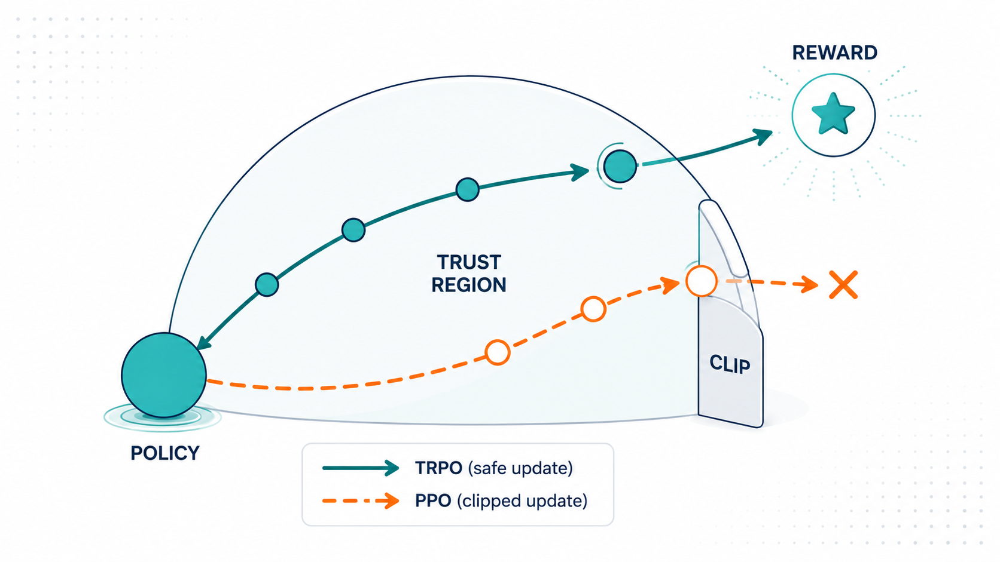
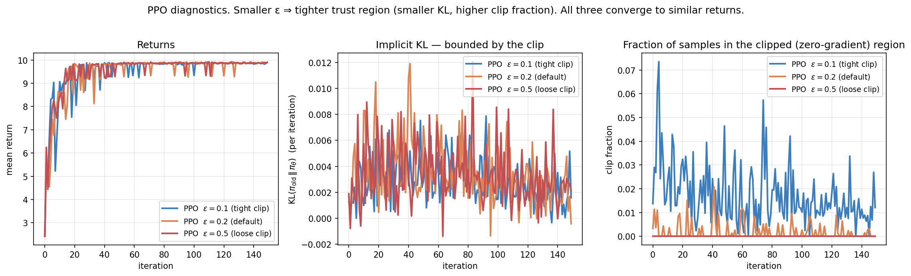
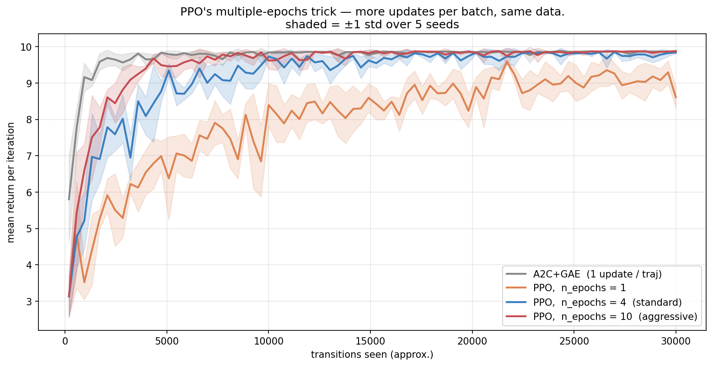
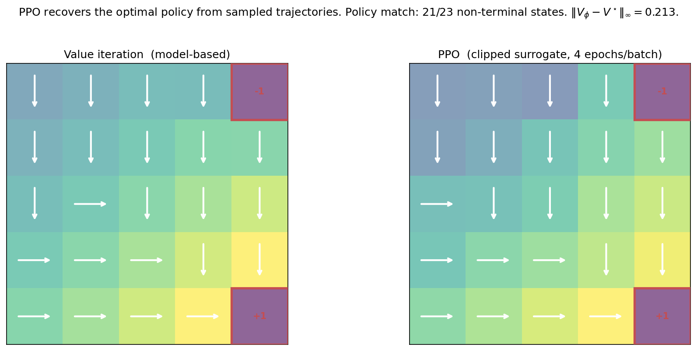
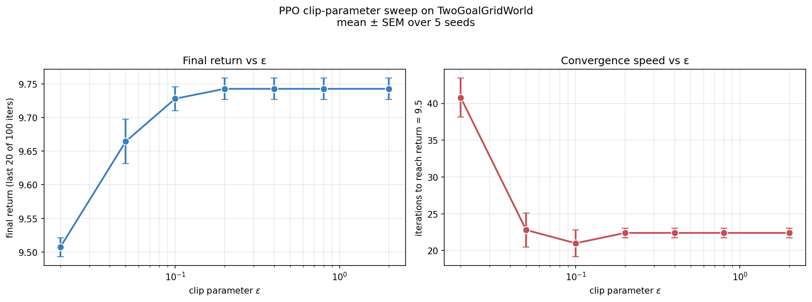
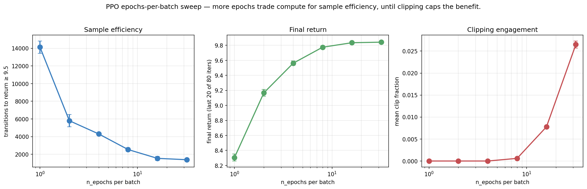
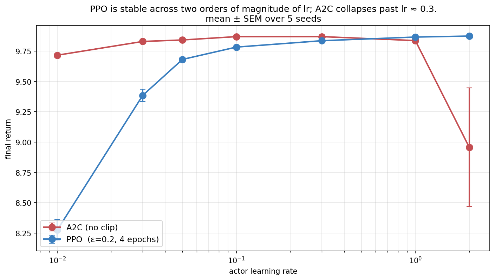

> *Policy gradient methods, from scratch — 3 of 4.*

[Post 2a §8.4](02a-reinforce-and-policy-gradient.qmd) showed something disturbing: increasing the learning rate of REINFORCE produces a catastrophic phase transition. At small lr, returns saturate cleanly. At medium lr, returns wobble. At large lr, the policy collapses entirely. The same picture shows up for A2C from [Post 2b](02b-actor-critic.qmd).

This isn't a coincidence — it's the **on-policy distribution shift** problem in a single picture. Each policy gradient update was computed under the *old* policy. A large update produces a *new* policy whose trajectory distribution is very different. The next gradient estimate is then from a wrong distribution, and the cycle compounds.

This post is about the solution. We introduce **importance sampling** as the framework for reusing data across policy updates. We derive **TRPO**'s explicit KL trust region. We then show how **PPO**'s clipped surrogate gives essentially the same effect with far simpler engineering. The result is the central algorithmic innovation that lets modern RL training work — and the chassis under every contemporary LLM RLHF pipeline.

---

## 0. The problem: why naive PG fails with big updates


The figure quantifies the cost of large learning rates: at $\alpha = 2.0$, **REINFORCE doesn't just slow down — it produces qualitatively different outcomes on different seeds**. The right panel shows std across 8 seeds: at $\alpha = 0.05$ the std stays below 1; at $\alpha = 2.0$ it sits around 4-5 throughout training. Some runs succeed; others collapse. We can't predict which.

The mechanism is straightforward. The policy gradient at iteration $k$ is an unbiased estimate of $\nabla J(\pi_{\theta_k})$. We then apply $\theta_{k+1} = \theta_k + \alpha \nabla J$. If $\alpha$ is small, $\theta_{k+1}$ is close to $\theta_k$, and $\pi_{\theta_{k+1}}$ is close to $\pi_{\theta_k}$ — the data we just used is still representative. If $\alpha$ is large, $\pi_{\theta_{k+1}}$ may have moved to a very different distribution, and the next batch will produce a totally different gradient estimate. Iterating this is unstable.

So the question is: **how do we take large effective steps without leaving the trust region where our current data is informative?**

Two features make this failure especially dangerous, and they are why the fix matters so much. First, it is **largely irreversible**: a too-large step can drive the policy into a region where it produces only low-reward trajectories, and from there the gradient signal is weak and uninformative (every action looks equally bad), so the policy has no clear way back. Collapse is a one-way door. Second, the stakes scale with the cost of data. On a gridworld a collapsed run is a wasted afternoon; in **RLHF on a large language model**, each iteration's "batch" is expensive human-relevant generation and the policy *is* a multi-billion-parameter model whose collapse means a degenerate, repetitive, or reward-hacking chatbot. The whole reason PPO became the default RLHF optimizer (§5) is that you cannot afford a single catastrophic step when the policy is that valuable and the data that costly. Stability is not a nicety here; it is the entire requirement.

---

## 1. Importance sampling: the bridge

The mathematical tool that enables everything in this post is **importance sampling**, the identity

$$
\mathbb{E}_{x \sim p}[f(x)] \;=\; \mathbb{E}_{x \sim q}\!\left[ \frac{p(x)}{q(x)} f(x) \right].
$$

We can compute an expectation under distribution $p$ by sampling from $q$ and reweighting. The factor $p(x)/q(x)$ is the **importance ratio**.

A two-line concrete example fixes the intuition. Suppose an action is good ($A = +1$) and under the old policy it had probability $\pi_{\text{old}} = 0.2$. If a candidate new policy would assign it $\pi_{\text{new}} = 0.4$, the importance ratio is $r = 0.4/0.2 = 2$: the surrogate counts this sample's advantage *twice*, correctly reflecting that the new policy would take this good action twice as often. That is exactly the signal we want — push probability toward good actions. The danger is the same mechanism unchecked: if the new policy lurched to $\pi_{\text{new}} = 0.99$, then $r \approx 5$, and a few such samples would dominate the whole gradient. The reweighting is faithful only while the policies are close; that is what we must enforce.

For policy optimization, set $p = \pi_{\theta_{\text{new}}}$, $q = \pi_{\theta_{\text{old}}}$, and let $f(a) = A(s, a)$ (advantage). Then

$$
\mathbb{E}_{a \sim \pi_{\text{new}}}[A(s, a)] \;=\; \mathbb{E}_{a \sim \pi_{\text{old}}}\!\left[ \frac{\pi_{\text{new}}(a \mid s)}{\pi_{\text{old}}(a \mid s)} A(s, a) \right].
$$

This is the key. We collect data once under $\pi_{\text{old}}$ and can then evaluate (and optimize) the new policy by reweighting. The expression on the right is differentiable in $\theta_{\text{new}}$, so we can **take multiple gradient steps using the same data** — as long as $\pi_{\text{new}}$ doesn't drift too far from $\pi_{\text{old}}$.

The "drift too far" is the central concern, and it is worth seeing *why* precisely, because it explains every design choice that follows. Importance sampling is unbiased for any $q$ with the right support, but its **variance** depends brutally on the mismatch between $p$ and $q$. The variance of the single-sample estimator $\frac{p(x)}{q(x)} f(x)$ scales with $\mathbb{E}_q[(p/q)^2 f^2]$, which contains the ratio *squared*. If $\pi_{\text{new}}$ puts ten times the mass of $\pi_{\text{old}}$ on some action, that sample's contribution is amplified hundredfold in the variance. A handful of large-ratio samples then dominate the estimate, and the gradient becomes both noisy and biased-in-practice (because we truncate or the rare events simply don't appear in a finite batch). In the extreme, the effective sample size — roughly $n / (1 + \mathrm{Var}[p/q])$ — collapses toward one: you have a batch of thousands but are effectively learning from a single transition. The whole game of TRPO and PPO is to keep $\pi_{\text{new}}$ close enough to $\pi_{\text{old}}$ that the ratios stay near 1, the variance stays controlled, and the reused data stays informative.

Define the **importance ratio** (a function of $\theta$ for fixed $\theta_{\text{old}}$):

$$
r_t(\theta) \;\equiv\; \frac{\pi_\theta(a_t \mid s_t)}{\pi_{\theta_{\text{old}}}(a_t \mid s_t)}.
$$

Note $r_t(\theta_{\text{old}}) = 1$. The PG theorem can be rewritten as

$$
\nabla_\theta J \big|_{\theta = \theta_{\text{old}}} \;=\; \mathbb{E}_{\pi_{\text{old}}}\!\big[ A_t \nabla_\theta r_t(\theta) \big|_{\theta = \theta_{\text{old}}} \big],
$$

which is exactly the standard policy gradient at $\theta = \theta_{\text{old}}$. The advantage is that the surrogate objective $L(\theta) = \mathbb{E}_{\pi_{\text{old}}}[r_t(\theta) A_t]$ is **defined for all $\theta$**, not just $\theta = \theta_{\text{old}}$, and can be optimized for many gradient steps before we collect new data.

---

## 2. TRPO: explicit KL trust region

Schulman et al. (2015) made the trust region explicit. The TRPO update solves

$$
\max_\theta \; L^{\text{IS}}(\theta) = \mathbb{E}_{\pi_{\text{old}}}\!\left[ r_t(\theta) \hat A_t \right]
\quad \text{subject to} \quad \mathbb{E}_{s}\!\left[ \mathrm{KL}(\pi_{\theta_{\text{old}}}(\cdot \mid s) \| \pi_\theta(\cdot \mid s)) \right] \leq \delta.
$$

The KL constraint enforces that the new policy stays within a "trust region" of the old one. Smaller $\delta$ → tighter trust region → more conservative update.

This is principled but technically demanding to solve. TRPO uses a second-order method: solve the quadratic approximation $\max_\theta g^\top (\theta - \theta_{\text{old}})$ subject to $(\theta - \theta_{\text{old}})^\top F (\theta - \theta_{\text{old}}) \leq \delta$ where $F$ is the Fisher information matrix. Solution via conjugate gradients + a line search to enforce the constraint approximately.

Effective, but a lot of moving parts. Worth understanding conceptually — but PPO, two years later, made the algorithm dramatically simpler while preserving most of the benefit.

### 2.1 Why the trust region is principled, not just a hack

It is tempting to read the KL constraint as a heuristic "don't move too far." It is more than that — it comes from a genuine performance-improvement guarantee, and the guarantee is worth seeing because it explains why *any* of this works. The key identity (Kakade & Langford 2002) expresses the new policy's return exactly in terms of the old policy's advantages:

$$
J(\pi_{\text{new}}) - J(\pi_{\text{old}}) \;=\; \mathbb{E}_{\tau \sim \pi_{\text{new}}}\!\left[ \sum_t \gamma^t A^{\pi_{\text{old}}}(s_t, a_t) \right].
$$

If we could evaluate the right-hand side under $\pi_{\text{new}}$ we'd be done — but that requires rolling out $\pi_{\text{new}}$, which is exactly what we're trying to avoid. The surrogate $L(\theta) = \mathbb{E}_{\pi_{\text{old}}}[r_t(\theta) \hat A_t]$ replaces the $\pi_{\text{new}}$-distribution over *states* with the $\pi_{\text{old}}$-distribution (it correctly reweights the *actions* via $r_t$, but not the state-visitation frequencies). TRPO's theorem bounds the error of that approximation: the true improvement is at least the surrogate minus a penalty proportional to the KL between the policies,

$$
J(\pi_{\text{new}}) - J(\pi_{\text{old}}) \;\ge\; L(\theta) - C \cdot \mathrm{KL}^{\max}(\pi_{\text{old}}, \pi_{\text{new}}),
$$

for a constant $C$ depending on the advantage magnitude and $\gamma$. So if you improve the surrogate by more than the KL penalty costs, you are *guaranteed* to improve the true return — **monotonic improvement**. Optimizing the surrogate inside a KL ball is therefore not a vibe; it is maximizing a provable lower bound on policy performance. The practical constant $C$ is far too conservative to use directly (it would force microscopic steps), so TRPO replaces the penalty with a hard KL constraint of size $\delta$, and PPO replaces *that* with the clip — each step trading a little theory for a lot of practicality, but all three descend from this lower bound.

---

## 3. PPO: the clipped surrogate

Schulman et al. (2017) observed that the trust region effect can be approximated by a simple modification of the importance-sampled objective. Define

$$
\boxed{\;
L^{\text{CLIP}}(\theta) \;=\; \mathbb{E}_{\pi_{\text{old}}}\!\left[ \min\!\Big( r_t(\theta) \hat A_t,\; \text{clip}\big(r_t(\theta), 1{-}\epsilon, 1{+}\epsilon\big) \hat A_t \Big) \right]
\;}
$$

where $\text{clip}(r, a, b) = \min(\max(r, a), b)$ and $\epsilon$ (typically 0.1 or 0.2) controls the trust region size.

That's the whole algorithm. No KL constraint, no second-order optimization, no line search. Just a clipped objective that you optimize with plain SGD/Adam.

### 3.1 Why the min and clip work


The crucial structure is the **asymmetric** clip:

- **Case $A_t > 0$ (good action)**: We want to increase $\pi_\theta(a_t \mid s_t)$, which means increase $r$. The unclipped objective $r \cdot A_t$ grows; we'd happily push $r$ to infinity. The clip caps it: above $r = 1 + \epsilon$, the objective is flat at $(1+\epsilon) A_t$. The $\min$ takes the smaller value, so the objective is the unclipped one below $1+\epsilon$ and flat above. **Gradient is zero in the clipped region — the optimizer can't push $r$ any higher.**

- **Case $A_t < 0$ (bad action)**: We want to decrease $\pi_\theta(a_t \mid s_t)$, which means decrease $r$. The unclipped objective decreases. The clip caps it below at $(1-\epsilon) A_t$. Now the $\min$ picks the *more negative* one — which is the unclipped value above $r = 1-\epsilon$, and the clipped value below. **Gradient is zero for $r < 1-\epsilon$.**

In both cases, the clip turns off the gradient when the policy has moved too far in the "natural" direction. The policy can move back (toward $r = 1$) freely, but it can't keep moving away.

The asymmetry is what makes this work. A naive *symmetric* clip — just $\text{clip}(r, 1-\epsilon, 1+\epsilon) A_t$ — has zero gradient on *both* sides, including where we want to move *into* the constrained region. That fails. The $\min$ with the unclipped version makes it work: we can always move *toward* the data-generating policy.

### 3.2 The PPO algorithm

```python
def train_ppo(env, policy, baseline, n_iterations, n_trajectories_per_iter,
              n_epochs, lr_actor, lr_critic, gamma, lam, eps):
    for it in range(n_iterations):
        batch = collect_batch(env, policy, n_trajectories_per_iter)
        samples = compute_advantages(batch, baseline, gamma, lam)  # GAE
        old_log_probs = [log pi_theta(a|s) for (s, a) in samples]

        # Multiple epochs of clipped surrogate updates.
        for epoch in range(n_epochs):
            for (s, a, A) in shuffled(samples):
                ratio = exp(log pi_theta(a|s) - old_log_probs[s, a])
                unclipped = ratio * A
                clipped   = clip(ratio, 1 - eps, 1 + eps) * A
                # Take gradient of min(unclipped, clipped).
                # Only update if unclipped is the active branch.
                update theta in the gradient direction

        # Critic update on the same batch.
        for (s, _, _, target) in samples:
            V_phi[s] += lr_critic * (target - V_phi[s])
```

The key trick: **multiple epochs on the same batch**. With vanilla policy gradient, taking a second update with the same data would compute the wrong gradient (the policy has changed). With PPO's clipped surrogate, the gradient stays informative as long as $r_t$ stays in $[1-\epsilon, 1+\epsilon]$.

### 3.3 KL stays bounded automatically



The clip is an *implicit* trust region: it doesn't directly constrain KL, but in practice the KL stays small because the gradient is turned off whenever the ratio strays past the boundary.

Three diagnostics worth watching in any PPO implementation:

1. **Mean importance ratio.** Should stay near 1.0. If it drifts far, the policy has changed too much per iteration.
2. **KL divergence between old and new policy.** Should be bounded — order $\epsilon^2$ in theory. If it explodes, training is unstable.
3. **Clip fraction.** What fraction of samples hit the clip on each update. Should be small ($\sim$1–10%) — if it's 30%+, you're throwing away most of your gradient signal.

The figure shows all three values stay tame across $\epsilon \in \{0.1, 0.2, 0.5\}$. Smaller $\epsilon$ engages clipping more (right panel) but keeps KL tighter (middle). Returns converge to roughly the same value (left), just at slightly different rates.

### 3.4 Where PPO is finicky in practice

PPO's reputation is "robust," and relative to vanilla policy gradient it is. But it has well-known sharp edges worth naming, because they recur in every large-scale use including RLHF:

- **The clip doesn't bound a single step's KL — it bounds it in expectation, eventually.** A single minibatch update can still push some ratios far past $1\pm\epsilon$ before the next recomputation of $r_t$; the clip only removes the *gradient* there, it doesn't undo a move already made. This is why practitioners add an explicit KL early-stopping rule on top of the clip: stop the epoch loop once mean KL exceeds a target. The clip and an explicit KL guard are complementary, not redundant.
- **Too many epochs per batch overfits the batch.** Reusing data is the point, but each extra epoch pushes $\pi_\theta$ further from $\pi_{\text{old}}$, raising the clip fraction and the chance of a destructive step. There is a sweet spot (often 3–10 epochs); §7.2 sweeps it.
- **Advantage normalization is nearly mandatory.** PPO is sensitive to advantage scale because the clip threshold $\epsilon$ is fixed while $\hat A_t$ can be any magnitude. Normalizing advantages (subtract mean, divide by std) per batch keeps the effective step size stable across tasks and across training.
- **The value function can dominate.** When actor and critic share a network, a large critic loss can swamp the policy gradient; the value-loss coefficient becomes a tuning knob, and many implementations also clip the value update.

None of these break the core idea — they are the difference between "PPO the equation" and "PPO that trains a 70B model without diverging." We will meet them again in §5, where PPO is the engine of RLHF.

---

## 4. PPO recovers sample efficiency



On this small tabular problem, A2C with per-step updates is the most sample-efficient. PPO with 1 epoch is much slower — it does only one update per batch where A2C does many. PPO with 10 epochs catches up to within striking distance of A2C.

**The point**: PPO's value isn't sample efficiency per se. It's that PPO **lets you do many epochs per batch safely**, where vanilla policy gradient would have collapsed. In neural-network settings — where each gradient step is expensive and per-step variance is high — this is the central practical reason PPO dominates.

### 4.1 PPO learns the right policy



The final policy comparison shows 21/23 non-terminal states matching value iteration's answer — same as A2C in [Post 2b](02b-actor-critic.qmd), better than REINFORCE in [Post 2a](02a-reinforce-and-policy-gradient.qmd). The two disagreements are at near-tied states. PPO is solving the same problem; it's not better at finding the *answer*, it's better at finding it **reliably**.

---

## 5. Forward connections

### 5.1 PPO is the RLHF workhorse

In modern RLHF (used for ChatGPT, Claude, Llama, etc.), the training loop is *exactly* PPO. Specifically:

- The **policy** $\pi_\theta$ is the language model.
- The **advantages** are computed via GAE from rewards given by a learned reward model.
- The **clipped surrogate** is the loss function (often with an additional **KL penalty** against a reference policy — a "soft" trust region on top of the "hard" clip).
- Training runs for many iterations of PPO updates over RLHF data.

The KL penalty against a reference model deserves a note. It's a separate KL constraint:

$$
\mathcal{L}_{\text{RLHF}} = L^{\text{CLIP}}(\theta) - \beta \, D_{\mathrm{KL}}(\pi_\theta \,\|\, \pi_{\text{ref}}).
$$

The reference is usually the pre-RLHF model (the SFT checkpoint). This penalty prevents the policy from drifting too far from coherent language generation in pursuit of high reward. Without it, RLHF collapses to reward-hacking gibberish that scores high on the reward model but is incoherent.

Note: this $\pi_{\text{ref}}$ KL is **different** from the implicit KL bound that PPO's clip provides between $\pi_{\text{old}}$ and $\pi_{\text{new}}$. PPO's clip prevents *per-iteration* drift. The reference KL prevents *cumulative* drift across all iterations.

### 5.2 PPO + GAE + a reward model = the full RLHF stack

If you understand Posts 2a, 2b, and 2c, you understand the algorithmic core of RLHF. The remaining engineering — reward modeling, prompt sampling, large-scale distributed training — are real challenges but not conceptual ones.

This is why we've built this so carefully. The thread from "log-derivative trick" to "RLHF for ChatGPT" is a single mathematical structure, with three additions: (a) a baseline (the critic), (b) GAE for the advantage estimator, (c) the clipped surrogate for stability. That's the entire algorithmic stack of modern RL-for-LLMs.

### 5.3 GRPO removes the critic but keeps the clip

DeepSeek-R1's GRPO (which we'll detail in Post 2d) is essentially **PPO without a learned critic**. Instead of $V_\phi$, the baseline is the mean reward of a group of completions sampled from the same prompt:

$$
A_i = r_i - \frac{1}{G} \sum_{j=1}^{G} r_j.
$$

The clipped surrogate is unchanged. So GRPO = PPO with a free baseline.

Why this works for LLMs:
- Critics in LLM space are expensive to maintain — a value head over a multi-billion-parameter model is itself a large model, and training it well is its own hard problem.
- The within-prompt variance of rewards is what we want to reduce; the group baseline captures it well, because all $G$ completions share the same prompt and so the mean reward is a tight, prompt-specific baseline.
- Removing the critic eliminates a source of training instability (a mis-calibrated critic injects biased advantages that the clip cannot protect against — bad advantages clipped are still bad advantages).

But the trade is real, not free, and worth stating honestly. The group baseline is a *Monte Carlo* estimate of the prompt's value from only $G$ samples, so it is noisier than a well-trained critic that has generalized across many prompts; GRPO buys simplicity and stability at the cost of needing several completions per prompt (more inference per update) and a higher-variance baseline. It is the same bias–variance dial from Post 2b, set toward "unbiased but sample-hungry." That this trade comes out favorably for LLM reasoning — where sampling several completions is cheap relative to maintaining a good critic, and where reward signals are sparse and a critic struggles to calibrate — is *why* GRPO works there and would not necessarily be the right call in classic continuous control.

GRPO is a striking example of how **knowing the structure of the algorithm lets you modify it**. The clipped surrogate is the load-bearing piece; the critic is a convenience you can swap for a group baseline when the problem makes that cheaper.

### 5.4 DPO bypasses PPO entirely

The most radical recent move is to skip PPO. **Direct Preference Optimization** (Rafailov et al. 2023) uses an algebraic identity to convert the RLHF objective into a supervised loss on preference pairs $(y^+, y^-)$:

$$
\mathcal{L}_{\text{DPO}} = -\log \sigma\!\left[ \beta \log \frac{\pi_\theta(y^+ \mid x)}{\pi_{\text{ref}}(y^+ \mid x)} - \beta \log \frac{\pi_\theta(y^- \mid x)}{\pi_{\text{ref}}(y^- \mid x)} \right].
$$

No PPO loop, no reward model, no advantage estimation. Just gradient descent on a binary classification objective.

We'll derive this in Post 2d. The conceptual takeaway here: **PPO is one way to solve the RLHF problem, not the only way**. The first-principles framing (REINFORCE → A2C → PPO → DPO) lets you see how the algorithmic landscape evolved and where the design space is.

---

## 6. Experiments to actually run

### 6.1 Clip parameter ε sensitivity

Sweep $\epsilon$ from very small (almost no updates allowed) to very large (no clipping). What's the sweet spot?

### 6.2 Epochs-per-batch sweep

PPO's main efficiency gain over A2C comes from running multiple SGD epochs on the same batch. How many is too many? When does the clipping start to dominate?

### 6.3 PPO under environment shift

Mirror of 1d.4. The +1 and −1 terminals swap positions partway through training. PPO's trust region adds stability; does it help or hurt adaptation?

### 6.4 PPO stability across learning rates

The motivating problem of this post. We saw vanilla REINFORCE collapses past lr ≈ 0.5 (Post 2a §8.4). Does PPO survive at lr = 1.0? At lr = 2.0?

---

## 7. Solutions

### 7.1 Clip parameter ε sensitivity — `experiments/02c_sol1_eps_sensitivity.py`



**What you should see.** $\epsilon = 0.02$ (very tight) converges slowly (41 iterations to threshold) and to a slightly lower return (9.51). $\epsilon \geq 0.1$ all reach 9.74 in about 22 iterations. The default $\epsilon = 0.2$ is right at the elbow.

**Why ε ≥ 0.1 all behave the same.** On this small problem, the natural per-iteration policy update is small enough that the clip never engages with $\epsilon \geq 0.1$. The KL diagnostics figure showed this: at $\epsilon = 0.5$, clip fraction was essentially zero. The clip is doing nothing because the policy isn't trying to move that far.

**Why tight ε is harmful.** With $\epsilon = 0.02$, the clip engages on most samples. Most gradient signal gets thrown away (because the gradient is zero in the clipped region). The policy can only crawl forward.

**The deeper lesson — ε encodes a prior about update size.** The PPO default of $\epsilon = 0.2$ is calibrated for typical neural-network settings where the natural update magnitude is comparable to $\epsilon$. On simpler problems where the gradient is well-behaved, you can use larger $\epsilon$ (or no clipping at all — equivalent to vanilla PG with multiple epochs). On harder problems (long horizons, sparse rewards, high-variance gradients), smaller $\epsilon$ is needed.

This is also why PPO works across so many domains with the same default: $\epsilon = 0.2$ is robust enough that it engages just-enough on hard problems and barely-at-all on easy ones.

### 7.2 Epochs-per-batch sweep — `experiments/02c_sol2_epochs_sweep.py`



**What you should see.** Three coupled effects, plotted in three panels:

- **Sample efficiency** drops from 14k transitions (1 epoch) to 1.4k (32 epochs) — a 10× improvement.
- **Final return** rises from 8.3 to 9.85, saturating at the optimum around 8 epochs.
- **Clip fraction** grows from essentially 0% (1 epoch) to 2.6% (32 epochs).

The clip fraction story is the key. At 1 epoch, the policy barely moves, so the clip never engages. At 32 epochs, the cumulative drift per batch is much larger, and the clip starts protecting against runaway updates.

**Why diminishing returns.** Past about 16 epochs, the policy is moving as far as the clip will allow — the optimization has saturated within the trust region. More epochs would change nothing because every additional gradient step on this batch has zero gradient (we're in the clipped region for most samples).

**The deeper lesson — PPO is self-regulating.** The standard PPO default is $n_{\text{epochs}} = 4$ to $10$. This isn't a magic number; it's "enough that you extract most of the available signal per batch, but not so many that you're computing zero gradients." The clip provides a natural stopping criterion. Going beyond the saturation point is wasted compute, not a stability risk.

This self-regulation is part of why PPO is so practical. Vanilla policy gradient with $n_{\text{epochs}} > 1$ can be wildly unstable. PPO with $n_{\text{epochs}} = 100$ would just be wasteful, not dangerous.

### 7.3 Environment shift — `experiments/02c_sol3_environment_shift.py`


**What you should see.** Pre-switch (episodes 0-1500), both methods learn the +1 terminal and reach return ~0.85. At the switch (episode 1500), both immediately drop to -1 — the policy that was confidently heading to the bottom-right now confidently heads to a tiger. Post-switch (1500-3000), both methods take a long time to recover, with PPO slightly smoother but not faster.

**Why both struggle to adapt.** Both REINFORCE and PPO have been *trained* into confident policies pointing toward the wrong corner. Recovering requires:

1. Random exploration to discover the new +1 location.
2. Enough gradient signal to overcome the existing momentum in $\theta$.

PPO's clip makes step 2 slower, not faster. The clip prevents large per-iteration policy changes, which is exactly the *opposite* of what you want when the environment changes drastically. You'd actually want to *increase* $\epsilon$ or take bigger steps to escape the bad commitment.

**The honest finding: PPO trades adaptation speed for stability, not the other way around.** This is the dual of the variance-vs-bias tradeoff. PPO is great when the environment is stable; it's relatively poor when the environment changes faster than the trust region can accommodate.

**The deeper lesson — entropy regularization is the right fix for non-stationarity.** What both methods lack here is *exploration*. With entropy regularization, the policy would never collapse to 99% confidence in a single direction; some probability mass would always be available to discover the new optimum. We saw this in [Post 2b §8.4](02b-actor-critic.qmd): entropy regularization with $\beta = 0.1$ keeps the policy responsive.

This generalizes far beyond gridworlds. In LLM RLHF, **the KL penalty against the reference model is doing exactly the entropy-regularization job**: it prevents the policy from collapsing to a degenerate distribution. Without it, the policy would commit too hard to whatever the reward model rewards, and lose the ability to recover if the reward model is even slightly wrong.

### 7.4 PPO stability across learning rates — `experiments/02c_sol4_lr_stability.py`



**What you should see.** A2C is well-behaved across two orders of magnitude (lr 0.01 to 1.0) but **catastrophically fails at lr = 2.0**, dropping to mean 8.96 with std 1.09 — some seeds work, some collapse entirely. PPO, in contrast, *peaks* at lr = 2.0 (9.87) with std 0.00 — perfectly reproducible across seeds.

This is the textbook demonstration. PPO transforms the lr-sensitivity curve from a sharp peak (A2C) into a saturating monotonic curve. **You can dial lr much higher under PPO without collapse.**

**Why PPO is monotonic.** Increasing lr makes the gradient steps within a batch bigger. With vanilla A2C, big steps mean the next batch is from a very different policy than the gradient assumed; instability compounds. With PPO, big steps engage the clip more often, which simply caps the per-iteration change. The policy can't move further than the clip allows, regardless of lr.

So at high lr, PPO is effectively limited by the clip rather than by gradient magnitude. The trust region becomes the dominant constraint. Returns saturate at the policy that's optimal-within-trust-region.

**The deeper lesson — PPO trades lr-tuning for ε-tuning.** With A2C, you have to carefully tune lr. With PPO, you can use a wide range of lr and instead tune $\epsilon$ (which is much more robust — see 7.1). This is *huge* in practice: hyperparameter tuning is expensive, and "the algorithm just works with default settings" is the central virtue of PPO.

This is a major reason PPO became the default for everything from MuJoCo control to LLM RLHF. The defaults work. You can change the problem (different environment, different policy architecture, different reward scale) and the same $\epsilon = 0.2$, $\lambda = 0.95$, and a wide range of lrs all just work.

---

## 8. Further reading

- **Schulman, Levine, Abbeel, Jordan & Moritz, "Trust Region Policy Optimization" (ICML 2015).** TRPO.
- **Schulman, Wolski, Dhariwal, Radford & Klimov, "Proximal Policy Optimization Algorithms" (2017).** PPO.
- **Engstrom et al., "Implementation Matters in Deep Policy Gradients: A Case Study on PPO and TRPO" (ICLR 2020).** A meticulous study of the implementation tricks that make PPO actually work in practice. Highly recommended.
- **Andrychowicz et al., "What Matters in On-Policy Reinforcement Learning? A Large-Scale Empirical Study" (ICLR 2021).** A 250,000-experiment ablation of PPO's design choices.
- **Huang, Dossa, Raffin, Kanervisto & Wang, "The 37 Implementation Details of Proximal Policy Optimization" (ICLR Blog Track 2022).** What separates a PPO that works from one that doesn't.

---

**Next up — Part 2d: RLHF, DPO, and GRPO.** We finally connect everything to LLM training. We'll see RLHF as PPO with a learned reward model, derive DPO's algebraic bypass of policy gradient, and look at GRPO's group-relative baseline that's making reasoning RL practical. The closing post of Topic 2, and the bridge from the "classical RL" we've been building to the modern LLM post-training stack.
