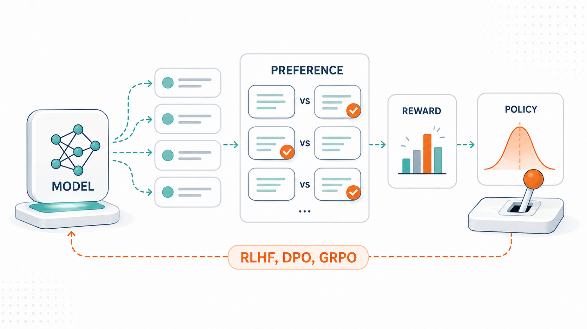
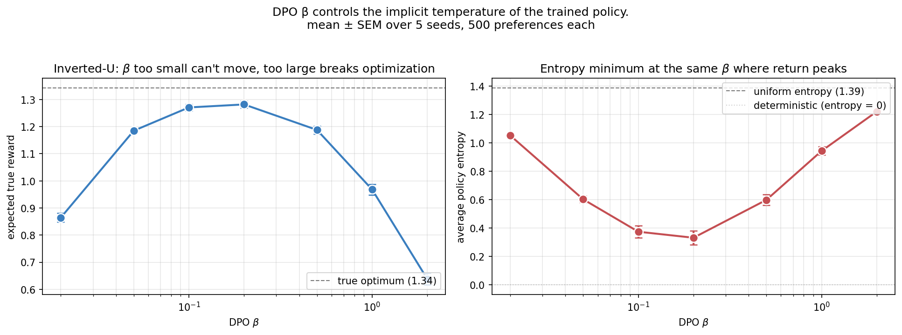
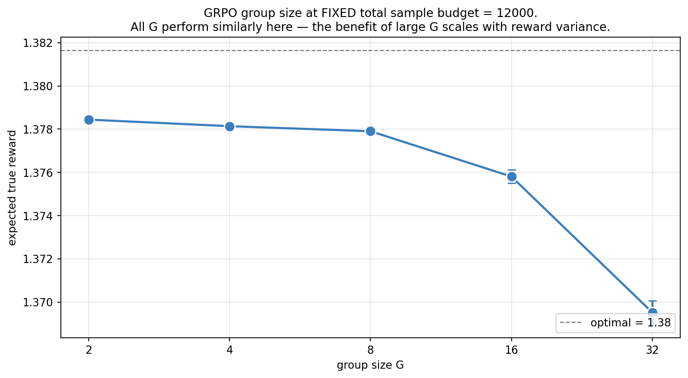
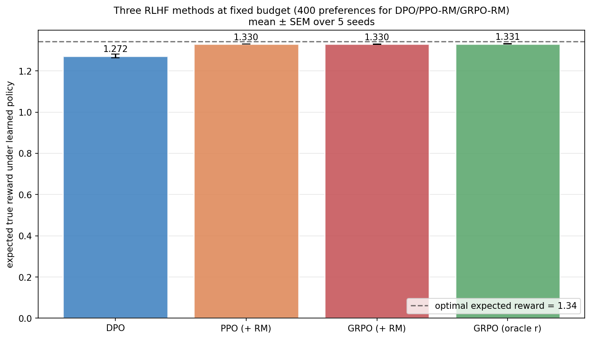

> *Policy gradient methods, from scratch — 4 of 4.*

This is the closing post of Topic 2. We've built the algorithmic stack from first principles: REINFORCE (Post 2a), actor-critic with GAE (Post 2b), and PPO's clipped surrogate (Post 2c). Each post connected forward to RLHF in the abstract. Now we make it concrete.

The bridge is preferences. In LLM training, the "reward" doesn't come from an environment — it comes from comparing model outputs. A human (or another model) chooses one completion over another, and that signal flows through one of three pipelines: train a reward model and run PPO on it (the original RLHF recipe), skip the reward model and optimize the policy directly on preferences (DPO), or train with PPO without a learned critic (GRPO).

All three are variations on the same first-principles structure we've already built. We'll see why each works, derive DPO's elegant closed-form objective from the RLHF optimality condition, examine where each pipeline shines, and end with the open questions about reward hacking and where the field is heading.

---

## 0. The full RLHF stack

The standard RLHF recipe, as described in Ziegler et al. (2019) and refined by InstructGPT (Ouyang et al. 2022), has four stages:

1. **Supervised fine-tuning (SFT).** Start from a pre-trained language model. Fine-tune on demonstrations of the target task. The result is $\pi_{\text{ref}}$, a reasonable initial policy.
2. **Collect preferences.** Sample pairs of completions $(y_w, y_l)$ from $\pi_{\text{ref}}$. A human chooses which is better; we treat the choice as a noisy label of the underlying reward.
3. **Train a reward model.** Fit $\hat r_\phi(x, y)$ to predict preferences using the Bradley-Terry model.
4. **PPO with KL penalty.** Train $\pi_\theta$ to maximize $\hat r_\phi$, with a KL penalty against $\pi_{\text{ref}}$ to prevent the policy from drifting too far from coherent generation.

The KL penalty is the dual purpose of the trust region in PPO: PPO's *internal* clip prevents per-iteration drift (the policy stays close to the data-generating policy within an iteration); the *external* reference KL prevents cumulative drift across iterations (the policy stays close to the original SFT model).

The whole stack is policy-gradient methods all the way down. DPO and GRPO simplify it in different ways — but each can be derived from the same first principles.

---

## 1. Preferences and the Bradley-Terry model

The starting point is the **Bradley-Terry model** of pairwise preferences. Given two items with latent "scores" $r_a$ and $r_b$, the probability that an annotator prefers $a$ over $b$ is

$$
P(a \succ b) \;=\; \sigma(r_a - r_b) \;=\; \frac{1}{1 + e^{-(r_a - r_b)}}.
$$

The model is *parsimonious*: a single scalar score per item determines all pairwise probabilities. It's also *only identified up to additive constants* — adding a constant to every $r$ doesn't change any probability. The natural latent variable to estimate is the reward function.

For RLHF, $a$ and $b$ are completions of a prompt $x$, and the scores are $r(x, y_a)$ and $r(x, y_b)$.

### 1.1 Fitting a reward model

To fit a reward model $\hat r_\phi$, we minimize the negative log-likelihood of the observed preferences:

$$
\mathcal{L}_{\text{RM}}(\phi) \;=\; -\mathbb{E}_{(x, y_w, y_l) \sim \mathcal D}\!\big[\log \sigma\!\big(\hat r_\phi(x, y_w) - \hat r_\phi(x, y_l)\big)\big].
$$

Note this is identical to a **logistic regression** loss with labels always = 1 ("winner beat loser") and features being the reward-difference function. For an LLM reward model, $\hat r_\phi$ is typically a transformer with a linear head that maps each completion to a scalar.

For our tabular setting, the reward function has one parameter per `(context, completion)` cell. The right panel of the figure shows that with enough preference data, the learned reward recovers the true reward up to the per-context additive constant (which we removed by centering).

### 1.2 The reward model is doing logistic regression

This framing is worth dwelling on. **The reward model is a binary classifier**: given pairs $(x, y_a, y_b)$, predict which one a human prefers. The "reward" interpretation is just an algebraic restatement: under Bradley-Terry, the classifier's score $\hat r_\phi(x, y)$ is a real-valued reward function, identified up to per-prompt constants.

This realization is what makes DPO possible.

---

## 2. The RLHF objective and its optimal policy

Once we have a reward model $\hat r_\phi$, RLHF optimizes the policy:

$$
\max_{\pi_\theta} \;\; \mathbb{E}_{x \sim \mathcal D, \, y \sim \pi_\theta(\cdot \mid x)}\!\big[\hat r_\phi(x, y)\big] \;-\; \beta \,D_{\mathrm{KL}}\!\big(\pi_\theta(\cdot \mid x) \,\|\, \pi_{\text{ref}}(\cdot \mid x)\big).
$$

Reward minus a KL penalty against the reference policy. The hyperparameter $\beta$ controls the strength of the KL constraint: small $\beta$ → policy can drift far in pursuit of reward; large $\beta$ → policy stays close to $\pi_{\text{ref}}$.

### 2.1 Closed-form optimal policy

Critically, this objective has a closed-form solution, and the derivation is short and illuminating — it is worth seeing rather than asserting. Rewrite the objective for a single prompt $x$ as a minimization by flipping signs and dividing by $\beta$:

$$
\min_{\pi}\; \mathbb{E}_{y \sim \pi}\!\left[ -\frac{r(y,x)}{\beta} + \log \frac{\pi(y\mid x)}{\pi_{\text{ref}}(y\mid x)} \right].
$$

Pull the reward into the log by writing $-\frac{r}{\beta} = \log \exp(-r/\beta)$, and define the normalized distribution $\pi^\star(y\mid x) = \frac{1}{Z(x)}\pi_{\text{ref}}(y\mid x)\exp(r(y,x)/\beta)$ with $Z(x)=\sum_y \pi_{\text{ref}}(y\mid x)\exp(r(y,x)/\beta)$. A few lines of algebra collapse the whole bracket into a single KL plus a constant:

$$
\min_{\pi}\; D_{\mathrm{KL}}\!\big(\pi(\cdot\mid x)\,\|\,\pi^\star(\cdot\mid x)\big) - \log Z(x).
$$

Since $\log Z(x)$ doesn't depend on $\pi$, and a KL divergence is minimized (to zero) exactly when its two arguments are equal, the optimum is simply $\pi = \pi^\star$:

$$
\boxed{\;
\pi^\star(y \mid x) \;=\; \frac{1}{Z(x)} \pi_{\text{ref}}(y \mid x) \exp\!\left(\frac{r(y, x)}{\beta}\right).
\;}
$$

The KL-regularized RL objective is, secretly, just "find the distribution closest to this Gibbs tilt of the reference." The policy *tilts* the reference toward high-reward outputs, with strength controlled by $1/\beta$.

This is a familiar object — it's the **Gibbs/Boltzmann posterior** with the reference as prior and reward as log-likelihood. It's also why RLHF can be viewed as a kind of approximate Bayesian inference over policies, and it is the exact same exponential-tilt-of-a-reference form as the inference-time temperature connection in Post 3a §1.

In practice, we never compute $\pi^\star$ directly — $Z(x)$ would require enumerating all completions. PPO approximates it via stochastic gradient ascent on the (clipped) surrogate. But the closed form is exactly what DPO exploits.

---

## 3. DPO: skipping the reward model

The DPO insight (Rafailov et al. 2023) is to **invert** the closed-form policy:

$$
r(y, x) \;=\; \beta \log \frac{\pi^\star(y \mid x)}{\pi_{\text{ref}}(y \mid x)} \;+\; \beta \log Z(x).
$$

Reward is the log-probability ratio between the optimal policy and the reference, plus a per-prompt constant.

Now plug this expression for $r$ into the Bradley-Terry preference probability:

$$
P(y_w \succ y_l \mid x) \;=\; \sigma\!\big(r(y_w, x) - r(y_l, x)\big)
$$

$$
\;=\; \sigma\!\left(\beta \log \frac{\pi^\star(y_w \mid x)}{\pi_{\text{ref}}(y_w \mid x)} - \beta \log \frac{\pi^\star(y_l \mid x)}{\pi_{\text{ref}}(y_l \mid x)} \;+\; \beta \log Z(x) - \beta \log Z(x)\right).
$$

The $\log Z(x)$ terms **cancel** because they're the same for $y_w$ and $y_l$ (both completions of the same prompt). What remains is

$$
P(y_w \succ y_l \mid x) \;=\; \sigma\!\left(\beta \log \frac{\pi^\star(y_w \mid x)}{\pi_{\text{ref}}(y_w \mid x)} - \beta \log \frac{\pi^\star(y_l \mid x)}{\pi_{\text{ref}}(y_l \mid x)}\right).
$$

This depends only on $\pi^\star$ and $\pi_{\text{ref}}$. The reward model is gone — it was always implicit in the policy ratio.

### 3.1 The DPO loss

Replace $\pi^\star$ with our policy $\pi_\theta$ (the thing we're learning) and minimize the negative log-likelihood of observed preferences. The result is the **DPO loss**:

$$
\boxed{\;
\mathcal{L}_{\text{DPO}}(\theta) \;=\; -\mathbb{E}\!\left[\log \sigma\!\left(\beta \log \frac{\pi_\theta(y_w \mid x)}{\pi_{\text{ref}}(y_w \mid x)} - \beta \log \frac{\pi_\theta(y_l \mid x)}{\pi_{\text{ref}}(y_l \mid x)}\right)\right].
\;}
$$

It's a binary classification loss. Optimizing it requires:

- A way to compute $\log \pi_\theta(y \mid x)$ (autoregressive log-probability of a completion under the model).
- A way to compute $\log \pi_{\text{ref}}(y \mid x)$ (same, under the reference). In practice you compute once and cache.
- Standard gradient descent.

No rollouts, no reward model, no PPO loop, no separately-trained value head. This is a *dramatic* engineering simplification.

### 3.2 Gradient intuition

The gradient of $\mathcal L_{\text{DPO}}$ has an interpretable structure. Let $u = \beta(\log\pi_\theta(y_w)/\pi_{\text{ref}}(y_w) - \log\pi_\theta(y_l)/\pi_{\text{ref}}(y_l))$ be the margin. Then

$$
\nabla_\theta \mathcal L_{\text{DPO}} \;=\; -\beta \,\sigma(-u)\,\big[\nabla_\theta \log \pi_\theta(y_w \mid x) - \nabla_\theta \log \pi_\theta(y_l \mid x)\big].
$$

The factor $-\beta \sigma(-u)$ is a weight that's high when the policy is *wrong* (margin negative — policy actually prefers loser) and low when the policy is correct (margin large positive). The direction is "increase log-prob of winner, decrease log-prob of loser" — a classic margin-style learning rule.

For our tabular softmax policy, the gradient simplifies beautifully: as I noted in the source code, the $\nabla \log \pi$ for winner and loser share a $-\pi(\cdot | s)$ term that cancels in the difference. The DPO gradient just pushes $\theta[s, w]$ up and $\theta[s, l]$ down, weighted by $\sigma(-u)$.

### 3.3 DPO vs PPO on the toy

On the synthetic task, PPO+RM and DPO are competitive across all preference counts, with PPO marginally ahead. The gap closes as more data arrives.

Why doesn't DPO match PPO exactly? With $\beta = 0.1$ and a uniform reference, the DPO-optimal policy is $\pi^\star \propto \exp(r / 0.1)$. With rewards bounded around $|r| \lesssim 2$, this gives a very concentrated distribution but never reaches the strict argmax. The DPO loss decays only logarithmically as the margin grows, so concentrating beyond a certain point costs ever-more steps for ever-less loss reduction.

PPO with a near-perfect reward model has no such constraint — it can push the policy to be arbitrarily greedy.

**The conclusion is task-dependent.** On real LLM preference data:

- Reward models are imperfect (limited capacity, limited data); DPO sidesteps this.
- DPO has no reward-model training stage and no PPO loop; far less engineering.
- PPO's KL penalty against the reference is replicated by DPO's $\beta$ term, but they're not identical in effect (PPO's KL is sampled per step; DPO's is implicit in the loss).

For most modern RLHF deployments, DPO has become the default starting point. It's simpler. It works.

---

## 4. GRPO: PPO without a critic

The third major variant. **Group Relative Policy Optimization** (Shao et al. 2024, used in DeepSeek-R1) keeps the PPO machinery but **replaces the learned value critic with a group-relative empirical baseline**.

### 4.1 The mechanism

For each prompt $x$:

1. Sample $G$ completions $y_1, \ldots, y_G$ from the current policy $\pi_\theta(\cdot | x)$.
2. Compute their rewards $r_1, \ldots, r_G$ (from a reward model or, for reasoning tasks, from a verifier giving correct/incorrect).
3. Compute the **group-relative advantage**:

$$
\hat A_i \;=\; \frac{r_i - \text{mean}(r_1, \ldots, r_G)}{\text{std}(r_1, \ldots, r_G) + \varepsilon}.
$$

The mean acts as the baseline; the std normalizes the advantage scale. The standard deviation normalization is optional but stabilizes training across prompts with very different reward variances.

4. Apply the **same** clipped PPO surrogate (Post 2c §3) using these advantages:

$$
\mathcal L_{\text{GRPO}}(\theta) \;=\; \mathbb E_{i}\!\left[\min\!\big(r_i(\theta) \hat A_i, \,\text{clip}(r_i(\theta), 1{-}\epsilon, 1{+}\epsilon) \hat A_i\big)\right] \;-\; \beta_{\rm KL}\, D_{\mathrm{KL}}(\pi_\theta \,\|\, \pi_{\text{ref}}).
$$

This is just PPO. The only difference is that the advantage estimate $\hat A_i$ comes from a group baseline, not from a learned $V_\phi$.

### 4.2 Why this works for LLMs

The motivations for replacing the critic with a group baseline are practical:

- **A value critic for LLMs is expensive.** It would be roughly the size of the policy network — another transformer.
- **Critics are hard to train accurately at LLM scale.** Bootstrapping introduces compounding errors.
- **Per-prompt variance dominates across-prompt variance.** When sampling many completions of the same prompt, their rewards span a wide range (some completions reach the answer, some don't). The group mean is a very good baseline for this variance.

For tasks with a clean verifier — like math problems where each completion is either correct or wrong — GRPO has an additional advantage: the reward is well-defined without a reward model. This is why DeepSeek-R1 used GRPO directly with verifier rewards, bypassing the entire preference-learning stage.

### 4.3 The KL penalty: trust region vs reward hacking

In RLHF practice, the reference KL plays two roles:

1. **As a trust region within an iteration.** PPO's clip already does this; the reference KL adds a cumulative version.
2. **As protection against reward hacking.** If the reward model is wrong, the policy will discover the error and exploit it. The KL penalty keeps the policy close to the reference, limiting how much it can exploit.

The honest finding is that **the KL penalty doesn't cleanly solve reward hacking**. Looking at the figure:

- $\beta_{\rm KL} = 0$ reaches the maximum true reward achievable while exploiting the corrupted RM.
- $\beta_{\rm KL} = 1$ slightly limits drift but doesn't change the achieved true reward much.
- $\beta_{\rm KL} = 5$ effectively prevents any policy learning.

There's no $\beta_{\rm KL}$ that "fixes" the corruption while still achieving good true reward. The KL penalty is a sliding scale between learning and not-drifting; it can't selectively prevent only the *bad* drift.

The real fix for reward hacking has to come from elsewhere: ensembles of reward models, calibration of reward model uncertainty, or constitutional / rule-based filters. The KL penalty is necessary but not sufficient.

This is **Goodhart's law** in mathematical dress: "when a measure becomes a target, it ceases to be a good measure." The reward model is a *proxy* for human preference, learned from finite data, so it is accurate near the distribution it was trained on (responses resembling $\pi_{\text{ref}}$'s outputs) and increasingly unreliable as the policy drifts into regions where it has no training signal. Optimizing the proxy hard enough always finds its blind spots — the policy discovers high-reward-model-score outputs that humans would actually dislike. There is a well-documented **reward-over-optimization** curve: as you optimize against a fixed reward model, true preference rises, peaks, and then *declines* even as the proxy reward keeps climbing (Gao et al. 2023 fit clean scaling laws to exactly this). The KL penalty's real job is to keep the policy inside the region where the proxy is still trustworthy — it bounds the drift, buying you the rising part of the curve before the proxy turns adversarial. It cannot tell good drift from bad because it doesn't know *where* the reward model is wrong; it only knows *how far* the policy has moved. That is why the durable fixes target the proxy's reliability itself (better, ensembled, uncertainty-aware reward models) rather than just constraining motion — a theme that returns in Topic 4's treatment of calibration.

---

## 5. The full picture

A common confusion in the RLHF landscape: are DPO, PPO, and GRPO competing alternatives, or different points in a shared design space? **It's the latter.** Each makes a different set of choices along three axes:

| | Reward model | Critic | Trust region |
|---|---|---|---|
| **RLHF (PPO)** | learned $\hat r_\phi$ | learned $V_\phi$ | clip + ref KL |
| **DPO** | implicit in policy | none (no rollouts) | implicit via $\beta$ |
| **GRPO** | learned OR verifier | group baseline | clip + ref KL |

You can mix and match:

- **PPO without a learned critic** (which is essentially GRPO).
- **DPO with explicit reward modeling** (this is essentially RLHF; DPO's "elegance" is in algebraically eliminating that step).
- **Iterative DPO**: run DPO multiple times, sample new preferences from the updated policy each round, repeat. Reintroduces some of PPO's on-policy nature.
- **DPO + KL to a moving reference**: relax the static $\pi_{\text{ref}}$ to a slowly-updating one.

All of these have been explored. The post-DPO RLHF literature is mostly variations along these axes, each calibrated to the specific failure modes of LLM training at scale.

---

## 6. Forward connections — into Topic 3

We've reached the algorithmic edge of the curriculum's "RL for LLMs" thread. Everything we built — bandits → MDPs → REINFORCE → A2C → PPO → RLHF/DPO/GRPO — leads here. The remaining direction is *what to do with* the trained policy.

This is where Topic 3 starts. Three threads:

### 6.1 Inference-time reasoning (Post 3a)

DPO/GRPO produces a fixed policy. But modern LLM systems do more at inference time: chain-of-thought, self-consistency sampling, tree search, reflection. These are **inference-time computation** — separate from training. We'll build them on top of the policy we now know how to train.

### 6.2 Tool use as actions (Post 3b)

Once the policy is reliable, we expand the action space: the policy can call tools (search, code execution, calculator). This turns the LLM from a pure text generator into an *agent* — an actor in an extended MDP whose actions include tool calls. The RL framework from Topics 1 and 2 still applies; the action space just expanded.

### 6.3 Planning and search (Post 3c)

Some problems are too hard for a single forward pass. AlphaProof, AlphaGeometry, and similar systems combine LLM policies with explicit search (MCTS, beam search). The LLM provides the prior; search provides the deliberation. We saw this pattern in Posts 1c–1d (model-based vs sample-based control); applying it to LLMs is the natural extension.

### 6.4 The thread from log-derivative trick to ChatGPT

If you've read Posts 2a through 2d, you've followed a direct mathematical line:

1. **Log-derivative trick** (2a §2.1): a way to compute gradients of expectations over distributions you control.
2. **REINFORCE** (2a §3): the simplest application — weighted log-likelihood, weighted by sampled returns.
3. **Baselines** (2a §4): subtract anything that doesn't depend on the action; reduce variance, keep unbiasedness.
4. **Learned baselines** (2b §3): the actor-critic chassis.
5. **GAE** (2b §2.3): smooth interpolation between TD and MC advantages.
6. **Importance sampling** (2c §1): reuse data across policy updates.
7. **Clipped surrogate** (2c §3): make multiple epochs per batch safe.
8. **Bradley-Terry preferences** (2d §1): how preferences relate to rewards.
9. **RLHF objective** (2d §2): reward maximization with a KL constraint to the reference.
10. **DPO** (2d §3): algebraically eliminate the reward model from RLHF.
11. **GRPO** (2d §4): replace the learned critic with a group baseline.

The math is one continuous derivation. Every modern RLHF system is some implementation choice within this space.

---

## 7. Experiments to actually run

### 7.1 DPO β parameter sweep

$\beta$ controls the implicit temperature of the DPO-trained policy. Sweep it from 0.02 to 2.0 and see what happens to both the achieved reward and the policy entropy.

### 7.2 GRPO group size sweep

Larger groups → better baseline estimates, but fewer iterations per total sample budget. Where's the sweet spot?

### 7.3 Three-way comparison

DPO vs PPO+RM vs GRPO+RM vs GRPO with oracle reward. How do they compare at the same data budget?

### 7.4 Preference noise robustness

Real preferences are noisy. How quickly does each method degrade when 5%, 10%, or 30% of preference labels are flipped?

---

## 8. Solutions

### 8.1 DPO β sweep — `experiments/02d_sol1_dpo_beta_sweep.py`

**What you should see.** An **inverted U** with peak return at $\beta \in [0.1, 0.2]$. Both extremes (very small and very large $\beta$) give worse policies.

- $\beta = 0.02$ (very weak): the gradient signal is tiny ($\sigma(-u)$ at zero margin contributes $0.5 \cdot \beta = 0.01$ per pair). The policy barely concentrates — entropy is 1.05, close to uniform's 1.39. Expected reward 0.87.
- $\beta = 0.1$–$0.2$ (sweet spot): the optimization is well-conditioned. Entropy drops to 0.33–0.37; expected reward reaches 1.27–1.28.
- $\beta = 2.0$ (very strong): the gradient is large but the optimization landscape becomes ill-conditioned. The Jacobian of the loss w.r.t. margin is steep, and finite-step optimization overshoots. Entropy rises back to 1.22; expected reward drops to 0.64.

**Why the inverted U?** The DPO loss is $\text{softplus}(-u)$ where $u = \beta \cdot \text{policy\_log\_ratio\_difference}$.

- Small $\beta$: even a perfectly-trained policy with very large log-ratio differences gives small $u$, hence loss close to $\log 2 \approx 0.69$. The optimizer can't drive the loss to zero because the signal it has is too small. Convergence is glacial.
- Large $\beta$: small policy changes produce huge changes in $u$. The gradient $\nabla u$ scales with $\beta$, and so do gradient steps. With finite step sizes and a fixed number of iterations, the policy oscillates and may not converge.

**The deeper lesson.** $\beta$ in DPO is a hyperparameter on the same level of importance as the learning rate. Sensitive sweet spot, asymmetric failure modes. In practice, DPO papers use $\beta \in [0.05, 0.5]$ and tune carefully.

There's an interesting connection to PPO's $\epsilon$: both control "how much can the policy move per unit of optimization." PPO's $\epsilon$ acts directly on the policy ratio; DPO's $\beta$ acts on the gradient magnitude. Both have similar inverted-U sensitivity curves.

### 8.2 GRPO group size sweep — `experiments/02d_sol2_grpo_group_size.py`

**What you should see.** Very small differences across group sizes:

- $G = 2$: 1.378 (3000 iterations).
- $G = 8$: 1.378 (750 iterations).
- $G = 32$: 1.370 (187 iterations).

All within 0.01 of the optimum 1.38. **On this clean small task, group size barely matters.**

**Why this is misleading about LLM-scale GRPO.** Two factors mask the true importance of $G$:

1. **Low reward variance.** Our task has rewards in $[-2, 2]$ with a uniform-random prior. The variance within a group at random policy is roughly 1.5; the variance shrinks as the policy improves. Group baselines correct for this variance, but on a clean task they're not strongly needed.
2. **Tabular policy = perfect generalization.** Each policy update perfectly affects only the visited `(context, completion)` cell. There's no "off-policy noise" from a function approximator generalizing to nearby cells.

At LLM scale, both factors flip. Reward variance can be huge (some completions hit the answer, others don't — rewards differ by orders of magnitude). And neural-network policies generalize across prompts, so per-prompt baseline accuracy matters a lot.

In DeepSeek-R1, $G$ was tuned in the range 16–64. On reasoning tasks with stark right-or-wrong rewards, this baseline structure is essential.

**The deeper lesson.** When you read "GRPO works because of group baselines," that claim is only verifiable at scales where reward variance is large. On clean tabular problems, GRPO is essentially "PPO with extra steps." This is a recurring pattern in the curriculum: many algorithmic innovations only matter at the scale they were designed for. Our small-scale demonstrations let us see *what they do*, but only big experiments validate *that they matter*.

### 8.3 Three-way comparison — `experiments/02d_sol3_three_way.py`

**What you should see.** Three of the four methods (PPO+RM, GRPO+RM, GRPO oracle) are statistically indistinguishable, all reaching ~1.33. DPO is at 1.27.

**Why the gap?** As we discussed in §3.3, DPO's $\beta = 0.1$ imposes an implicit KL constraint that prevents full concentration. The other methods have no such constraint and can drive the policy to be arbitrarily concentrated.

In other words: on tasks where the optimal policy is *deterministic*, anything with a KL penalty (DPO, RLHF-with-KL) will underperform unconstrained methods. The KL penalty is a feature, not a bug — it's protection against reward hacking and policy collapse — but it costs a few percent of headline performance.

**Why GRPO oracle is so close to GRPO+RM.** With 400 preferences in our 4×4 setting, the reward model fits the true reward almost perfectly. The "+RM" cost is negligible — the reward model is essentially the true reward.

At LLM scale this would be very different. Reward models on real human preferences are noisy and miscalibrated. The oracle is unreachable.

**The deeper lesson.** Algorithm choice in RLHF is mostly about engineering trade-offs, not asymptotic performance:

- **DPO** is simplest. No PPO loop, no critic, no reward model.
- **PPO+RM** is the original recipe. Most studied, most production-tested.
- **GRPO** is in-between. Uses a reward (or verifier), but no critic.

On clean small problems, they all reach the optimum. The differences emerge in the real-world conditions of imperfect rewards, distribution shift, and computational scale.

### 8.4 Preference noise — `experiments/02d_sol4_preference_noise.py`

**What you should see.** Both methods degrade gracefully but **PPO+RM is consistently more robust** than DPO, and the gap widens with more noise:

- 0% flip: PPO+RM 1.33, DPO 1.27 (gap 0.06)
- 10% flip: PPO+RM 1.29, DPO 1.21 (gap 0.08)
- 20% flip: PPO+RM 1.24, DPO 1.15 (gap 0.09)
- 30% flip: PPO+RM 1.10, DPO 0.95 (gap 0.15)
- 40% flip: PPO+RM 0.79, DPO 0.58 (gap 0.21)

**Why PPO+RM is more noise-robust here.** The reward model averages many preferences into its parameters. A flipped preference is a small bias in the reward estimate; many independent preferences cancel out the noise. By the time the policy sees the reward signal, much of the noise has been smoothed away.

DPO uses each noisy preference directly in the policy gradient. A flipped preference is a noisy gradient step. The policy gets pushed in conflicting directions before "averaging" via the natural smoothing of gradient descent — but the smoothing is less effective than explicit averaging in parameter space.

**This goes against some of the conventional wisdom.** A common claim is "DPO removes reward modeling errors by going direct." The flip side, often unstated, is that DPO also removes reward modeling's *smoothing benefit*. On noisy data, this can be a real downside.

**The deeper lesson — there's no universal best method.** This is the cleanest cut: under noisy preferences, the smoothing of a learned reward model helps. Under clean preferences, the simplicity of DPO wins (less engineering, fewer failure modes, fewer hyperparameters).

In practice:

- For high-quality preference data (small, carefully-curated), DPO is often the right starting point.
- For noisier preferences (large-scale, less-controlled), PPO+RM still has advantages.
- A hybrid like **iterative DPO** (collect preferences from updated policy each round) gets some of both — preference data stays in-distribution, and you can do multiple rounds of smoothing through the updates.

The choice is empirical, not theoretical.

---

## 9. Further reading

- **Christiano, Leike, Brown, Martic, Legg & Amodei, "Deep RL from Human Preferences" (NeurIPS 2017).** The original RLHF paper.
- **Ziegler, Stiennon, Wu, Brown, Radford, Amodei, Christiano & Irving, "Fine-Tuning Language Models from Human Preferences" (2019).** First application to LLMs.
- **Ouyang et al., "Training Language Models to Follow Instructions with Human Feedback" (NeurIPS 2022).** InstructGPT.
- **Rafailov, Sharma, Mitchell, Manning, Ermon & Finn, "Direct Preference Optimization: Your Language Model is Secretly a Reward Model" (NeurIPS 2023).** The DPO paper.
- **Shao, Wang, Zhu, Xu, Song, Bi, Zhang, Zhang, Li, Wu & Guo, "DeepSeekMath: Pushing the Limits of Mathematical Reasoning in Open Language Models" (2024).** Where GRPO is introduced.
- **DeepSeek-AI, "DeepSeek-R1: Incentivizing Reasoning Capability in LLMs via Reinforcement Learning" (2025).** GRPO at scale for reasoning.
- **Bradley & Terry, "Rank Analysis of Incomplete Block Designs" (Biometrika 1952).** The original Bradley-Terry paper (yes, the same one used in RLHF, in 2026).

---

**Topic 2 is now complete.** Posts 2a–2d built the modern policy gradient stack from the log-derivative trick to RLHF/DPO/GRPO. The next topic shifts focus: from *training* a policy to *deploying* it intelligently.

**Topic 3 starts with Post 3a — Inference-Time Reasoning.** Chain-of-thought, self-consistency, tree search at inference time. Why does the same model perform better with more compute at the test step? How does inference-time scaling compare with training-time scaling? We'll start building the tools that turn a trained policy into a useful agent.
