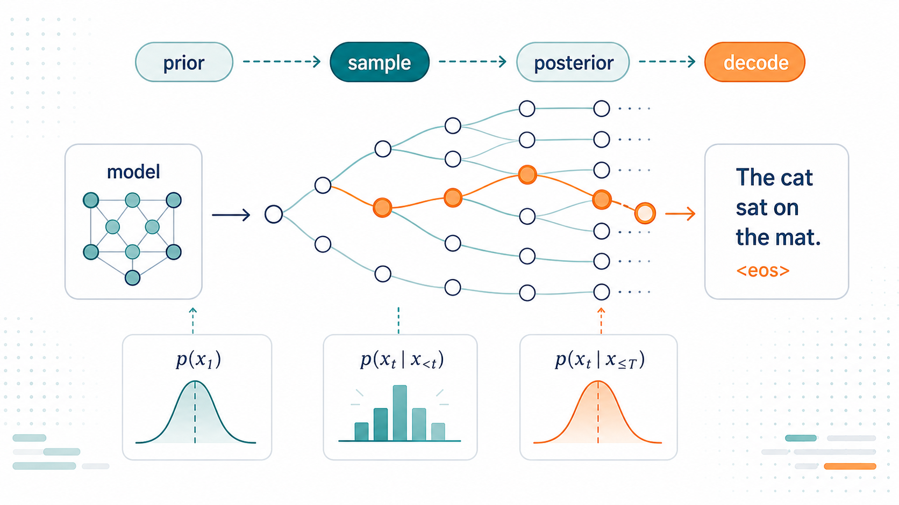
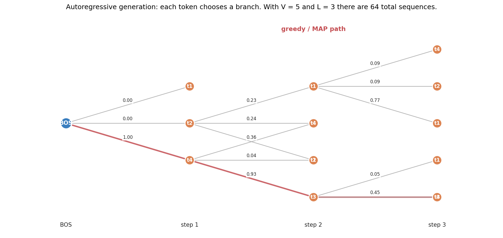
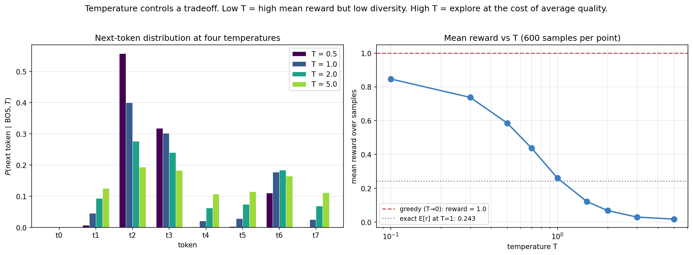
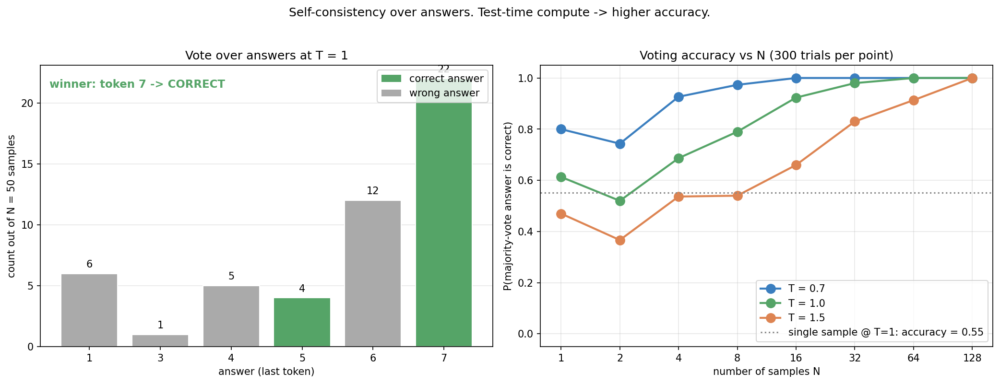
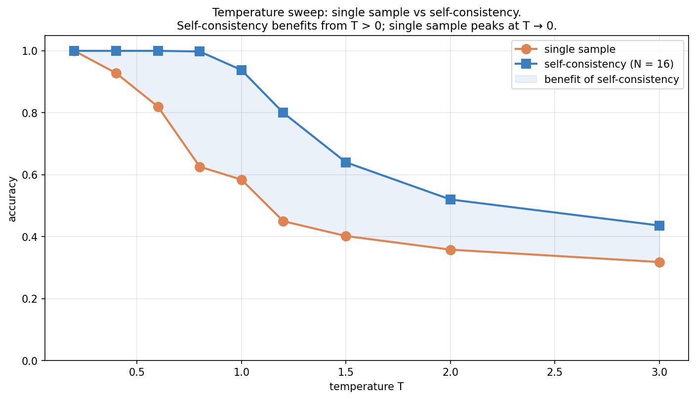
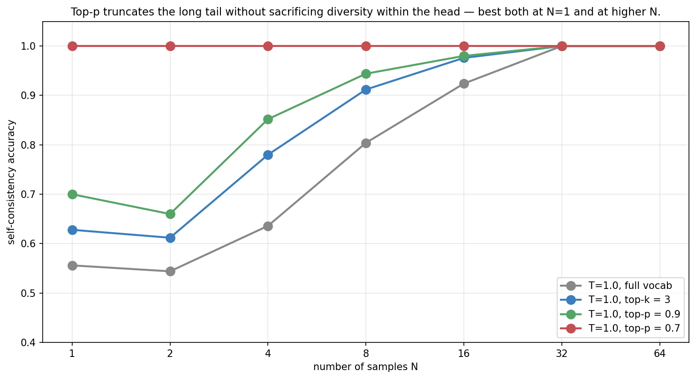
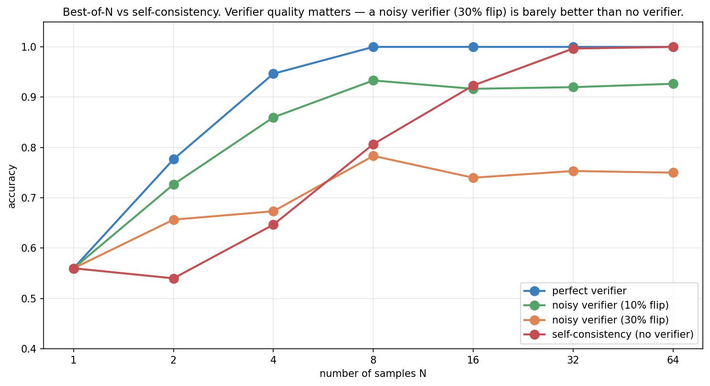

> *Topic 3, post 1 of 3.*

Topics 1 and 2 were about *training* a policy. By the end of [Post 2d](02d-rlhf-dpo-grpo.qmd), we had the full algorithmic stack — from the log-derivative trick through REINFORCE, A2C+GAE, PPO, and RLHF/DPO/GRPO — for fitting a language model policy to human preferences or verifier signals.

Topic 3 is about what to do with that policy once you have it. This post starts with the most basic operation: **decoding** — turning a trained model into actual text. It is worth being concrete about what that involves, because the whole post hinges on it. At each position, a language model does not output a word. It outputs a vector of **logits** — one real number per vocabulary token, perhaps 50,000 of them — which a softmax turns into a full probability distribution over what the next token could be. To produce text we must repeatedly *collapse* that distribution into a single chosen token, append it, and run the model again. **Decoding is the rule for doing the collapsing.** Take the most probable token every time? Sample in proportion to probability? Keep several candidate sequences alive at once? Each rule is a different decoder, and — crucially — the choice of rule is entirely separate from the trained weights. The same model, decoded two different ways, can be eloquent or degenerate, reliable or creative. That the seemingly mundane choice of *how* to collapse is one of the most consequential design decisions in modern AI systems is the surprise this post unpacks.

The thesis: **decoding is approximate inference**. The LM defines a distribution $\pi(y \mid x)$ over completions; every decoding strategy is some way of selecting from that distribution — approximating the **mode** (the single most probable completion), drawing a **sample from a tempered or truncated** version of it, or estimating a **marginal decision** such as the majority-vote answer. (Note we deliberately avoid saying "the mean": text has no natural average — there is no meaningful midpoint between two sentences — so the useful targets are high-probability sequences and marginal answer distributions, not a mean completion.) Once you see the family clearly, you can predict when each strategy will work, when it'll fail, and how to compose them.

---

## 0. Setup: the LM as a policy

A language model defines a conditional distribution

$$
\pi_\theta(y_1, y_2, \ldots, y_L \mid x) \;=\; \prod_{t=1}^{L} \pi_\theta(y_t \mid x, y_{<t}).
$$

Each token is drawn conditional on the prompt $x$ and all previous tokens — this factorization (the chain rule of probability) is what "autoregressive" means. It is exactly the policy form from Posts 2a–2c, with state = $(x, y_{<t})$ and action = $y_t$: the prompt-plus-history-so-far is the state, and the next token is the action. Decoding, then, is just *rolling out a policy* in this sequential decision process — and the decoding strategies below are the rollout rules.

The exponential branching is what makes decoding non-trivial. With a vocabulary of ~50,000 (a typical LLM) and 100-token responses, the space of sequences is $50000^{100}$ — far larger than any astronomical number you've heard of. We cannot enumerate. Every decoding strategy is some way of biasing search through this combinatorial space.

Throughout this post we work with a **tiny synthetic LM** ($V \approx 8$, $L \approx 4$) where we can enumerate all sequences and compute exact properties. The phenomena we'll demonstrate scale up to real LMs — the toy just lets us *see* them precisely.

---

## 1. Temperature

The most familiar knob. Given logits $z_v$ for each vocabulary token $v$, temperature $T$ rescales:

$$
\pi_T(v) \;=\; \frac{\exp(z_v / T)}{\sum_{v'} \exp(z_{v'} / T)}.
$$

Limits:

- $T \to 0$: $\pi_T$ concentrates on $\arg\max_v z_v$ — pure greedy.
- $T = 1$: the LM's own distribution.
- $T \to \infty$: uniform over the vocabulary.

This isn't only a presentation choice. There's a deeper connection: **temperature controls a Boltzmann distribution** $\pi_T(y) \propto \exp(r(y) / T)$. In statistical mechanics, $1/T$ is the *inverse temperature* $\beta$. Familiar?

You've seen exactly this in Post 2d §2.1 — the optimal RLHF policy is

$$
\pi^\star(y \mid x) \;\propto\; \pi_{\text{ref}}(y \mid x) \exp\!\left(\frac{r(y, x)}{\beta}\right).
$$

The RLHF training temperature $\beta$ and the inference-time temperature $T$ are **mathematically analogous but not the same object**, and it's worth being precise about the difference. Inference-time $T$ reshapes a *fixed*, already-trained model distribution — it changes only how sharply we sample, with the weights untouched. RLHF's $\beta$ is a coefficient *inside an optimization*: it sets the trade-off between maximizing reward and staying close to the reference policy during the KL-regularized training that *produces* the weights. Both have the Boltzmann form $\exp(\cdot/\text{temperature})$, and both implement "softer here, sharper there" — but one is a knob on a frozen distribution and the other is a knob on a training objective. The shared algebra is a real and useful connection; the equivalence is structural, not literal.

### 1.1 The diversity–quality tradeoff

Low $T$ gives high mean reward per sample but no diversity. High $T$ gives diverse samples but lower mean reward. The right-panel curve shows this monotonically — for a single sample, low $T$ wins.

But as we'll see in §5, **a single sample isn't always what we want.** If we can take many samples and aggregate, diversity becomes valuable, and the optimal $T$ shifts away from zero.

---

## 2. Top-k and top-p truncation

Temperature scales every logit. Sometimes we want to *truncate* — keep only the few most likely tokens and renormalize among them.

**Top-k**: keep the highest-probability $k$ tokens, zero out the rest, renormalize.

**Top-p (nucleus sampling)**: keep the smallest set of tokens whose cumulative probability is at least $p$, in descending order. The size of this set varies with the distribution shape.

Both are inference-time interventions on the same model — no retraining. They handle the "long tail" of low-probability tokens that would otherwise contribute generation noise.

The right panel makes the conceptual difference clear:

- **Top-k** truncates to a fixed *count* of tokens regardless of distribution shape. When the original distribution is peaked, this is fine; when it's flat, you're throwing away most of the probability mass arbitrarily.
- **Top-p** truncates to a target *probability mass*. The effective number of kept tokens adapts: many for flat distributions, few for peaked ones.

In practice, top-p ($p \in [0.9, 0.95]$) is the more common default in modern LLM systems. Combined with $T \in [0.7, 1.0]$, it forms the standard "creative generation" setup.

### 2.1 As Bayesian inference

Both truncations can be viewed as **conditioning on a truncated support** — restricting the distribution to a *set* of allowed tokens and renormalizing over it. Top-k says: "the answer is one of the top-$k$ tokens; renormalize over them." Top-p says: "the answer lies in the smallest set of tokens covering probability mass $p$; renormalize over that set." (This is conditioning on a set, not imposing a Dirac prior — a Dirac would put all mass on a *single* point, whereas truncation keeps a whole support set and rescales it.) What we sample from is the original distribution restricted and renormalized to that support.

This isn't just elegant. It tells us when truncation helps: when the long tail is mostly noise (low-confidence "wrong" tokens), truncating cleans up the distribution. When the long tail contains meaningful low-probability options, truncation hurts.

---

## 3. Beam search and the MAP collapse

Sampling explores the distribution. The opposite extreme is **search** — find the highest-probability sequence(s).

**Beam search** is the standard approximate MAP algorithm. Maintain $B$ candidate sequences ("beams") at each step. Expand each beam by all possible next tokens, score the $B \cdot V$ continuations by total log-probability, keep the top $B$. After $L$ steps, return the highest-log-probability sequence.

This is approximate because the true MAP would require enumerating $V^L$ sequences. Beam search keeps only $B$ at each step; sequences that look bad early but become great later get pruned. With $B = 1$ it's pure greedy.

Beam search is the default of most translation and summarization systems. The intuition seems sound: surely the *highest-probability* sequence is the best one?

It's not.

**The MAP collapse** is a robustly-observed phenomenon: for open-ended generation, the highest-log-prob sequence from a well-trained LM is often *worse* than typical samples — bland, repetitive, or otherwise degenerate. Framed precisely, it is a risk of **optimizing pure model likelihood**: the mode of the model distribution is not the same as a good answer, especially when the output space is open-ended and the model places spurious mass on safe, generic continuations. It was documented for neural machine translation (Stahlberg & Byrne 2019), open-ended generation (Holtzman et al. 2020), and reasoning (Wang et al. 2022).

This does *not* make beam search globally bad. On the contrary, beam search remains the workhorse for tasks with a constrained, well-defined target — machine translation, summarization, and other structured generation — especially when paired with length normalization, repetition or coverage penalties, and reranking. There the target distribution is peaked enough that high likelihood really does track quality, and the failure mode above is mild. The collapse bites hardest in open-ended generation, where likelihood and quality diverge.

The right panel makes the same point a different way: in **this synthetic LM**, beam search of any width (1, 3, 10, 50) gets stuck at the same MAP — wider beams give more candidates, but the top-1 by log-prob happens not to change here. In general this is *not* guaranteed: a wider beam preserves prefixes that a narrower beam would prune early, and one of those surviving prefixes can finish as a higher-log-prob sequence than anything the narrow beam kept — so beam width genuinely can change the returned sequence. What is robust is the deeper issue: pure-MAP decoding optimizes *model likelihood*, and for a well-trained LM the highest-likelihood sequence is often bland or degenerate. Sampling at $T=1$ has lower mean reward (0.11) because each individual sample is risky, but that variability is what lets us escape the MAP collapse via the next two sections.

### 3.1 Why MAP collapses

A trained LM optimizes likelihood, not quality. Two related forces produce the collapse:

1. **Long sequences with small probability per token.** A 100-token sequence with average per-token probability $0.5$ has joint probability $0.5^{100} \approx 10^{-30}$. MAP search prefers sequences that take less risk on each token — so it ends up producing short, common phrases that compound to a "safe" path.

2. **Approximation error in the LM.** The LM is trained on a finite dataset and assigns *some* probability to every continuation. The exact MAP often picks up these spurious high-probability paths that don't correspond to anything meaningful.

The fix is to either (a) regularize the search (e.g., length normalization, repetition penalty), (b) abandon MAP and sample, or (c) sample + rerank, which is the bridge to the next section.

---

## 4. Self-consistency

If sampling exposes us to diversity, **self-consistency** (Wang et al. 2022) aggregates it: sample $N$ completions, group them by some notion of "answer," and take the majority vote.

The setup: for a reasoning task, the "answer" is a specific token (the final answer to a math problem, the choice in a multiple-choice question, etc.). Different *reasoning paths* may lead to the same answer, and voting over reasoning paths reduces noise.

The right panel is one of the most important figures in this post. **Test-time accuracy scales with $N$**, and the rate depends on temperature:

- $T = 0.7$: starts at 0.80 accuracy, saturates by $N = 16$.
- $T = 1.0$: starts at 0.55, reaches near-perfect by $N = 64$.
- $T = 1.5$: starts at 0.45, takes $N = 128$ to saturate.

Higher temperature → more diverse samples → more compute needed to saturate → eventually still gets there.

### 4.1 The Monte Carlo connection

Self-consistency is **Monte Carlo estimation of the answer marginal**:

$$
P(\text{answer} = a \mid x) \;=\; \mathbb{E}_{y \sim \pi(\cdot \mid x)}[\mathbf{1}[\text{answer}(y) = a]].
$$

We sample $N$ trajectories from the policy, compute the indicator for each answer, and average. The majority vote returns $\arg\max_a \hat P(a)$, the empirical mode. With enough samples, $\hat P \to P$ and the mode converges to the true marginal mode.

This is *almost certainly* not the same as the MAP of the joint distribution over $y$. MAP picks the single most likely sequence; self-consistency picks the most likely *answer*, marginalizing out everything else. **The fact that these differ is exactly the MAP collapse.**

Why does the marginal mode beat the sequence mode? Because there are typically *many* reasoning paths to the right answer and *many different* paths to each wrong answer, so the right answer's probability is spread across — and summed over — a large set of correct derivations, while each individual wrong path may be locally fluent (high sequence-probability) but isolated. Marginalizing collects all the correct paths' mass onto one answer; MAP, fixated on the single highest-probability *string*, can land on a confident-but-wrong path whose answer few other paths share. There is a clean condition for when voting works: as long as the model places more marginal mass on the correct answer than on *any single* wrong answer, the empirical mode converges to correct as $N\to\infty$. This is a Condorcet-style result — you do *not* need each sample to be more-often-right-than-wrong overall, only that the correct answer is the *plurality* winner. It is exactly why a model with, say, 40% per-sample accuracy spread over one correct answer can reach near-100% with enough votes, provided the remaining 60% is fragmented across many wrong answers rather than concentrated on one.

The convergence rate is the standard Monte Carlo $1/\sqrt N$: the empirical answer frequencies approach the true marginal at that rate, so the probability of a wrong plurality decays roughly exponentially in $N$ once the correct answer leads. This is also why self-consistency shows diminishing returns — going from 4 to 16 samples helps far more than 64 to 256.

### 4.2 Connection to ensembling

Self-consistency is also exactly the same idea as ensembling in classical ML. Sample $N$ classifiers from your posterior; average their predictions. Reduces variance proportional to $1/N$ (for independent samples).

In LLMs, the "ensemble members" are different reasoning trajectories from a single model. The variance comes from sampling. The accuracy gain is the variance reduction.

---

## 5. Best-of-N: sampling + verifier

Self-consistency aggregates by voting. The alternative is to score each candidate with an external **verifier** and pick the highest-scored one. This is **best-of-N (BoN)**:

1. Sample $N$ candidates from the LM.
2. Score each with a verifier $V(\text{candidate})$.
3. Return $\arg\max_i V(y_i)$.

The verifier can be many things:

- A learned reward model (this is essentially RLHF inference: sample at high $T$, rerank with the RM).
- An executable check (unit tests for code generation).
- An external solver (a math checker).
- Another LLM scoring the candidate (LLM-as-judge).

When does BoN beat self-consistency? It depends on the verifier:

The crucial observation: **a noisy verifier doesn't just slow BoN down — it imposes an accuracy ceiling**. With 30% verifier-flip rate, BoN plateaus at 0.75 no matter how many candidates you sample, because some fraction of the time the verifier picks a wrong candidate that it mistakenly scored highly.

The mechanism behind the ceiling is worth making precise, because it is the opposite of voting's behaviour. As $N$ grows, BoN samples *more* candidates, which means more chances for the verifier to be fooled by a high-scoring wrong answer. Past a point, the bottleneck stops being "did we sample a correct candidate?" (almost surely yes, at large $N$) and becomes "did the verifier rank a correct one first?" — which is capped by the verifier's own reliability, independent of $N$. More samples can even *hurt*: a better verifier-fooling wrong answer is more likely to appear in a larger pool. So BoN's accuracy is bounded by verifier quality, and a sufficiently noisy verifier makes BoN *worse* than no verifier at all (just voting). This is the same lesson as the noisy-heuristic story in tree search (Post 3c §6): an unreliable evaluator that you trust completely is dangerous, while aggregation that *averages* over noise (voting) degrades gracefully.

Self-consistency, in contrast, has no such ceiling. As $N$ grows, the empirical answer distribution converges to the true marginal, and the vote winner converges to the right answer (as long as the LM puts more mass on the right answer than any single wrong answer).

This explains why both methods coexist in practice:

- For tasks with reliable verifiers (e.g., code generation with unit tests), BoN is dominant.
- For tasks without reliable verifiers (e.g., open-ended reasoning), self-consistency is more robust.

---

## 6. Test-time scaling: the deep connection

The big picture beneath everything above: **inference is computationally tunable**. We can spend more compute at test time and get better answers.

This is qualitatively different from training-time compute. When training, we adjust *parameters*. The compute is amortized over all future inference. When sampling, we generate *more candidates* per query. The compute scales linearly with calls.

Both can be productive. The recent "reasoning model" trend (OpenAI's o-series, DeepSeek-R1) clearly trades test-time compute for accuracy — longer chains of thought, and in many systems multiple sampled drafts with selection. The exact internal pipelines are not public, so we should be careful not to over-claim the specifics; but the *general* principle they exploit — spend more inference compute to raise accuracy — is exactly the principle this post makes precise, and the building blocks here (sampling, self-consistency, verification) are the vocabulary in which those systems are described.

### 6.1 Scaling laws at test time

A typical empirical observation:

$$
\text{error}(N) \approx \text{error}(\infty) + \frac{C}{N^\alpha}
$$

for some $\alpha \in [0.3, 1.0]$. Accuracy improves with $N$ but with diminishing returns. The exponent $\alpha$ depends on the task — easier tasks have higher $\alpha$ (faster saturation); harder ones have lower.

This is a power-law analog of the training-time scaling laws (Kaplan et al. 2020, Hoffmann et al. 2022). Both come from the same statistical structure: more samples → tighter Monte Carlo estimate → less error.

### 6.2 Composition

The most effective inference-time systems compose multiple strategies:

- Sample $N = 64$ candidates at $T = 0.7$, top-p = 0.9.
- Score each with a learned reward model.
- Re-sample $K = 16$ from the top-scored.
- Average / vote among them.

These compositions are the kind of thing behind headline results like "a strong base model with chain-of-thought plus self-consistency reaches ~95% on GSM8K." The exact recipe varies by report and the precise numbers depend on the model, but the qualitative decomposition holds: the base model's single-sample accuracy is substantially lower, and a large part of the rest is decoding — chain-of-thought to expose intermediate steps, then self-consistency or verification to aggregate over samples.

### 6.3 Forward connections

The next two posts of Topic 3 extend this thread:

- **Post 3b — Tool use as actions.** When the verifier becomes an executable check (compile/run/test), the loop tightens: the LM generates, the tool verifies, the LM refines. This is *agentic* behavior built on the inference-time tools we've introduced here.

- **Post 3c — Tree of Thoughts and MCTS.** What if instead of sampling N flat candidates we *search* through a tree of reasoning steps, expanding promising paths and pruning dead ends? This is decoding + search, and it is how systems built in the AlphaZero mould (such as AlphaProof) operate.

Both are continuations of the same idea — what we now know how to train, we can deploy more cleverly at inference time.

---

## 7. A practical decoder's guide

Pulling the post together into something you can act on. The right decoder depends on the task, because tasks differ in whether likelihood tracks quality and whether a verifier is available:

- **Creative / open-ended writing → top-p sampling** (e.g. $p \approx 0.9$, $T \approx 0.8$–$1.0$). You *want* diversity and you have no single correct target, so avoid MAP and sample from a truncated tail that drops the noise.
- **Exact-answer reasoning (math, multiple-choice) → self-consistency.** Sample several chains of thought at moderate $T$ and majority-vote the final answer; this estimates the answer marginal, which is exactly what you care about, and it needs no external verifier.
- **Code and anything with a checkable spec → best-of-N with execution.** When you can *run* candidates against tests, generate $N$ and keep the one that passes. The executable check is a near-perfect verifier, so best-of-N dominates here (§9.4).
- **Translation / summarization / structured generation → beam search with length normalization and reranking.** The target is constrained enough that high likelihood tracks quality, the MAP collapse is mild, and beam search with penalties is the established, strong choice.

The meta-point: match the decoder to whether your task has a verifier and whether its likelihood is trustworthy. There is no universally best decoder — only the best one for the structure of your problem.

---

## 8. Experiments to actually run

### 8.1 Temperature sweep with self-consistency

Sweep $T$ from 0.2 to 3.0. Plot both single-sample accuracy and self-consistency accuracy at $N = 16$. Where do they peak? Are they the same?

### 8.2 Beam width sweep

Vary beam width from 1 to 200. Show two things on the same plot: the top-1 reward (the actual output of beam search), and the *best* reward anywhere in the beam (what reranking by reward could find).

### 8.3 Top-k and top-p with self-consistency

Compare full-vocabulary $T=1$ to truncated $T=1$ at different cuts (top-k = 3, top-p = 0.9, top-p = 0.7). Does truncation help self-consistency, or hurt it?

### 8.4 Best-of-N vs self-consistency with imperfect verifiers

Sweep verifier quality from perfect to 30% flip rate. At what verifier quality does self-consistency overtake BoN?

---

## 9. Solutions

### 9.1 Temperature × self-consistency — `experiments/03a_sol1_temperature_sweep.py`

**What you should see.** The two curves tell complementary stories:

- **Single sample** peaks at low $T$ (~1.0 accuracy at $T = 0.2$) and decreases monotonically. This is the textbook "greedy is best" result for a single shot.
- **Self-consistency (N=16)** holds at 1.0 across $T \in [0.2, 0.8]$ — the easy regime where even a single sample is mostly right. Then it gracefully degrades, but stays above the single-sample line throughout.

The *gap* between the two curves (shaded region) is the **value of test-time compute**. It's tiny at low $T$ (because single-sample is already optimal) and large at moderate $T$. There's a sweet spot around $T = 0.8$ where:

- Single-sample is starting to fail (~0.63 accuracy).
- Self-consistency is still maxed out (~1.0).

Compute budget of 16 samples turns a 63%-accuracy generator into a 100%-accuracy one. That's the practical value of the technique.

**Why doesn't high $T$ break things?** Even at $T = 3.0$, self-consistency is still at 0.44 — better than single-sample at 0.32. The crucial property is that at any $T$, *the most likely answer in expectation* is still the correct one (assuming the LM is reasonably calibrated). Voting reveals that mode.

**The deeper lesson.** Temperature and test-time compute are *substitutes*. You can either dial T down to follow the MAP (cheap but capped at single-sample accuracy) or dial T up and use compute to aggregate (expensive but higher ceiling). Modern systems lean toward the latter because compute is increasingly cheap relative to model parameters.

### 9.2 Beam width sweep — `experiments/03a_sol2_beam_width_sweep.py`

**What you should see.** Two panels make the same point from different angles:

**Left (Top-1)**: Beam width has *no effect* on the top-1 output. Whatever the MAP is, that's what beam search returns regardless of $B$. For the "MAP collapses" LM, the top-1 is reward 0.2 for any $B$.

**Right (Best-in-beam)**: Wider beams *contain* sequences with higher reward. By $B = 5$, all three configurations have a reward-1 sequence somewhere in the beam. By $B = 50$, every beam contains good candidates.

**Why this matters.** Beam search alone is bad on mis-calibrated LMs. But beam search + reranking — use beam search as a candidate generator and rerank by reward — gets you the benefits without the MAP collapse.

This is exactly the recipe in many production code-generation systems: beam-search candidates, then test/rank each one, return the best.

**The deeper lesson.** Decoding strategies decompose into *generation* and *selection*. Beam search is one way to generate; argmax-by-logprob is one way to select. The two can be mixed and matched. Generation + reranking is consistently better than generation + take-first when you have access to any signal beyond log-probability.

### 9.3 Top-k / top-p × self-consistency — `experiments/03a_sol3_top_k_top_p.py`

**What you should see.** A clean ordering across all $N$:

- Top-p = 0.7: 100% accuracy at $N = 1$.
- Top-p = 0.9: 70% at $N = 1$, 100% by $N = 32$.
- Top-k = 3: 63% at $N = 1$, 100% by $N = 32$.
- Full vocab: 56% at $N = 1$, 100% by $N = 32$.

The most striking result: **tightening top-p from 0.9 to 0.7 single-handedly turns a 70%-accuracy decoder into a 100%-accuracy one**. No more samples, no reranking — just a tighter truncation.

**Why top-p beats top-k.** Adaptive truncation. On distributions where the LM is confident (entropy low), top-p = 0.7 keeps only the top 1-2 tokens. On distributions where it's uncertain, it expands to more. Top-k = 3 is the same width everywhere, which over-truncates confident contexts and under-truncates uncertain ones.

**Why all the truncated variants eventually reach 1.0.** Self-consistency exposes the underlying truth: as long as the *correct* answer has the highest marginal probability under the (truncated) generative process, enough samples will surface it. The truncation just affects how *fast* this happens.

**The deeper lesson — truncation is a regularizer.** It removes the model's least-confident predictions, which are also the most likely to be wrong. Truncation interacts with model calibration: a well-calibrated LM's tail is meaningful information, and truncation hurts; a miscalibrated LM's tail is noise, and truncation helps.

LLMs are typically *under-confident* in their tails (the noise interpretation). Real-world top-p values around 0.9–0.95 reflect this. Truncate less than that and the noise contributes; more than that and you lose actual options.

### 9.4 Best-of-N with imperfect verifiers — `experiments/03a_sol4_best_of_n.py`

**What you should see.** Four regimes:

- **Perfect verifier**: BoN is fastest. Saturates at N=8 with 1.0 accuracy.
- **10% flip verifier**: BoN still beats self-consistency at low $N$ (N≤8) but plateaus at 0.93 — there's a noise floor.
- **30% flip verifier**: BoN plateaus at 0.75. Self-consistency surpasses it at $N = 16$.
- **No verifier (self-consistency)**: Slowest start but no ceiling. Reaches 1.0 at $N = 64$.

**The bias-variance tradeoff in disguise.** A verifier is a high-bias, low-variance signal — each candidate gets one score, ranked once. Self-consistency is high-variance, low-bias — it averages over many noisy samples but converges to truth. At small $N$, low-variance (good verifier) wins. At large $N$, low-bias (no verifier) wins.

**Practical implication.** Whether to use BoN or self-consistency depends on:

1. **How good is your verifier?** Code tasks (perfect verifier via execution) → BoN. Open-ended reasoning (no verifier or LLM-as-judge with noise) → self-consistency.
2. **How much compute can you spend?** Small budgets favor BoN (better at low N). Large budgets favor self-consistency (better at high N).
3. **What's the cost of being wrong?** BoN's plateau is a hard ceiling. If you need >95% accuracy, you need a near-perfect verifier or you need self-consistency.

**The deeper lesson — combine them.** In practice, the strongest systems combine both: sample $N_{\text{big}}$ candidates, filter to $N_{\text{med}}$ with a verifier, vote among those. This gets you the high-quality candidate pool of BoN + the noise-averaging of self-consistency.

DeepSeek-R1's reasoning pipeline does exactly this. So does GPT-4's coding mode. The classical methods are alive and well — they're just nested inside bigger systems now.

---

## 10. Further reading

- **Holtzman, Buys, Du, Forbes & Choi, "The Curious Case of Neural Text Degeneration" (ICLR 2020).** The MAP-collapse paper for open-ended generation. Introduces nucleus sampling.
- **Wang, Wei, Schuurmans, Le, Chi, Narang, Chowdhery & Zhou, "Self-Consistency Improves Chain of Thought Reasoning in Language Models" (ICLR 2023).** The self-consistency paper.
- **Stahlberg & Byrne, "On NMT Search Errors and Model Errors: Cat Got Your Tongue?" (EMNLP 2019).** The empirical MAP-collapse paper for translation.
- **Eikema & Aziz, "Is MAP Decoding All You Need?" (COLING 2020).** A thorough survey of MAP vs sampling trade-offs.
- **Snell, Lee, Xu & Kumar, "Scaling LLM Test-Time Compute Optimally can be More Effective than Scaling Model Parameters" (2024).** Empirical study of test-time compute scaling.

---

**Next up — Post 3b: Tool use as actions.** When the LM can call out to tools (search, code execution, calculators), the inference loop tightens: generate → execute → refine. We'll see ReAct from scratch, treat tool use as an extended MDP, and connect back to the bandit/Q-learning framework from Topic 1. Verifiers and tools merge into a single concept: *external signals the LM can incorporate*.
