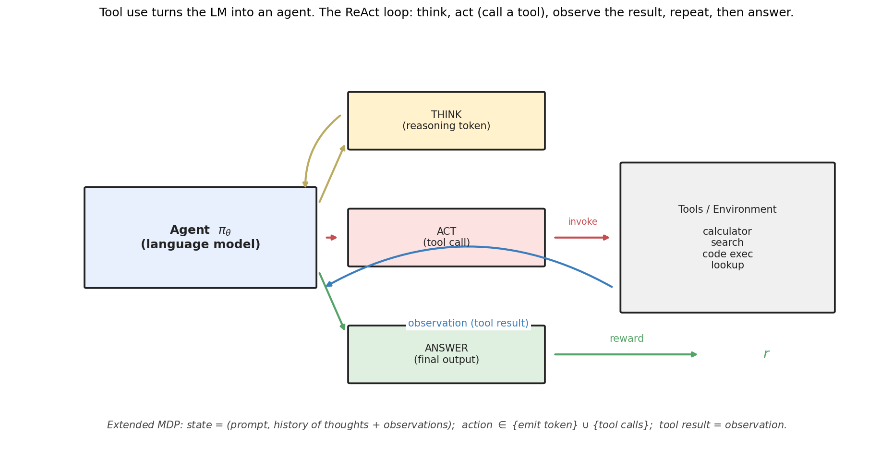
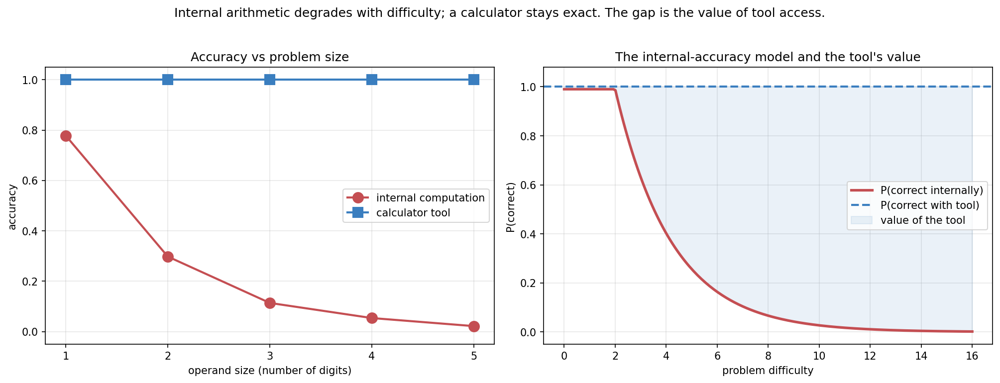
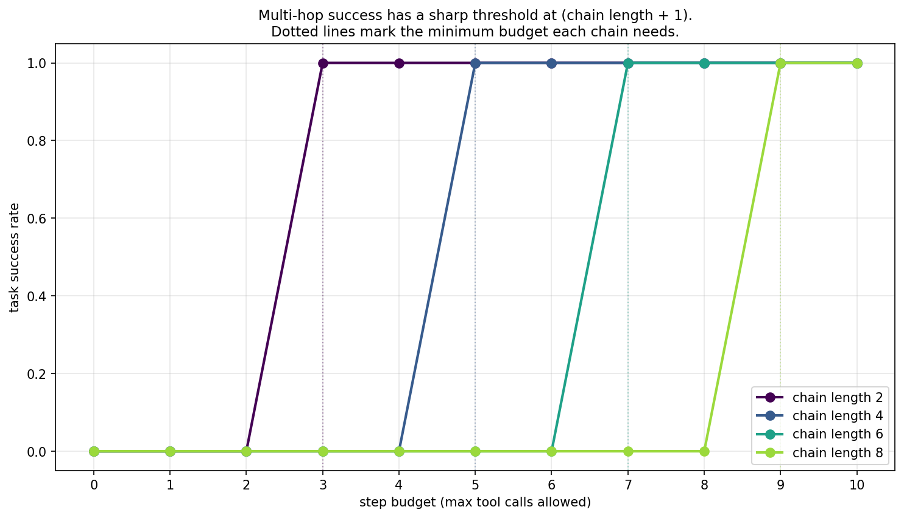
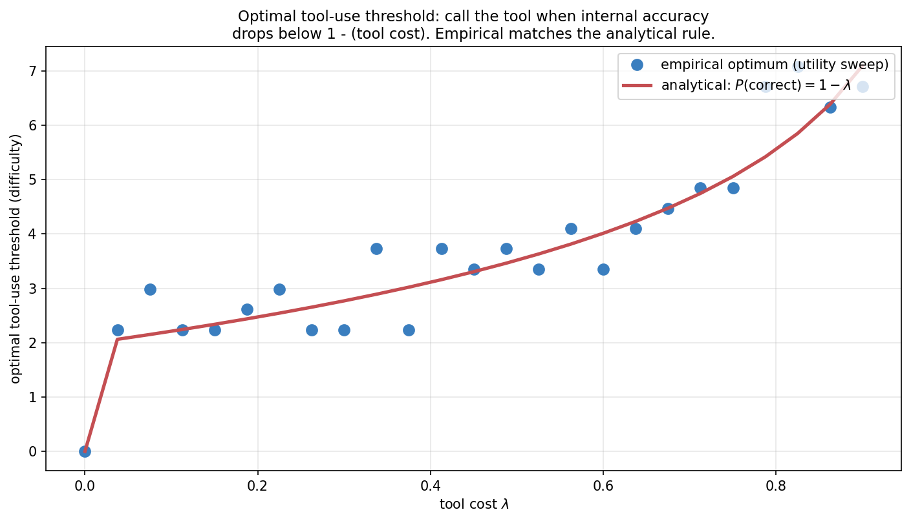
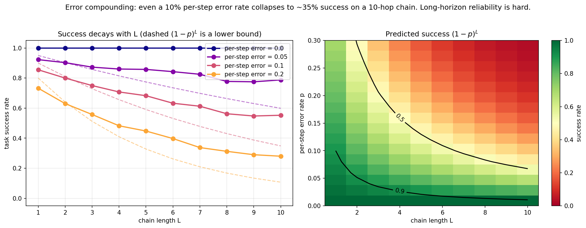

> *Topic 3, post 2 of 3.*

In [Post 3a](03a-decoding-as-inference.qmd) we treated a trained LM as a fixed distribution and asked how to sample from it well. The most powerful technique we found — best-of-N with a verifier — already hinted at something bigger: what if the "verifier" isn't just a passive scorer, but an active *tool* the model can call mid-generation? A calculator. A search engine. A Python interpreter. A database.

Once the model can call tools, something qualitative changes. It is no longer producing a single forward pass of text. It is **acting** — emitting an action, receiving a result from the world, and deciding what to do next based on that result. It has become an agent.

Why does this matter so much? Because it can relax the two hardest limits on a fixed language model, when used correctly. A model's weights are frozen and finite: it cannot know facts that postdate its training, and it cannot reliably execute precise procedures (arithmetic, code, lookups) that it only ever saw demonstrated. Tools can relax both limits — a search tool gives access to current information, a Python interpreter gives exact computation, a database gives ground truth — *provided the agent calls the right tool at the right time and uses what it returns correctly*. (As §8.3 shows, a badly-chosen or unreliable tool can make things worse, so "dissolve" would overstate it.) The model stops having to *be* an oracle and instead becomes a controller that knows *which* oracle to consult and how to use what it returns.

This post builds that agent loop from scratch. The thesis: **tool use turns the LM into an agent in an extended MDP**, and the entire framework from Topic 1 — states, actions, observations, rewards, the POMDP belief update — applies directly. We'll see the mechanism by which a text-only model calls a tool, implement ReAct (Yao et al. 2022), frame it as a POMDP, derive when a rational agent should call a tool, and confront the central difficulty of agents: errors compound over long horizons.

---

## 0. The agent loop

Before the framework, the mechanism — because it is less magical than it sounds. A language model can do exactly one thing: emit text, one token at a time. It cannot run code, query a database, or browse the web. So how does it "call" a calculator?

By convention. The model is prompted or fine-tuned to emit a specific structured string when it wants a tool — something like `Action: calculator[17 * 23]`. Around the model sits a **harness**: an ordinary program (not a neural network) that watches the generated text stream. When the harness recognizes the action pattern, it *pauses* generation, parses out the arguments, actually executes the real tool, and pastes the result back into the model's context as an observation — `Observation: 391`. Then it resumes generation. The model, reading its own context, now sees the observation as if it had always been there, and continues from it.

That loop — *model emits an action string → harness intercepts and executes → result appended to context → model continues* — is the entire mechanism of tool use. The intelligence is deliberately split: the model decides *what* to do and the harness does it. The model never executes anything; it orchestrates by emitting text that a program agrees to interpret. Modern "function calling" or "tool calling" APIs just formalize the convention — the model emits JSON conforming to a declared tool schema, and the harness dispatches on it — but the underlying loop is the same one ReAct introduced.

The textual scaffolding that makes this legible is the **Thought / Action / Observation** format. A ReAct transcript reads like a diary: the model writes a thought ("I should compute 17 times 23"), then an action (`calculator[17 * 23]`), the harness injects an observation (`391`), and the model writes its next thought conditioned on it. Reasoning and acting interleave, each informing the next. Abstractly:

**ReAct** — Reasoning + Acting — interleaves three kinds of step:

- **THINK**: an internal reasoning token. No effect on the environment; it updates the agent's own working memory.
- **ACT**: a tool call. The agent emits a structured action (e.g., `calculator(17, *, 23)`), the environment executes it, and returns an **observation**.
- **ANSWER**: the agent emits its final output. The episode ends; reward is assigned.

This is exactly an episode in a Markov Decision Process. Let's make the correspondence precise, because it's the whole point.

### 0.1 Tool use as a POMDP

The cleanest formal model is the **partially observable** MDP from [Post 1d](01d-pomdps-and-q-learning.qmd), because the thing the agent is reasoning about — the true answer, the actual state of the world — is hidden from it. Mapping the pieces:

- **Hidden state.** The true world/task state — the actual population of Paris, the real contents of the file, the correct answer. The agent never observes this directly; it is what the agent is trying to pin down.
- **Observations.** What the agent actually sees: the conversation history (prompt, prior thoughts) and the outputs returned by tools. These are partial, noisy evidence about the hidden state. The prompt-plus-history is the agent's *observation/context*, **not** the true MDP state — a distinction worth keeping, because conflating "what the agent has seen" with "how the world actually is" is exactly the error partial observability forces us to avoid.
- **Actions.** It is useful to work at the level of *semantic macro-actions* — `THINK` (an internal reasoning step), `ACT(tool, args)` (invoke a tool), and `ANSWER` (commit a final output) — rather than raw tokens. This is a layered picture: at the **token level** the LM only ever emits text; at the **harness level**, certain structured spans of that text are *interpreted* as tool calls or as a final answer. The macro-actions are the agent-level abstraction over the token-level emission.
- **Belief.** The agent's inferred representation of the hidden state, updated as observations arrive — implicitly carried in the transformer's activations over the growing context.
- **Reward.** Assigned at the `ANSWER` step (1 if correct, 0 otherwise, in the simplest case).

The augmentation that makes this *agentic* is in the action space: a vanilla LM's actions are just the vocabulary; a tool-using LM's macro-actions include calls that reach out into the world and return observations. Everything else — the policy, the trajectory, the return — carries over from Topic 2, now over a partially observed state.

### 0.2 The belief view

So the agent's job is to take actions (tool calls) that produce observations, accumulating enough evidence to answer. This is the POMDP belief-update structure of Post 1d: each observation refines the agent's belief about the hidden answer. To be careful about one phrasing, though — the **ReAct trace is not literally the belief; it is the evidence/history from which the model forms an implicit belief.** The written transcript of thoughts and observations is the *record of evidence*; the belief is whatever internal representation the model computes from that record when deciding its next action. Calling the trace "the belief" is a useful shorthand, but the trace is the data and the belief is the (approximate, learned) inference drawn from it.

We saw this in the Tiger problem (Post 1d): the agent listens (observes), updates its belief, and acts once confident. Tool use is the same loop with a richer observation space.

---

## 1. Why tools? The internal-accuracy cliff

The motivating empirical fact: LMs are unreliable at certain operations — multi-digit arithmetic being the canonical example — and tools are exact.

We model this with a synthetic agent whose internal arithmetic accuracy decays exponentially with problem difficulty:

$$
P(\text{correct internally} \mid \text{difficulty } d) = \alpha \cdot e^{-\lambda \max(d - d_0, 0)}.
$$

Small problems ($d \le d_0$): nearly always right. Large problems: nearly always wrong. A calculator tool, by contrast, returns the exact answer regardless of difficulty.

This is not a strawman. Real LLMs show exactly this profile: high accuracy on single-digit arithmetic, falling off a cliff as the operands grow, because they're pattern-matching rather than executing an algorithm. The fix isn't a bigger model — it's giving the model a calculator. The same logic extends to search (for facts beyond training data), code execution (for precise computation), and databases (for current information).

It is worth being precise about *why* the cliff exists, because it tells you which problems tools fix and which they don't. A transformer computes in a fixed number of forward-pass steps; multi-digit multiplication requires a number of sequential carry operations that grows with the operand size, so beyond some width the algorithm simply does not fit in the available depth, and the model falls back to interpolating between memorized patterns. The failure is *structural*, not a knowledge gap — which is exactly why scaling the model up shifts the cliff right but never removes it, while a calculator removes it entirely. The general principle: tools help most for tasks that are **precise, verifiable, and procedural** (arithmetic, lookups, code execution, unit conversions) — tasks where a short exact procedure exists that the model approximates poorly. They help *least* for tasks that are about judgment, synthesis, or fluency, where there is no external oracle to call and the model's own distribution is the best available answer. Knowing which side of that line a sub-task falls on is the first thing a good agent designer decides, and it is what the decision rule of §4 formalizes.

---

## 2. A ReAct trace

The multi-step structure is clearest on a **multi-hop** task: a question whose answer requires chaining several lookups. We use a small knowledge graph where entities are connected by typed relations (`next`, `parent`, `linked`), and each entity has a numeric `value`.

A task: "Starting from E0, follow `linked`, then `parent`, then `parent`, then read the `value`." No single lookup answers it — the agent must chain four tool calls, feeding each result into the next.

This trace is the heart of agentic behavior. Notice:

- The agent **threads state**: the observation E2 becomes the input to the next lookup `(E2, parent)`.
- It **cannot shortcut**: there's no way to answer without performing each hop, because the intermediate entities are hidden until queried.
- The reward is **sparse and terminal**: correct only if the entire chain executes correctly.

This is precisely the POMDP belief update. The agent starts knowing only E0. Each lookup is an action that yields an observation, collapsing uncertainty about the next entity in the chain. After four observations, the belief concentrates on the answer.

In a real system, the clean trace above hides a layer of unglamorous harness engineering that is the difference between a demo and a working agent. The model emits *text*, and text is messy: it may produce a malformed action (`lookup(E2` with a missing paren), hallucinate a tool that doesn't exist, pass arguments of the wrong type, or wrap the call in prose the parser doesn't expect. A production harness must therefore (a) parse defensively — typically constraining the model to a strict format (JSON matching a tool schema) and validating before executing; (b) handle tool errors as *observations* rather than crashes — when a lookup fails, the harness appends `Observation: error: unknown relation` and lets the model recover on the next step, exactly as a human would re-read an error message and retry; and (c) guard against loops, since a confused agent will happily call the same failing tool forever (hence the step budget of §3, which doubles as a safety cutoff). The ReAct format earns its keep here: because every action and observation is explicit text in the context, the agent can *see* its own error and correct it — error recovery is just more reasoning over a longer trace. This is also why modern tool-use APIs constrain generation to a schema: it moves the "is this a valid action?" check from fragile post-hoc parsing into the decoding process itself.

---

## 3. The step budget

Multi-hop tasks expose a basic resource constraint: an $L$-hop task needs at least $L$ tool calls. If the agent's step budget is smaller, it physically cannot complete the chain.

The phase transition is crisp. Below the required budget, success is zero — not low, *zero*, because the agent can't reach the answer. At and above, success is one (for the oracle policy).

The practical implication: **agent frameworks must budget steps for the hardest expected task**. Too few steps and hard tasks are unsolvable regardless of model quality. This is why production agent systems expose a `max_steps` or `max_iterations` parameter, and why setting it too low silently caps capability.

The "+1" in the threshold is the final `value` read — the chain of $L$ relations plus one attribute lookup. Different task structures have different constants, but the linear relationship between horizon and required budget is robust *in this synthetic multi-hop task*, where success is exactly zero below the required number of calls because every hop is mandatory and hidden. Real tasks are softer: a model may shortcut a chain with prior knowledge, a single retrieved document may contain several hops at once, or partial credit may be available — so the real-world version is "too small a budget caps capability," not a perfectly sharp zero-to-one cliff.

---

## 4. When should a rational agent call a tool?

Tools aren't free. Each call costs latency, tokens, money, and sometimes reliability. A rational agent should call a tool only when the expected benefit exceeds the cost.

Model the per-problem expected utility of each choice:

$$
U_{\text{internal}}(d) = P_{\text{internal}}(\text{correct} \mid d), \qquad U_{\text{tool}}(d) = P_{\text{tool}}(\text{correct} \mid d) - \lambda,
$$

where $\lambda$ is the cost of a tool call (in units of accuracy) and we allow the tool itself to be **imperfect**, succeeding with probability $P_{\text{tool}}(\text{correct} \mid d) \le 1$. The agent should call the tool exactly when $U_{\text{tool}} > U_{\text{internal}}$:

$$
P_{\text{tool}}(\text{correct} \mid d) - \lambda \;>\; P_{\text{internal}}(\text{correct} \mid d).
$$

The familiar **perfect-tool** rule is the special case $P_{\text{tool}} = 1$, which recovers $P_{\text{internal}}(\text{correct} \mid d) < 1 - \lambda$. Since internal accuracy decreases with difficulty, this is a **threshold rule**: call the tool when the problem is hard enough that the tool's expected accuracy advantage exceeds its cost. With a perfect tool the cutoff is exactly the difficulty at which internal accuracy drops to $1 - \lambda$; with a flaky tool the bar is higher, because the tool itself might be wrong (we see this bite in §8.3).

This is a clean, interpretable decision rule, and it falls right out of expected-utility maximization — the same logic as the bandit and MDP value comparisons from Topic 1. The agent is solving a tiny one-step decision problem at every turn: compute internally, or pay $\lambda$ for an exact answer.

---

## 5. The anatomy of real tool use

The toy uses one read-only lookup tool. Real agents juggle many tools, and two distinctions matter enough to change how you design the system.

### 5.1 Read tools vs write (effectful) tools

Tools split into two kinds with very different risk profiles. **Read tools** — search, retrieval, a calculator, a database query — only return information; calling one twice is harmless, and a wrong call costs only some wasted budget. **Write tools** — sending an email, executing a trade, deleting a file, posting to an API — *change the world*, and their effects cannot be retried away. This asymmetry should reshape the decision rule of §4: for a read tool, the cost $\lambda$ is just latency and tokens, so when in doubt, call it. For a write tool, the "cost" of a wrong call is unbounded and irreversible, so the bar for calling should be far higher — and many production agents insert a confirmation step (human-in-the-loop) before any effectful action. The error-compounding analysis of §8.2 is also far more dangerous for write tools: a wrong read is a detour, but a wrong write is damage. A useful design principle falls out of this: keep the agent's *default* loop in read-only tools (gather evidence freely), and gate the small number of write actions behind explicit confirmation or verification.

### 5.2 Which tool? Selection as part of the policy

The toy agent decides only *whether* to call its single tool. A real agent must also decide *which* of many tools to call and *with what arguments* — tool selection is itself part of the policy. Mechanically this is handled by giving the model a list of tool schemas (name, description, argument types) in its context and letting it emit a call naming one of them. Conceptually it is a routing problem: the model maps the current observation to a choice over an enlarged action set $\{\text{THINK}\} \cup \{\text{ANSWER}\} \cup \{\text{ACT}(\text{tool}_j, \text{args})\}_j$. More tools means a larger action space, which means more ways to choose wrong — so, as with the branching factor in tree search (Post 3c), a focused toolset the model understands well usually beats a sprawling one. The description text matters as much as the code: the model selects tools by reading their descriptions, so a poorly-described tool is an unusable one regardless of how well it works.

### 5.3 How models learn to use tools at all

We have described the *mechanism* of tool use, but where does the *ability* come from — how does a next-token predictor learn to emit a well-formed `Action:` at the right moment? Two routes, in increasing order of how much they bake the skill into the weights. The first is **few-shot prompting**: show the model a handful of ReAct exemplars in its context and rely on in-context learning to imitate the format. This works with capable base models and requires no training, but it is brittle — the model may drift out of format on long traces. The second is **fine-tuning on tool-use traces**, the route taken by Toolformer (Schick et al. 2023): generate or collect many transcripts in which tool calls appear at useful points, then train the model on them so that emitting and using tools becomes part of its learned behavior. Toolformer's clever twist is self-supervision — it inserts candidate API calls into text, keeps the ones that *reduce the model's loss* on the following tokens (i.e. the call actually helped predict what came next), and trains on those. This is the same "learn from a signal you can compute" idea that runs through the whole curriculum: here the signal is "did the tool call make the continuation more predictable?" Modern function-calling models combine both — instruction-tuned on large collections of tool-use traces, then prompted with task-specific schemas at inference time.

---

## 6. Forward connections

### 6.1 Tools and verifiers are the same thing

In Post 3a, best-of-N used a verifier to score candidates. Here, tools provide observations. These converge: **a tool that checks correctness is a verifier, and a verifier you can query mid-generation is a tool.** A code interpreter that runs unit tests is simultaneously (a) a tool the agent calls and (b) a verifier of the agent's output. The boundary dissolves.

This unification is why agentic coding works as well as it does: the compiler/test-runner is a perfect verifier *and* a perfect tool. The agent generates code, runs it, observes the failures, and refines — best-of-N and ReAct fused into one loop.

### 6.2 Toward search (Post 3c)

A ReAct trace is a single *path* through the space of action sequences. But at each step, the agent could have chosen differently — a different tool, a different query, a different reasoning branch. What if, instead of committing to one path, the agent *searched* over multiple branches, expanding promising ones and pruning dead ends?

That's Tree of Thoughts and MCTS for LLMs — the subject of Post 3c. It's the natural combination of this post's action-space view with the search techniques from classical RL (Post 1c's value iteration, the tree search underlying AlphaGo). Tool use gives us the action space; search gives us a smarter way to explore it.

### 6.3 The reliability problem

The deepest issue this post raises is in §8.2 below: errors compound. Under the simplest model — *independent* per-step errors where *any* single error is fatal — an agent with a 10% per-step error rate has only a $(1-0.1)^{10} \approx 35\%$ chance of correctly completing a 10-step task. Those two assumptions matter: real environments often allow recovery (a later step fixes an earlier slip) or redundancy (multiple paths to the answer), which softens the decay, so $(1-p)^L$ is best read as a worst-case lower bound. Even so, the exponential sensitivity to per-step reliability is *the* central challenge of long-horizon agents, and it motivates everything from self-verification to the planning methods of the next post.

---

## 7. Experiments to actually run

### 7.1 Optimal tool-use threshold

Derive and verify the rule "call the tool when internal accuracy < 1 − λ." Sweep the cost λ and check the empirically-optimal threshold against the analytical prediction.

### 7.2 Error compounding over chains

Sweep chain length and per-step error rate. How fast does success decay? Compare to the $(1-p)^L$ prediction.

### 7.3 Robustness to unreliable tools

Give the calculator an error rate. At what tool-error-rate does using the tool stop being worth it — and how does that depend on problem difficulty?

### 7.4 ReAct vs answer-immediately

Compare a tool-using agent to one that always answers from internal computation, across difficulty levels. Add a threshold agent and measure its tool-call savings.

---

## 8. Solutions

### 8.1 Optimal tool-use threshold — `experiments/03b_sol1_optimal_threshold.py`

**What you should see.** The empirical optimum — found by brute-force sweeping the threshold and picking the one that maximizes mean utility — lands right on the analytical curve derived in §4. As $\lambda \to 0$ (free tools), the threshold goes to zero: always use the tool. As $\lambda$ grows, the threshold rises: only call the tool for problems hard enough that internal accuracy has dropped below $1 - \lambda$.

The discretization scatter comes from the finite candidate-threshold grid and the difficulty being a discrete-ish quantity (digit counts), but the trend is unmistakable.

**The deeper lesson.** Tool-use decisions are *expected-value calculations*, identical in structure to the action-value comparisons of Topic 1. The agent doesn't need a separate "should I use a tool" module — it needs to estimate its own reliability and compare it to the tool's cost. This is why **calibration** (knowing what you don't know, the subject of Topic 4) is foundational for agents: an agent that's miscalibrated about its internal accuracy will call tools at the wrong times.

### 8.2 Error compounding — `experiments/03b_sol2_chain_length.py`

**What you should see.** Success decays roughly geometrically with chain length. A perfect agent ($p=0$) stays at 1.0. But even a small per-step error rate compounds:

- $p = 0.05$: a 10-hop chain succeeds ~80% of the time empirically.
- $p = 0.1$: ~55%.
- $p = 0.2$: ~28%.

**The honest finding: the empirical curves sit *above* the $(1-p)^L$ prediction.** In a finite graph, a wrong relation sometimes lands on the correct next entity by coincidence, or reaches a different entity that happens to share the same terminal value. So $(1-p)^L$ is a *lower bound* on success — reality is more forgiving than the worst case, because not every error is fatal.

This is itself a useful lesson: the clean exponential model assumes every mistake derails the whole chain. Real environments often have redundancy or recoverability that softens the decay. But the qualitative story — exponential sensitivity to per-step reliability — holds.

**The deeper lesson.** This is *the* reason long-horizon agents are hard. To complete a 20-step task at 90% success, you need a per-step error rate below ~0.5%. Current LLMs are nowhere near that on open-ended steps. Everything in modern agent engineering — self-verification, retrying failed steps, decomposition into checkpoints, human-in-the-loop — is an attempt to fight this exponential. The next post's planning methods are another weapon: search lets the agent recover from a bad step by exploring alternatives rather than committing to the first choice.

### 8.3 Robustness to unreliable tools — `experiments/03b_sol3_tool_errors.py`

**What you should see.** The tool's accuracy is just $1 - \text{error rate}$, independent of problem difficulty. The internal baselines depend strongly on difficulty: 80% on easy 1-digit problems, ~1% on hard 5-digit ones.

The crossover (the green X) tells the story: on **easy** problems, a tool with >20% error rate is *worse* than just computing internally — you'd be better off not calling it. On **hard** problems, even a 50%-error tool crushes the ~1% internal baseline.

**The deeper lesson.** Tool use isn't unconditionally good. The value of a tool is `(tool accuracy − internal accuracy)`, and that can be *negative* when the tool is unreliable and the task is easy. A well-designed agent should weigh tool reliability against its own competence per task. This is why blindly routing everything through tools (or through a flaky external API) can hurt — and why the threshold policy of §4 should really threshold on *expected accuracy gain*, not just difficulty.

### 8.4 ReAct vs answer-immediately — `experiments/03b_sol4_react_vs_immediate.py`

**What you should see.** The answer-immediately agent tracks the internal-accuracy cliff exactly — fine on trivial problems, useless on hard ones. Both ReAct agents stay near-perfect across all difficulties.

The interesting comparison is between the two ReAct variants. The **always-tool** agent calls the calculator on every problem (cost = 1.0 per problem). The **threshold** agent (`difficulty ≥ 4`) matches its accuracy while calling the tool only ~30% of the time on easy problems — it solves trivial arithmetic internally and reserves the tool for cases that need it.

**The deeper lesson.** The best agent isn't the one that uses tools the most; it's the one that uses them *when warranted*. On easy problems, internal computation is free and accurate, so calling a tool is pure overhead. On hard problems, the tool is essential. The threshold policy captures this, and it generalizes: a good agent routes each sub-task to the cheapest method that's reliable enough. This is the seed of the "router" pattern in modern agent systems — cheap model for easy turns, expensive model or tool for hard ones.

---

## 9. Further reading

- **Yao, Zhao, Yu, Du, Shafran, Narasimhan & Cao, "ReAct: Synergizing Reasoning and Acting in Language Models" (ICLR 2023).** The ReAct paper.
- **Schick, Dwivedi-Yu, Dessì, Raileanu, Lomeli, Zettlemoyer, Cancedda & Scialom, "Toolformer: Language Models Can Teach Themselves to Use Tools" (NeurIPS 2023).** Self-supervised tool-use learning.
- **Parisi, Zhao & Fiedel, "TALM: Tool Augmented Language Models" (2022).** An early tool-augmentation framework.
- **Mialon et al., "Augmented Language Models: a Survey" (TMLR 2023).** Broad survey of tool use, reasoning, and acting.
- **Kahneman, *Thinking, Fast and Slow* (2011).** The System 1 / System 2 distinction is a useful lens: internal computation is System 1, tool use is the agent invoking deliberate System 2 machinery.

---

**Next up — Post 3c: Tree of Thoughts and MCTS for LLMs.** A ReAct trace is a single path; what if the agent searches over many? We'll combine the action-space view from this post with the tree search behind AlphaGo, building Tree of Thoughts and a lightweight MCTS over reasoning steps — and confronting the error-compounding problem head-on with search-based recovery.
