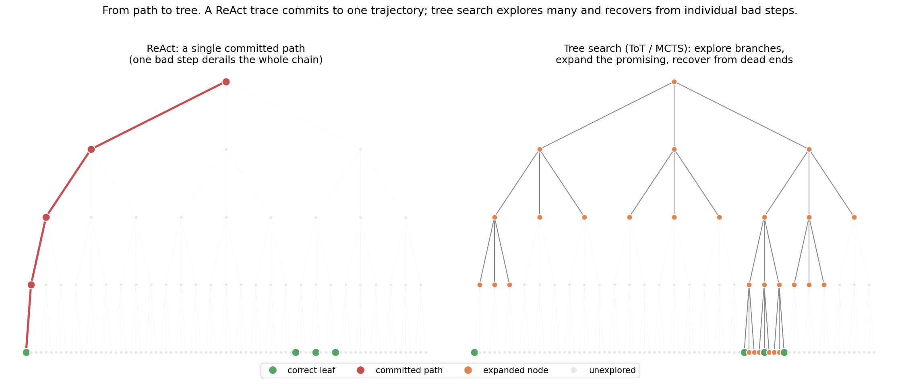
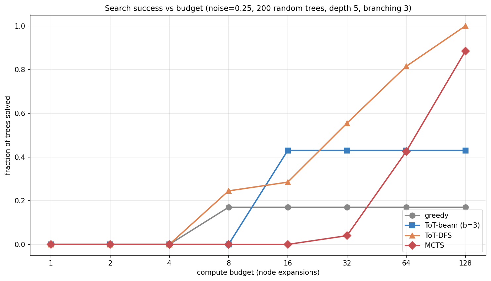
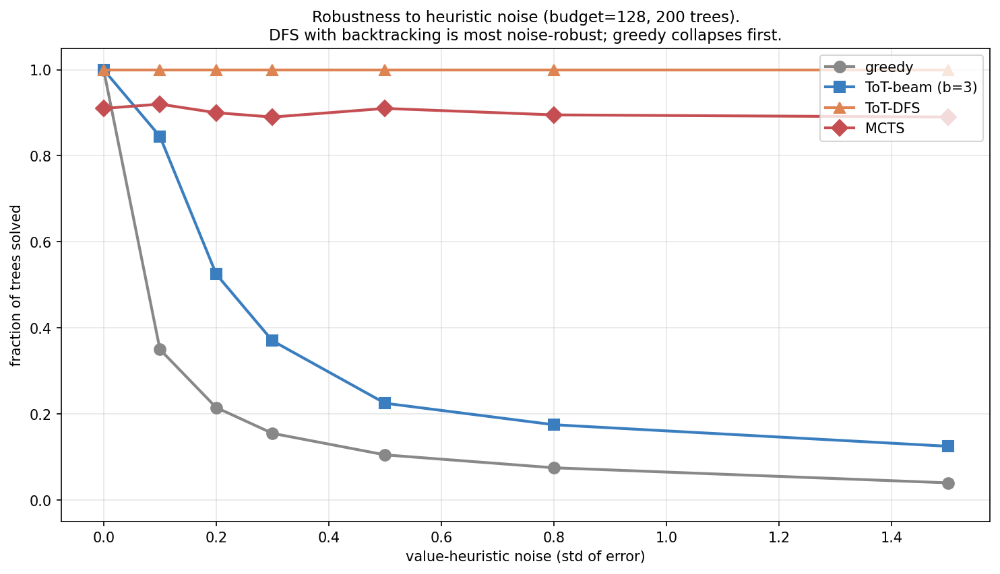
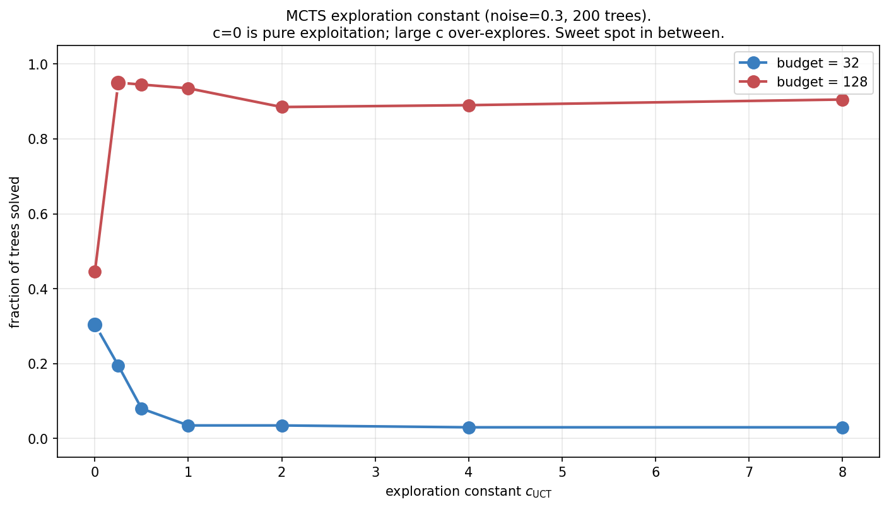
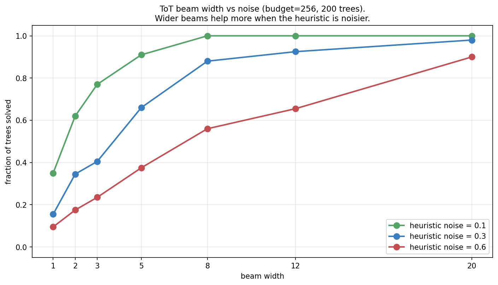

> *Topic 3, post 3 of 3.*

[Post 3b](03b-tool-use.qmd) ended on a sobering note. A ReAct agent reasons and acts along a single trajectory, and its success decays as $(1-p)^L$ with the number of steps $L$. Even a small per-step error rate compounds into near-certain failure on a long horizon. We called this the central challenge of long-horizon agents.

This post is the antidote. The idea is simple to state and powerful in practice: **instead of committing to one reasoning path, search over a tree of them.** When a step goes wrong, don't carry the mistake to the end — backtrack and try a different branch. When several continuations look plausible, explore the promising ones in parallel and let evidence decide.

This is **Tree of Thoughts** (Yao et al. 2023) and, in its most powerful form, **Monte Carlo Tree Search (MCTS)** — the search procedure at the heart of AlphaGo and AlphaZero, here applied to LLM reasoning. It is the natural culmination of Topic 3: we combine the action-space view from Post 3b with the classical tree search that descends from the value iteration of [Post 1c](01c-mdps-and-bellman.qmd) and the bandit exploration of [Post 1a](01a-multi-armed-bandits.qmd), and we attack error-compounding head-on. By the end we will have built, from scratch, every component of the search half of the AlphaZero template — and we will be honest about where search helps, where it doesn't, and what it costs.

---

## 0. From path to tree

Model reasoning as a tree:

- The **root** is the problem statement.
- Each **edge** is one reasoning step — a "thought." From any node there are up to $K$ possible next thoughts (the **branching factor**).
- A **path** of length $D$ (the **depth**) reaches a **leaf**: a complete chain of reasoning ending in an answer.
- Some leaves are **correct** (reward 1); most are wrong (reward 0).

A ReAct trace is a single root-to-leaf path. Greedy decoding picks the highest-probability next thought at each step and never reconsiders. That is the left panel: efficient, but one wrong turn is fatal — and the deeper the reasoning, the likelier that at least one turn goes wrong.

Tree search is the right panel: maintain multiple candidate nodes, expand the promising ones, and — crucially — *backtrack* when a branch turns out to be a dead end. The cost is compute (more nodes expanded); the benefit is robustness against any single mistake.

### 0.1 A concrete tree: the Game of 24

The abstraction is easier to hold onto with the canonical example from the Tree-of-Thoughts paper: the **Game of 24**. You are given four numbers — say `4, 9, 10, 13` — and must combine them with $+, -, \times, \div$ to make 24. It is a genuine search problem: most combinations fail, and a wrong early move quietly forecloses every solution downstream.

Here a *thought* is one arithmetic step that consumes two numbers and produces one. From the root `{4, 9, 10, 13}`, candidate thoughts include `13 - 9 = 4` (leaving `{4, 4, 10}`), `10 - 4 = 6` (leaving `{6, 9, 13}`), `4 × 9 = 36` (leaving `{36, 10, 13}`), and so on — that branching is the $K$ above. Three thoughts in, you have collapsed four numbers to one; if it equals 24 the leaf is correct. A solution path is `13 - 9 = 4`, then `10 - 4 = 6`, then `4 × 6 = 24`. Greedy chain-of-thought commits to whichever first step *looks* best and is stuck if it was wrong. Tree search tries `13 - 9` first, and if the subtree beneath it dead-ends, backtracks and tries `10 - 4` instead.

### 0.2 What the tree physically is

The tree is not a data structure handed to us — it is generated on the fly by the LLM. To produce the (up to) $K$ children of a node, you prompt the LLM $K$ times — with temperature, so the samples differ — asking for the next reasoning step given the partial solution so far; the distinct continuations *are* the children. To evaluate a node, you either ask the LLM to rate the partial solution ("is this on track to reach 24? sure / maybe / impossible") or roll out random completions from it and check how many reach a correct answer. So tree-of-thoughts search is a loop of three LLM-driven operations — **propose** candidate next steps (sampling), **evaluate** how promising each is (self-rating or rollout), and **decide** which to expand next (the search algorithm) — with the LLM serving as both the branch generator and, usually, the evaluator.

This is also why the branching factor is a *design choice*, not a given: it is however many candidate continuations you ask the model to generate. We will see in §10.4 that this choice has real consequences — wider is not automatically better.

Throughout, we replace the real LLM with a synthetic `ReasoningTree` small enough to enumerate, where each node has a known **true value** — the fraction of correct leaves in its subtree, equivalently $P(\text{a random completion from here succeeds})$. Knowing the ground-truth value of every node lets us measure each search algorithm against an oracle and ask precise questions ("how much does heuristic noise cost?") that would be impossible to answer with a real, opaque LLM. A search algorithm tries to find a correct leaf by climbing this value gradient, guided only by a **noisy value heuristic** — the stand-in for an LLM's imperfect self-evaluation, defined next.

---

## 1. The value heuristic: where does it come from?

Search needs to estimate how promising a node is *without* expanding its whole subtree. That estimate is the **value heuristic** $\hat v(\text{node}) \approx P(\text{a correct leaf lies below this node})$, and everything downstream depends on its quality. A perfect heuristic turns search trivial — just follow the gradient to a correct leaf. A useless one reduces every algorithm to blind enumeration. Real heuristics live in between, and the entire art of search-augmented reasoning is coping with their noise. Two sources are used in practice, and they trade off bias against compute in opposite ways.

**A learned value model (low variance, fixed bias).** Train a model to predict $P(\text{success})$ from a partial reasoning state — or, with an LLM, simply ask it: "rate how promising this partial solution is." This is one cheap query per node, but its quality is fixed at whatever the model learned; it cannot be improved at inference time by spending more compute. In the LLM-reasoning literature this learned scorer comes in two flavours worth distinguishing. An **outcome reward model (ORM)** judges only complete solutions — did the final answer check out? A **process reward model (PRM)** scores each intermediate step — is this line of the derivation valid? PRMs are exactly value heuristics for partial states, which is what tree search wants: they let you prune a bad branch *before* paying to expand it to a leaf. We model the learned heuristic as the true value plus Gaussian noise, with $\sigma$ the knob for how good the scorer is:
$$
\hat v(\text{node}) = \mathrm{clip}\big(v_{\text{true}}(\text{node}) + \mathcal{N}(0, \sigma), \; 0, \; 1\big).
$$

**Monte Carlo rollouts (unbiased, high variance, compute-hungry).** From a node, sample $k$ random completions to leaves and average their rewards. This is an unbiased estimate of the true value, with no training required, and its accuracy improves with $k$ — but each rollout is itself a sequence of LLM calls, so a $k$-rollout estimate costs $k$ times as much per node. This is the "simulation" step of classic MCTS, and it is essentially the self-consistency idea from [Post 3a](03a-decoding-as-inference.qmd) repurposed as a value estimate: sample several completions, let their average vote on how good the starting node was.

Notice the verifier from Post 3a reappearing here in a new role. There, a verifier *re-ranked* finished candidates (best-of-N). Here, a value model *guides* the search before candidates are finished. Same object — a function that scores a (partial) solution — used at two different points in the pipeline. We compare the two value sources head-to-head in §10.3; the headline is that rollouts trade compute for accuracy and, with enough of them, match or beat a fixed learned model.

---

## 2. What "budget" counts: the cost model

Every figure in this post plots success against a **budget**, so it is worth being precise about what that budget buys — especially because, as the reader of an earlier draft rightly noted, BFS, DFS, rollouts, and MCTS have genuinely different cost profiles.

Our unit of budget is the **node expansion**: generating and evaluating the children of one node. We pick this unit because, with a real LLM, expanding a node means prompting the model to propose its next thoughts and to score them — and that LLM call dominates the cost of everything else (the bookkeeping of the search algorithm is free by comparison). One expansion $\approx$ one round of LLM calls per thought. Budgeting expansions is therefore budgeting LLM calls, which is what actually costs money and latency.

Three caveats keep the comparison honest:

- **MCTS counts iterations, not raw expansions.** Each MCTS iteration runs one selection–expansion–evaluation–backpropagation cycle and expands (at most) one node, so an iteration is close to one expansion. We budget iterations for MCTS; the per-iteration cost is comparable to one expansion elsewhere, but not identical, and you should read MCTS-vs-DFS comparisons as "same order of magnitude of LLM calls," not "exactly equal."
- **Rollout-based value multiplies the per-node cost.** If you evaluate each node with $k$ rollouts (§1), then a method run at "budget $B$" actually issues roughly $B \times k$ LLM calls. When §10.3 compares rollout value to a learned value head, the learned head is one call per node and the rollouts are $k$; a fair accounting must include that multiplier.
- **The spending *pattern* differs even when the total matches.** BFS spends its budget breadth-first (expand all $b$ frontier nodes per level); DFS spends it depth-first along one path, then backtracks; MCTS spreads it adaptively, pouring expansions into whichever region currently looks best. Same currency, very different distributions over the tree — which is exactly why they behave so differently below.

With the cost model fixed, the comparisons that follow are fair.

---

## 3. Tree of Thoughts: BFS and DFS

Tree of Thoughts (Yao et al. 2023) is the simplest family: systematically explore the tree, using the value heuristic to decide which nodes to keep and which to expand. The original paper instantiates it two ways.

**ToT-BFS (beam search over thoughts).** Keep the top $b$ nodes at each depth, ranked by heuristic value. Expand all of them, score their children, keep the best $b$, descend to the next level. This is exactly the beam search from [Post 3a](03a-decoding-as-inference.qmd) — but over reasoning *steps* rather than tokens, and ranked by a *value heuristic* rather than log-probability. The beam width $b$ is the breadth of the search: a wider beam keeps more candidates alive and so is more robust to a heuristic that occasionally mis-ranks the true-best node (we quantify this in §10.2). BFS suits problems with a fixed, shallow number of steps where you want to compare several partial solutions side by side at each stage — the Game of 24, where every solution is exactly three thoughts deep, is a natural fit.

**ToT-DFS (depth-first with backtracking and pruning).** Visit the most promising child first (value-ordered), descend until you reach a leaf or a node the heuristic deems hopeless (value below a **pruning threshold**), then backtrack and try the next-best sibling. The pruning threshold is what makes DFS efficient: a branch the value model is confident about being a dead end is abandoned without expanding it fully. With enough budget DFS will exhaustively explore the reachable tree, so on small trees it is remarkably strong — backtracking guarantees it can never get *permanently* stuck, only slowed. DFS suits problems where solutions may sit at varying depths and you want to commit to a line of reasoning, follow it, and abandon it cleanly if it fails — mini-crosswords, in the original paper.

The key difference from greedy chain-of-thought is the same for both: they keep alternatives alive. **Greedy commits; ToT recovers.** Greedy throws away every path but one at each step; ToT retains enough of the frontier that a single bad evaluation costs a detour, not the whole solution.

---

## 4. MCTS: search guided by exploration

For large trees, exhaustive DFS is infeasible and a fixed beam is too rigid — you would either set $b$ too small and miss the solution, or too large and blow the budget on unpromising branches. **Monte Carlo Tree Search** allocates expansions *adaptively*, pouring compute into whichever part of the tree currently looks most worth investigating, using the exact exploration–exploitation logic of the bandit algorithms from [Post 1a](01a-multi-armed-bandits.qmd).

### 4.1 Two values per node — keep them straight

This is the point an earlier draft got wrong, and it is worth stating carefully because it is the crux of why MCTS works. Every node $c$ in the search tree carries two statistics, accumulated as the search runs:

- a **visit count** $N(c)$ — how many iterations have passed through $c$, and
- a **cumulative value** $W(c)$ — the sum of all evaluation results that have flowed back through $c$.

From these we form the **backed-up empirical value**
$$
Q(c) \;=\; \frac{W(c)}{N(c)},
$$
the running *mean* of every evaluation that has ever passed through $c$. This is distinct from the one-shot **heuristic value** $\hat v(c)$ of §1, which is the estimate produced when a node is first evaluated. The relationship is: $\hat v$ is the raw signal computed at a leaf or newly-expanded node; $Q$ is the accumulated average of many such signals, backed up the tree. As a node is visited more, $Q(c)$ averages over more evidence and becomes more reliable than any single $\hat v$. **MCTS makes decisions using $Q$, not $\hat v$.**

### 4.2 The four phases

Each MCTS iteration runs four phases:

1. **Selection.** From the root, descend by the **UCT** rule, at each step picking the child that maximizes
$$
\text{UCT}(c) \;=\; \underbrace{Q(c)}_{\text{exploit}} \;+\; c_{\text{UCT}} \underbrace{\sqrt{\frac{\ln N(\text{parent})}{N(c)}}}_{\text{explore}}.
$$
The first term — the *backed-up empirical value* — favours children that have looked good on average so far. The second favours children that have been visited little (small $N(c)$), so their value is still uncertain. Unvisited children ($N(c)=0$) are taken first. This is precisely **UCB1** from [Post 1a §4](01a-multi-armed-bandits.qmd), now applied at every node of the tree.
2. **Expansion.** On reaching a node whose children have not yet been generated, expand it: generate its children (one round of "propose" calls to the LLM).
3. **Evaluation.** Estimate the value of the newly reached node with the *heuristic* $\hat v$ — a learned-value query or a rollout (§1). If the node is a leaf, use its true reward instead. This single number is the iteration's fresh evidence.
4. **Backpropagation.** Walk back from the evaluated node to the root; for every node on the path, increment $N$ by one and add the evaluation result to $W$. This is what turns a one-shot $\hat v$ into the backed-up $Q$ along the whole path.

After the budget is spent, **commit to the most-visited child at each step from the root** — not the highest-$Q$ child. The visit count is the more robust signal: a child accrues visits only by repeatedly winning the UCT comparison across many iterations, so a high $N$ means the node looked good *under sustained scrutiny*, whereas a high $Q$ from few visits could be a lucky single evaluation. This "robust child" commit rule is the standard one in AlphaGo-style systems, and it is why §10.1's good runs hinge on accumulating visits, not chasing the momentary best score.

### 4.3 Why this is bandits, stacked

The UCT rule is the bridge from Topic 1. Selecting among a node's children is a multi-armed bandit problem: each child is an arm, $Q(c)$ is its running mean reward, $N(c)$ is the number of pulls, and UCB1 governs the explore/exploit tradeoff. MCTS is bandit algorithms nested into a tree, one bandit per internal node, all sharing a budget. The exploration constant $c_{\text{UCT}}$ is the same dial as the bandit's confidence width — and, as §10.1 shows, its best setting depends on the budget, exactly as the bandit's optimal exploration depended on the horizon.

### 4.4 The AlphaZero variant: adding a policy prior

One extension is worth flagging because it is what AlphaZero actually uses. Plain UCT explores purely by visit count. AlphaZero's **PUCT** rule adds a *policy prior* $P(c)$ — a probability the policy network assigns to each child — biasing exploration toward moves the policy already thinks are good:
$$
\text{PUCT}(c) \;=\; Q(c) \;+\; c_{\text{puct}}\, P(c)\, \frac{\sqrt{N(\text{parent})}}{1 + N(c)}.
$$
For LLM reasoning the prior is natural: it is the model's own probability for each candidate next thought (the log-probabilities from Post 3a). We don't implement PUCT in the toy — our branches are unlabelled by a prior — but it is a one-line change to the selection rule, and it is the mechanism by which a strong policy focuses the search.

---

## 5. How the strategies compare

With the cost model of §2 fixing the x-axis, two groups emerge:

- **Greedy and fixed-beam plateau.** Greedy makes one descent and stops — extra budget is wasted because it has no mechanism to reconsider. Beam with $b=3$ explores a fixed slice of the tree and saturates once that slice is exhausted; a wider slice needs a wider $b$, set in advance.
- **DFS and MCTS keep improving with budget.** Both can revisit and explore more of the tree, so additional compute translates into additional success.

On these small trees, **DFS actually beats MCTS**. Exhaustive backtracking is hard to beat when the tree is small enough to mostly cover, and DFS has no exploration overhead — it never "wastes" a visit re-checking a branch it has already characterized. This is an honest and important caveat: MCTS is not magic. Its advantage appears at *scale*, where the tree is far too large to enumerate and the value of pouring compute adaptively into the best region — rather than methodically sweeping — finally dominates. On a problem you can nearly cover by brute force, a good DFS is the simpler and stronger choice.

---

## 6. Why search helps: noise robustness and error recovery

### 6.1 Robustness to a noisy heuristic

The value heuristic is never perfect — and for an LLM rating its own half-finished reasoning, it can be quite poor. So the right question is not "how does each method do with a perfect guide?" but "how gracefully does each degrade as the guide gets noisier?" As $\sigma$ grows:

- **Greedy collapses fastest.** One noisy evaluation sends it down a dead branch with no recovery; its success tracks the probability that *every* step's noisiest moment didn't mislead it, which falls off a cliff.
- **Beam degrades** — a fixed width can absorb a little mis-ranking but not a lot; past some noise the true-best node routinely falls outside the top $b$.
- **DFS and MCTS stay robust.** Backtracking (DFS) and exploration (MCTS) are both *recovery mechanisms*: a misleading value estimate costs some wasted expansions, not the whole run, because the algorithm retains the ability to come back and try what it skipped.

The lesson generalizes well beyond the toy: the algorithms with a way to *undo* a bad decision are the ones that tolerate unreliable guidance. Since LLM self-evaluations are exactly that — unreliable guidance — this robustness is the property that matters most in practice.

### 6.2 The payoff: defeating error compounding

This is the figure the whole topic has been building toward.

Recall Post 3b: a single path's success decays as $(1-p)^L$. The greedy curve here *is* that compounding — useless past depth 4. This was the wall Topic 3 kept running into.

Search **mitigates** the decay. DFS holds near-perfect success through depth 5 and stays an order of magnitude above greedy at depth 7. The recovery mechanism directly counteracts compounding: a wrong step is no longer fatal, because the search backs up and tries again, so the failure probability is no longer a product of per-step success rates but the much gentler "did *any* explored path succeed."

But note the honesty in the figure's title: search *mitigates*, it does not *defeat*. With a fixed budget and a tree that grows as $K^D$, even DFS eventually runs out of room — at depth 7 the tree has $3^7 = 2187$ leaves and a budget of 256 cannot cover enough of them. The deeper the reasoning, the more compute search needs, and the requirement grows with the tree. There is no free lunch: search converts compute into reliability, and exponentially large trees demand exponentially much compute to fully tame. What search buys is a far better *exchange rate* than a single path — not exemption from the exponential.

---

## 7. Search vs sampling: when is the tree worth it?

A fair question after [Post 3a](03a-decoding-as-inference.qmd), where self-consistency (sample $N$, take the mode) was a strong and very simple baseline: does structured tree search actually beat just sampling more?

The honest and slightly humbling result: **guided sampling — the simplest method that uses the heuristic at all — wins at low-to-moderate budgets.** Just biasing each random rollout toward higher-value children (a softmax over the heuristic at each step) is remarkably effective and far cheaper to implement than any tree search, with no backtracking machinery, no node bookkeeping, and trivial parallelism (the samples are independent).

Structured search (DFS, MCTS) pulls ahead only at high budgets, where exhaustive or near-exhaustive exploration becomes possible and systematic coverage finally pays off. This mirrors a robust real-world finding: self-consistency with a good model is a strong baseline that fancier search struggles to beat at modest compute. It echoes Post 3a's lesson that test-time compute and method sophistication are partial substitutes — you can often buy with raw samples what you would otherwise buy with algorithmic cleverness.

---

## 8. The AlphaZero connection

Everything in this post is a piece of the **AlphaZero** template, the most successful marriage of learning and search to date. AlphaZero has three components:

1. A **policy network** $\pi(a \mid s)$ — proposes promising actions (here: which thoughts to consider, i.e. the branching, and the prior $P(c)$ in PUCT).
2. A **value network** $v(s)$ — estimates how good a state is (here: our value heuristic of §1).
3. **MCTS** — uses both to search, producing improved action choices that then become training targets for the policy and value networks.

The loop closes: search improves on the raw policy (a few hundred simulations choose better moves than the policy alone), and the improved choices are distilled back into the networks — policy improvement, exactly the operator from [Post 2c](02c-trpo-and-ppo.qmd), with MCTS playing the role of the improvement step. Iterate, and policy and value co-evolve toward expert play with no human data.

How far does this carry over to LLM reasoning? It is worth being careful, because the honest answer is "partially, and unevenly." The template has been realized end-to-end in *some* systems we can point to. **AlphaProof** (DeepMind, 2024) couples a language model with tree search over formal proof steps in Lean, in the explicit AlphaZero mould, and reached medal-level performance on competition mathematics. **TS-LLM / "AlphaZero-like Tree-Search"** (Feng et al. 2023) demonstrates the full loop — an LLM policy, a learned value, and MCTS — guiding both decoding and training on reasoning benchmarks. **LATS** (Zhou et al. 2024) combines ReAct-style acting with tree search and value-based pruning. In these systems, the pieces we built — a policy that proposes steps, a value model that scores partial solutions, and search that stitches them into reliable chains — are demonstrably composed exactly as described.

What we should *not* claim is that every headline "reasoning model" works this way. The internals of commercial systems like OpenAI's o-series or DeepSeek-R1 are not public, and the available evidence suggests much of their gain comes from reinforcement learning over long chains of thought rather than from explicit tree search at inference time. Search over reasoning and RL over reasoning are related — both spend compute to improve a chain — but they are not the same mechanism, and conflating them is a common error. The safe statement is the one this post actually supports: explicit tree search *is* a proven way to compose a policy and a value model into reliable long-horizon reasoning, demonstrated in systems like AlphaProof and TS-LLM, and we have now built its search half from scratch.

---

## 9. When should you actually use this?

It is easy to read a post about MCTS and reach for MCTS. Resist that. Here is the decision order the experiments above support, cheapest first:

- **Start with guided sampling.** Sample several reasoning chains, bias each step toward the value heuristic, and take the best or most common answer. It is trivial to implement, embarrassingly parallel, and — per §7 — the strongest option at low-to-moderate budgets. For most applications this is where you should stop.
- **Use DFS (with pruning) for small or discrete trees.** When the reasoning has a bounded, modest number of steps and a clear notion of a dead end — the Game of 24, constraint puzzles, short proof search — depth-first search with a pruning threshold is simple, exhaustive in the limit, and per §5 often *beats* MCTS on trees you can nearly cover.
- **Reserve MCTS for large spaces where exploration pays.** MCTS earns its complexity only when the tree is far too large to enumerate *and* your value estimates genuinely improve as you explore (so the adaptive allocation has something to allocate toward). This is the AlphaGo regime — enormous branching, a value network that sharpens with search. If your tree is small or your heuristic is fixed and decent, a simpler method will match it for less code.
- **Across all of them, widen breadth when the heuristic is noisy and budget when reasoning is deep** (§10.2, §6.2), and tune exploration to your budget (§10.1).

The meta-lesson: the sophistication of your search should match the size of your space and the quality of your guide — not the sophistication you wish to display.

---

## 10. Experiments and solutions

### 10.1 The MCTS exploration constant — `experiments/03c_sol1_cuct_sweep.py`

**What you should see.** A budget-dependent sweet spot. At low budget (32), pure exploitation ($c_{\text{UCT}}=0$) wins — you cannot afford to explore, so follow $Q$ greedily. At high budget (128), some exploration ($c_{\text{UCT}} \approx 0.25$) is clearly best, and pure exploitation leaves a lot on the table (0.44 vs 0.95) because it locks onto the first branch that looks good and never checks alternatives.

**The deeper lesson.** This is the exploration–exploitation tradeoff from the bandit posts, now modulated by budget. Exploration is an *investment*: it spends immediate expansions in exchange for information that pays off later. When the budget is tiny the investment cannot mature, so exploit; when it is large the information compounds, so explore. The optimal $c_{\text{UCT}}$ rises with available compute — the same logic by which the optimal bandit exploration rate depends on the horizon.

### 10.2 ToT beam width — `experiments/03c_sol2_beam_width.py`

**What you should see.** Wider beams always help, and they help *more* when the heuristic is noisier. With a clean heuristic (noise 0.1) a narrow beam suffices, because the top-ranked node is usually genuinely best. With a noisy heuristic (noise 0.6) the true-best node is often ranked low, so you must keep many candidates to avoid discarding it.

**The deeper lesson.** Beam width is the breadth analog of the bandit confidence interval. When your value estimates are unreliable, hedge by keeping more options alive — the same instinct as widening a confidence interval under uncertainty, committing to fewer eliminations until the evidence is stronger. Breadth ($b$) buys robustness to noise; budget buys depth. Section 6.2's depth problem and this section's noise problem are addressed by the two different dials.

### 10.3 Where the value comes from — `experiments/03c_sol3_value_source.py`

**What you should see.** Rollout-based value improves monotonically with the number of rollouts per node, crossing the noise-0.3 oracle at ~2 rollouts and the noise-0.1 oracle at ~4. With 32 rollouts it nearly saturates. Remember the cost model of §2: "32 rollouts per node" means each expansion costs 32 extra LLM calls, so the right-hand end of this curve is far more expensive per node than the learned-value baselines it is being compared against.

**The deeper lesson — the AlphaGo-to-AlphaZero story in miniature.** Early AlphaGo used Monte Carlo rollouts for its value estimates (the simulation step here). AlphaZero replaced them with a learned value network — one cheap forward pass instead of many rollouts. The tradeoff is exactly what this figure shows, once you fold in §2's accounting: rollouts need no training but cost compute that scales with the accuracy you want; a learned value model is cheap per query but capped by its training quality. For LLM reasoning both appear — self-consistency-style rollouts when no value model exists, and a learned or critic-based value when one does.

### 10.4 Branching factor — `experiments/03c_sol4_branching.py`

**What you should see.** As the branching factor $K$ grows, the tree widens exponentially ($K^4$ leaves) and a fixed budget covers proportionally less of it, so every method declines. The ordering at wide branching is DFS > MCTS > beam > greedy — the methods with stronger recovery degrade most gracefully.

**The deeper lesson.** The branching factor is the size of the effective action space — the number of distinct next-thoughts the model considers at each step — and from §0.2 it is a *choice*. There is a real tension: a *wider* thought-generator gives search more options (more chance a good one exists) but makes the space harder to cover with fixed compute. This is why prompting an LLM to generate a *focused* set of candidate next steps (say 3–5, not 50) often works better than maximal diversity — it keeps the branching factor in the regime where search can actually cover the tree. Generation and search must be co-designed: the policy that proposes branches and the search that explores them are two halves of one system.

---

## 11. Further reading

- **Yao, Yu, Zhao, Shafran, Griffiths, Cao & Narasimhan, "Tree of Thoughts: Deliberate Problem Solving with Large Language Models" (NeurIPS 2023).** The ToT paper; introduces BFS/DFS over thoughts and the Game-of-24, creative-writing, and crossword tasks.
- **Kocsis & Szepesvári, "Bandit based Monte-Carlo Planning" (ECML 2006).** The UCT algorithm — UCB1 applied to tree search.
- **Silver et al., "Mastering the game of Go without human knowledge" (Nature 2017).** AlphaZero: policy + value + MCTS with PUCT, trained by self-play.
- **Feng et al., "AlphaZero-like Tree-Search can Guide Large Language Model Decoding and Training" (2023).** TS-LLM: the full policy/value/MCTS loop for LLM reasoning.
- **Zhou, Yan, Shlapentokh-Rothman, Wang & Wang, "Language Agent Tree Search Unifies Reasoning, Acting, and Planning in Language Models" (LATS, ICML 2024).** Combines ReAct-style acting with tree search and value-based pruning.
- **Browne et al., "A Survey of Monte Carlo Tree Search Methods" (IEEE TCIAIG 2012).** The comprehensive MCTS reference, including the robust-child commit rule and UCT variants.

---

**That completes Topic 3.** We went from decoding a fixed policy ([3a](03a-decoding-as-inference.qmd)) to acting with tools ([3b](03b-tool-use.qmd)) to searching over reasoning (this post) — the full arc of *inference-time computation*. The recurring theme: a trained policy is just the starting point, and how cleverly we spend compute at inference time can matter as much as the training itself. Search is the most powerful — and most expensive — lever in that toolkit, and §9 is the reminder to pull it only when the space and the guide justify it.

**Next up — Topic 4: Memory, retrieval, and reflection.** Agents that act over long horizons need to remember, retrieve relevant context, and evaluate their own outputs. We treat retrieval-augmented generation as Bayesian conditioning, self-reflection as a Monte Carlo estimate of answer quality, and confront the calibration problem that §8.1 of [Post 3b](03b-tool-use.qmd) flagged as foundational: an agent that doesn't know what it doesn't know cannot decide when to retrieve, reflect, or act.
