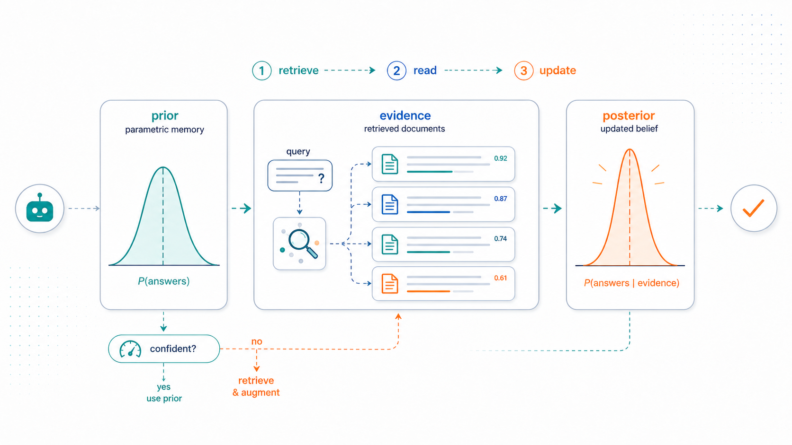
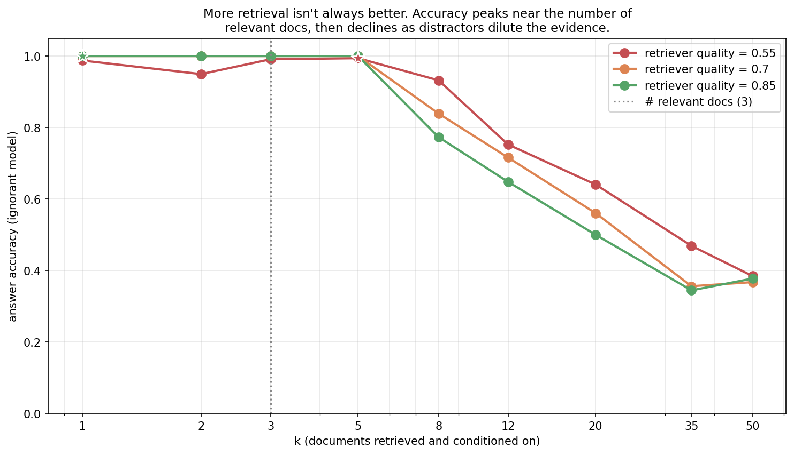
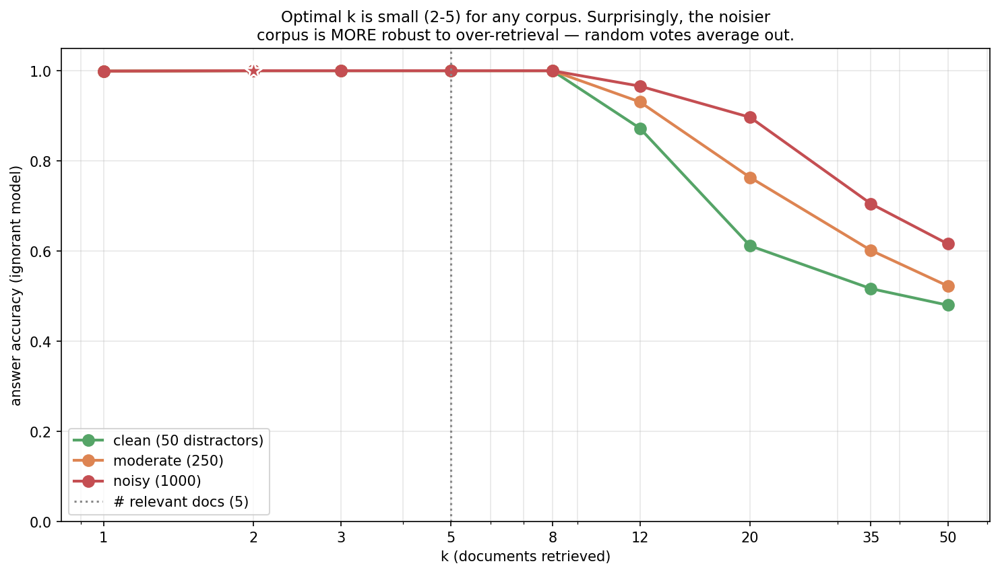
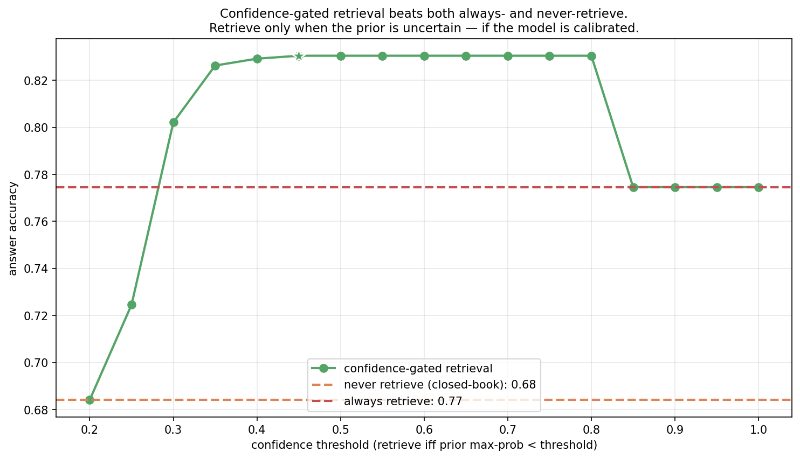

> *Topic 4, post 1 of 3.*

Topic 3 was about inference-time computation: how to decode, act, and search with a fixed policy. A single assumption ran underneath all of it — that the knowledge needed to answer was already *inside* the model, waiting for clever sampling or search to extract it. Often it isn't. A language model's knowledge is whatever got compressed into its weights during training, lossily, and frozen at the training cut-off. Ask it about a paper from last week, a fact it saw once in a trillion tokens, or the contents of your private codebase, and it has nothing to draw on but a blurry parametric average. The usual result is a fluent, confident, wrong answer — a hallucination.

This post is about the standard fix, **retrieval-augmented generation (RAG)**, and the lens that makes its behavior predictable. We do two things. First, §0 explains what RAG concretely *is* — the machinery of embedding, search, and in-context reading — because the reframing only makes sense once the mechanism is clear. Then the central claim, stated carefully: **RAG can be usefully modeled as Bayesian conditioning.** The model's parametric memory plays the role of a *prior* over answers; retrieved documents act as *evidence*; the answer the model produces after reading them behaves like a *posterior*. Most real RAG systems do not literally compute a Bayesian posterior — this is a *normative* lens, one that predicts when retrieval should help or hurt, not a description of what the transformer does inside. But it is a remarkably predictive lens, and it turns the practical questions — when does retrieval help, how many documents to fetch, when does it backfire, when should the agent bother retrieving at all — into precise questions about priors, likelihoods, and posteriors. The frame connects directly back to the Bayesian linear regression of [Post 1b](01b-contextual-bandits.qmd) and forward to calibration ([Post 4c](04c-calibration.qmd)).

---

## 0. What retrieval-augmented generation actually is

The slogan is *retrieve, then generate*. A RAG system has two phases — one done once, offline, and one done per query.

**Indexing (offline).** Take the corpus you want the model to draw on — documentation, a wiki, your email, a code repository — and split it into **chunks**: passages of a few hundred tokens each. Pass every chunk through an **embedding model**: a neural network (usually a smaller transformer than the generator) trained to map a piece of text to a fixed-length vector — say 768 or 1536 numbers — so that texts with *similar meaning* land near each other in the vector space. Store all of these vectors in an index, a **vector database**, keeping a pointer from each vector back to its original text.

**Retrieval and generation (online).** When a query arrives:

1. **Embed the query** with the *same* embedding model, producing a query vector.
2. **Search** the index for the chunk vectors nearest the query vector — by cosine similarity or Euclidean distance. This is a nearest-neighbor search; at scale it uses approximate algorithms (HNSW, IVF) that give up a little accuracy for sub-linear lookup. Keep the top $k$.
3. **Assemble a prompt** that pastes the text of those $k$ chunks in front of the question, with a wrapper like *"Use the following context to answer the question. Context: {chunks}. Question: {query}."*
4. **Generate.** The model produces its answer, now able to read the retrieved passages directly in its context window.

That is the core mechanism. Two pieces carry most of the weight.

**The embedding model is the matchmaker.** It is trained — typically with a contrastive objective on (question, answer-passage) pairs — so that a query and the passage that answers it map to nearby vectors, while unrelated text maps far away. A large part of retrieval quality is the quality of this matchmaking: if the embedding model places the answer-bearing passage near the query, retrieval succeeds; if it doesn't, no amount of clever prompting downstream recovers it. (Production systems add reranking, query rewriting, and metadata filters on top, so the embedding model is not literally the *only* factor — but it is the foundation.) This is why §3 and §9.4 dwell on what makes retrieval find the right thing — geometry in the embedding space is central.

**In-context conditioning is the other half.** Why does pasting text into the prompt help at all? Because a language model is an exceptionally good *in-context* reader. Even when a fact is absent from its weights, once that fact sits in the context window the model can attend to it, quote it, and reason over it. Retrieval teaches the model nothing — it never touches the weights — it merely arranges for the right text to be present at generation time. The model's task shifts from *recall* (hard, lossy, frozen) to *reading comprehension* (something LLMs do very well). That shift — from frozen parametric memory to fresh in-context evidence — is precisely the structure of a Bayesian update, which is where we turn next.

### 0.1 Two engineering choices that decide everything

Two design decisions inside the mechanism above quietly determine whether RAG works at all, and both are worth understanding because the Bayesian model in §1 takes their outcome as given.

**How embeddings are trained, and the bi-encoder/cross-encoder split.** The matchmaker is trained *contrastively*: take a question and its true answer-passage as a positive pair, take random other passages as negatives, and adjust the encoder so the positive pair lands closer (higher cosine similarity) than the negatives. Done at scale, this carves out a geometry where semantic relatedness becomes geometric proximity. Crucially, retrieval uses a **bi-encoder** — query and documents are embedded *separately*, so all document vectors can be computed once, offline, and indexed for fast nearest-neighbor search. The price is that the query never "sees" the document during scoring; their interaction is reduced to a single dot product. A **cross-encoder**, by contrast, feeds query and document *together* through a transformer and is far more accurate — but it must run once per (query, document) pair, so it cannot scan millions of documents. This is exactly why production pipelines are two-stage: a cheap bi-encoder retrieves a few hundred candidates, then an expensive cross-encoder *reranks* them. The bi-encoder gives recall at scale; the cross-encoder gives precision on the shortlist.

**Chunking.** Documents must be split into passages before embedding, and chunk size is a genuine tradeoff with no free answer. Chunks too large dilute the embedding — a 2,000-word passage about ten topics produces a vector that is the average of ten meanings and is sharply near *none* of them, so it matches no query well. Chunks too small fragment the evidence — the sentence that answers the question loses the surrounding context that made it interpretable, and a single chunk may no longer contain a complete fact. Real systems tune chunk size (often a few hundred tokens), overlap adjacent chunks so a fact straddling a boundary isn't split, and sometimes attach metadata (section titles, source) to each chunk. The cleanliness of this step bounds everything downstream: no retriever recovers a fact that chunking destroyed.

---

## 1. The Bayesian picture

Strip away the engineering and a RAG system is computing a conditional distribution over answers. Without retrieval, the model effectively samples from

$$
p_0(a \mid q),
$$

the distribution its weights implement for a query $q$ — its **parametric prior**, the belief it holds *before* seeing any documents. For a well-memorized fact this prior is sharp and correct. For a long-tail or post-cut-off query it is diffuse (the model is guessing) or, worse, sharp and *wrong* (a confident hallucination).

Retrieval supplies documents $D = \{d_1, \dots, d_k\}$, and the model now samples from

$$
p(a \mid q, D),
$$

the distribution conditioned on the query *and* the retrieved text. By definition this is a **posterior** — the prior updated by evidence. Bayes' rule says exactly how the two connect:

$$
p(a \mid q, D) \;=\; \frac{p_0(a \mid q)\, p(D \mid a, q)}{p(D \mid q)} \;\propto\; p_0(a \mid q)\, p(D \mid a, q).
$$

The term $p(D \mid a, q)$ acts as a **likelihood**: how compatible is *this* set of documents with $a$ being the true answer? A passage that states or supports answer $a$ is far more likely to surface when $a$ is true, so it tilts the posterior toward $a$. A caveat to keep the model honest: in a real RAG system documents are *not* sampled from an answer-conditioned generative process — a retriever selects them by similarity to the query over a fixed corpus. So $p(D \mid a, q)$ is best read as a *pseudo-likelihood* or **compatibility/evidence score** — how much each document votes for an answer — rather than a literal generative likelihood. Unless one defines an explicit generative retrieval model, this is the more defensible reading, and it is all the analysis below actually needs.

To handle several documents at once we assume they are conditionally independent given the answer — the **naive-Bayes assumption**:

$$
p(D \mid a, q) \;=\; \prod_{i=1}^{k} L(d_i \mid a).
$$

Then the update factorizes, and in log-space it becomes simple addition:

$$
\log p(a \mid q, D) \;=\; \log p_0(a \mid q) \;+\; \sum_{i=1}^{k} \log L(d_i \mid a) \;+\; \text{const}.
$$

Each retrieved document contributes an additive vote — measured in nats — for the answer it supports. A relevant document casts a strong vote for the truth; a distractor casts a vote for whatever it happens to mention. **The posterior is the prior plus the sum of the votes.** That is exactly what our experiments implement, with one knob — the *evidence strength*, the size of each vote — that we calibrate in §9.2.

The figure shows the case retrieval is built for: a model that *misremembers* — confident on the wrong answer A3 — is pulled to the truth by documents that point to A1. Prior, times likelihood, gives posterior.

Two honest caveats keep this from being a fairy tale:

**Real LLMs do not run Bayes' rule.** A transformer reading documents in its context does whatever its weights have learned to do, which is only *approximately* Bayesian and sometimes badly so: it may overlook a relevant passage, over-anchor on a fluent distractor, or fail to combine two documents that jointly imply the answer. The Bayesian account is *normative* — it describes what optimal conditioning would look like — and it predicts the qualitative behavior (when retrieval helps, when it hurts) strikingly well. But it is a model *of* the system, not a literal account of the forward pass.

**The independence assumption is wrong, and useful anyway.** Retrieved documents are correlated — near-duplicates, or several passages from one source — so treating their votes as independent over-counts redundant evidence. Production systems fight this with de-duplication and diversity-aware retrieval (e.g. maximal marginal relevance). We keep the naive-Bayes form because it captures the essential dynamics — *votes accumulate, distractors dilute* — with a single interpretable parameter.

With the model in hand, the two ways RAG fails are immediate:

- **Confidently-wrong prior + weak evidence** (few or low-quality documents) → the posterior stays wrong. Retrieval didn't help.
- **Correct prior + misleading evidence** (distractor documents) → strong votes override the truth. Retrieval actively hurt.

The rest of the post quantifies exactly when each happens.

---

## 2. The core result: retrieval helps most when the model knows least

Sweep the model's parametric knowledge — the fraction of queries it has effectively memorized — and compare *closed-book* (answer from the prior alone) to *open-book* (condition on retrieved documents).

The result is intuitive in hindsight, and the Bayesian frame predicts it exactly. When parametric knowledge is low, the prior is near-uniform; the posterior is then dominated by the retrieved evidence, so a good retriever carries the model to a correct answer it had no hope of producing alone. When parametric knowledge is high, the prior is already correct and sharp, and the evidence has little left to add — the posterior barely moves.

So the value of retrieval is, precisely, *the gap between what the model already knows and what the documents contain* — formally, how much the evidence sharpens a diffuse prior. This explains where RAG earns its keep in practice:

- **Long-tail facts** the model saw rarely or never — the low-knowledge regime, where the prior is uninformative.
- **Fresh information** postdating the training cut-off — where the prior is stale or absent.
- **Private data** (your documents, your codebase) that was never in pre-training at all — where the prior is pure guesswork.

And it explains where RAG adds little: common knowledge the model already has nailed. Bolting retrieval onto a query the model answers perfectly from memory is, at best, wasted latency — and at worst actively harmful, as §5 shows.

---

## 3. Retrieval quality: precision, recall, and a threshold

Everything above assumed the retriever actually surfaces relevant documents. But retrieval is its own subsystem with its own failure modes, and its quality is measured the classical way — **precision** (what fraction of retrieved documents are relevant) and **recall** (what fraction of all relevant documents were retrieved).

The left panel is the textbook precision-recall tradeoff, with the crossover sitting exactly at $k = $ the number of relevant documents. Small $k$: high precision, low recall — you fetch only the surest matches but miss some relevant material. Large $k$: you've captured all the relevant documents (recall 1.0) but diluted them with irrelevant ones, so precision decays as $\sim 1/k$. There is no $k$ that maximizes both; the right operating point depends on how costly a missed document is versus a distractor — a question the Bayesian model answers in §4.

The right panel makes a subtler point: in *this toy model*, retrieval quality is not a smooth dial but has a sharp **threshold**. Recall that retrieval is nearest-neighbor search in the embedding space. If the embedding model is poor — if it fails to place answer-bearing passages near their queries — then the "nearest" neighbors are essentially random, and precision sits at the chance baseline. Once the embedding model crosses a quality threshold, relevant passages start landing closer to the query than the distractors do, and precision climbs sharply toward 1.0. In a real system the transition is usually more **gradual**, not a clean step: retrieval quality improves or degrades smoothly as you change the embedding model, add reranking, tune chunk size, apply metadata filters, deduplicate, or rewrite queries. The toy's sharp threshold is a clarifying caricature of a real, smoother dependence. Either way the dependence is tied to the *geometry* of the embedding space, and in particular its dimensionality — the subject of §9.4, where we see why production embeddings have hundreds or thousands of dimensions.

---

## 4. The retrieval budget: more is not better

How many documents should we retrieve and feed to the model? The Bayesian frame issues a warning: every retrieved document contributes a likelihood factor, and a distractor's factor is *misleading*. There is a genuine tension — recall wants large $k$ (fetch enough to capture the relevant evidence), precision wants small $k$ (don't drown the signal in distractor votes).

Accuracy peaks at small $k$ — around the number of genuinely relevant documents — then *declines* as $k$ grows. Past the relevant set, every extra document is a distractor casting a vote for a (usually wrong) answer; pile on enough of them and they outvote the handful of relevant documents. In the log-space picture from §1, you are adding noise terms to the sum until they swamp the signal.

This matches a well-known practical finding: stuffing the context with more retrieved passages frequently *degrades* RAG quality. Two mechanisms compound. The first is the distractor-vote dilution our model captures directly. The second, which we don't model but which points the same way, is that real LLMs attend poorly to information buried in the middle of a long context — the "lost in the middle" effect (Liu et al. 2024). Both say the same thing: **retrieve precisely, not abundantly.** A handful of on-target passages beats a context window stuffed with marginal ones.

One important refinement the toy elides: production systems separate **candidate retrieval depth** from **final context budget**. They deliberately retrieve *many* candidates (high recall — cast a wide net), then **rerank** them with a stronger cross-encoder, **deduplicate** near-identical passages, and compress or select down to the *few* that actually go into the prompt (high precision in what the generator sees). The two $k$'s are different: retrieve 50, show 3. This split is also the practical answer to the naive-Bayes overcounting problem from §1 — reranking and **maximal marginal relevance (MMR)** explicitly penalize redundancy, so the handful of passages finally shown to the model are diverse rather than three paraphrases of one source casting three correlated votes.

---

## 5. When retrieval hurts

The most important caveat, and the one most often ignored in practice. RAG is not free insurance. Conditioning on bad evidence can make the model *worse* than it would have been answering closed-book from memory.

The crossover is the key feature. With a poor retriever, the open-book curve sits *below* the closed-book baseline: a model that would have answered correctly from its prior is dragged to a wrong answer by misleading documents. Retrieval only helps once the retriever crosses a quality threshold — and below it, the right policy is to not retrieve at all.

That threshold is **higher for a more knowledgeable model**. This is the Bayesian frame once more: a confident, correct prior is a large term in the log-posterior, so it takes stronger (better, more numerous) evidence to overturn. A knowledgeable model therefore needs a *better* retriever before retrieval is worth the risk, while a model that knows little has little to lose and benefits from retrieval even when it is mediocre.

The practical consequence is sharp: **whether to retrieve depends jointly on the model's knowledge and the retriever's quality.** Indiscriminate retrieval — the default in many RAG pipelines, which retrieve on every query — is simply the wrong policy. Which brings us to the central decision.

---

## 6. Two extensions the toy doesn't capture

The single-shot, dense-only retrieval of our model is the base case. Two extensions matter enough in practice to name, and both fit the Bayesian frame cleanly.

**Hybrid retrieval: dense plus sparse.** The embedding-based retrieval we built is *dense* — it matches on learned semantic similarity. It has a known blind spot: rare exact tokens (an error code, a function name, a proper noun, a part number) may not be well-represented in the embedding geometry, so a semantically-fuzzy match can lose to an exact lexical one. Classic *sparse* retrieval (BM25, essentially TF-IDF keyword matching) is the opposite — great at exact terms, blind to paraphrase. Production systems run **both** and fuse the rankings (e.g. reciprocal rank fusion), because the two failure modes are complementary. In the Bayesian picture these are simply two evidence sources with different likelihood models — one scoring semantic compatibility, one scoring lexical overlap — and fusing them is combining their votes, exactly the multi-document update of §1 applied across *retrievers* rather than across documents.

**Multi-hop and agentic RAG.** Our model retrieves once, then answers. Many real questions need *several* retrievals, where what you retrieve second depends on what you learned first ("who directed the highest-grossing film of the director of *Jaws*?" requires finding Spielberg, then his films, then their grosses). This is no longer one-shot conditioning — it is a *sequence* of retrieve-read-decide steps, which is precisely the agent loop of [Post 3b](03b-tool-use.qmd) with retrieval as the tool. Each hop is a Bayesian update that also *chooses the next query*, and the confidence-gating decision below generalizes to "do I have enough evidence to answer, or do I retrieve again?" — the same belief-state reasoning as a POMDP agent. Self-RAG and related systems make exactly this loop learned. The single-shot case is the foundation; iterated retrieval is where RAG becomes agentic.

---

## 7. The decision: when should the agent retrieve at all?

If retrieval helps an ignorant model and hurts a knowledgeable one paired with a bad retriever, the move is obvious: **retrieve selectively** — only when the model is uncertain. This is the RAG analogue of the tool-use threshold from [Post 3b §4](03b-tool-use.qmd): reach for the external resource exactly when your own answer is unreliable, and not otherwise.

The policy is simple to state. Compute the prior, measure its confidence — say, the maximum probability it assigns to any single answer — and retrieve only if that confidence falls below a threshold. Confident queries are answered from memory; uncertain ones trigger retrieval.

But the policy has a precondition that turns out to be the whole story of the next two posts: it is only as good as the model's **calibration** — its ability to know when it doesn't know. A model that is confidently wrong will *skip* retrieval exactly when it most needs it. A model that is uncertain about things it actually knows will retrieve needlessly and risk corruption by a mediocre retriever. Confidence-gating works if and only if confidence tracks correctness, which is the definition of calibration and the subject of [Post 4c](04c-calibration.qmd). We measure the payoff of this policy — and it is large — in §9.3.

---

## 8. Experiments to actually run

### 8.1 Optimal retrieval budget vs corpus noise

Sweep $k$ across corpora with different distractor counts. Where is the optimal $k$, and how does it move with corpus noise?

### 8.2 Evidence-strength calibration

The posterior weights each document by an evidence strength (nats per document). Sweep it. What's the calibrated value, and what does miscalibration cost?

### 8.3 Confidence-gated retrieval

Compare never-retrieve, always-retrieve, and a policy that retrieves only when the prior is uncertain. Can selective retrieval beat both extremes?

### 8.4 Embedding dimension

Sweep the embedding dimensionality. How does retrieval quality depend on it, and why?

---

## 9. Solutions

### 9.1 Optimal budget vs corpus noise — `experiments/04a_sol1_optimal_k.py`

**What you should see.** The optimal $k$ is small — 2 to 5 — regardless of corpus size, and accuracy is flat and high up to about $k = 8$. Beyond that, all three decline as distractors flood the context.

**The honest surprise.** The *noisiest* corpus (1000 distractors) declines *slowest* at large $k$. This is counterintuitive until you think in votes. Each distractor casts a vote for a uniformly-random answer. With many distractors retrieved, those random votes average out to a near-uniform contribution that doesn't change the argmax — they cancel each other. With few distractors, the vote distribution is lumpier and more likely to pile onto a single wrong answer by chance, overturning the relevant signal. More noise of a symmetric kind is, paradoxically, safer than a little.

**The deeper lesson.** What matters isn't the raw number of distractors but whether their evidence is *systematically* or *randomly* misleading. Random noise washes out; systematic bias — distractors that all point the same wrong way — is what kills retrieval. Real corpora have both, which is why "retrieve few" remains a safe default even though the toy result looks forgiving.

### 9.2 Evidence-strength calibration — `experiments/04a_sol2_evidence_strength.py`

**What you should see.** An inverted-U for every knowledge level. At evidence strength zero, the model ignores documents entirely and scores its closed-book baseline. As strength rises, relevant documents begin correcting wrong priors and accuracy climbs — peaking around 1 nat per document. Push strength higher and accuracy *falls*, because now a single distractor document carries enough weight to override an otherwise-correct prior.

**The deeper lesson.** Evidence strength is a calibration parameter, and its optimum is moderate. It encodes the answer to "how much should I trust one retrieved document?" — exactly the question a RAG system must resolve, whether explicitly (a confidence-weighted fusion of context and prior) or implicitly (how the generator was trained to weigh context against its own knowledge). The knowledgeable model's curve falls most steeply because it has the most correct prior to lose. The same over/under-confidence tradeoff governs how much a model should trust its *own* outputs — the calibration story of Post 4c.

### 9.3 Confidence-gated retrieval — `experiments/04a_sol3_confidence_gated.py`

**What you should see.** The headline result. Under a mediocre retriever, never-retrieve scores 0.68 (the model's closed-book accuracy) and always-retrieve scores 0.77 (retrieval helps on net but corrupts some confident-correct answers). The confidence-gated policy reaches **0.83** across a broad plateau of thresholds — beating both.

The mechanism: gating retrieves for uncertain queries (where the prior would be wrong and evidence helps) while trusting confident priors (avoiding corruption by the mediocre retriever). It captures the upside of retrieval without the downside.

**The deeper lesson.** This is the punchline of the post: **the right amount of retrieval is query-dependent, and the gating signal is the model's own confidence.** It works only if that confidence is trustworthy — if the model is calibrated. A miscalibrated model gates at the wrong times, skipping retrieval when confidently wrong and retrieving needlessly when uncertain about things it knows. This is the bridge to Post 4c, and it is the same principle as the tool-use threshold in Post 3b: an agent should reach for an external resource exactly when its internal answer is unreliable, and knowing *that* requires calibration.

### 9.4 Embedding dimension — `experiments/04a_sol4_embedding_dim.py`

**What you should see.** At low embedding dimension (2-6), precision@3 is near the random baseline and accuracy is near random-guess: the retriever cannot distinguish relevant documents from distractors. As dimension grows, both climb sharply and saturate near dimension 32-48.

**The deeper lesson — the geometry of retrieval.** In low dimensions there isn't much room: random distractor vectors are fairly likely to land near the query by chance, so relevant and irrelevant documents overlap and similarity search can't separate them. In high dimensions the **concentration of measure** kicks in — two random unit vectors are nearly orthogonal with overwhelming probability — so a genuinely-relevant document, deliberately aligned with the query by the embedding model, stands out sharply against a background of near-orthogonal noise. This is precisely why production text embeddings live in hundreds to thousands of dimensions: the high-dimensional geometry is what makes nearest-neighbor search discriminative in the first place. It is the same concentration phenomenon that makes a high-dimensional Gaussian concentrate on a thin shell — here working in our favor.

---

## 10. Further reading

- **Lewis et al., "Retrieval-Augmented Generation for Knowledge-Intensive NLP Tasks" (NeurIPS 2020).** The paper that named RAG and combined a dense retriever with a generator end-to-end.
- **Karpukhin et al., "Dense Passage Retrieval for Open-Domain Question Answering" (EMNLP 2020).** How to train the embedding model — the contrastive (question, passage) objective behind the matchmaker of §0.
- **Guu et al., "REALM: Retrieval-Augmented Language Model Pre-Training" (ICML 2020).** Retrieval folded into pre-training rather than bolted on at inference.
- **Liu et al., "Lost in the Middle: How Language Models Use Long Contexts" (TACL 2024).** Why stuffing more documents into context degrades performance — the real-LM complement to §4.
- **Asai et al., "Self-RAG: Learning to Retrieve, Generate, and Critique through Self-Reflection" (ICLR 2024).** A model trained to decide *when* to retrieve and to critique what it gets back — the learned version of the confidence-gating policy of §6.

---

**Next up — Post 4b: Self-reflection as Monte Carlo.** If retrieval brings in *external* evidence, reflection generates *internal* evidence: the model critiques and revises its own output. We'll frame self-reflection as a Monte Carlo estimate of answer quality, see when iterating genuinely improves answers versus when it just amplifies the model's own biases, and connect it to the best-of-N and self-consistency methods from Post 3a.
