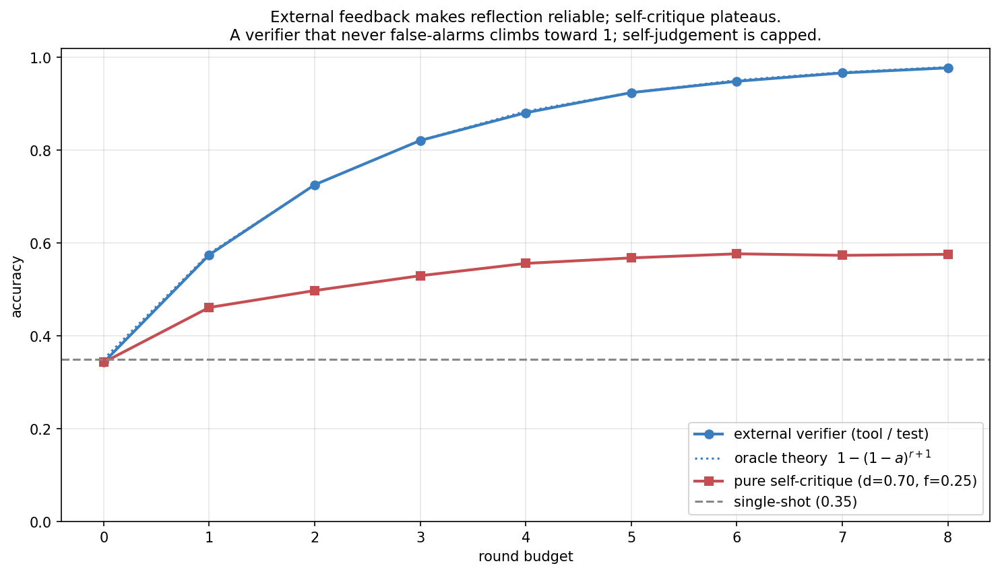
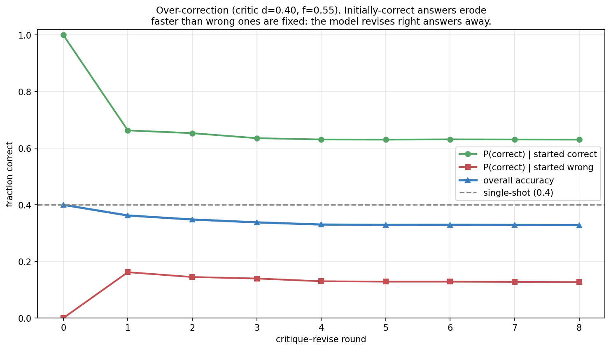

> *Topic 4, post 2 of 3.*

[Post 4a](04a-rag-as-bayesian-conditioning.qmd) gave an agent a way to bring in *external* evidence: retrieve documents and condition on them. This post is about the other source of new information an agent can tap — *internal* evidence. The model generates an answer, then looks back at its own work, critiques it, and revises. This is **self-reflection**, the loop behind Reflexion (Shinn et al. 2023), Self-Refine (Madaan et al. 2023), and the "wait, let me reconsider" behavior you see in reasoning models.

The intuition is seductive: surely a model that checks its work does better than one that answers off the cuff. Sometimes. But self-reflection has a sharp failure mode that the intuition hides, and getting it wrong is one of the most common ways agentic systems waste compute or actively degrade. So this post does two things. First, §0 nails the mechanism — what "the model critiques itself" concretely means, and why it is just another way to spend inference compute. Then the frame that makes its behavior predictable: **self-reflection is sequential, adaptive Monte Carlo.** It is the one-at-a-time, stop-when-satisfied sibling of the best-of-N and self-consistency methods from [Post 3a](03a-decoding-as-inference.qmd). Seeing it that way lets us derive, in two lines of algebra, exactly when reflection improves an answer and when it just launders the model's own mistakes into more confident mistakes. The punchline, which connects straight to calibration ([Post 4c](04c-calibration.qmd)): **reflection only pays off across the generation–verification gap — when the model can judge an answer better than it can produce one.**

---

## 0. What self-reflection actually is

Strip away the framing and self-reflection is a loop over three operations, all run by the *same* language model:

1. **Generate.** Produce a candidate answer to the problem, the ordinary forward pass of Topic 3.
2. **Critique.** Feed the candidate back to the model with a prompt like *"Review the answer above. Is it correct? Identify any errors."* The model emits a verdict — accept, or reject-with-reasons.
3. **Revise.** If the critique found fault, prompt the model again — now with the original problem, its first answer, and the critique — to produce a corrected answer.

Repeat until the critique is satisfied or a budget runs out. That is the entire mechanism. Reflexion, Self-Refine, and "self-consistency with self-evaluation" are all variations on this generate–critique–revise loop; they differ mainly in what the critique is allowed to see (just the answer? a tool result? a memory of past attempts?) and how the revision is prompted.

The single most important fact about this loop — the fact the whole post turns on — is that **the critic is the same model as the generator.** There is no second, wiser system grading the first. The network that produced a flawed answer is the network asked whether the answer is flawed. This is why self-reflection is not free improvement: a model that cannot tell its answer is wrong will, on critique, declare it right and stop; a model that is unsure of a correct answer may, on critique, "fix" it into a wrong one. Reflection can only surface judgement the model already has but did not use on the first pass. Whether it has that judgement is an empirical property — the generation–verification gap — and most of this post is about measuring its consequences.

It helps to be concrete about why a gap could exist at all. Generating a correct multi-step proof is hard: you must get every step right in sequence. *Checking* a given proof can be easier: a single invalid step is often locally visible even when producing the whole valid chain was not. The same asymmetry shows up in code (writing a correct function vs. noticing it crashes on an edge case) and in arithmetic (computing vs. plugging the answer back in). When verification is genuinely easier than generation, a second look adds real information. When it isn't — when the model's errors are *invisible to itself* because the same blind spot produced and then evaluated the answer — a second look adds nothing, or worse.

### 0.1 Reflection is a way to spend inference compute

[Post 3a](03a-decoding-as-inference.qmd) introduced test-time compute: spend more inference to raise accuracy. It gave two parallel recipes — **best-of-N** (sample $N$ candidates, let a verifier pick the best) and **self-consistency** (sample $N$, take the majority answer). Self-reflection is a third recipe, and the cleanest way to understand it is by contrast.

Best-of-N and self-consistency are **parallel and non-adaptive**: fire off $N$ independent samples, then aggregate. Self-reflection is **sequential and adaptive**: produce one answer, evaluate it, and decide *based on that evaluation* whether to spend more compute. Easy problems get accepted on the first try and cost one call; hard ones trigger revision after revision. That adaptivity is reflection's promise — compute is spent where the model itself thinks it is needed — and its peril, because the spending decision is made by the same fallible judge. The next section makes the Monte Carlo connection precise.

---

## 1. Reflection as sequential, adaptive sampling

Here is the frame. The model can draw samples (candidate answers) from its generator. It cannot see which samples are correct — but it has a noisy test, the self-critic, that labels each sample "looks right" or "looks wrong." Reflection is then exactly **rejection sampling with a noisy acceptance test**: draw a candidate; if the test rejects it, draw another; stop when the test accepts (or you run out of budget).

Compare the three Post-3a-and-this strategies as sampling schemes over the same generator:

- **Self-consistency:** draw $N$, return the most common *answer*. A Monte Carlo estimate of the answer marginal's mode — no critic needed (Post 3a §4).
- **Best-of-N:** draw $N$, return the one the *verifier* scores highest. Uses the critic to rank, once, in parallel.
- **Self-reflection:** draw one at a time; the critic's accept/reject decides whether to draw again. Uses the critic *sequentially and adaptively* to decide how many samples to take.

This unifies the topic: all three are ways of turning extra samples into accuracy, differing in whether they aggregate by **voting** (self-consistency, robust to a bad critic because it ignores it), **ranking** (best-of-N, one critic judgement per candidate), or **sequential acceptance** (reflection, one critic judgement that also controls the budget). The sequential structure is what makes reflection efficient — it stops early on easy problems — and what makes it fragile — a single bad accept/reject can end the search at a wrong answer or throw away a right one. We will see both effects.

With a *perfect* critic, reflection is beautiful: it is rejection sampling that returns a correct answer whenever the generator can produce one, so after $r$ rounds its accuracy is $1-(1-a)^{r+1}$ where $a$ is the generator's per-sample accuracy — it drives error to zero geometrically. The entire question is what happens when the critic is *not* perfect, which is always.

There is one more lens worth holding, because it explains reflection's *adaptive* spending. The accept/reject decision at each round is an **optimal-stopping problem**: at every step the agent holds a candidate and must decide "accept this and stop, or pay for another draw?" With a trustworthy critic, the optimal policy is exactly what the loop does — stop when the critic is satisfied, because the critic's "looks right" is good evidence the answer is right and further draws are unlikely to improve it. This is why reflection naturally spends *little* compute on easy problems (accepted immediately) and *more* on hard ones (repeatedly rejected) — the budget allocation is automatic, driven by the critic's verdicts. The catch is that an optimal-stopping rule is only as good as the signal it stops on: if the critic's "looks right" doesn't track "is right," the agent stops at the wrong times — accepting confident wrong answers and rejecting unrecognized correct ones. Adaptivity is a multiplier on critic quality, for better and worse.

---

## 2. When does reflection help? The two-line answer

We can compute reflection's effect in closed form for one round, and the result is so clean it is worth carrying in your head. Let

- $a$ = the generator's accuracy (probability a fresh answer is correct),
- $d$ = the critic's **detection rate**: $P(\text{flag as wrong} \mid \text{answer is wrong})$,
- $f$ = the critic's **false-alarm rate**: $P(\text{flag as wrong} \mid \text{answer is correct})$,
- $a'$ = the accuracy of a *revised* answer.

One round of "critique, and revise if flagged" gives a final answer that is correct with probability

$$
A_1 \;=\; \underbrace{a\big[(1-f) + f\,a'\big]}_{\text{started correct}} \;+\; \underbrace{(1-a)\,d\,a'}_{\text{started wrong, caught}}.
$$

Reading the terms: a correct answer survives if it isn't false-alarmed (prob $1-f$); if it *is* false-alarmed it gets revised, landing correct with prob $a'$. A wrong answer is rescued only if the critic catches it (prob $d$) and the revision succeeds (prob $a'$). Subtracting the no-reflection baseline $A_0 = a$ gives the **net change**:

$$
\boxed{\;\Delta \;=\; \underbrace{(1-a)\,d\,a'}_{\text{FIX: wrong}\to\text{right}} \;-\; \underbrace{a\,f\,(1-a')}_{\text{BREAK: right}\to\text{wrong}}.\;}
$$

Reflection helps exactly when the **fix term beats the break term**. The structure is the whole story:

- The fix term rewards a high detection rate $d$ and a large pool of wrong answers to fix $(1-a)$.
- The break term punishes a high false-alarm rate $f$ and a large pool of right answers to ruin $a$.

For the cleanest case — **blind revision**, where a revision is just another independent draw so $a' = a$ — the boxed expression collapses to

$$
\Delta \;=\; a\,(1-a)\,(d - f).
$$

Three consequences fall straight out, and they are the spine of the post:

1. **Reflection helps if and only if the critic discriminates: $d > f$.** The quantity $d - f$ is the critic's *informedness* (Youden's J), the standard measure of a binary classifier's skill. If the model's self-judgement is no better than chance at separating its right answers from its wrong ones, reflection is worthless on average — and if it is *anti*-discriminating ($f > d$), reflection actively destroys accuracy.
2. **The benefit is largest when the model is moderately wrong**, peaking at $a = \tfrac12$. When the model is almost always right ($a \to 1$) there is little to fix and much to break; when it is almost always wrong ($a \to 0$) there is little a single revision can recover. The middle is where a second look pays.
3. **The fix and break terms are weighted by how often you're wrong vs. right.** This is the same shape as Post 4a's central result — retrieval helped most when the model knew least — for the same reason: the value of a corrective mechanism scales with how much there is to correct.

A worked number makes the balance tangible. Take a model right half the time ($a = 0.5$) with a decent critic ($d = 0.8$, $f = 0.2$) and blind revision ($a' = 0.5$). The fix term is $(1-0.5)\cdot 0.8 \cdot 0.5 = 0.20$ — one round rescues 20% of all problems from wrong to right. The break term is $0.5 \cdot 0.2 \cdot 0.5 = 0.05$ — it ruins 5%. Net $\Delta = +0.15$: accuracy climbs from 0.50 to 0.65 in a single round, and the boxed formula agrees ($0.5\cdot0.5\cdot(0.8-0.2) = 0.15$). Now keep everything but flip the critic to over-critical ($d=0.2$, $f=0.8$): fix $= 0.5\cdot0.2\cdot0.5 = 0.05$, break $= 0.5\cdot0.8\cdot0.5 = 0.20$, net $\Delta = -0.15$ — the *same magnitude*, but now accuracy falls to 0.35. The only thing that changed sign was the critic's discrimination. Reflection is a lever that multiplies whatever judgement the model brings; point it the wrong way and it multiplies the model's confusion just as efficiently.

The condition $d > f$ is just the formal version of the generation–verification gap. We measure its consequences next.

---

## 3. The generation–verification gap

The whole edifice rests on the critic discriminating — on $d > f$. Where would such a critic come from, and how good can it be? This is the **generation–verification gap**: the difference between how well a model can *produce* a correct answer and how well it can *recognize* one.

The figure is the cleanest statement of the principle: the accuracy change is a straight line through the origin in $d - f$, exactly as the algebra predicts, and the sign of the gap is the sign of the benefit. There is no amount of iterating, prompting, or cleverness that turns a sub-chance critic into a useful one — if self-judgement can't beat a coin flip, reflection can't help.

For real LLMs, the gap is **task-dependent**, and this is the single most useful thing to internalize:

- **Verifiable tasks have large positive gaps.** Code (does it pass the tests?), arithmetic (does it check out?), formal proofs (does each step type-check?), constraint satisfaction (are all constraints met?). Here verification can be near-perfect because it is mechanical, and reflection — *with that verification wired in* — is enormously effective.
- **Open-ended reasoning has a small or unreliable gap.** For a hard word problem the model got wrong, the *same* reasoning blind spot that produced the wrong answer also evaluates it, so the critic inherits the generator's errors. The model may even rate its wrong answer *more* confidently after "checking." Here $d - f$ can be near zero or negative.

This is exactly the distinction between an **outcome reward model** (judge the final answer) and a **process reward model** (judge each step) from Post 3c §1, now wearing different clothes. A PRM-style critic that checks intermediate steps tends to discriminate better than an ORM-style critic that stares at a final answer, because step-level errors are more locally visible — more verifiable. The art of building a reflective agent is largely the art of maximizing $d - f$: structuring the critique so the model's verification skill, wherever it exceeds its generation skill, gets used.

---

## 4. The empirical picture: helps most when mostly wrong

Putting the simulation together reproduces the algebra and shows the failure modes side by side.

Read the three curves against the diagonal (the no-reflection baseline):

- **Good critic** ($d=0.85$, $f=0.10$, gap $0.75$): a large, consistent lift, biggest in absolute terms in the low-to-middle accuracy range — exactly where there is the most to fix.
- **Weak critic** ($d=0.55$, $f=0.45$, gap $0.10$): hugs the diagonal. A barely-discriminating critic produces barely any benefit, however many rounds you run.
- **Anti-discriminating critic** ($d=0.30$, $f=0.60$, gap $-0.30$): *below* the diagonal everywhere. This is the dangerous regime — a model that is systematically more suspicious of its right answers than its wrong ones will reflect itself into lower accuracy. And it can happen for real: a model prompted to "find the error" may dutifully invent one, flagging correct answers to comply with the instruction.

The lift is not symmetric in $a$: notice how the good critic's curve and the diagonal converge as $a \to 1$. When the model is already almost always right, even a good critic's occasional false alarm costs about as much as its rare fix gains — so reflection on easy, high-accuracy tasks is mostly wasted motion and a little risk. **Reflect on the hard problems, not the easy ones** — which, done by confidence, is the gating idea of §6 and Post 4c.

---

## 5. Iterating: diminishing returns and over-correction

If one round helps, do ten rounds help ten times as much? No — and the two ways the answer is "no" matter.

**Diminishing returns (the good cases).** Each round only acts on the answers still flagged. With a good critic, the first round fixes most of the fixable wrong answers; later rounds have a shrinking pool to work on, so accuracy rises fast then plateaus. The plateau height is set by the critic's discrimination and the revision quality, not by the round count — past a few rounds, more iteration buys almost nothing. This is the reflective analogue of self-consistency's $1/\sqrt N$ diminishing returns from Post 3a: the easy gains come first.

**Over-correction (the bad case).** The over-critical critic (red, $f > d$) is the one to fear. Because it false-alarms correct answers more often than it catches wrong ones, every round erodes the stock of correct answers faster than it grows it, and accuracy *falls* below the single-shot baseline before stabilizing. The model is, quite literally, talking itself out of answers it had right. The uninformative critic ($d = f$, orange) shows the boundary case: fixes exactly balance breaks, and reflection is pure wasted compute — accuracy never moves off the baseline no matter how long you iterate.

The practical rule: **a round budget is not a "more is better" dial.** It interacts with critic quality. With a verified critic, a small budget (2–4 rounds) captures nearly all the gain; with an unreliable one, *any* budget can hurt, and the safest budget is zero.

---

## 6. The honest caveat: pure self-correction is fragile

It is worth stating plainly, because the field learned it the hard way. A prominent line of work (Huang et al. 2023, "Large Language Models Cannot Self-Correct Reasoning Yet") found that on reasoning benchmarks, prompting a model to critique and revise its own answers *without any external signal* often **did not help and sometimes hurt** — for exactly the reason §2 makes precise: the self-critic's discrimination on hard reasoning is too close to zero, so fixes and breaks roughly cancel, and any prompt that nudges the model toward "find a mistake" pushes $f$ up and tips the balance negative.

The robust fix is to stop relying on pure self-judgement and **wire in external verification** — the bridge back to Post 3b's tools.

When the critic is an *external oracle* — a compiler, a test suite, a search query, a calculator — it has $d = 1$ and $f = 0$ by construction: it never mislabels. Reflection then becomes the geometric error-killer of §1, climbing toward perfect accuracy as the budget grows. This is why the convincing demonstrations of "self-improving" agents are almost always *tool-grounded*: AlphaProof checks proofs in Lean, coding agents run the tests, SWE-agents execute the code. The reflection loop is identical; what changed is that the critique is now a fact about the world rather than the model's opinion of its own work. The lesson threads the whole topic together: an agent that needs to know whether it is right should, whenever possible, *check* rather than *introspect* — and where it must introspect, it had better be calibrated, which is Post 4c.

---

## 7. A practical guide to reflective agents

The analysis collapses into a short decision procedure for whether and how to add reflection, cheapest and safest first:

- **Ask first: is there an external verifier?** If the task is checkable — code with tests, math you can re-evaluate, a claim you can look up — wire that verifier into the loop and largely stop worrying about the rest (§6). External feedback has $d=1, f=0$ and turns reflection into a reliable error-killer. This is the highest-value move by a wide margin.
- **If you must self-critique, measure $d$ and $f$ before trusting it.** On a labeled held-out set, check how often the model flags its wrong answers ($d$) versus its right ones ($f$). If $d - f$ is not comfortably positive, do not deploy the loop — it will not help and may over-correct (§5). This single measurement separates useful reflection from expensive self-sabotage.
- **Reflect on hard inputs, not easy ones.** Reflection's benefit vanishes as accuracy approaches 1 (§4), so gate it on confidence: revise only when the model's first-pass confidence is low. This is the same confidence-gating that beat always/never-retrieve in Post 4a, and it depends on calibration — Post 4c.
- **Invest in the critique, not the round count.** A small budget (2–4 rounds) captures nearly all the available gain; what actually raises the ceiling is making each critique *informative* — localizing and explaining the error so the revision is targeted, not just a fresh guess (§9.4).
- **Prefer voting when the critic is noisy and the budget is generous.** If you cannot get a discriminating critic, self-consistency (which ignores the critic) is more robust than sequential reflection (which trusts it); see §9.2.

The meta-lesson mirrors the rest of the curriculum: a corrective procedure is only as good as the signal that drives it. Check the world when you can; introspect only when your introspection is calibrated.

---

## 8. Experiments to actually run

### 8.1 External feedback vs self-critique

Replace the noisy self-critic with a perfect external verifier and sweep the round budget. How far below the external-verifier ceiling does pure self-critique plateau?

### 8.2 Reflection vs best-of-N vs self-consistency

At a fixed budget of model calls, compare sequential reflection against parallel best-of-N and self-consistency. Which spends compute best, and how does the answer depend on critic quality?

### 8.3 The over-correction trajectory

With an over-critical critic, trace accuracy round by round, split by whether the first answer was correct. Watch the correct answers erode.

### 8.4 Does the critique inform the revision?

Sweep `revise_gain` — the boost a revision gets from an informative critique — and compare reflection against a best-of-N baseline that only reranks. Where does reflection's advantage come from?

---

## 9. Solutions

### 9.1 External feedback vs self-critique — `experiments/04b_sol1_external_feedback.py`

**What you should see.** The external verifier drives accuracy from the single-shot 0.35 toward 0.98, matching the theoretical ceiling $1-(1-a)^{r+1}$ almost exactly — because a verifier that never false-alarms simply keeps resampling until a correct answer appears. Pure self-critique (the *same* generator, judged by itself at $d=0.70$, $f=0.25$) plateaus around 0.58: useful, but capped far below, because its false alarms keep costing it correct answers.

**The deeper lesson.** The gap between the two curves *is* the cost of using self-judgement instead of ground truth. It quantifies why "let the model check its own work" is a weak substitute for "let the model run the test." Whenever a cheap external verifier exists — and for code, math, and structured outputs one usually does — wiring it into the reflection loop converts a fragile, plateauing process into a reliable, near-monotonic one. This is the same point as Post 3b's tool-use threshold and Post 3c's value-heuristic noise, in a third costume: an unreliable evaluator caps what any search or revision procedure can achieve.

### 9.2 Reflection vs best-of-N vs self-consistency — `experiments/04b_sol2_reflect_vs_bon.py`

**What you should see.** Reflection and best-of-N track each other closely and plateau around 0.62 — both lean on the same noisy critic, so they share its ceiling. Self-consistency starts behind at small budgets (a 2-sample vote is weak) but climbs steadily and overtakes by a budget of ~8, because it **ignores the critic entirely** and averages over independent samples instead.

**The deeper lesson.** This is the robustness-vs-efficiency trade from Post 3c's "guided sampling vs search," now between reflection and voting. When the critic is decent, reflection's adaptivity is efficient — it stops early on easy problems and concentrates compute on hard ones, getting strong accuracy at small budgets. When the critic is noisy and the budget is generous, the method that *doesn't trust the critic* (self-consistency) wins, because averaging launders noise that sequential acceptance amplifies. The design choice follows the critic: trust it sequentially when it is good, average past it when it is not.

### 9.3 The over-correction trajectory — `experiments/04b_sol3_overcorrection.py`

**What you should see.** The green curve — answers that started correct — falls steeply in the first round and keeps drifting down: the over-critical critic flags these correct answers (false-alarm 0.55) and the reviser replaces them, often with something worse. Meanwhile the red curve — answers that started wrong — barely rises, because this critic catches errors only 40% of the time. The net (blue) is a steady loss.

**The deeper lesson.** Over-correction is the concrete shape of $f > d$. It is dangerous precisely because it is *invisible from inside the loop*: every step looks like diligent self-improvement — the model is finding "errors" and fixing them — while accuracy quietly degrades. The only defense is to measure $d$ and $f$ against ground truth on a held-out set before trusting a reflection loop in production, and to cap or disable revision when the critic cannot be shown to discriminate. Activity is not progress; a model busily revising is not necessarily a model improving.

### 9.4 Does the critique inform the revision? — `experiments/04b_sol4_informative_critique.py`

**What you should see.** At `revise_gain = 0` — where a "revision" is just another independent draw from the same generator — reflection barely outperforms best-of-N, because both are really just "try again and pick a good one." As the critique becomes informative (the revision accuracy rises with the gain), reflection pulls clearly ahead, reaching ~0.81 while the rerank-only baseline stays put.

**The deeper lesson.** This isolates *where reflection's value actually comes from*. It is not the mere act of trying again — best-of-N already does that, in parallel, more robustly. Reflection earns its keep only when the critique **localizes the error well enough to make the next attempt better**, not just different. "Your answer is wrong" is worth little; "your answer is wrong because step 3 divides by a quantity that can be zero" is worth a lot, because it steers the revision. When you build a reflective agent, the lever that matters is the *informativeness of the critique*, not the number of rounds — design the critique to pinpoint and explain, not merely to judge.

---

## 10. Further reading

- **Shinn et al., "Reflexion: Language Agents with Verbal Reinforcement Learning" (NeurIPS 2023).** The reflection loop with a memory of past attempts; strongest when feedback is grounded (tests, environment signals).
- **Madaan et al., "Self-Refine: Iterative Refinement with Self-Feedback" (NeurIPS 2023).** Generate–critique–revise with the same model; gains on tasks where self-feedback discriminates.
- **Huang et al., "Large Language Models Cannot Self-Correct Reasoning Yet" (ICLR 2024).** The honest counterweight — pure self-correction often fails to help on reasoning without external signals. The empirical face of §2's $d > f$ condition.
- **Cobbe et al., "Training Verifiers to Solve Math Word Problems" (2021).** Learned verifiers and the generation–verification gap that makes verification-guided methods work.
- **Saunders et al., "Self-critiquing models for assisting human evaluators" (2022).** Measures the critique–generation gap directly: models can often critique better than they generate, but not always.

---

**Next up — Post 4c: Calibration and uncertainty.** Twice now — confidence-gated retrieval in Post 4a, and "reflect on the hard problems" here — the right policy has hinged on the model *knowing when it is likely wrong*. That is calibration: does "the model is 90% sure" mean it is right 90% of the time? We will measure it, see why neural networks are systematically overconfident, build the fixes (temperature scaling, and the reliability diagram you already met in Post 1b), and close the loop on the agentic decisions — when to retrieve, when to reflect, when to act — that all depend on an agent that knows what it doesn't know.
