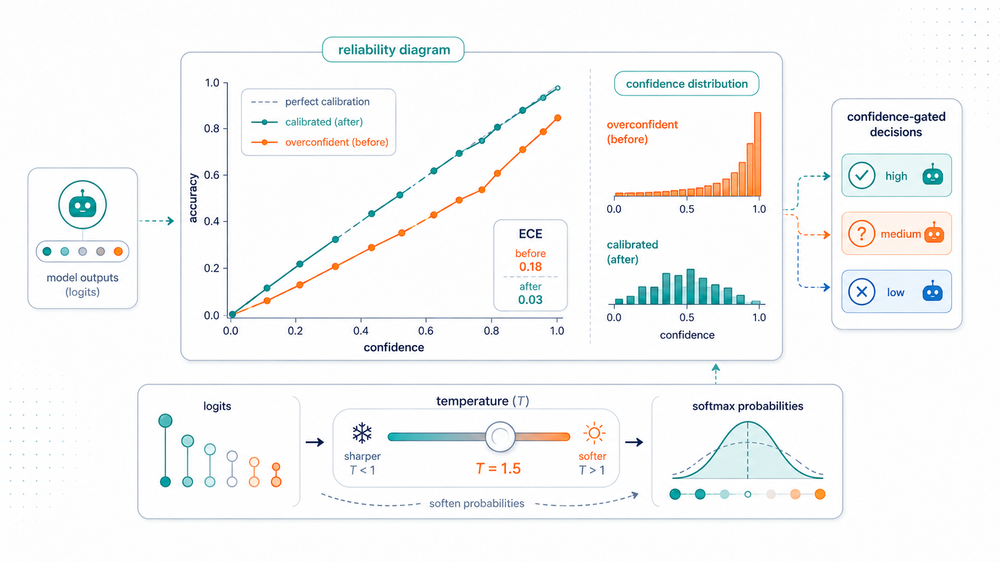
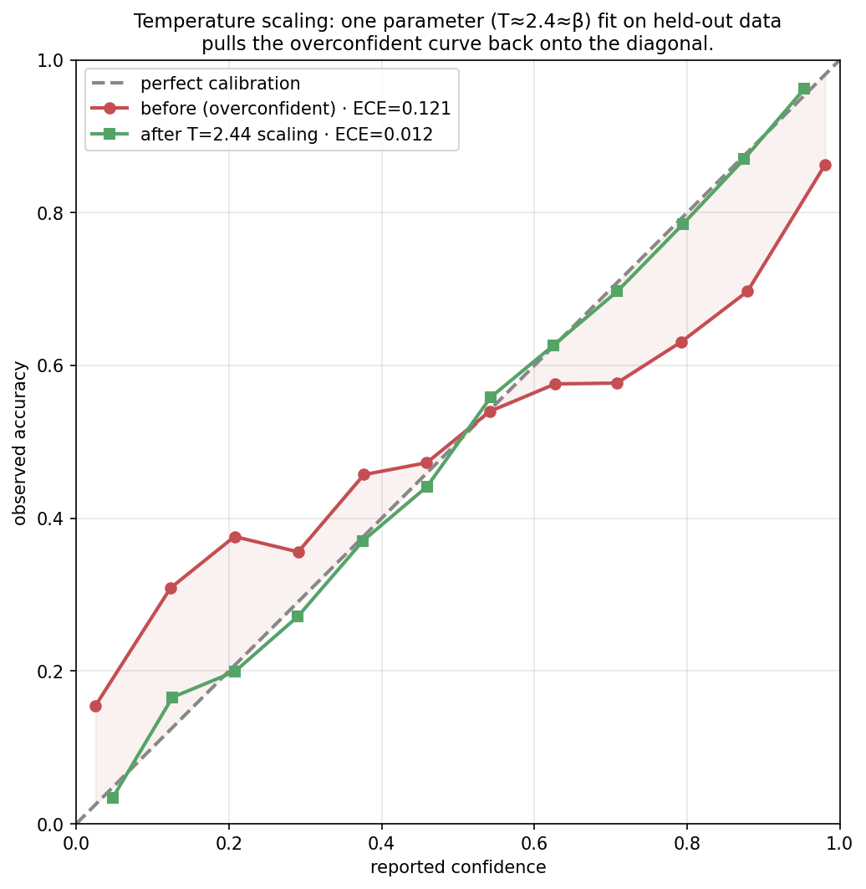
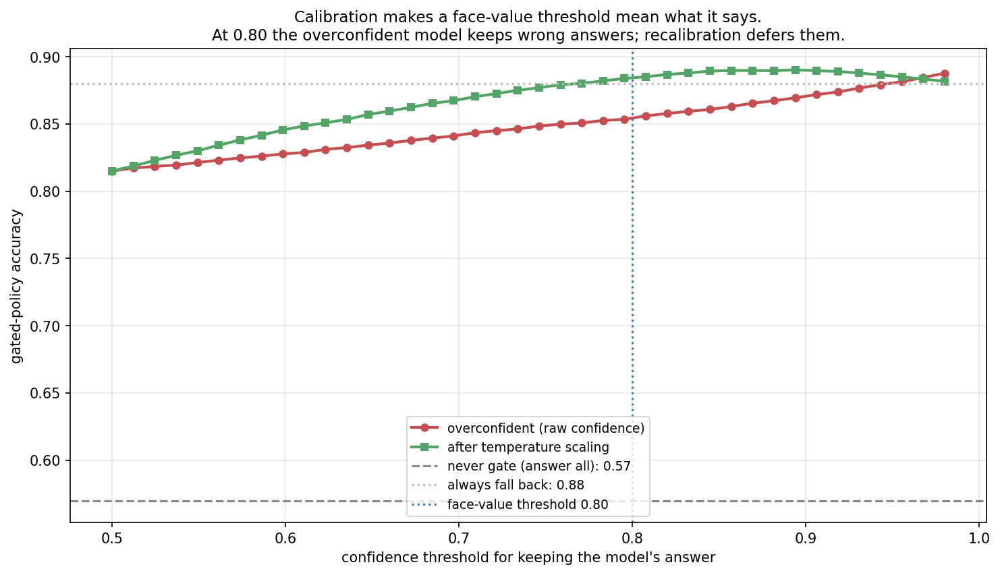
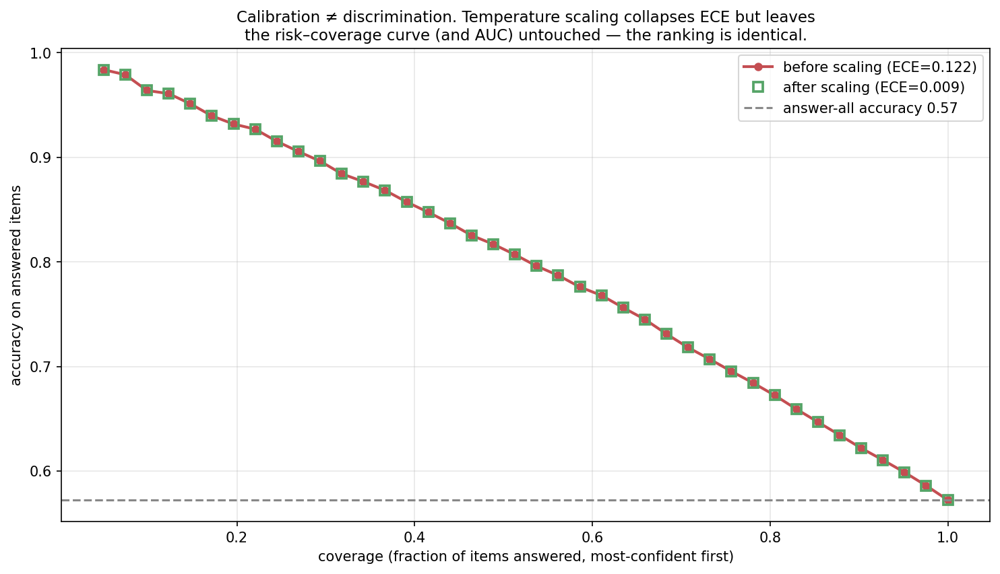
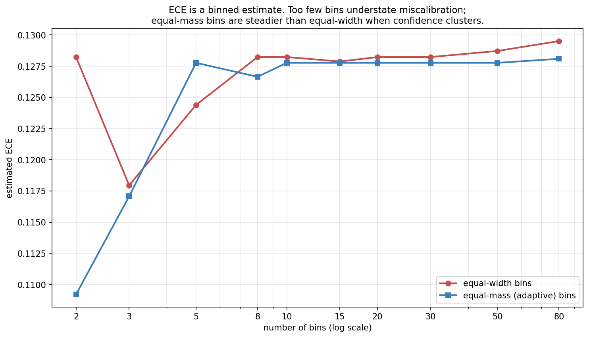
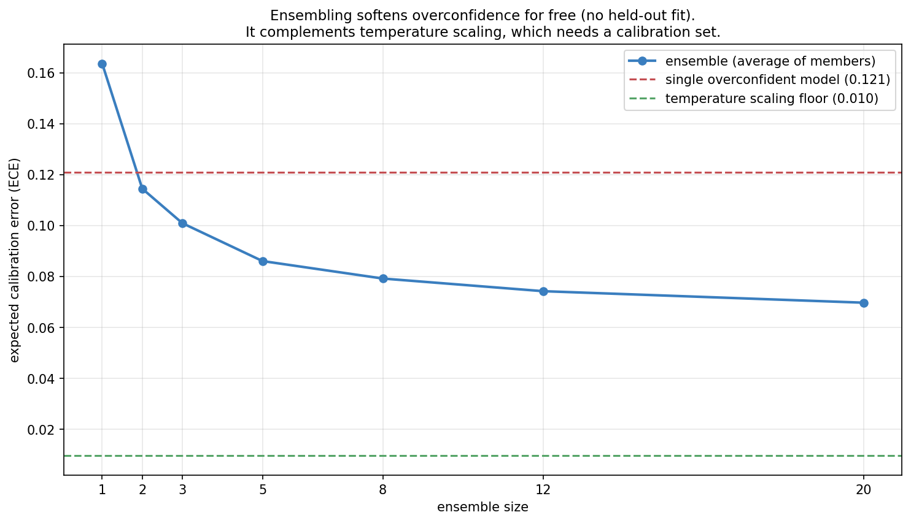

> *Topic 4, post 3 of 3 — and the close of the topic.*

Twice now a decision has come down to the model knowing when it is likely wrong. In [Post 4a](04a-rag-as-bayesian-conditioning.qmd), confidence-gated retrieval beat both always- and never-retrieving — *if* the model's confidence tracked its accuracy. In [Post 4b](04b-self-reflection.qmd), "reflect on the hard problems, not the easy ones" needed the model to recognize which problems were hard. Both policies rest on a single property we kept deferring: **calibration**. Does "the model is 90% confident" actually mean it is right 90% of the time?

This post pays off that debt and closes Topic 4. We will (§0) define calibration and meet its picture, the reliability diagram — which you already saw, unnamed, in [Post 1b](01b-contextual-bandits.qmd); (§1) explain why modern neural networks, and LLMs in particular, are *systematically overconfident*; (§2) measure miscalibration with Expected Calibration Error; (§3) fix it with **temperature scaling** — the very same temperature knob from decoding ([Post 3a](03a-decoding-as-inference.qmd)), now turned to a different purpose; (§4) confront an honest subtlety that catches people out — **calibration is not discrimination**; and (§5) close the loop, showing precisely how calibration powers every confidence-gated decision an agent makes. The throughline of the whole curriculum lands here: an agent that acts under uncertainty must first know *how* uncertain it is.

---

## 0. What calibration is

A model is **calibrated** if its confidence means what it says: among all the predictions it makes with confidence $p$, a fraction $p$ are correct. If you gather every answer the model was 70% sure of and 70% of them are right, the model is calibrated at 0.7. If it is calibrated at every confidence level, it is calibrated, full stop.

Formally, writing $\hat{p}$ for the model's reported confidence in its answer and $Y$ for whether the answer is correct,

$$
\mathbb{P}\big(Y = 1 \,\big|\, \hat{p} = p\big) \;=\; p \qquad \text{for all } p \in [0, 1].
$$

The picture is the **reliability diagram**: bin predictions by reported confidence, and for each bin plot the average confidence (x) against the observed accuracy (y). Perfect calibration is the diagonal $y = x$.

The reliability diagram is the same diagnostic we used in Post 1b to check whether Thompson Sampling's posterior was honest — there we asked whether a bandit's belief intervals had the right coverage; here we ask whether a classifier's confidences have the right accuracy. Same idea, same plot: does the claimed probability match the observed frequency?

Two failure modes sit on either side of the diagonal:

- **Overconfidence** (curve below the diagonal at high confidence): the model says 0.9 but is right 0.7 of the time. This is the dominant failure of modern neural networks, and the one that matters most for agents — an overconfident model *fails to seek help when it should*.
- **Underconfidence** (curve above): the model says 0.6 but is right 0.8 of the time. Rarer in deep nets, but it wastes effort — an underconfident agent retrieves, reflects, and defers when it didn't need to.

Calibration is a property of the *confidence numbers*, not of the accuracy. A model can be highly accurate and badly calibrated (a great classifier that always says 0.99), or inaccurate but well calibrated (a coin-flipper that always says 0.5 on a balanced task is perfectly calibrated). Keep that separation in mind — §4 shows it has teeth.

This also means calibration alone is not the goal. The constant-0.5 coin-flipper is perfectly calibrated and perfectly useless: its confidence never *distinguishes* the questions it will get right from the ones it won't. What we actually want is calibration *plus* **sharpness** — confidence that is both honest and *decisive*, near 1 when the model really is reliable and near 0 when it isn't. A model that says 0.5 on everything has thrown away all its information to achieve calibration; a model whose confidences spread out to match its true per-item accuracy has kept it. The proper scoring rules of §2 (Brier, NLL) reward exactly this combination, and the discrimination/calibration split of §4 makes the two ingredients precise. For an agent, sharpness is what makes the confidence signal *worth* gating on, and calibration is what makes the gate's threshold *mean* something — you need both.

---

## 1. Why neural networks are overconfident

If you train a modern neural network and look at its reliability diagram, it almost always sags below the diagonal: it is overconfident, often badly. This was documented sharply by Guo et al. (2017), who showed that as networks got deeper, wider, and better-regularized through the 2010s, their *accuracy* improved while their *calibration* got worse. Why?

The root cause is the training objective. Networks are trained to minimize **negative log-likelihood** (cross-entropy): for each example, push the probability of the correct class toward 1. Crucially, this loss keeps rewarding higher confidence on already-correct training examples *even after they are classified correctly* — driving the predicted probability from 0.9 toward 0.99 toward 0.999 lowers the loss further, so a high-capacity network that has already fit the training labels keeps sharpening its confidence to squeeze out the last of the loss. The network learns to be *emphatic*, not *honest*. On held-out data, that emphasis becomes overconfidence: the same sharp probabilities, now attached to answers that are sometimes wrong.

The asymmetry is worth seeing in the loss itself. The per-example loss on a correct-class probability $p$ is $-\log p$, which keeps *decreasing* as $p \to 1$ — there is always a gradient pulling confidence higher on training examples. But the marginal *accuracy* gain from $p = 0.9$ to $p = 0.999$ is zero (the argmax was already right). So once a model can fit its training set, gradient descent spends its remaining capacity inflating confidence rather than improving decisions, because that is the only direction left that lowers the loss. The model arrives at test time fluent in certainty and untrained in doubt.

Three forces compound it:

- **Capacity.** A network with enough parameters to fit the training set with near-certainty will report near-certainty at test time too, because nothing in the objective penalizes confident-and-wrong on data it never saw.
- **The softmax saturates.** Class probabilities come from a softmax over logits; large logit gaps produce probabilities astronomically close to 1. Once the logits are big, confidence is pinned near the ceiling regardless of whether this particular input is actually easy.
- **No incentive to express doubt.** The training signal never says "you should have been less sure here" unless the answer was wrong *and* in the training set. Genuine epistemic uncertainty — "this input is unlike what I trained on" — is not something maximum-likelihood classification training teaches.

For **LLMs** specifically, there is an extra twist that runs straight through this curriculum: the alignment stage degrades calibration. Base language models, pretrained purely on next-token prediction, tend to be remarkably well-calibrated on multiple-choice questions — next-token likelihood *is* a calibrated probability when the training objective is honest. But the RLHF of [Post 2d](02d-rlhf-dpo-grpo.qmd) optimizes the model toward outputs a reward model prefers, and a sharpened, confident, assertive tone is one such preference. OpenAI's GPT-4 technical report showed exactly this: the pretrained model was well-calibrated, and post-RLHF calibration was substantially worse. The very process that makes a model helpful and agreeable also makes its stated confidence less trustworthy — which is precisely why an agent built on an aligned model cannot assume its confidence is meaningful without checking.

---

## 2. Measuring miscalibration

To fix calibration we first have to score it. The reliability diagram is the visual; we need a number.

The standard scalar is **Expected Calibration Error (ECE)**: bin the predictions by confidence, measure the gap between accuracy and confidence within each bin, and average those gaps weighted by how many predictions fall in each bin:

$$
\text{ECE} \;=\; \sum_{b=1}^{B} \frac{n_b}{N} \,\big|\, \text{acc}(b) - \text{conf}(b) \,\big|,
$$

where bin $b$ holds $n_b$ of the $N$ predictions, $\text{acc}(b)$ is the fraction correct in the bin, and $\text{conf}(b)$ is the bin's average confidence. ECE is the average vertical distance from the reliability curve to the diagonal — zero for a perfectly calibrated model, growing as the curve pulls away.

A tiny worked example makes the formula concrete. Suppose 100 predictions fall into three confidence bins: 50 predictions averaging 0.95 confidence of which 40 are correct (accuracy 0.80); 30 predictions averaging 0.70 confidence of which 21 are correct (accuracy 0.70); and 20 predictions averaging 0.55 confidence of which 13 are correct (accuracy 0.65). The per-bin gaps are $|0.80-0.95| = 0.15$, $|0.70-0.70| = 0.00$, and $|0.65-0.55| = 0.10$. Weighting by bin size: $\text{ECE} = 0.50(0.15) + 0.30(0.00) + 0.20(0.10) = 0.095$. The model is about 9.5 points miscalibrated on average — driven almost entirely by the big, overconfident high-confidence bin, which is exactly the bin an agent leans on most when deciding to act without checking.

A close relative, **Maximum Calibration Error (MCE)**, takes the worst bin instead of the average (here $0.15$), which matters when any single confidence band feeds a high-stakes decision.

ECE is intuitive but has a measurement wrinkle worth flagging now and quantifying in §8.3: it depends on the binning. Too few bins average opposite errors together and *understate* miscalibration; too many bins make each bin's accuracy estimate noisy. Equal-width bins also behave badly when confidence piles up near 1 (as overconfident models do), leaving most bins nearly empty — equal-mass bins, which put the same count in each bin, are steadier.

Two **proper scoring rules** complement ECE by folding calibration together with sharpness (how decisively the model commits):

- **Brier score**: mean squared error between confidence and outcome, $\frac{1}{N}\sum (\hat{p}_i - y_i)^2$. Lower is better; it decomposes exactly into calibration, sharpness, and irreducible uncertainty.
- **Negative log-likelihood**: $-\frac{1}{N}\sum [y_i \log \hat p_i + (1-y_i)\log(1-\hat p_i)]$. The training loss itself, and — importantly for the next section — the smooth objective that temperature scaling minimizes.

Unlike ECE, both are differentiable and binning-free, which is why we optimize NLL to *fix* calibration even though we report ECE to *measure* it.

---

## 3. The fix: temperature scaling

The most useful fact about neural-network miscalibration is that it is mostly a *scaling* problem, not a *shape* problem: the logits point in the right direction (the ranking of answers is fine), they are just too big, so the softmax is too sharp. That suggests an almost embarrassingly simple fix — divide the logits by a constant before the softmax.

This is **temperature scaling** (Guo et al. 2017). Take the model's logit vector $\mathbf{z}$ and a single scalar $T > 0$, and compute calibrated probabilities from $\mathbf{z}/T$ instead of $\mathbf{z}$:

$$
\hat{p}_{\text{cal}} \;=\; \text{softmax}\!\left(\frac{\mathbf{z}}{T}\right).
$$

A temperature $T > 1$ softens the distribution (pulls confidence toward uniform, fixing overconfidence); $T < 1$ sharpens it; $T = 1$ leaves the model untouched. The single parameter $T$ is fit *after* training, on a held-out calibration set, by minimizing NLL. That is the entire method: one number, no retraining, fit in seconds.

The fitted temperature lands right where it should. Because our synthetic model's miscalibration is *exactly* a logit rescaling by a factor $\beta$, the optimal temperature is $T = \beta$, and sweeping $T$ shows NLL and ECE bottoming out together at that value:

Three things make temperature scaling the default:

- **It cannot change accuracy.** Dividing every logit by the same positive $T$ leaves the argmax untouched, so the model's predictions — and its accuracy — are exactly preserved. You are recalibrating confidence, never trading away correctness. (This is also the seed of §4's subtlety.)
- **One parameter can't overfit.** A single scalar fit on held-out data generalizes about as reliably as anything in machine learning.
- **It is the same operation as decoding temperature.** In [Post 3a](03a-decoding-as-inference.qmd), temperature $T$ reshaped the *sampling* distribution: $T \to 0$ for greedy/argmax decoding, $T = 1$ for the raw distribution, $T > 1$ for more diverse samples. Here the identical operation $\mathbf{z}/T$ reshapes the *confidence* distribution. One knob, two readings: in 3a we tuned it to control how adventurously we *sample*; here we fit it to control how honestly we *report*. That a single transformation governs both sampling diversity and probabilistic honesty is one of the small unifications that makes the softmax such a load-bearing object.

In reality miscalibration is not *purely* a single global scaling, so temperature scaling does not zero out ECE on real models — but it removes most of it, which is why it remains the first thing to reach for. Richer fixes (Platt scaling, vector/matrix scaling, isotonic regression, histogram binning) trade the one-parameter safety for more flexibility, and we will not need them here.

One detail about the multi-class case explains why a *single* scalar suffices. A model over $K$ classes has a whole logit vector per input, and one could imagine learning a separate temperature per class, or a full matrix transform $W\mathbf{z} + \mathbf{b}$ (this is "matrix scaling"). Guo et al. found that the single shared scalar almost always wins: the richer transforms have enough parameters to overfit the calibration set and can even *change* the predictions (a matrix transform alters the argmax), reintroducing the accuracy risk that the scalar version is immune to. The empirical lesson is that modern-network miscalibration really is, to first order, one number — the logits are collectively too large — so one number fixes it, and reaching for more flexibility usually costs more than it returns. This is a recurring theme in the curriculum: the simplest intervention that matches the structure of the problem (here, a global over-sharpening) beats a more expressive one that can model noise.

---

## 4. Calibration is not discrimination

Here is the subtlety that trips people up, and it falls straight out of "temperature scaling can't change accuracy." Because dividing logits by $T$ is a *monotonic* transformation, it never changes the *order* of items by confidence. The most-confident prediction before scaling is the most-confident after; the ranking is identical. And everything that depends only on the ranking is therefore untouched: the ROC curve, the AUC, and — critically for agents — the best achievable accuracy of any single-threshold "answer if confident, else defer" policy.

The risk–coverage curves lie exactly on top of each other. This forces a clean distinction between two different virtues of a confidence score:

- **Discrimination** (ranking): can the model put its correct answers *above* its wrong ones, whatever the absolute numbers? Measured by AUC or the risk–coverage curve. This is what determines the *best possible* selective-prediction accuracy.
- **Calibration** (levels): do the absolute numbers match the observed frequencies? Measured by ECE. This is what determines whether a *fixed, face-value* threshold does what you intend.

Temperature scaling improves only the second. It is genuinely useful — but if your model ranks its answers badly (poor discrimination), no amount of recalibration will make confidence-gating work, because the wrong answers are mixed in with the right ones at every confidence level. Calibration makes a threshold *interpretable*; discrimination makes it *effective*. An agent needs both, and they come from different places: discrimination from a capable model, calibration from honest (or recalibrated) probabilities.

So why does calibration matter for agents at all, if it can't improve the best-threshold accuracy? Because in practice you do not get to tune the threshold per-deployment with oracle knowledge of the outcomes. You set it by what it *means* — "retrieve when the model is less than 80% likely to be right" — and ship it. That rule only behaves as intended if 80%-confidence means 80%-accurate. The next section makes the cost of getting this wrong concrete.

---

## 5. Closing the agentic loop

We can now state precisely why calibration has shadowed every decision in this series. An agent acting under uncertainty repeatedly faces the same shape of choice: *trust my own answer, or pay for a fallback action* — retrieve a document (4a), run a reflection round (4b), call a tool (3b), ask a human, or abstain. The optimal policy is a confidence threshold: act on your own answer when confident, take the fallback when not. And that threshold is set by its meaning.

The overconfident model sabotages the gate in exactly the way that matters most: it is *confidently wrong*, so its wrong answers clear the threshold and never get sent to the fallback that would have rescued them. Recalibration does not make the model smarter — recall it cannot change accuracy or ranking — but it makes the threshold honest, so the items that *should* be deferred actually are. This is the mechanism behind 4a's confidence-gated retrieval and 4b's "reflect on the hard ones": both are threshold policies, and both silently assumed the calibration we have now made explicit.

It is worth seeing *where* the threshold should sit, because calibration is precisely what makes the calculation valid. Suppose acting on the model's own answer is worth its probability of being correct, $\hat p$, while the fallback (retrieve, reflect, defer) succeeds with probability $q$ at some extra cost $c$ (latency, tokens, a tool call). The agent should keep its own answer when its expected value exceeds the fallback's, $\hat p > q - c$, giving the threshold

$$
\hat p^\star = q - c.
$$

If the fallback is a strong retriever ($q = 0.9$) costing a little ($c = 0.05$), defer whenever confidence drops below $0.85$. This rule is only correct when $\hat p$ is a *real probability of correctness* — i.e. when the model is calibrated. Feed it an overconfident model's inflated $\hat p$ and the comparison $\hat p > q - c$ fires on answers that are not actually that likely to be right, and the agent keeps them instead of deferring. Calibration is the precondition that turns this clean decision rule from wishful arithmetic into a policy that behaves as derived.

It is worth naming what this rule actually is, because it is the same object that has been quietly recurring since Topic 3. Comparing $\hat p$ against $q - c$ is an **expected-utility decision**: the agent holds a *belief* about a latent quantity (is my answer correct?), attaches *utilities* to outcomes (a right answer is worth more than the cost of checking), and takes the action with the highest expected value. Deferring "when the expected improvement from the fallback outweighs its cost" is exactly a **value-of-information** calculation — act on what you have unless gathering more is worth the price. And this same shape governed every agentic decision in the series: the tool-call threshold of [Post 3b §4](03b-tool-use.qmd) ($P_{\text{tool}} - \lambda > P_{\text{internal}}$), the confidence-gated retrieval of [Post 4a](04a-rag-as-bayesian-conditioning.qmd), and the reflect-when-uncertain policy of [Post 4b](04b-self-reflection.qmd) are all the same expected-utility comparison over a belief about the agent's own reliability.

That is the Bayesian thread of the whole curriculum surfacing at the control layer. We met Bayesian *belief* explicitly in the posterior of [Post 1b](01b-contextual-bandits.qmd) and the conditioning of [Post 4a](04a-rag-as-bayesian-conditioning.qmd); here it becomes Bayesian *decision-making* — a controller that maintains a calibrated posterior over task-relevant quantities and chooses actions to maximize expected utility. A recent position paper (Papamarkou et al., 2026) argues precisely that the orchestration layer of an agentic system — the logic that decides which tool to call, which expert to consult, when to stop — is where Bayesian principles should govern, even while the underlying LLM stays a black-box predictor. Our series arrives at the same place from the bottom up: calibration (this post) is what makes the controller's beliefs trustworthy, and expected-utility action selection is what makes its choices coherent. Topic 5's orchestration, and the nanoAgent of Post 5b, are this controller made concrete.

The synthesis for Topic 4: an agent's competence is bounded not only by what it knows (parametric memory), what it can look up (retrieval, 4a), and what it can reconsider (reflection, 4b), but by **whether it knows which of those it needs** — and that meta-knowledge is calibration. A perfectly knowledgeable model with broken calibration makes the same catastrophic move as an ignorant one: it acts when it should have checked. Knowing what you don't know is not a nicety on top of agency; it is the control signal that makes agency work.

---

## 6. A practical guide to calibration for agents

Pulling it together into what to actually do:

- **Measure before you trust.** Compute ECE and draw the reliability diagram on a representative held-out set before relying on any confidence-gated policy. Overconfidence is the default, not the exception — assume your model has it until you've checked.
- **Temperature-scale as the cheap first fix.** One parameter, fit on held-out data, no retraining, no accuracy cost. It removes most miscalibration and makes thresholds interpretable.
- **Separate discrimination from calibration.** If gating works poorly, diagnose which is failing: a bad reliability diagram means recalibrate; a flat risk–coverage curve means the model can't rank its answers and no recalibration will help — you need a better model or a better confidence signal (e.g. self-consistency agreement, which often discriminates better than raw token probability).
- **Distrust confidence under distribution shift.** Calibration is fit on one distribution and degrades on inputs unlike it — exactly the out-of-distribution cases where an agent most needs to know it's uncertain. A model calibrated on its training distribution can be wildly overconfident off it.
- **Beware verbalized confidence.** An LLM *saying* "I'm 90% sure" is not the same as its token probabilities being calibrated; stated confidence is shaped by RLHF toward what sounds helpful and is often even less reliable than the underlying probabilities. Prefer measurable signals.
- **Calibrate the signal you'll actually gate on.** If you gate on self-consistency agreement or a reward-model score rather than token probability, calibrate *that* quantity — calibration is a property of a specific score against a specific outcome, not a global trait of the model.

---

## 7. Experiments to actually run

### 7.1 Confidence-gated decisions

Gate on a fixed face-value threshold and sweep it, for an overconfident model and the same model after temperature scaling. How much does recalibration improve the gated policy, and how does the best threshold move?

### 7.2 Calibration vs discrimination

Plot the risk–coverage curve before and after temperature scaling. Confirm it is unchanged, and reconcile that with the large drop in ECE.

### 7.3 ECE and the bins

Sweep the number of bins and compare equal-width against equal-mass binning on an overconfident model. How much does the reported ECE depend on the choice?

### 7.4 Ensembles vs temperature scaling

Grow an ensemble of independent predictors and track ECE. How far does averaging alone recalibrate, and how does it compare to a fitted temperature?

---

## 8. Solutions

### 8.1 Confidence-gated decisions — `experiments/04c_sol1_confidence_gated.py`

**What you should see.** At a face-value threshold of 0.80, the raw overconfident model scores about 0.85 while the temperature-scaled model scores about 0.88 — because the overconfident model keeps wrong answers it rates above 0.80, whereas the calibrated one sends them to the better fallback. The overconfident curve also peaks at a *higher* threshold, because you'd have to crank the threshold up to compensate for its inflated confidences.

**The deeper lesson.** This is the entire reason the post exists. Recalibration doesn't make the model know more — same accuracy, same ranking — but it makes the *gate* behave as designed, which is what converts raw accuracy into good decisions. In a real agent the fallback is retrieval, reflection, or a tool call, each with its own cost and success rate; the calibrated threshold is what lets you trade them off sanely instead of guessing.

### 8.2 Calibration vs discrimination — `experiments/04c_sol2_calibration_vs_discrimination.py`

**What you should see.** The two risk–coverage curves are identical to the pixel, even though ECE fell by more than 10×. Temperature scaling moved every confidence number but preserved their order, so the accuracy-on-most-confident-$k$% is untouched.

**The deeper lesson.** Calibration and discrimination are different axes, and conflating them leads to two opposite mistakes: believing recalibration will fix a model that simply can't rank its answers (it won't), or dismissing recalibration because "it doesn't improve selective accuracy" (it doesn't need to — it makes the threshold mean something). Diagnose which axis is failing before reaching for a fix. ECE for levels, AUC / risk–coverage for ranking.

### 8.3 ECE and the bins — `experiments/04c_sol3_ece_bins.py`

**What you should see.** With very few bins ECE is understated — wide bins average overconfident and underconfident regions together and cancel them. As the bin count grows the estimate rises and then wobbles with sampling noise; equal-mass binning stays steadier than equal-width because it doesn't leave near-empty bins where confidence is sparse.

**The deeper lesson.** ECE is an *estimate* with a knob, not a ground truth, and the knob can be gamed — reporting a flattering ECE by quietly choosing a favorable bin count is a real failure of rigor. Fix the binning scheme in advance, prefer equal-mass bins, and report the reliability diagram alongside the scalar so the shape of the miscalibration is visible, not just one summary number.

### 8.4 Ensembles vs temperature scaling — `experiments/04c_sol4_ensembles.py`

**What you should see.** Averaging the probabilities of independent ensemble members lowers ECE substantially as the ensemble grows — from ~0.12 toward ~0.07 here — without fitting anything, because the mean of several extreme-but-noisy probabilities is pulled toward the middle. It doesn't reach the temperature-scaling floor (~0.01) in this toy, but in practice ensembles bring a bonus temperature scaling can't: they also raise *accuracy*, by averaging out each member's independent errors.

**The deeper lesson.** Calibration has more than one lever. Temperature scaling is the cheapest and most precise *post-hoc* fix but only recalibrates; ensembles (and their cheap cousin, MC-dropout) improve calibration *and* accuracy at the cost of running the model several times; self-consistency from Post 3a is secretly an ensemble too, which is part of why agreement among samples is often a better-discriminating confidence signal than any single sample's probability. The methods compose: ensemble for accuracy and rough calibration, then temperature-scale the ensemble's output for the final polish.

---

## 9. Further reading

- **Guo et al., "On Calibration of Modern Neural Networks" (ICML 2017).** The paper that documented modern-network overconfidence and established temperature scaling as the default fix. The reference for this whole post.
- **Naeini et al., "Obtaining Well Calibrated Probabilities Using Bayesian Binning" (AAAI 2015).** The origin of binned ECE and its estimation pitfalls.
- **Kadavath et al., "Language Models (Mostly) Know What They Know" (2022).** LLMs can be reasonably calibrated about their own correctness — and where they can't. Directly relevant to self-reflection (Post 4b).
- **OpenAI, "GPT-4 Technical Report" (2023), calibration section.** The pretrained model is well-calibrated on multiple choice; RLHF makes it worse. The empirical basis for §1's LLM twist.
- **Lakshminarayanan et al., "Simple and Scalable Predictive Uncertainty Estimation using Deep Ensembles" (NeurIPS 2017).** Ensembles as a calibration-and-accuracy method; the basis for §8.4.
- **Ovadia et al., "Can You Trust Your Model's Uncertainty?" (NeurIPS 2019).** How calibration degrades under distribution shift — the §6 caveat, measured.
- **Papamarkou et al., "Position: Agentic AI Orchestration Should Be Bayes-Consistent" (2026).** A recent position paper arguing that an agent's control layer should maintain calibrated beliefs over latent task quantities and choose actions by expected utility / value of information — the orchestration-level view of the decision rule in §5, and a frame Topic 5 builds on.

---

**Topic 4 in one line.** An agent's competence is bounded by what it knows, what it can retrieve ([4a](04a-rag-as-bayesian-conditioning.qmd)), what it can reconsider ([4b](04b-self-reflection.qmd)), and — the control signal tying those together — whether it knows which it needs, which is calibration. Memory, retrieval, reflection, and uncertainty are four faces of the same question: how should an agent marshal evidence, internal and external, to act well under uncertainty?

**Next up — Topic 5: Putting it together.** We have built every piece from the ground up: bandits and exploration, MDPs and value, policy gradients and RLHF, decoding and search, tools, retrieval, reflection, and calibration. Topic 5 assembles them into complete agents — first the design of **multi-agent systems**, where several models cooperate, debate, and divide labor, and then a from-scratch **nanoAgent** reference implementation that wires the whole curriculum into something you can run.
