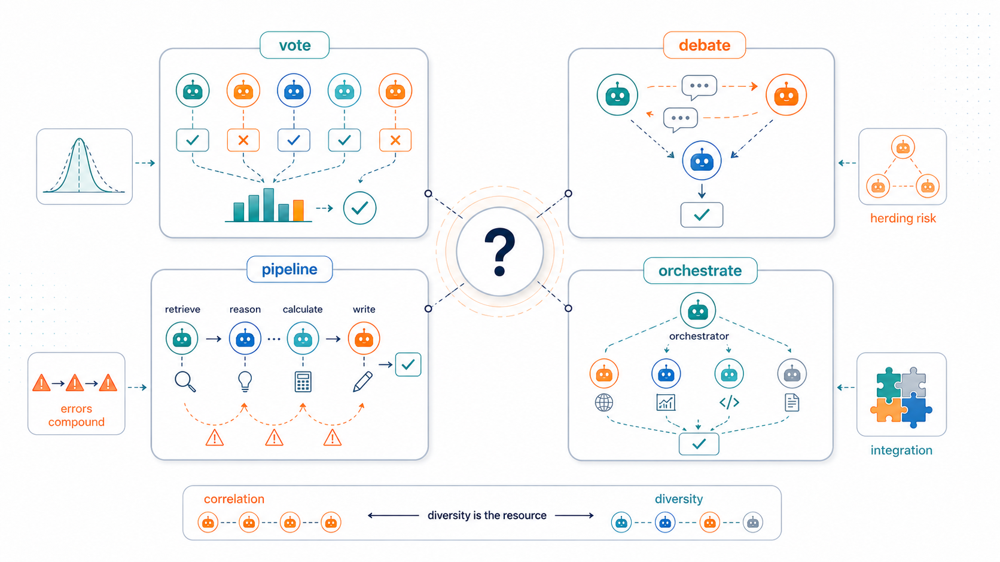
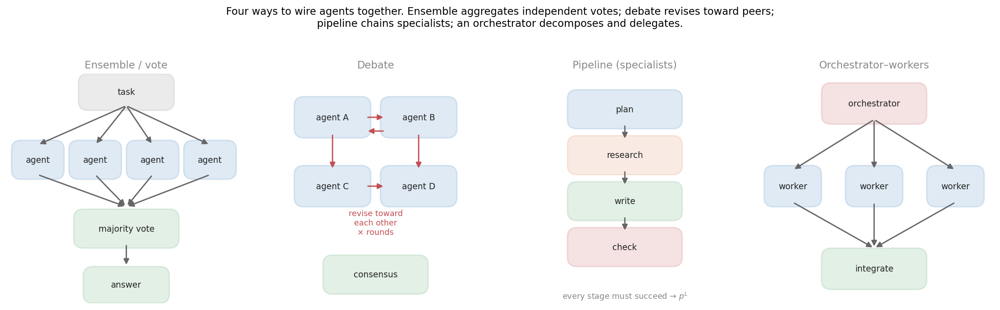
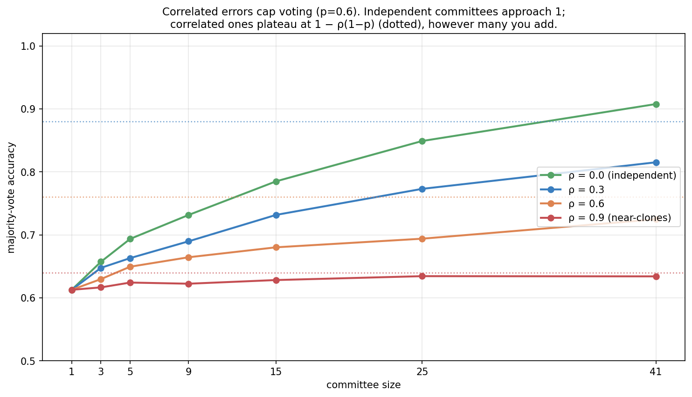
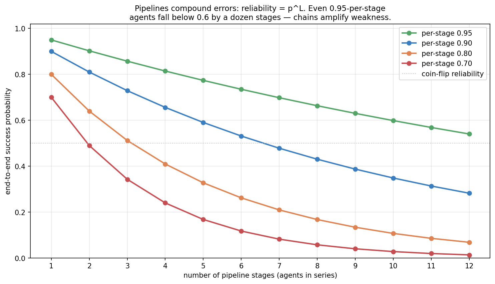
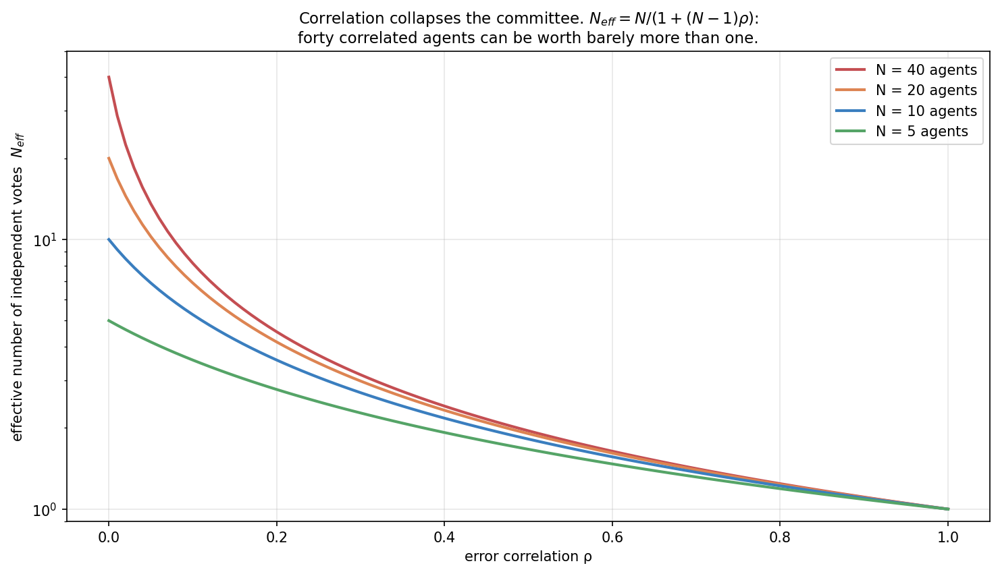
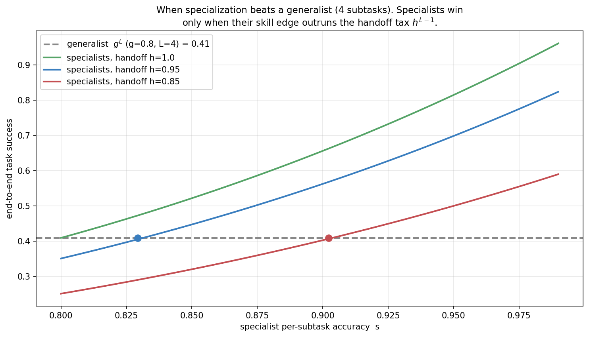
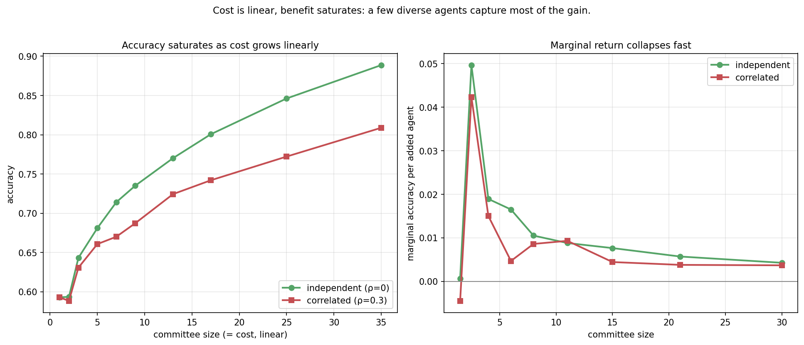

> *Topic 5, post 1 of 2.*

Every post so far has concerned a *single* agent: how it explores, decides, learns, decodes, searches, calls tools, retrieves, reflects, and knows what it doesn't know. The obvious next move — the one every framework markets — is to use *several* agents: a committee that votes, a panel that debates, a pipeline of specialists, a manager that delegates to workers. The promise is that many heads are better than one.

Sometimes. The honest question this post asks is the one the marketing skips: **when does adding agents actually help, and when does it just multiply cost and compound errors?** The answer turns out to be sharp and largely classical, because a committee of LLMs is an instance of a problem statisticians have studied for two centuries — *combining many noisy estimators of the same truth*. That framing connects multi-agent systems straight back through this series: voting is [self-consistency](03a-decoding-as-inference.qmd) across agents, debate is [reflection](04b-self-reflection.qmd) with peer critics instead of self-critique, and a loud miscalibrated agent is a [calibration](04c-calibration.qmd) failure that poisons the group.

We will (§0) lay out the four patterns; (§1) prove the upside with the **Condorcet jury theorem**; (§2) find the catch — **correlated errors** cap everything, so diversity is the real resource; (§3) examine **debate** and when peer pressure helps versus herds; (§4) examine **pipelines and specialization**, where errors compound multiplicatively; and (§5) pull it into design guidance. The recurring lesson: multi-agent systems are not magic, they are variance reduction and labor division, and both have precise conditions under which they pay.

---

## 0. Four ways to wire agents together

"Multi-agent system" covers several distinct architectures, and conflating them is the first mistake. Four patterns cover most of the space:

- **Ensemble / vote.** Several agents answer the same question independently; aggregate by majority vote (or averaging). This is the multi-agent face of self-consistency from [Post 3a](03a-decoding-as-inference.qmd) — there the "agents" were independent samples from one model; here they may be different models or differently-prompted instances.
- **Debate.** Agents see each other's answers and revise over several rounds, critiquing and responding. This is [reflection](04b-self-reflection.qmd) with *peer* critics rather than self-critique — and, as we will see, that change of critic is exactly what 4b predicted would matter.
- **Pipeline (specialists).** Agents work in series, each a specialist for one stage: a planner, then a researcher, then a writer, then a checker. Output flows down the chain.
- **Orchestrator–workers.** A manager agent decomposes a task, delegates subtasks to workers (often in parallel), and integrates their results. The hierarchical generalization of the pipeline.

The first two **aggregate** redundant attempts at the *same* task (variance reduction); the last two **decompose** a task into *different* subtasks (labor division). These are fundamentally different value propositions with different failure modes, and the rest of the post takes them in turn.

The distinction is worth dwelling on because it determines which mathematics applies. Aggregation patterns are governed by the statistics of **combining estimators**: their benefit comes from averaging away independent noise, so they help most when individual agents are decent-but-noisy and their errors are uncorrelated, and they fail when errors correlate (§2). Decomposition patterns are governed by the arithmetic of **reliability in series**: their benefit comes from letting each agent specialize, but they pay a multiplicative reliability tax because every stage must work (§4). A useful diagnostic before reaching for any multi-agent design is to ask which kind of leverage you actually need — *"I want a more reliable answer to one hard question"* points to aggregation; *"I want to accomplish a multi-step task"* points to decomposition — because the two need opposite things from their members (diverse redundancy vs. reliable specialization) and degrade in opposite ways.

---

## 1. The wisdom of crowds: the Condorcet jury theorem

Start with voting, because it has a clean and old answer. In 1785 the Marquis de Condorcet proved a result about juries that turns out to govern LLM committees exactly. Suppose $n$ agents each answer independently and each is correct with probability $p$. Take the majority vote. Then:

- if $p > \tfrac12$ (each agent better than chance), majority-vote accuracy **increases** with $n$ and tends to **1** as $n \to \infty$;
- if $p < \tfrac12$, it **decreases** to **0**;
- if $p = \tfrac12$, it stays at $\tfrac12$.

The mechanism is the law of large numbers. Each agent's answer is a noisy vote for the truth; averaging many independent noisy votes concentrates on the majority tendency, and if that tendency leans even slightly correct ($p>\tfrac12$), enough votes make the correct answer win almost surely. It is the same $1/\sqrt{n}$ variance reduction that made self-consistency work in Post 3a — a committee is a self-consistency ensemble whose samples come from different agents.

A small calculation shows the lift concretely. With three independent agents each correct with probability $p = 0.6$, the majority is correct if at least two are. That probability is $\binom{3}{2}(0.6)^2(0.4) + (0.6)^3 = 3(0.36)(0.4) + 0.216 = 0.432 + 0.216 = 0.648$ — a jump from 0.60 to 0.648 for two extra agents. Push to nine agents and the majority-correct probability climbs past 0.73; at 21 agents, past 0.80. The gains are real but *sublinear* — each doubling of the committee buys a shrinking increment, the same diminishing returns as drawing more Monte Carlo samples, which is why §7.4's cost analysis matters. The closed form is $\sum_{k > n/2} \binom{n}{k} p^k (1-p)^{n-k}$, the upper tail of a binomial, and its march toward 1 for $p>\tfrac12$ is the jury theorem in one line.

Two consequences deserve emphasis because they are easy to forget in the excitement of "let's add more agents":

- **The knife-edge at $p = \tfrac12$ is unforgiving.** The theorem amplifies whatever tendency exists. A committee of below-chance agents is *worse* than one agent — voting drives them confidently to the wrong answer. Adding agents is not a way to fix a bad base model; it sharpens whatever the base model already leans toward.
- **It assumes independence.** Every word of the theorem rests on the votes being independent. That assumption is where LLM committees fall apart, and it is the subject of the next section.

It is worth pausing on how strong the independence assumption is, because the theorem is often quoted as if "more voters help" were unconditional. The proof needs the votes to be independent *conditional on the truth* — agent A being wrong tells you nothing about whether agent B is wrong. For human juries deliberating separately that is roughly plausible; for LLM agents it is close to false by construction, because the thing that makes one instance wrong on a question (a gap in training data, a misleading surface pattern, a common misconception) is usually present for every instance built from the same model. The theorem is not wrong — it is just answering a question ("what if errors are independent?") whose premise rarely holds for clones. Holding the premise up to the light is what the next section does, and it is the difference between the textbook promise of certainty and the disappointing plateau real committees hit.

---

## 2. Diversity is the resource

Real agents are not independent. If your "committee" is five copies of the same model with the same prompt, they will tend to be right together and — fatally — *wrong together*, making the same mistakes on the same inputs. The Condorcet magic evaporates when errors are correlated, and quantifying that is the most important practical result in this post.

Model it with a single knob: let $\rho$ be the fraction of items on which the agents fail (or succeed) **in lockstep** — all giving the same answer — because they share blind spots, while on the remaining $1-\rho$ they answer independently. Then majority-vote accuracy is capped, no matter how many agents you add, at

$$
\text{accuracy}_{\infty} \;=\; 1 - \rho\,(1 - p).
$$

The lockstep items can only be answered as well as a single agent ($p$); only the independent items get the Condorcet boost toward 1.

The plateau is brutal at high correlation: near-clone agents ($\rho = 0.9$) get essentially nothing from a committee of forty. The right way to think about it is **effective sample size**. A committee of $n$ equicorrelated agents carries the information of only

$$
n_{\text{eff}} \;=\; \frac{n}{1 + (n-1)\rho}
$$

independent ones — the same formula that governs correlated measurements anywhere in statistics. It comes straight from variance: averaging $n$ unit-variance estimators with pairwise correlation $\rho$ gives variance $\frac{1}{n} + \frac{n-1}{n}\rho$ rather than the $\frac{1}{n}$ you'd get if they were independent, and $n_{\text{eff}}$ is just the independent count that would yield the same variance. Two limits make it memorable: at $\rho = 0$, $n_{\text{eff}} = n$ (full credit for every agent); as $n \to \infty$ with $\rho > 0$ fixed, $n_{\text{eff}} \to 1/\rho$ — a *hard ceiling* on effective votes no matter how many agents you recruit. At $\rho = 0.1$, forty agents are worth about eight; at $\rho = 0.5$, worth two; and you can never exceed ten effective votes at $\rho = 0.1$ even with a million agents. This is the quantitative heart of "**diversity is the resource**": the value of a committee is set not by its size but by the independence of its members' errors.

For LLM agents specifically, correlation is the *default*, not the exception, because the usual sources of independence are absent: the agents often share a **base model** (identical weights, identical biases), share **training data** (so they are fooled by the same myths and the same adversarial phrasings), and share a **prompt** (so they are anchored the same way). Genuine diversity has to be engineered, and the levers are concrete: **different base models** (the strongest lever — different architectures and training data fail differently), **different prompts or personas** (a "skeptic" and an "optimist" make different errors), **different tools or context** (an agent with web search errs differently from one reasoning from memory), and **different temperatures or decompositions**. Every bit of shared machinery pushes $\rho$ back up, so a committee of GPT-clones answering with the same prompt is close to one agent wearing five hats. The practical takeaway inverts the naive intuition: **past a handful of genuinely diverse agents, buy diversity, not headcount.**

---

## 3. Debate: reflection with peer critics

Voting is non-interactive — agents never see each other. **Debate** lets them: each agent reads the others' current answers and revises, over several rounds. The hope is that exposing reasoning lets agents catch each other's errors and converge on truth, and there is real evidence it can help (Du et al. 2023). But notice what debate *is* in the vocabulary of this series: it is the reflection loop of [Post 4b](04b-self-reflection.qmd), with the critic being *other agents* instead of the model itself. And 4b's central finding — reflection helps only when the critic discriminates better than the generator, and external feedback beats self-critique — tells us exactly what to expect. Peer critics are a step up from self-critique (a different model may catch what you can't), but they are still fallible critics, and debate inherits reflection's failure mode: **herding**.

Herding is the conformity trap. When agents revise toward the current majority, they can converge on a *confident wrong* consensus, and — worse — the very act of converging destroys the diversity that voting relied on. A debate that reaches unanimity has an effective sample size of one.

The curve tells the whole story. With *moderate* conformity and genuine reconsideration each round, debate accumulates evidence and beats one-shot voting — the peer critique adds real information, just as 4b's informative external feedback did. But as conformity climbs, the committee collapses to consensus before the evidence is in, freezing on the early plurality and throwing away the independence that made the crowd wise. There is a sweet spot, and it is not "agree as much as possible."

This is also where [calibration](04c-calibration.qmd) re-enters with teeth. In a debate, a *confidently wrong* agent is maximally dangerous: its unwavering assertiveness pulls conformist peers toward its error, exactly the over-correction dynamic of 4b and the loud-miscalibrated-agent failure of 4c, now at the group level. A single stubborn, miscalibrated participant can drag a committee that started correct toward a wrong consensus — sycophancy and conformity are not just social foibles, they are mathematically how a debate loses information. The defenses mirror the single-agent lessons: keep critics diverse (lower $\rho$), don't over-weight confident assertions (calibration), and prefer external verification over persuasion (4b) — a debate grounded in a tool result or a runnable test cannot be herded by rhetoric.

There is a clean way to see why debate is *strictly riskier* than voting on the diversity axis. Voting reads the agents' independent opinions once, at maximum diversity, and aggregates. Debate lets the opinions *influence each other before* aggregation, which can only reduce their diversity — interaction is a force that drives $\rho$ up over rounds, toward the consensus limit where $n_{\text{eff}} \to 1$. So debate is making a bet: that the information peers exchange (catching each other's specific errors) outweighs the independence they spend by converging. When peers genuinely discriminate — different models catching different mistakes, or a debate anchored in verifiable evidence — the bet pays. When they merely conform, debate pays the diversity cost and gets nothing for it, landing below where a simple vote would have. This reframes the practitioner's question from "should agents debate?" to "do my agents add more information by interacting than they lose in independence?" — and for clones sharing a base model and prompt, the answer is usually no.

---

## 4. Pipelines and specialization: when labor division pays

The aggregation patterns (vote, debate) attack the *same* task redundantly. Pipelines and orchestrators do something different: they **decompose** a task into different subtasks handled by different agents. The promise is specialization — a dedicated planner, researcher, writer, and checker, each better at its job than a generalist. The peril is that they are wired *in series*, and series wiring compounds errors.

If every stage must succeed for the task to succeed, end-to-end reliability is $p^L$ for $L$ stages — the same multiplicative error-compounding cliff we met for long-horizon tool use in [Post 3b](03b-tool-use.qmd). The arithmetic is unforgiving: a pipeline of four 90%-reliable agents succeeds only $0.9^4 \approx 66\%$ of the time; ten stages at 95% each is still only $0.95^{10} \approx 60\%$. **Adding stages is adding risk**, and the instinct to decompose a task into ever-finer specialist roles can quietly make the system *less* reliable than a single capable generalist that does the whole thing in one coherent pass.

So when does specialization actually win? When the per-subtask skill gain from specializing outruns the **coordination tax** of handing off between stages. Modeling each of the $L-1$ handoffs as succeeding with probability $h$ (context gets lost, formats mismatch, the next agent misreads the last one's output), a specialist pipeline achieves $s^L h^{L-1}$ against a generalist's $g^L$:

The crossover makes the condition concrete: specialists must be enough better at their narrow jobs to pay for the handoffs. When handoffs are clean ($h \approx 1$) a modest skill edge suffices; when handoffs are lossy, specialists can be substantially better per-subtask and still lose end-to-end. A worked case sharpens it: with four subtasks, a generalist at $g = 0.8$ per subtask achieves $0.8^4 \approx 0.41$. Specialists at $s = 0.9$ with perfect handoffs achieve $0.9^4 \approx 0.66$ — a clear win. But drop the handoff reliability to $h = 0.85$ and the same specialists get $0.9^4 \cdot 0.85^3 \approx 0.40$ — *below the generalist*, despite each being meaningfully better at its own subtask. The three lossy handoffs ($0.85^3 \approx 0.61$) erased the entire specialization advantage. This is why the most reliable real systems keep pipelines *short*, invest heavily in clean handoff formats (structured outputs, shared scratchpads, explicit context passing), and add a verification stage — because the cheapest way to fight $p^L$ is to raise each $p$ toward 1, which usually means grounding stages in tools and checks rather than adding more agents.

The **orchestrator–workers** pattern is the hierarchical generalization, and it inherits both properties. Parallel workers (an orchestrator fanning out independent subtasks) compound less than a serial pipeline — independent subtasks don't multiply each other's failure the same way — but the orchestrator's decomposition and integration steps are themselves stages that can fail, and the orchestrator is a single point of failure for the whole plan. The design lesson is the same: every agent you add is a stage that must work, so add agents only when the decomposition genuinely buys more than the coordination it costs.

It is worth being precise about the parallel-versus-serial distinction, because it is the one structural choice that most changes a multi-agent system's reliability. In a **serial** pipeline of $L$ stages each reliable with probability $p$, *every* stage must succeed, so end-to-end reliability is $p^L$ — failure compounds. In a **parallel** fan-out where $L$ independent subtasks are each attempted once and all must succeed, the reliability is also $p^L$ (all must work), but the failures are *independent rather than sequential*, which matters for a subtler reason: a parallel subtask can be **retried or voted on in isolation** without re-running the whole chain, whereas a serial pipeline often has to restart from the failed stage with all the downstream context invalidated. And when the parallel subtasks are *redundant* rather than *complementary* — several workers attempting the same subtask — you are back in aggregation territory and reliability *rises* with workers ($1 - (1-p)^L$ if any-success suffices) instead of falling. So "parallel" spans both the best case (redundant workers, reliability climbing toward 1) and a compounding case (complementary subtasks, all required), and a good orchestrator design pushes toward the former: decompose so that subtasks are independently checkable and, where it matters, redundantly attempted. The orchestrator's own decomposition step, though, has no redundancy by default — a bad plan dooms every worker downstream — which is why the integration-and-verification step at the end (a checker that can reject and re-plan) is the highest-value agent to add to any orchestrator system. It converts a single-point-of-failure plan into a loop with a chance to recover, the multi-agent echo of the reflection loop from Post 4b.

There is a unifying way to see what a good orchestrator is doing, and it ties this topic back to the Bayesian thread of the series. An orchestrator's job — decide which worker or tool to invoke, with what subtask, and when to stop — is a sequence of decisions under uncertainty, and the principled version is the **Bayesian control** view that closed Post 4c: the orchestrator maintains a calibrated *belief* about the state of the task (which subgoals are done, how reliable each worker is, how likely the current draft is correct) and chooses each next action by *expected utility* — routing to the worker with the highest expected value, and spending another call (a worker, a vote, a verification pass) only when its expected improvement outweighs its cost. The voting, debate, and pipeline choices of this post are then not separate tricks but actions a Bayesian controller selects among: vote when independent evidence is cheap and beliefs are uncertain, verify when a stage's reliability is in doubt, stop when the belief is confident enough that more compute isn't worth it. A recent position paper (Papamarkou et al., 2026) argues exactly this — that the orchestration layer, not the LLM weights, is where Bayesian decision-making belongs, with the models and tools left as black-box predictors underneath. Our series reaches the same conclusion constructively: every "when should the agent do X?" rule we derived (call a tool in 3b, retrieve in 4a, reflect in 4b, defer in 4c) is one expected-utility decision, and an orchestrator is just the controller that makes all of them in sequence.

---

## 5. A practical guide to multi-agent design

The analysis collapses into a short set of rules, cheapest and most reliable first:

- **Default to one good agent.** Multi-agent systems multiply cost and failure surface. Reach for them only when a single agent — with tools, retrieval, and reflection — is genuinely insufficient, and measure that it is.
- **For hard judgment calls, vote — but engineer diversity.** Independent voting is the most robust multi-agent pattern (it cannot herd). Its value is set by $\rho$, so spend on *diverse* members: different models, prompts, personas, tools. A few diverse agents beat many clones.
- **Use debate sparingly and ground it.** Debate can beat voting when peers add genuine information, but it herds under conformity and is poisoned by confident wrong agents. Keep rounds few, keep participants diverse, and anchor the debate in external verification (a test, a tool, a retrieved fact) rather than persuasion.
- **Keep pipelines short and handoffs clean.** Reliability is $p^L$; every stage is risk. Minimize stages, use structured handoffs, raise each stage's reliability with tools and checks before adding more specialists.
- **Specialize only when the skill edge beats the coordination tax.** Division of labor pays when subtasks are genuinely separable and specialists are clearly better at their part — not as a reflex.
- **Watch the cost–accuracy frontier.** Cost grows linearly with agents; accuracy saturates. The cost-effective committee is small.

The meta-point ties the topic to everything before it: a multi-agent system is a way of *combining* the single-agent capabilities we spent four topics building, and the combination is governed by the same forces — variance reduction needs independence, sequential reliability compounds, and confident-but-wrong signals corrupt aggregation. More agents is a tool, not a goal.

To see the rules in action, consider a concrete choice: *"Should I answer hard factual questions with a 7-agent debate?"* Walk it through. Is the need aggregation or decomposition? Aggregation — it's one hard question, not a multi-step task — so the relevant math is §2's correlation, not §4's compounding. Are the agents diverse? If they are seven instances of one model with one prompt, $\rho$ is high and $n_{\text{eff}}$ is barely above 1, so seven agents will scarcely beat one — the answer is to spend the budget on *diversity* (different models, a skeptic/proponent split, one agent with retrieval) rather than count. Should they debate or vote? Debate spends diversity to exchange information (§3); for factual questions a *retrieval-grounded* exchange can genuinely help, but an ungrounded debate among clones will likely herd, so prefer voting unless the agents can cite external evidence. And is seven the right number? §7.4 says the marginal gain is near-dead past a handful, so three-to-five diverse, retrieval-grounded agents voting is almost certainly better than seven clones debating — at lower cost. Every step of that reasoning is one of the rules above; the value of the framework is that it turns "more agents sounds good" into a sequence of answerable questions.

---

## 6. Experiments to actually run

### 6.1 Effective votes under correlation

Compute $n_{\text{eff}} = n/(1+(n-1)\rho)$ across $\rho$ for several committee sizes. How fast does correlation collapse a large committee?

### 6.2 Herding in debate

Track majority-vote accuracy across debate rounds for moderate vs high conformity, with and without a stubborn faction. When does interaction help, and when does it freeze the committee?

### 6.3 Specialization vs generalist

Sweep specialist skill against a generalist baseline for several handoff reliabilities. Where is the crossover?

### 6.4 The cost–accuracy frontier

Plot accuracy and marginal accuracy-per-agent against committee size, for independent and correlated committees. Where do the returns die?

---

## 7. Solutions

### 7.1 Effective votes under correlation — `experiments/05a_sol1_effective_votes.py`

**What you should see.** $n_{\text{eff}}$ falls off a cliff in $\rho$: even mild correlation slashes a large committee's effective size, and by $\rho = 0.5$ almost all committees — whether 5 or 40 agents — are worth only one to two independent votes. The lines converge, meaning that under real correlation, *committee size stops mattering* and only diversity does.

**The deeper lesson.** This is the single number to internalize about multi-agent voting. The benefit of a committee is not $n$, it is $n_{\text{eff}}$, and $n_{\text{eff}}$ is governed by the correlation you usually can't see. It is the same arithmetic as self-consistency's diminishing returns (Post 3a) and deep ensembles' calibration gains (Post 4c) — independent errors are a scarce resource, and shared base models spend it fast. Before scaling a committee, ask not "how many agents?" but "how independent are their mistakes?"

### 7.2 Herding in debate — `experiments/05a_sol2_herding.py`

**What you should see.** The moderate-conformity committee improves round over round — peers genuinely informing each other. The high-conformity committees flatline at the round-0 accuracy: everyone copies the early plurality immediately, so no new evidence enters and the debate is over before it began. The stubborn faction makes it no better.

**The deeper lesson.** Debate's value comes from *reconsideration*, not *agreement* — the same distinction as 4b's "the value is in the content of the critique, not the round count." Conformity feels like progress (the committee is converging!) while actually destroying the independence that made the crowd worth consulting. The instinct to drive a multi-agent system toward consensus is often exactly wrong: a committee that agrees too fast has thrown away its own wisdom.

### 7.3 Specialization vs generalist — `experiments/05a_sol3_specialization.py`

**What you should see.** With perfect handoffs ($h = 1$), specialists need only a small per-subtask edge to beat the generalist. As handoffs degrade to $h = 0.85$, the crossover shifts far right — specialists must be dramatically better just to break even, because the $h^{L-1}$ coordination tax eats their advantage.

**The deeper lesson.** Decomposition is not free. Every handoff is a lossy channel — context dropped, formats mismatched, the next agent misreading the last — and those losses compound exactly like the pipeline's $p^L$. This is why "just add a specialized agent for X" so often disappoints: the specialist may be better at X, but the wiring tax can swallow the gain. Specialize when subtasks are cleanly separable and the skill edge is large; otherwise a coherent generalist that never has to hand off wins.

### 7.4 The cost–accuracy frontier — `experiments/05a_sol4_cost_accuracy.py`

**What you should see.** Accuracy rises steeply for the first few agents then flattens, while cost (committee size) grows linearly forever. The marginal-gain panel makes the verdict explicit: the accuracy added by each new agent collapses fast, and faster still when errors are correlated — the correlated committee's marginal gain is near zero almost immediately.

**The deeper lesson.** The economically right committee is small. Because benefit saturates ($1/\sqrt{n}$-ish) while cost is linear, the cost-effectiveness peaks at a handful of agents and declines from there; a 40-agent committee pays 40× for accuracy a 5-agent committee nearly matched. Combined with §7.1, the guidance is unambiguous: a few genuinely diverse agents capture almost all the available benefit, and everything past that is mostly burning compute.

---

## 8. Further reading

- **Condorcet, "Essai sur l'application de l'analyse à la probabilité des décisions" (1785).** The jury theorem, two centuries before LLMs made it newly relevant.
- **Du et al., "Improving Factuality and Reasoning in Language Models through Multiagent Debate" (2023).** Debate improves answers — the upside of §3, with the caveats this post quantifies.
- **Wang et al., "Self-Consistency Improves Chain of Thought Reasoning" (2022).** Voting over samples; the single-model ancestor of the committee (Post 3a).
- **Du Bois / Lakshminarayanan et al. on ensembles (NeurIPS 2017).** Why diversity drives ensemble gains — the correlation story of §2, from the ML side.
- **Hong et al., "MetaGPT" (2023) and Wu et al., "AutoGen" (2023).** Orchestrator–worker and role-specialized frameworks; the engineering face of §4, including the handoff-format problem.
- **Anthropic, "Building effective agents" (2024).** A practitioner's argument for preferring simple, single-agent designs until multi-agent complexity is demonstrably warranted — the §5 default, in practice.
- **Papamarkou et al., "Position: Agentic AI Orchestration Should Be Bayes-Consistent" (2026).** Argues that the control layer orchestrating LLMs and tools should maintain calibrated beliefs and select actions by expected utility / value of information — the Bayesian-controller view of §4 and the through-line into Post 5b.

---

**Next up — Post 5b: The nanoAgent reference implementation.** We have built every piece from the ground up — bandits and exploration, MDPs and value, policy gradients and RLHF, decoding and search, tools, retrieval, reflection, calibration, and now coordination. The final post wires them into **nanoAgent**: a small, readable, from-scratch agent that plans, calls tools, retrieves, reflects, and knows when it is unsure — the whole curriculum assembled into something you can run, read end to end, and extend.
