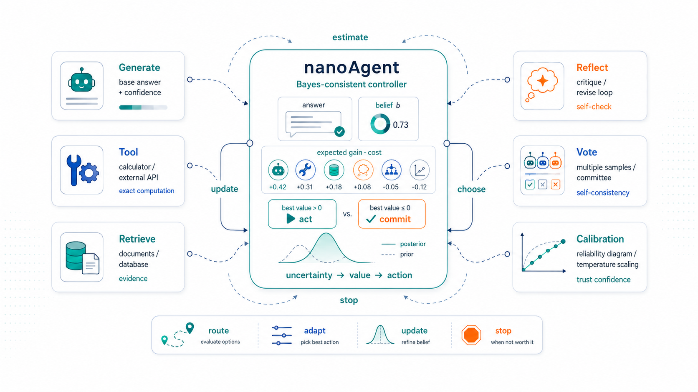
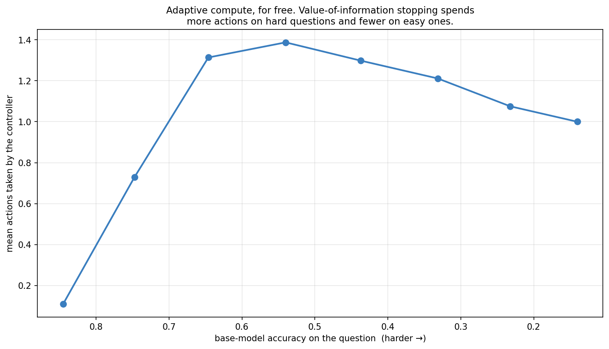

> *Topic 5, post 2 of 2 — and the finale of the series.*

We have built every piece from the ground up. Exploration and regret with [bandits](01a-multi-armed-bandits.qmd); value, policy, and credit assignment with [MDPs](01c-markov-decision-processes.qmd) and [policy gradients](02a-policy-gradient-theorem.qmd); alignment with [RLHF](02d-rlhf-dpo-grpo.qmd); inference-time reasoning with [decoding](03a-decoding-as-inference.qmd), [tools](03b-tool-use.qmd), and [search](03c-tree-of-thoughts.qmd); evidence-marshalling with [retrieval](04a-rag-as-bayesian-conditioning.qmd), [reflection](04b-self-reflection.qmd), and [calibration](04c-calibration.qmd); and coordination with [multi-agent systems](05a-multi-agent-systems.qmd). This final post assembles them into one runnable artifact: **nanoAgent**, a small agent that answers questions by orchestrating all of these capabilities — and decides *which* to use, and *when to stop*, by a single principle.

That principle is the one [Post 4c](04c-calibration.qmd) and [Post 5a](05a-multi-agent-systems.qmd) converged on: the agent's control layer should be a **Bayes-consistent controller**. It maintains one calibrated belief — the probability its current answer is correct — and at each step makes a value-of-information decision: for each capability, estimate the expected accuracy after using it, subtract its cost, and take the best option only if that net gain beats answering now. When nothing is worth its cost, it commits. That is the whole agent. What makes it a fitting capstone is that the controller's estimate of each action's value is *literally the analytic result we derived for that action earlier in the series* — `one_round_accuracy` from reflection, `condorcet_accuracy` from voting, the calibrated belief from temperature scaling. nanoAgent is the curriculum, wired together and made to run.

A note on what this is and isn't. nanoAgent's **controller** is real, readable code you could lift into a production agent. To run it end to end without a live LLM, we plug it into a *simulated world* faithful to the toy models of earlier posts — the same approach the whole series used. The control logic is genuine; the model and tools underneath it are stand-ins. That separation is exactly the architecture the [Bayesian-orchestration view](#further-reading) recommends, and it is how real agent code is structured: a model-agnostic controller over swappable black-box capabilities.

---

## 0. The architecture

nanoAgent is a loop around a belief.


The pieces map onto the whole series:

- **Belief** — a single number $b$, the calibrated probability that the current answer is correct. Seeded from the generator's confidence and made trustworthy by the temperature scaling of [Post 4c](04c-calibration.qmd). This is the agent's posterior over "am I right?"
- **Capabilities** — the actions that can change the answer or the belief: call a **tool** ([3b](03b-tool-use.qmd)), **retrieve** ([4a](04a-rag-as-bayesian-conditioning.qmd)), **reflect** ([4b](04b-self-reflection.qmd)), or **vote** over more samples ([3a](03a-decoding-as-inference.qmd)/[5a](05a-multi-agent-systems.qmd)). Each is a black box with a cost.
- **The controller** — the value-of-information rule that chooses among them. This is the only "intelligence" in the orchestration layer, and it is small.

Everything interesting — routing each question to the right capability, spending more effort on hard questions, stopping early on easy ones — *emerges* from the one rule. There is no routing table and no hand-written policy. Let us build it.

It is worth being precise about what makes this controller "Bayes-consistent," because the phrase is doing real work. A Bayesian decision-maker has three parts: a **belief** (a probability distribution over unknown quantities), a **utility** (how much each outcome is worth), and a **decision rule** (choose the action maximizing expected utility). nanoAgent has all three. Its belief is $b$, the posterior probability that the current answer is correct. Its utility is accuracy minus cost — a right answer is worth $1$, each action costs its price. Its decision rule is "take the action with the highest expected utility, which is the action whose expected accuracy gain most exceeds its cost." The agent is *coherent* in the decision-theoretic sense: it never takes an action it expects to leave it worse off, and it stops exactly when no action's expected benefit covers its price. This is the whole content of the [position](#further-reading) that an agent's orchestration layer should be Bayesian — and nanoAgent is what it looks like in forty lines. Notice what is *not* Bayesian here: the generator, tools, and retriever are black boxes making no guarantees. The coherence lives entirely in the thin control layer on top, which is precisely where it is cheap to put and most valuable to have.

---

## 1. The world: capabilities as black boxes

The agent orchestrates capabilities; to run it we need capabilities to orchestrate. The simulated world gives each question a *type* (`knowledge`, `calculation`, or `reasoning`) and a latent difficulty, and exposes the four capabilities, each faithful to its post:

- `generate` — the base model ([3a](03a-decoding-as-inference.qmd)): returns an answer (correct with a type- and difficulty-dependent probability) and a confidence that may be miscalibrated ([4c](04c-calibration.qmd)).
- `use_tool` — a calculator ([3b](03b-tool-use.qmd)): near-perfect on `calculation`, useless elsewhere.
- `retrieve` — retrieval ([4a](04a-rag-as-bayesian-conditioning.qmd)): strong on `knowledge`, noisy elsewhere.
- `reflect` — a self-critic ([4b](04b-self-reflection.qmd)): flags and revises, with the detection/false-alarm/revision parameters from that post.

The crucial design choice is that **each capability has a home question type where it shines**, and the world never tells the agent the answer — only the question type. The agent must figure out, per question, which capability is worth invoking. That is the whole challenge, and the world is built so that no single capability wins everywhere — exactly the condition under which orchestration earns its keep.

---

## 2. The belief: a calibrated posterior

The agent's belief is the probability its current answer is correct. It starts from the generator's reported confidence, but — following [Post 4c](04c-calibration.qmd) — that raw confidence may be overconfident, so the agent temperature-scales it before trusting it:

```python
def _calibrate(self, raw_conf: float) -> float:
    """Apply temperature scaling to the raw confidence (Post 4c)."""
    return float(sigmoid(logit(raw_conf) / self.calibration_T))
```

This one line is load-bearing for the entire agent, and §5 shows why: every decision the controller makes is a comparison against this belief, so if the belief is inflated, every "answer now" looks better than it should and the agent stops too early. Calibration is not a nicety bolted onto the agent — it is the precondition that makes the controller's arithmetic mean anything.

It is worth dwelling on why a *scalar* belief suffices here, and where it would not. nanoAgent tracks one number: the probability the current answer is correct. That is enough for the decisions it faces, because every action is evaluated by how it changes that one probability, and the value-of-information comparison only needs expected accuracies. A richer agent — one that had to decide *which* alternative answer to prefer, or combine partial evidence from several retrievals — would need a full posterior over the answer space, updated by Bayesian conditioning ([Post 4a](04a-rag-as-bayesian-conditioning.qmd)) as each capability reports in. The scalar belief is the minimal sufficient statistic for nanoAgent's decision problem, and starting minimal is the point: it keeps the controller legible, and §7 sketches how to grow the belief when the task demands it. The discipline is to track exactly the belief your decisions actually consult — no more, no less — and here that is a single calibrated probability.

---

## 3. The controller: value of information

Here is the heart of nanoAgent. For each capability, the controller estimates the **expected accuracy of the current answer after taking that action**, using the analytic models from earlier posts:

```python
def _expected_after(self, action, belief, qtype):
    """Expected accuracy of the current answer after taking `action`."""
    if action == TOOL:
        return self.m.tool_accuracy if qtype == "calculation" else belief
    if action == RETRIEVE:
        return self.m.retrieval_accuracy if qtype == "knowledge" else belief
    if action == REFLECT:                                    # Post 4b
        return one_round_accuracy(belief, self.m.detect,
                                  self.m.false_alarm, self.m.revise)
    if action == VOTE:                                       # Post 5a
        return condorcet_accuracy(belief, 1 + self.m.vote_n)
```

Notice the reuse: the value of a reflect step *is* `one_round_accuracy` from Post 4b; the value of voting *is* `condorcet_accuracy` from Post 5a. The agent's model of its own capabilities is the mathematics we derived for them. The controller then picks the action with the greatest expected gain net of cost — or answers now if none clears the bar:

```python
def _best_action(self, belief, qtype):
    """The action with the greatest expected gain net of cost, or ANSWER."""
    best, best_gain = ANSWER, 0.0
    for action in (TOOL, RETRIEVE, REFLECT, VOTE):
        gain = (self._expected_after(action, belief, qtype) - belief) \
            - self._cost(action)
        if gain > best_gain:
            best, best_gain = action, gain
    return best, best_gain
```

That comparison — expected gain versus cost — is the **value-of-information** rule named in [Post 3b §4](03b-tool-use.qmd) and [Post 4c §5](04c-calibration.qmd), and it is the entire decision logic.

There is a subtlety worth making explicit, because it is the difference between a controller that works and one that spins. Why is gathering information ever worth it, if a Bayesian belief update is unbiased — the expected posterior equals the prior? The answer is that the value of an action does not come from *refining the belief*; it comes from the action's power to *change the answer*. A tool call on a calculation question does not merely sharpen the agent's estimate of whether its shaky guess was right — it *replaces* that guess with a near-certain one. The gain `_expected_after(TOOL, ...) − belief` is positive precisely because the tool can fix a wrong answer, not because it reduces uncertainty about a fixed one. This is why `_expected_after` returns the *capability's* accuracy on its home type, not some refinement of `belief`: the action is an opportunity to swap in a better answer, and its value is how much better, minus what it costs. An action that could only tell the agent "you were right" or "you were wrong," without letting it act on the news, would have zero value here — which is exactly correct.

The stopping rule follows from the same logic and is worth seeing as an **optimal-stopping** decision (the frame from [Post 4b](04b-self-reflection.qmd)). At each step the agent holds an answer and asks: is any action's expected improvement worth its cost? As the belief rises — after a successful tool call or retrieval — the room left to improve shrinks, so every action's gain shrinks too, until none clears its cost and the agent commits. The agent stops not after a fixed number of steps but when its belief is *good enough that more work is not worth it*, which is the right stopping rule and the source of the adaptive compute we will see in §5.4. The control loop just applies this rule until the agent decides to answer:

```python
def solve(self, world, qid, rng):
    qtype = world.observe(qid)["type"]
    answer, raw_conf = world.generate(qid, rng)
    belief = self._calibrate(raw_conf)

    for _ in range(self.max_steps):
        action, gain = self._best_action(belief, qtype)
        if action == ANSWER:
            break
        answer, belief = self._execute(action, world, qid, answer,
                                       belief, qtype, rng)
    return Trace(answer=answer, correct=world.is_correct(qid, answer), ...)
```

Forty lines, and it is a complete agent. No routing table: the agent calls the tool on calculation questions because `_expected_after(TOOL, ...)` returns a high number there and a low one elsewhere. No stopping heuristic: it stops because every action's expected gain has fallen below its cost. The behavior is emergent from the value-of-information rule, which is what makes this a *controller* rather than a script.

---

## 4. Watching it run

Trace the agent on one question of each type (belief in brackets):

- **Calculation** — generate gives a shaky answer ($b = 0.41$). The controller sees `tool` would lift expected accuracy to $0.97$ at cost $0.06$: gain $\approx 0.50$, easily the best. It calls the tool, belief jumps to $0.97$, and on the next step no action's gain beats its cost — it answers. *One action.*
- **Knowledge** — generate is weak ($b = 0.45$); `retrieve` promises $0.90$ at cost $0.06$ (gain $\approx 0.39$). It retrieves, belief rises to $0.90$, and it answers. *One action.*
- **Reasoning** — generate is middling ($b = 0.60$). No tool or retrieval helps this type, but `reflect` promises `one_round_accuracy(0.60, ...) ≈ 0.73` at cost $0.05$ (gain $\approx 0.08$). It reflects, belief rises to $0.73$; a second reflect still clears its cost ($0.73 \to 0.79$), a third does not. It answers. *Two actions.*
- **Easy anything** — generate is already confident ($b = 0.93$). Every action's expected gain is below its cost from the start. It answers immediately. *Zero actions.*

The same rule produces four different behaviors, each appropriate to the question. That is the point of a controller: one principle, many policies.

---

## 5. Does it work?

### 5.1 The adaptive controller beats every fixed strategy


No fixed strategy can win, because each capability helps only its home type: "always use the tool" is great on calculation and useless on knowledge. The adaptive controller — same capabilities, same costs — routes each question to the capability that helps it, and clears every fixed baseline by a wide margin. **Orchestration is the value-add**, and it comes entirely from per-question action selection.

This reframes what an "agent" buys you. The capabilities are fixed and unremarkable — a base model, a calculator, a retriever, a critic, each mediocre outside its niche. The agent adds no new capability; it adds *judgment about which to use*. That judgment is worth roughly twenty accuracy points here (from the best fixed strategy's ~0.68 to the controller's ~0.89), and it is the cheapest twenty points in the system because it requires no better model, tool, or retriever — only a calibrated belief and a value-of-information rule over capabilities you already have. The lesson generalizes well beyond this toy: when you have several specialized tools and no single one dominates, the highest-leverage investment is often not a better tool but a better *controller* to route among them.

### 5.2 Routing emerges from value of information


This is the result that makes the design feel less like engineering and more like a principle. We never told the agent that tools are for arithmetic. It computes the expected gain of each capability against its calibrated belief, and the home capability simply wins for each type. Routing is *derived*, not declared — which means it would adapt automatically if the capabilities or their costs changed.

### 5.3 Calibration drives control


Here is where Topic 4 pays off concretely. When the generator is overconfident and the agent trusts it, every "answer now" looks attractive, so the agent gathers less evidence (lower cost) and scores worse. The agent that temperature-scales its belief first keeps making the right calls. The lesson the whole series built toward, in one figure: **an agent's decisions are only as good as its belief is honest.** Calibration is not a side-quest; it is the control signal.

The failure mode is worth naming precisely, because it is subtle and common. The overconfident agent is not making *random* mistakes — it is making a *systematic* one: it consistently believes its answers are better than they are, so the gain term `_expected_after(action) − belief` is consistently too small, and actions that would have helped look not worth their cost. The agent is rational given its belief; the belief is just wrong. And note the second symptom in the right panel — the overconfident agent spends *less*. A miscalibrated agent is not only less accurate but cheaper, which is exactly the trap: in a quick evaluation it looks efficient (high apparent confidence, low cost) right up until you measure the accuracy it quietly gave up. This is why calibration must be measured directly ([Post 4c](04c-calibration.qmd)) and never inferred from an agent's own confidence or its apparent decisiveness — the agent that seems surest of itself may be the one most in need of evidence.

### 5.4 Value-of-information stopping gives adaptive compute



Because the agent stops as soon as no action's expected gain beats its cost, it naturally spends compute where it is needed: easy questions are answered immediately, hard ones draw several actions. This *adaptive compute* — the property expensive reasoning systems work hard to engineer — falls out of the value-of-information rule for free.

### 5.5 The compute–accuracy frontier (and a familiar trap)


Two honest findings here. First, the well-tuned controller **beats indiscriminate "do everything" at lower cost** — because doing everything includes harmful actions (reflecting on answers that were already right), while the controller skips them. Second, the trap: if you make actions too cheap, the agent *over-acts*, and accuracy *falls* — it reflects correct answers into wrong ones, exactly the over-correction of [Post 4b](04b-self-reflection.qmd), now visible at the level of the whole agent. There is an optimal eagerness, and it is neither "never act" nor "always act." The cost parameters are how you tune it.

The deeper point is that the cost parameters are not bookkeeping — they are the agent's *theory of when an action is worth taking*, and getting them wrong fails in both directions. Set them too high and the agent is timid: it answers from a weak belief when a cheap tool call would have rescued it (the right side of the curve, sliding toward "do nothing"). Set them too low and it is manic: it keeps acting past the point of usefulness, and because some actions can *hurt* (reflection's false alarms, a vote that dilutes a good answer), over-acting actively destroys accuracy rather than merely wasting compute. That accuracy can *decrease* with more compute is the counterintuitive part, and it is the same shape as Post 4b's over-reflection and Post 5a's herding: more is not better once the marginal action's expected harm exceeds its expected good. The value-of-information rule with honest costs is precisely what finds the balance, which is why the costs deserve as much care as the belief — they are the other half of the agent's utility function.

---

---

## 6. Honest limits

nanoAgent is a faithful skeleton, not a production system, and being clear about the gap is part of the curriculum's contract:

- **The world is simulated.** The capabilities are toy models with known parameters; a real LLM's accuracy, a real tool's reliability, and a real retriever's relevance are messier, drift over time, and interact. The control logic transfers; the clean numbers do not.
- **The controller's self-model can be wrong.** nanoAgent knows its own capability accuracies ($d$, $f$, tool reliability, …). A real agent only *estimates* these, and a mis-estimated self-model mis-prices actions — an agent that thinks its critic is better than it is will over-reflect. The value-of-information rule is only as good as the models plugged into it.
- **Calibration is assumed achievable.** We temperature-scale a clean confidence. Real LLM confidence is harder to extract and calibrate, degrades off-distribution ([Post 4c §6](04c-calibration.qmd)), and verbalized confidence is unreliable. The agent inherits every caveat of the calibration post.
- **Question type is observed.** The agent is told each question's type; a real agent must infer it, imperfectly, and a misrouted question wastes an action. Type inference is itself a learnable sub-policy we have not built.
- **The action space is small and the horizon short.** Real agents face long horizons where errors compound ([Post 3b](03b-tool-use.qmd), [5a](05a-multi-agent-systems.qmd)), larger action spaces, and tool *arguments* to choose, not just tools. The controller's structure scales to these; its tractability may not.

None of these break the design — they are where the next thousand lines of engineering go. The point of nanoAgent is that the *control principle* is small, principled, and complete; production work is making each black box and each estimate good enough for the principle to act on.

---

## 7. Extending nanoAgent

The reference implementation is deliberately small so it can be grown. Natural extensions, each mapping to a piece of the series:

- **A real backend.** Swap the simulated world for an LLM and real tools; the controller is unchanged. Calibrate the LLM's confidence on a held-out set ([4c](04c-calibration.qmd)) so the belief is trustworthy.
- **Learned self-model.** Estimate the capability parameters ($d$, $f$, tool accuracy, costs) from logged outcomes instead of hard-coding them — a bandit problem ([1a](01a-multi-armed-bandits.qmd)) over the agent's own actions.
- **Richer beliefs.** Track a posterior over the answer itself, not just a scalar correctness probability, and update it by Bayesian conditioning on each capability's output ([4a](04a-rag-as-bayesian-conditioning.qmd)).
- **Multi-step tasks.** Extend the single-question loop to a plan over subgoals, where the controller chooses sub-tasks and the compounding arithmetic of [Post 5a](05a-multi-agent-systems.qmd) governs reliability.
- **A committee of nanoAgents.** Wrap several diverse controllers in the voting or debate patterns of [Post 5a](05a-multi-agent-systems.qmd) — orchestration all the way up.

Each is a few dozen lines on top of the controller, because the controller already factors the problem the right way: beliefs, capabilities, and a value-of-information rule that ties them together.

---

## 8. Further reading {#further-reading}

- **Papamarkou et al., "Position: Agentic AI Orchestration Should Be Bayes-Consistent" (2026).** Argues that an agent's control layer — not the LLM weights — should maintain calibrated beliefs over latent task quantities and choose actions by expected utility / value of information, with the models and tools as black boxes. nanoAgent is a small, concrete instance of exactly this architecture.
- **Anthropic, "Building effective agents" (2024).** The practitioner's case for simple, composable agent designs over elaborate frameworks — the spirit of nanoAgent's forty-line controller.
- **Russell & Norvig, *Artificial Intelligence: A Modern Approach*, ch. 16–17.** Decision theory, value of information, and rational agents — the classical foundation under the controller's one rule.
- **Schick et al., "Toolformer" (2023); Yao et al., "ReAct" (2022).** Tool-use and reasoning-plus-acting agents; the engineering lineage nanoAgent abstracts.
- The companion notebook builds and runs nanoAgent end to end, including the worked trace of §4 and every experiment above.

---

**The series, in one arc.** We began with a single decision under uncertainty — which arm to pull — and the exploration–exploitation trade that governs it. We end with an agent that makes a *sequence* of decisions under uncertainty — which capability to invoke, and when to stop — governed by the same logic: maintain a calibrated belief, weigh expected value against cost, and act. Everything between, from policy gradients to retrieval to calibration, was a way of building or sharpening one of those two things: the **belief**, or the **value of an action**. nanoAgent is where they meet. An agent, in the end, is not a model — it is a controller that knows what it believes, knows what its actions are worth, and chooses accordingly. Thank you for building it from scratch.
